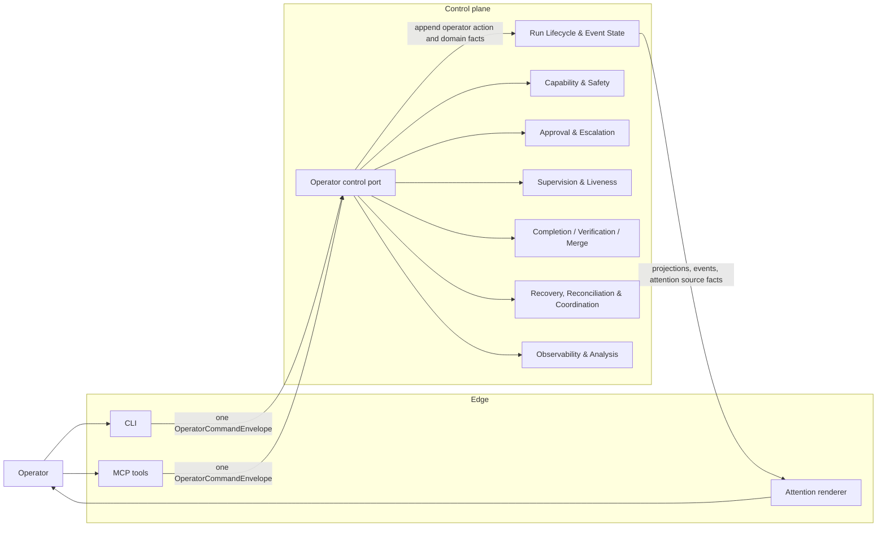
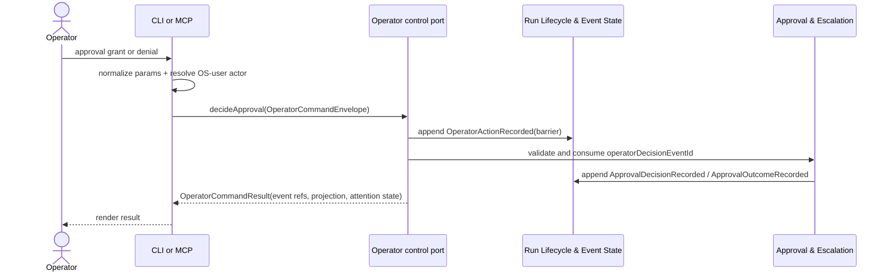

# Operator & Entry Surface - design

## 1. Purpose & boundaries

Operator & Entry Surface is the human-facing edge for driving and supervising Runs. It provides MCP
tools and CLI commands for preview, start, inspect, wait, approval decisions, stop, handoff, operator
overrides, recovery requests, attention acknowledgement, and "why did/didn't X" inspection. It also
delivers outbound attention when recorded Control plane facts show that a Run is parked or needs
Operator action.

The edge is a thin adapter. It normalizes input, attaches an Operator identity, calls the Control
plane exactly once for each Operator action, and renders the returned result. It contains no run
logic, evaluates no gates, authors no Run events directly, imports no provider contracts, and imports
no concrete Driver specifics.

Out of scope: run state, lifecycle transitions, capability gates, approval adjudication, liveness,
completion, recovery, analysis content, storage, Work Source status writes, provider operations, and
external trigger auth/runtime.

## 2. Required reading

Read: [README.md](../../README.md), [requirements.md](../../requirements.md),
[decisions.md](../../decisions.md), [architecture.md](../../architecture.md),
[conventions.md](../../conventions.md), [glossary.md](../../glossary.md),
[_templates/domain-design-template.md](../../_templates/domain-design-template.md), [charter.md](charter.md),
and approved core-01 through core-07 design files and subfiles. No provider designs, source code,
legacy docs, or material outside `docs/kit-vnext` were used.

## 3. Context diagram

## 4. Design

Low-level detail is split by cohesive topic:

- [Command surface and envelopes](design/command-surface-and-envelopes.md) defines MCP and CLI
  parity, request/response envelopes, Operator identity, and the one-call/one-operator-event mapping.
- [Attention, explainability, and deferred triggers](design/attention-explainability-and-triggers.md)
  defines parked-run attention, approval decision routing, "why did/didn't X" traces, and the
  external-trigger model deferred from v1.

Core decisions:

- MCP and CLI are equivalent surfaces over the same typed command envelope. Differences are only
  rendering, streaming, and exit-code behavior.
- Each Operator action, including invalid parameter or identity cases for a known MCP tool or CLI
  command, results in exactly one Control plane call and exactly one recorded `OperatorActionRecorded`
  audit event. Downstream core events may cite that event as causation, but the Operator action
  itself has one audit fact.
- The edge never obtains a `RunWriter`. The Control plane appends all events, including the Operator
  audit fact and any domain-specific consequences.
- The edge supplies an OS-user `OperatorActorRef` with every request when resolvable, or an
  `os-user-unavailable` actor when identity lookup fails. The Control plane records the rejection
  path; the edge does not short-circuit mutating actions locally.
- Read commands are still Control plane calls. When run-scoped, they record an Operator audit event so
  sensitive inspection of approvals, analysis, or gate evidence is attributable.
- `wait` is read-only over Control plane wait semantics. It never refreshes liveness, proves worker
  health, renews leases, or records progress.
- Outbound attention is delivery of recorded Control plane facts. Notification delivery is not run
  state; failure to notify never un-parks, resumes, blocks, or completes a Run.
- External triggers are represented as future producers of the same command envelope and are not
  implemented in v1.

## 5. Contracts & interfaces

The edge consumes only the Control plane-facing `OperatorControlPort`, defined with typed envelopes,
command parameters, response shape, and command mapping in
[Command surface and envelopes](design/command-surface-and-envelopes.md). The port is a Control plane
facade, not a provider contract; it hides core-domain coordination from the edge.

## 6. Events & data

The edge emits no Run events. For every Operator action on a known MCP tool or CLI command, accepted
or rejected, the Control plane appends one `OperatorActionRecorded` event at `barrier` durability
before acting or in the same atomic semantic batch as the first domain consequence. The event records
action id, command name, surface, OS-user actor or identity-resolution failure, target, redacted
parameter digest, reason, idempotency key, result intent, and validation errors when present.

For approval decisions, `OperatorActionRecorded.actionKind = "approval-decision"` carries the request
id, decision, requested scope, reason, and actor. Core-03 consumes that event id as the
`operatorDecisionEventId` required for human decisions. Protected-policy or profile overrides use the
same audit event shape with an override-specific action kind.

Consumed data: core-01 state, summary, metrics, launch projections and event cursors; core-02
`CapabilityGateRecord`; core-03 pending approval projections and outcomes; core-04 liveness
projection; core-05 completion and merge decisions; core-06 recovery projection; core-07 analysis
facts and redacted report refs. The edge renders these data; it does not derive alternate state.

## 7. Behavior diagram

## 8. Failure & degraded modes

- `operator-identity-unavailable`: the edge sends an `os-user-unavailable` actor to the Control plane;
  the Control plane records the rejection before any domain action.
- `operator-event-unwritable`: the Control plane cannot append the audit event; the requested action
  is not performed.
- `control-plane-unavailable`: the edge reports failure and performs no fallback provider or storage
  operation.
- `command-envelope-invalid`: schema, idempotency, target, or parameter digest is invalid; the
  Control plane records the rejection and no domain action runs.
- `attention-delivery-failed`: notification delivery failed locally; the Run remains in the recorded
  parked or needs-operator state.
- `explanation-unavailable`: recorded evidence is missing, degraded, or not attributable to the
  requested question; the edge reports the gap without guessing.
- `external-trigger-deferred`: v1 refuses external trigger entry instead of accepting unauthenticated
  or unmodeled triggers.

Capability gates treat missing Operator audit events, unverified Operator identity for human-required
actions, and unwritable Operator decisions as absent human authorization.

## 9. Testing strategy

NFR-TEST is met with a fake `OperatorControlPort`, fake OS identity resolver, deterministic clocks,
and fixture Run projections/events from approved core contracts. Edge tests use no real processes,
filesystem, network, provider contracts, concrete Drivers, or Run writers.

Required tests: MCP/CLI parity for every command; exactly one Control plane call per command,
including invalid parameter and identity cases; no edge imports of provider contracts or Drivers; no
direct `RunWriter` usage; stable idempotency and parameter-digest generation; OS-user identity capture
and Control plane rejection paths; approval-decision routing to the Control plane with one audit
event; wait does not refresh liveness; attention rendering from recorded facts; explain output
contains only recorded evidence refs or explicit gaps; external trigger entry returns
`external-trigger-deferred`.

This satisfies FR-10, the Operator side of FR-4, NFR-OBS for attributable inspection, NFR-SAFE for
fail-closed Operator controls, NFR-SOLID for edge-to-core dependency direction, and NFR-TEST.

## 10. Open questions

- External trigger transport, authentication, replay defense, and rate policy remain deferred.
- Notification transports beyond active MCP sessions and CLI wait output need product confirmation.
- Retention and redaction policy for Operator reasons and rendered explanation transcripts are
  policy-owned and not defined here.

## 11. Definition of done

- [x] All sections complete; guidance notes removed.
- [x] Files are focused; command/envelope and attention/explainability detail is split into subfiles.
- [x] Complies with the Dependency Rule; dependencies listed and justified.
- [x] Uses glossary vocabulary.
- [x] States the FR/NFR ids satisfied; shows how NFR-TEST is met.
- [x] Failure/degraded modes defined (fail-closed).
- [x] Provider-domain validation is not applicable to this edge domain.
- [x] Diagrams present and consistent with architecture.md naming.
