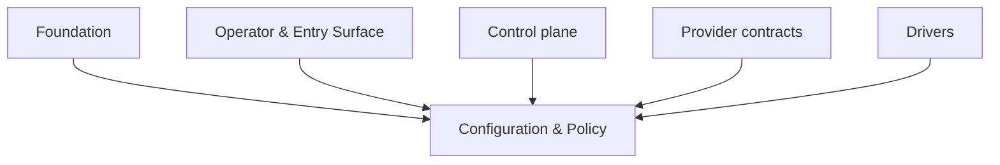
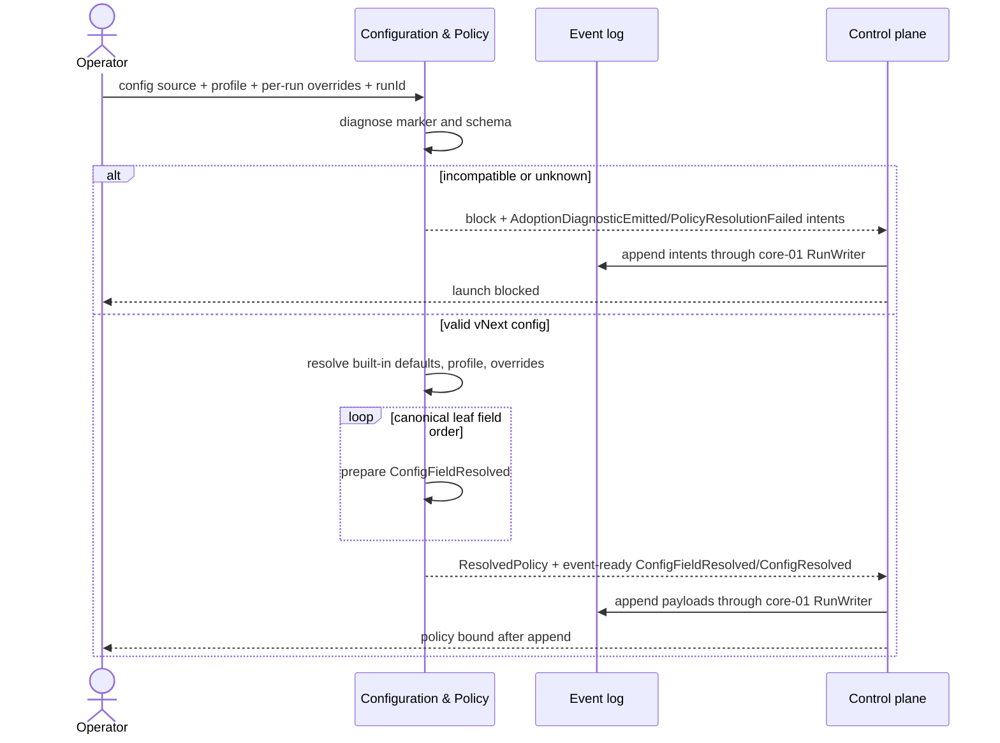

# Configuration & Policy — design

## 1. Purpose & boundaries

Configuration & Policy defines the vNext config schema, deterministic policy resolution, per-field
provenance, safe defaults, and adoption diagnostics. It is the foundation source that the Control
plane, provider contracts, and drivers read before deciding what powers are available.

Out of scope: applying approval, escalation, capability, verification, or merge decisions. Those are
owned by consuming core domains. Credentials and secrets are owned by Credentials & Secrets.

## 2. Required reading

- [README.md](../../README.md)
- [architecture.md](../../architecture.md)
- [conventions.md](../../conventions.md)
- [glossary.md](../../glossary.md)
- [charter.md](charter.md)
- [decisions.md](../../decisions.md)

No sibling contract was read or required. This foundation design depends on nothing above Foundation
and introduces no forbidden dependency.

## 3. Context diagram



## 4. Design

The low-level detail is split because the schema, resolution algorithm, interfaces, events, and tests
are cohesive but too large for a single focused file:

- [Schema & resolution](design/schema-and-resolution.md) defines the config marker, policy blocks,
  safe defaults, deterministic precedence, per-field provenance, capability default-off model, and
  adoption diagnostics.
- [Interfaces, events & verification](design/interfaces-events-and-verification.md) defines the
  typed interface, emitted events, fail-closed states, and test strategy.

Core design decisions:

- The only accepted config marker is `schema: "kit-vnext.config.v1"`.
- Resolution has exactly three layers: operator per-run override, selected profile, then immutable
  built-in defaults.
- Operator overrides always win; unknown fields are rejected instead of ignored.
- Defaults are complete, supervised, and safe: capabilities off, approval assisted, runner merge off.
- Capability config expresses desired powers only; actual availability still requires fresh positive
  Capability attestation.
- Adoption diagnostics are marker-first and fail closed. Non-vNext or unknown artifacts refuse to
  run with guidance; no migration or silent interpretation occurs.

## 5. Contracts & interfaces

Configuration & Policy exposes a deterministic API:

```ts
interface ConfigurationPolicy {
  diagnoseAdoption(
    sources: AdoptionSource,
    context: AdoptionContext,
  ): Result<AdoptionReport, AdoptionDiagnosticFailure>;
  resolveRunPolicy(
    source: ConfigSource,
    input: RunConfigInput,
    context: ResolutionContext,
  ): Result<ResolvedPolicyResult, PolicyResolutionFailure>;
}
```

It consumes no core, provider, or driver interface. `AdoptionContext` supplies a foundation event
writer only for pre-run `ConfigLoaded`; resolution supplies `runId` but no writer. Successful and
failed adoption/resolution paths return structural append intents for the owning core domain to
append through core-01's single leased `RunWriter` before binding or blocking the Run. Those intents
include the structural core-01 envelope fields (`domain`, `type`, `occurredAt`, durability, and
payload) while fnd-01 owns only the payload semantics. Full types are in
[Interfaces, events & verification](design/interfaces-events-and-verification.md).

## 6. Events & data

Owned event payloads:

- `ConfigLoaded`
- `ConfigFieldResolved`
- `ConfigResolved`
- `AdoptionDiagnosticEmitted`
- `PolicyResolutionFailed`

The key invariant is one `ConfigFieldResolved` intent per resolved leaf field, returned in canonical
lexicographic field order before `ConfigResolved`. Core-01 appends those event-ready intents in one
atomic RunWriter transaction. Projections may read the latest resolved policy and provenance map; they
do not author policy.
Adoption preflight returns one `AdoptionDiagnosticEmitted` append intent per blocking config or
artifact diagnostic, plus a `PolicyResolutionFailed` append intent for the fail-closed state.

## 7. Behavior diagram



## 8. Failure & degraded modes

Fail-closed states:

- `adoption_incompatible`: config has a non-vNext marker.
- `adoption_unknown_artifact`: config or artifact has no recognized vNext marker.
- `adoption_diagnostic_unrecorded`: returned diagnostic/failure intents were not appended by the
  owning core writer.
- `config_loaded_unrecorded`: pre-run `ConfigLoaded` could not be committed by the foundation writer.
- `config_invalid`: schema validation failed.
- `profile_unknown`: requested profile does not exist.
- `override_invalid`: operator override has an unknown or invalid field.
- `unsupported_deferred_capability`: config attempts to set `orchestrator-decide` in v1.
- `provenance_write_failed`: resolved policy was computed but not activated because the returned
  provenance payloads were not appended through core-01.

Capability gates treat any missing resolved policy, failed diagnostic, or missing provenance event as
all autonomous capabilities absent. The degraded state is supervised and blocked before launch.

## 9. Testing strategy

Satisfies policy-side FR-4 and FR-7, FR-13, NFR-SAFE, NFR-DET, NFR-SOLID, and NFR-TEST.

Tests are pure and use in-memory sinks: schema fixtures, safe-default snapshots, precedence property
tests, provenance order/hash tests over returned structural append intents, adoption config/artifact
diagnostic tests, deferred-capability rejection tests, and capability default-off tests. Core-01
integration covers RunWriter append failure. No real providers, credentials, processes, or Forge
operations are used, satisfying NFR-TEST.

## 10. Open questions

- Exact field names for approval/escalation handoff should be reconciled with core-03 and prov-01.
- The charter asks whether narrow dependency-install auto-grant is default-on or explicit opt-in.
  This design chooses default-on but tightly bounded; chief architect should confirm.

## 11. Definition of done

- [x] All sections complete; guidance notes removed.
- [x] Files are focused; large design detail is split into cohesive subfiles.
- [x] Complies with the Dependency Rule; dependencies listed and justified.
- [x] Uses glossary vocabulary.
- [x] States the FR/NFR ids satisfied; shows how NFR-TEST is met.
- [x] Failure/degraded modes defined (fail-closed).
- [x] Provider-domain validation is not applicable to this foundation domain.
- [x] Diagrams present and consistent with architecture.md naming.
- [x] Open questions captured, not silently resolved.
