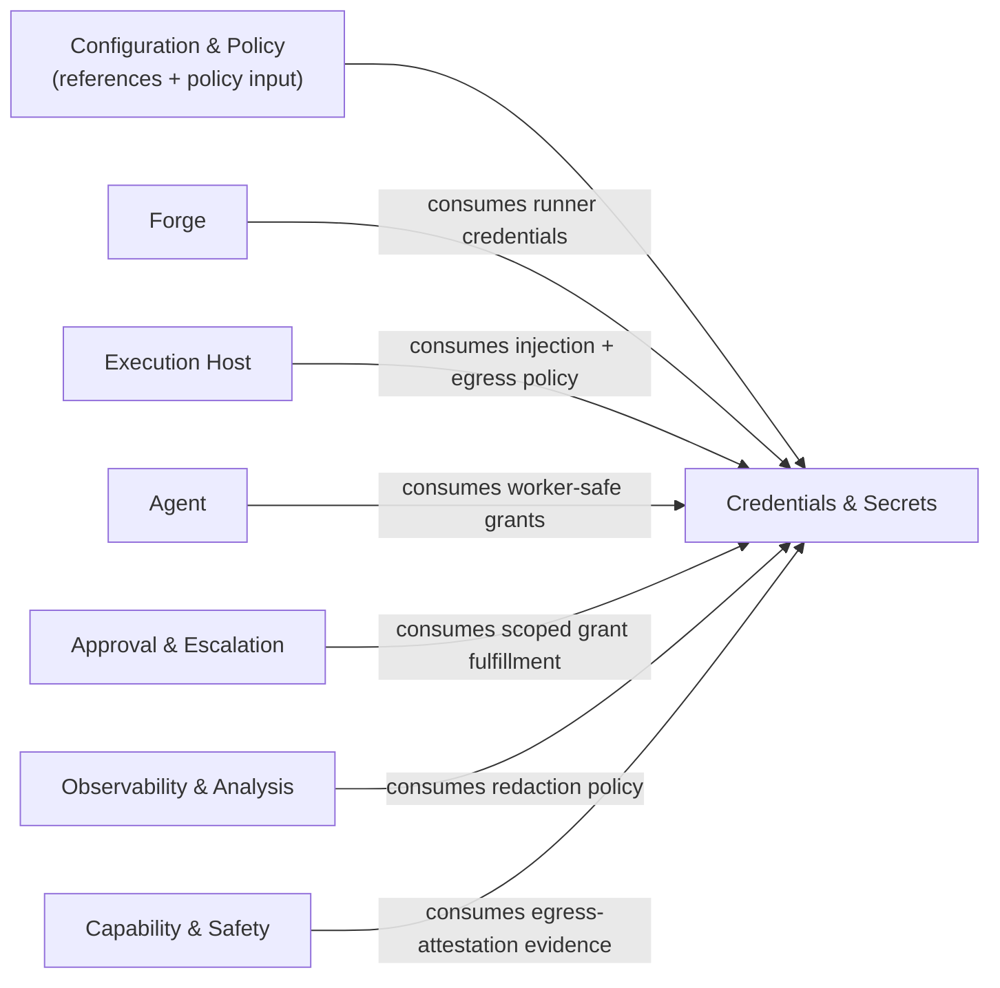
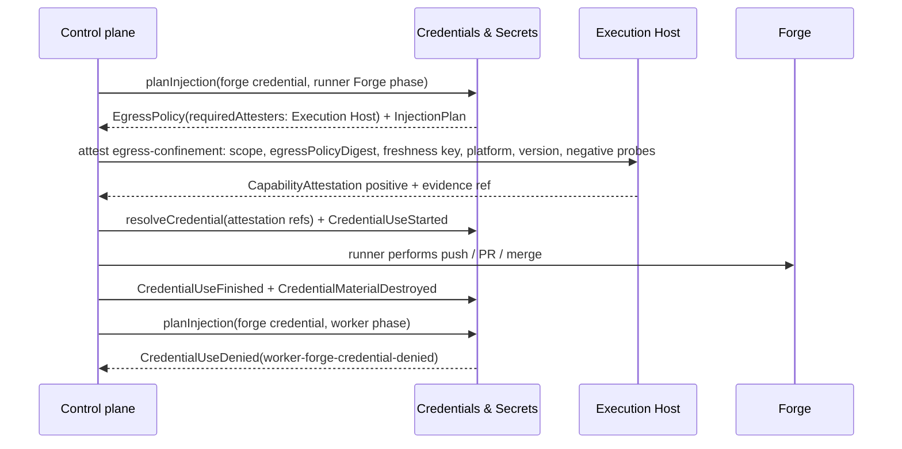

# Credentials & Secrets -- design

## Mandate

**Purpose.** Scoped credential injection, redaction, and audit, plus the egress-policy spec. The core
invariant: **the worker never holds Forge credentials** (FR-12).

### Responsibilities (in scope)
- Resolve credentials from the environment / secret manager (referenced, **never stored in the repo**).
- **Scoped injection**: give each party only what it needs — the runner gets Forge credentials; the
  worker gets only its narrow needs (e.g. a registry scope), **never Forge credentials**.
- **Redaction** of secrets in all telemetry and artifacts; **audit** of every credential use.
- The **egress policy** (host allowlists) handed to the Execution Host for enforcement and
  **attestation**, and to consuming drivers as policy input (enforcement is delegated and proven, not
  performed here — AD-5).

### Out of scope
- Enforcing egress (delegated + attested by the Execution Host, prov-04).
- The secret-storage backend (env / secret manager — referenced, not reimplemented).

### Requirements owned
FR-12 (credential isolation), NFR-SEC.

### Dependencies (Dependency Rule)
- Depends on: nothing above Foundation.
- Depended on by: prov-02 (Forge credentials), prov-04 (runner-command credentials), core-03 (scoped
  grant fulfillment).

### Required reading
Standard set + the worker/runner boundary (AD-12) and NFR-SEC in
[decisions.md](../../../decisions.md) / [requirements.md](../../../requirements.md).

### Deliverable
`README.md` defining: the credential model + scoped-injection rules (who gets what); the redaction
policy; the audit events; the egress-policy shape consumed by Execution Host attestation and
consuming-driver policy input.

### Definition of done (domain-specific)
- The worker provably never receives Forge credentials; every credential use is audited.
- Secrets are redacted in all telemetry and artifacts.

### Open questions
- Secret-manager integrations; per-driver credential shapes.

## 1. Purpose & boundaries

Credentials & Secrets turns configured secret references into tightly scoped, auditable credential
use. It owns the credential model, scoped injection rules, redaction policy, audit event shapes, and
egress-policy document handed to the Execution Host for attestation and to consuming drivers as
policy input.

Out of scope: enforcing egress, implementing a secret manager, provider-specific Forge/Agent/Work Source/Execution Host behavior, and event-log storage mechanics. This Foundation domain depends only on Configuration & Policy for credential references and policy input; it does not call Edge, Control plane, provider contracts, drivers, or concrete secret backends.

## 2. Required reading

Read: `README.md`, `architecture.md`, `conventions.md`, `glossary.md`, `decisions.md`, `requirements.md`, and this domain's `README.md#mandate`. No sibling contracts were read. This design uses AD-12's worker / runner boundary and the shared capability attestation model.

## 3. Context diagram

Only `Configuration & Policy -> Credentials & Secrets` is a dependency of this domain. The other
arrows identify domains that depend on this Foundation output.

## 4. Design

Credentials stay as references until the last responsible moment. Secret material exists only in memory inside the runner process or a driver call boundary, is wrapped with a redaction set before capture, and is never stored in repo files, events, projections, or artifacts. The typed model is in [contracts-and-events.md](contracts-and-events.md): `CredentialRef` names kind, purpose, secret reference, allowed parties/phases/hosts, TTL, and policy digest; `CredentialScope` binds a use to run, task, operation, party, phase, optional command prefix, expiry, and grant event.

Scoped injection rules:

1. Forge credentials are `kind: "forge"` and runner-only; any worker plan containing one emits `CredentialUseDenied`.
2. The worker environment is closed and minimal by default: no inherited environment, no ambient repo credentials, no shell profile, and no credential-like host variables. The worker receives only explicit non-Forge inputs derived from typed `CredentialRef`s whose `allowedParties` includes `worker`.
3. The runner receives Forge credentials only for runner-owned Forge phases: push, PR create/update, evidence refresh, review metadata, and merge.
4. Worker credentials are bounded by party, phase, command prefix, TTL, host allowlist, injection mode, egress policy, prior audit event, and fresh attestations for every enforcement point.
5. Scoped grants may request credential use but cannot expand configured parties, phases, hosts, command prefix, TTL, or credential kind.
6. File injection uses temporary paths outside repo-controlled files; env injection is per spawned process; both are destroyed when the operation ends.

The worker-no-Forge invariant is a pure predicate over `CredentialRef` and `CredentialScope`: party and phase must be allowed, the scope must be unexpired, and `scope.party === "worker" && ref.kind === "forge"` is always false.

Threat model: a worker, dependency, or tool may try to read ambient credentials, request broad grants, or exfiltrate injected material; logs, provider responses, analysis, or artifacts may capture secrets; egress attestation may be stale, wrong-scope, or missing an enforcement point; and crashes may interrupt audit append, redaction, or cleanup. Trusted base: the runner process, configured secret resolver, event writer, and attesting drivers. If any part cannot prove its guarantee, credential use is denied.

Retention and tamper evidence:

- Secret material and decrypted values are memory-only and destroyed at operation end or TTL expiry; they are never persisted.
- Redaction sets are memory-only and destroyed with the operation; only fingerprint ids and replacement counts persist.
- Temporary injected files live outside repo-controlled files and are deleted at operation end; failure enters `credential-destroy-unconfirmed`.
- Keyed fingerprints, redaction counts, egress-policy ids and digests, audit records, and
  quarantine metadata are retained for the run event-log lifetime and never contain reversible secret
  values.
- Quarantined artifacts are inaccessible evidence until recovery resolves them; raw quarantine is then deleted or replaced by a redacted artifact, while metadata remains for the run event-log lifetime. They cannot satisfy gates.
- Every credential decision event carries `policyDigest`, `credentialRefDigest`, `scopeDigest`,
  `grantEventId` when present, `attestationEventIds`, `evidenceRefs`, `prevEventHash`, and
  `eventHash`. Global ordering and writer identity come from the core-01 event envelope; the
  credential audit hash chain is payload-local over prior credential-audit events only.

Redaction is source-side and recursive. A `RedactionSet` covers the raw secret plus shell assignment, JSON value, authorization header, URL-encoded value, and sensitive temporary file path. Events, projection inputs, process output, command lines, errors, Agent prompts/tool results, Forge responses, CI logs, analysis records, and text artifacts are redacted before persistence. Binary artifacts are proven clean, transformed by a safe text extractor, or quarantined as `artifact-redaction-failed`. Redacted output uses labels like `[REDACTED:credential:<id>]`; audit events store keyed fingerprints only.

The `EgressPolicy` type in [contracts-and-events.md](contracts-and-events.md) is default-deny data
for attestation, not enforcement. It includes the canonical `egressPolicyDigest`, rules, negative
probes, required attesters, freshness key, and expiry.

Worker egress policies can reference only non-Forge credentials. Runner egress policies can
reference Forge credentials only for runner Forge phases. A credential requiring egress confinement
is released only after the Execution Host enforcement point has a fresh positive
`CapabilityAttestation` (`capability: "egress-confinement"`) matching the egress-policy `scope` and
`egressPolicyDigest`, freshness key, platform, driver version, expiry, evidence ref, and negative
probes. Missing, stale, partial, or mismatched attestation denies injection.

## 5. Contracts & interfaces

Typed interfaces live in [contracts-and-events.md](contracts-and-events.md) because the catalog is cohesive detail. It defines `ResolvedCredential`, `InjectionPlan`, `RedactionSet`, `CredentialDenied`, `RedactedInput`, `RedactedValue`, and the public `CredentialsAndSecretsContract`.

Exposes: `resolveCredential(ref, scope): ResolveCredentialResult`;
`planInjection(refs, scope): PlanInjectionResult`;
`redact<T extends RedactedInput>(value, redactionSet): RedactResult<T>`;
`destroy(operationId): CredentialMaterialDestroyed`; and
`issueEgressPolicy(refs, scope): EgressPolicy | CredentialDenied`.

Consumes: Configuration & Policy supplies `CredentialRef` records and defaults by value. Dependency Rule justification: this is a Foundation peer dependency; provider, Control plane, and Edge domains consume this domain rather than being called by it.

## 6. Events & data

Typed payloads for `CredentialUsePlanned`, `CredentialUseStarted`, `CredentialUseFinished`, `CredentialUseDenied`, `CredentialMaterialDestroyed`, `RedactionApplied`, and `EgressPolicyIssued` are defined in [contracts-and-events.md](contracts-and-events.md).

Audit invariant: every resolved credential use has exactly one `CredentialUseStarted` or
`CredentialUseDenied`; every start has `CredentialUseFinished` and `CredentialMaterialDestroyed`, or
the run enters a degraded mode. Every credentialed operation is bound to policy, grant, attestations,
evidence, the core-01 envelope ordering and writer epoch, and the payload-local credential audit hash
chain.

## 7. Behavior diagram

## 8. Failure & degraded modes

- `credential-ref-unresolved`: missing, inaccessible, or ambiguous reference; deny use.
- `credential-scope-denied`: party, phase, command prefix, host, or TTL exceeds policy; deny use.
- `worker-forge-credential-denied`: attempted Forge credential exposure to worker; deny use and audit.
- `egress-policy-unattested`: any configured enforcement point lacks a matching fresh positive attestation; deny confined credentials.
- `redaction-unavailable`: redaction set unavailable before capture; deny use.
- `audit-write-unavailable`: audit event cannot be appended before use; deny use.
- `credential-destroy-unconfirmed`: block settlement until recovery records the outcome.
- `artifact-redaction-failed`: quarantine artifact; it cannot satisfy gates.

Capability gates treat all failures as absent capability. Unknown or ambiguous state fails closed.

## 9. Testing strategy

Requirements satisfied: FR-12 and NFR-SEC. Supports NFR-TEST, NFR-SAFE, NFR-DET, and NFR-SOLID.
NFR-TEST is met with mock secret resolvers, mock Configuration & Policy input, mock Execution Host
egress attestations, consuming-driver policy inputs, and zero real processes or network in
control-plane tests. Driver conformance suites must prove real and mock drivers honor
`InjectionPlan`, `RedactionSet`, and `EgressPolicy`.

Focused tests: property-test `mayInject` so no policy or grant injects Forge credentials into the worker; prove worker env construction starts closed and only adds typed non-Forge `CredentialRef` bindings; enforce audit start/deny and finish/destroy invariants; verify tamper fields bind policy, grants, attestations, evidence, core-01 envelope metadata, and the payload-local hash chain; redact generated secrets and encodings across structured data, logs, provider responses, and text artifacts; deny missing/stale/partial/mismatched egress attestations; replay decisions from recorded references, scopes, grants, attestations, and events.

## 10. Open questions

Open questions: which secret-manager integrations are v1-supported beyond environment variables; what exact credential shapes the first Forge, registry, Agent, and Execution Host drivers need; and whether worker egress to public Forge hosts is allowed when no Forge credential is present. Retention is no longer open: this design uses the concrete retention rules in Section 4.

## 11. Definition of done

- [x] All sections complete; guidance notes removed.
- [x] Files are focused; typed contracts/events are split into `contracts-and-events.md` as one cohesive catalog.
- [x] Complies with the Dependency Rule; dependencies listed and justified.
- [x] Uses glossary vocabulary.
- [x] States the FR/NFR ids satisfied; shows how NFR-TEST is met.
- [x] Failure/degraded modes defined (fail-closed).
- [x] Provider domains: contract validation is not applicable to this Foundation domain.
- [x] Diagrams present and consistent with architecture.md naming.
