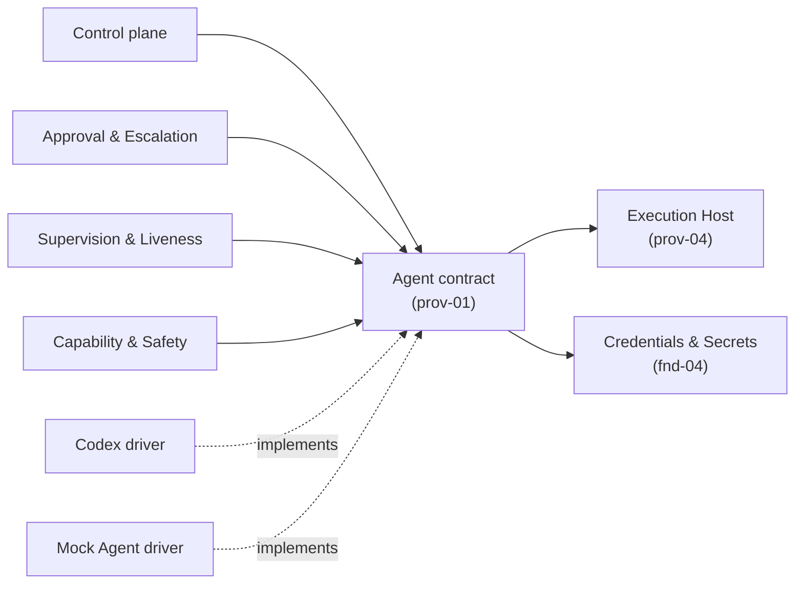
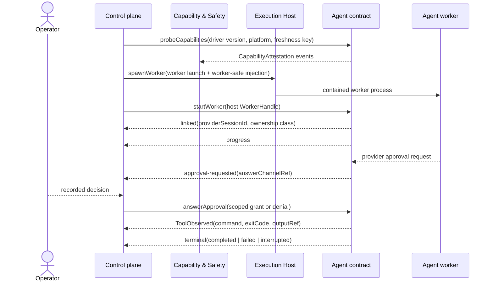

# Agent Execution - design

## 1. Purpose & boundaries

Agent Execution is the host-neutral provider seam for the Agent / worker protocol. It drives a
worker that runs on an Execution Host, normalizes worker protocol events, relays approval requests
and answers, resumes owned sessions when attested, and records capability attestations for real and
mock drivers.

Out of scope: approval adjudication and policy (core-03), liveness decisions (core-04), process
containment, kill, and runner-owned verify (prov-04), workspace and local git lifecycle (fnd-03),
Forge push/PR/check/review/merge (prov-02), and credential issuance (fnd-04). The Agent seam never
executes commands itself; it observes worker tool activity and references captured output by
`outputRef`.

## 2. Required reading

Read: `README.md`, `architecture.md`, `decisions.md`, `requirements.md`, `conventions.md`,
`glossary.md`, `_templates/domain-design-template.md`, `domains/README.md`, this domain's
`charter.md`, `prov-04` charter and design including `design/contracts-and-conformance.md`, and
`fnd-04` charter and design. No legacy docs, memory, external web/API sources, or repository files
outside that set were read. Provider evidence captured locally is under `evidence/`.

## 3. Context diagram

Dependency Rule compliance: this domain defines a provider contract and driver obligations. It
depends on the Execution Host for worker process ownership and on Credentials & Secrets only for the
redaction set used by `AgentOutputSink`; worker-safe injection is delivered through the prov-04
host-side `HostInjectionContext`, a subset of the fnd-04 `InjectionPlan`. It introduces no dependency
on the Control plane or concrete core modules. The Control plane consumes the Agent contract; Codex
and mock drivers implement it.

## 4. Design

The contract is intentionally split from driver mechanics. This file is the entry point; deep detail
lives in focused subfiles:

- [contracts-and-conformance.md](design/contracts-and-conformance.md) - typed Agent contract.
- [capabilities-and-conformance.md](design/capabilities-and-conformance.md) - capability set,
  event invariants, and conformance suite.
- [codex-driver.md](design/codex-driver.md) - Phase 0/Phase 1 Codex mapping, approval enum mapping,
  Guardian treatment, process-parentage rules, and evidence gates.
- [mock-driver.md](design/mock-driver.md) - programmable adversarial driver and incident replay
  fixtures.

Worker lifecycle is `probe -> start -> linked -> observe -> answer approvals -> terminal`. The
Execution Host spawns the worker executable and owns containment. The Agent driver opens the worker
protocol stream, emits a `linked` event when it has a stable provider session id, normalizes progress
and tool observations, and emits exactly one terminal event for the Agent session.

Approval relay is durable only when two independent facts hold: the driver can catch a provider
approval request, and it can persist an answer channel across human latency or owned-session resume.
If either fact is missing, the request is still recorded, but the run parks rather than pretending an
answer can be delivered later.

Tool execution remains inside the worker process tree. For Codex, the driver observes command
execution items that the worker protocol reports, extracts `command`, `exitCode`, and captured
output, stores redacted output through the supplied output sink, and emits
`ToolObserved{command, exitCode, outputRef}`. If an exit code is missing, the driver emits a degraded
event instead of fabricating one. Runner-owned verify continues to use Execution Host `runCommand`.

## 5. Contracts & interfaces

The public interface is:

- `probeCapabilities(scope): CapabilityAttestation[]`
- `startWorker(request, hostHandle): AgentSession | AgentFailure`
- `observe(session): AsyncIterable<AgentEvent>`
- `answerApproval(session, answer): ApprovalAnswerResult`
- `resumeOwned(request): AgentSession | AgentFailure`
- `stopObserving(session): AgentReleaseResult`

Normalized events are `progress`, `linked`, `approval-requested`,
`ToolObserved{command, exitCode, outputRef}`, `guardian-review`, `degraded`, and `terminal`.

Capabilities are `canRelayApproval`, `canPersistApprovalAnswerChannel`, `canResumeOwned`,
`emitsStructuredToolExit`, `emitsGuardianReview`, and `preservesHostProcessParentage`. Capability
gates require fresh positive attestations with driver version, platform, freshness key, scope, and
evidence refs. Stale, absent, negative, or schema-only evidence disables the dependent power.

## 6. Events & data

Emitted events: `AgentCapabilityAttested`, `AgentSessionStarted`, `AgentSessionLinked`,
`AgentProgressObserved`, `AgentApprovalRequested`, `AgentApprovalAnswered`,
`AgentToolObserved`, `AgentGuardianReviewObserved`, `AgentSessionTerminal`,
`AgentObservationDegraded`, and `AgentSessionReleased`.

Stream events map to log event names as follows: `linked` -> `AgentSessionLinked`, `progress` ->
`AgentProgressObserved`, `approval-requested` -> `AgentApprovalRequested`, `tool-observed` ->
`AgentToolObserved`, `guardian-review` -> `AgentGuardianReviewObserved`, `degraded` ->
`AgentObservationDegraded`, and `terminal` -> `AgentSessionTerminal`.

Consumed data: `WorkerHandle` / `HostWorkspaceHandle`, host observations, and
`HostInjectionContext` from prov-04; `redactionSetId` / redaction set for `AgentOutputSink` from
fnd-04; prompt/task payload and approval answers passed in by the Control plane. Contributed
projections are latest Agent capability by freshness key, active provider session linkage, pending
approval channels, last tool observations, and terminal Agent state.

## 7. Behavior diagram

## 8. Failure & degraded modes

- `agent-capability-unattested`: required attestation is missing, stale, negative, or wrong-scope.
- `agent-linkage-lost`: no stable provider session id or ownership linkage is observed.
- `approval-relay-unattested`: provider requests approval but relay capability is absent.
- `approval-answer-channel-lost`: request was captured but cannot be answered after park/resume.
- `agent-resume-unattested`: resume is requested without a fresh positive `canResumeOwned`.
- `structured-tool-exit-missing`: command output is observed without a trustworthy exit code.
- `tool-output-ref-missing`: output capture exists but no redacted `outputRef` was produced.
- `guardian-review-untrusted`: Guardian payload is missing, unstable, or unactionable.
- `host-parentage-unproven`: worker commands cannot be tied to the host-owned process tree.
- `agent-terminal-ambiguous`: provider ends without a single classified terminal state.

Capability gates fail closed. Approval relay parks for Operator attention when relay or persistence
is absent. Supervision cannot treat tool activity as killable when parentage is unproven. Completion
cannot use tool observations with missing exit codes or output refs. Guardian data is advisory unless
`emitsGuardianReview` is freshly attested.

## 9. Testing strategy

Requirements satisfied by the design: FR-3, FR-4 transport, NFR-EXT, and NFR-TEST. It supports
NFR-SAFE and NFR-DET by making every autonomous power a pure function of recorded attestations and
events.

NFR-TEST: Control plane tests run against the mock Agent with zero real processes and zero network.
Provider conformance covers schema probes, real Codex smoke tests when available, incident replays,
and adversarial mocks that omit, delay, or lie about linkage, approvals, exit codes, Guardian claims,
and terminal status. Real-driver validation remains partial until live approval/resume and
parentage probes are captured for the target Codex version.

## 10. Open questions

- Guardian integration is resolved for v1 as advisory observation only. It may become load-bearing
  only after stable schema and live `approveGuardianDeniedAction` probes are positive.
- Worker-command parentage under app-server is explicitly deferred to a joint prov-01/prov-04 probe.
  Until `preservesHostProcessParentage` is positive, app-server worker commands cannot unlock
  unattended autonomy or kill-dependent recovery.
- Whether Phase 0 `mcp-server` can persist approval answer channels through `elicitation/create`
  remains unsatisfied by current evidence.
- Resolved: `outputRef` is an fnd-02 `ArtifactRef.id`, resolvable via
  `ArtifactStore.resolve(id)`; this domain still treats it as an opaque, redacted output reference.

## 11. Definition of done

- [x] All sections complete; guidance notes removed.
- [x] Files are focused; detailed contract, Codex, and mock topics are split into `design/`.
- [x] Complies with the Dependency Rule; dependencies listed and justified.
- [x] Uses glossary vocabulary.
- [x] States the FR/NFR ids satisfied; shows how NFR-TEST is met.
- [x] Failure/degraded modes defined (fail-closed).
- [ ] Provider domains: Codex schema and MCP probes are captured, but live real-driver approval,
  resume, structured tool-exit, and parentage probes are not yet complete.
- [x] Diagrams present and consistent with architecture.md naming.
- [x] Open questions captured, not silently resolved.
