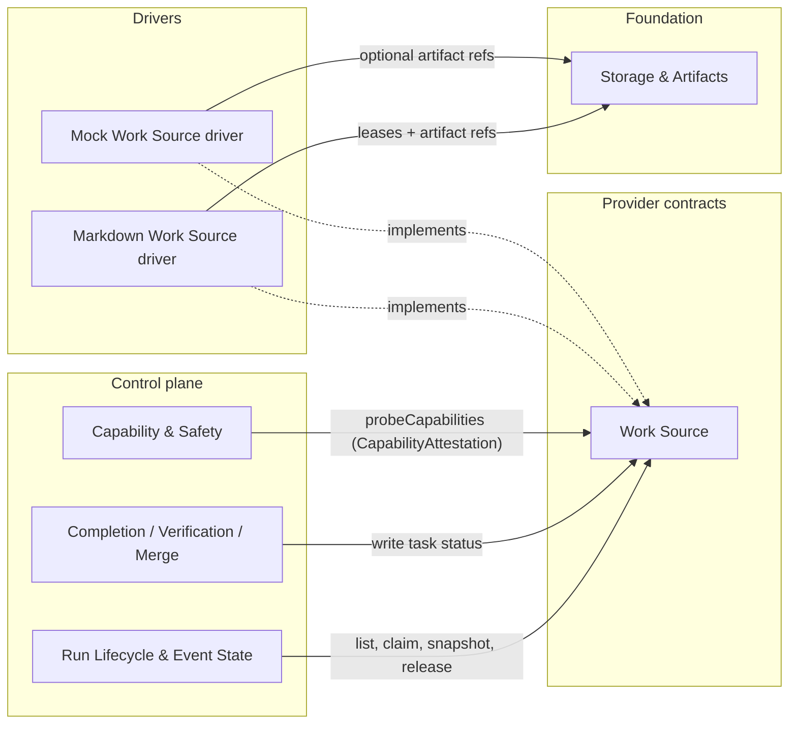

# Work Source - design
## 1. Purpose & boundaries
Work Source is the provider contract for Tracks, Tasks, eligibility, claim/release, TaskSnapshot
creation, and task status writes. It is the task status authority. Run activity remains owned by the
Event log; Work Source never writes run state and the Control plane never edits task source files
except through this contract.

Out of scope: authoring PRDs/designs or storing documents; local git evidence collection; Forge,
Agent, and Execution Host behavior; cross-repo routing. A Task may reference a PRD/design, but Work
Source snapshots the reference and any inline spec text rather than becoming a document store.

## 2. Required reading
Read only: `README.md`, `architecture.md`, `conventions.md`, `glossary.md`, `requirements.md`,
`decisions.md`, `_templates/domain-design-template.md`, this domain's `charter.md`, and
`domains/fnd-02-storage-and-artifacts/charter.md`, plus
`domains/fnd-02-storage-and-artifacts/design.md`. No external sources or legacy files were used.

## 3. Context diagram


## 4. Design
The contract separates three stable identities: `WorkSourceId` for one configured source inside one
project/repo, `TrackId` for a grouping of Tasks, and `TaskId` for a source-native Task id. A `TaskKey`
is `{ workSourceId, trackId, taskId }`. `target.project` is opaque to Work Source; v1 uses it for
filtering and future routing can interpret it above this seam.

Task model:
- `status`: source-native label plus bucket from the Track's deterministic `statusBuckets` mapping.
- `spec`: inline markdown text and `specRefs[]` with path/URL, label, and optional declared digest.
- `dependencies[]`: simple `TaskKey` references only. Eligibility is false while any dependency is
  missing, blocked, unknown, or not complete. Rich expressions are deferred.
- `claim`: absent or `{ runId, holder, claimedAt, expiresAt, epoch }`; `sourceRecordDigest`: digest of
  the exact parsed task record and inline spec.

TaskSnapshot is produced at claim time and stored as a write-once artifact through fnd-02. It contains
parsed task fields, raw excerpt, source path/digests, spec refs, inline spec digest, dependency keys,
claim metadata, and caller-provided `sourceRevision`. Work Source does not gather local git state; the
caller passes revision evidence so this seam does not cross into local git ownership.

Authority separation: Work Source is authoritative for Task status, claim metadata, Track membership,
and source-native dependency state. The Event log is authoritative for Run activity. A status write
may cite a run id and snapshot ref for audit, but this is Task metadata, not Run truth.

Markdown driver:
- One Track maps to one markdown tracker file with one fenced `kit-work-source` YAML block containing
  `workSourceId`, `track`, and `statusBuckets`. Each Task is a heading plus one fenced `kit-task`
  block; prose until the next Task heading is inline spec.
- The YAML block owns `id`, `track`, `status`, `target.project`, `specRefs`, `dependencies`, and
  optional `claim`. Duplicate ids, invalid YAML, unknown dependency references, or multiple machine
  blocks make the Task unavailable and produce a diagnostic.
- Status mapping is source-owned and deterministic: each native status appears once in
  `statusBuckets`; unmapped labels become `unknown`, make the Task ineligible, and fail dependencies.
- Claim/release/status writes acquire fnd-02 lease `work-source:<workSourceId>:<trackId>`, reread the
  file, compare source and record digests, edit only the Task YAML block, fsync through the storage
  primitive, reread, and verify the post-write digest. A changed precondition returns a conflict.
- Claims have explicit expiry; replacement of an expired claim requires the Track lease and returns a
  diagnostic naming the prior claim.

Mock driver:
- Backlog state is an in-memory or fixture-provided list of Tracks and Tasks. It implements the same
  preconditions, claim expiry, dependency checks, status writes, and failure injection points as the
  Markdown driver, including races, stale snapshots, omitted signals, delayed writes, and false claims.

Sync/import/export boundaries:
- Import/read parses source data into `TaskView` and `TaskSnapshot`; sync performs fenced
  claim/release/status mutation only; export returns artifact refs and deterministic diagnostics. Work
  Source does not author PRDs/designs, publish docs, push branches, or write Forge state.

## 5. Contracts & interfaces
```ts
type StatusBucket = "eligible" | "inProgress" | "complete" | "blocked" | "unknown";
type WorkSourceCapability =
  | "supportsTracks" | "supportsClaim" | "supportsStatusWrite" | "supportsDependencies";
interface WorkSourceProbeScope {
  driverId: string;
  driverVersion: string;
  platform: string;
  sourceKind: "markdown" | "mock";
  freshnessKey: string;
  capabilities: WorkSourceCapability[];
  trackIds?: string[];
  at: string;
}
interface CapabilityAttestation {
  capability: WorkSourceCapability;
  probeMethod: string;
  result: "positive" | "negative";
  evidenceRef: string;
  scope: string;
  expiry: string;
  driverVersion: string;
  platform: string;
  freshnessKey: string;
  at: string;
  details?: Record<string, unknown>;
}
type TaskKey = { workSourceId: string; trackId: string; taskId: string };
type SpecRef = { kind: "path" | "url"; ref: string; label?: string; declaredDigest?: string };
type TaskStatus = { native: string; bucket: StatusBucket };
type Claim = { runId: string; holder: string; claimedAt: string; expiresAt: string; epoch: number };
type TaskView = { key: TaskKey; title: string; status: TaskStatus; target: { project: string };
  spec: { inline?: string; refs: SpecRef[] }; dependencies: TaskKey[]; claim?: Claim;
  sourceRecordDigest: string };
type TaskSnapshot = { task: TaskView; sourcePath: string; sourceRevision: string;
  sourceBytesDigest: string; inlineSpecDigest?: string; rawExcerptDigest: string; createdAt: string };
interface WorkSource {
  probeCapabilities(scope: WorkSourceProbeScope): CapabilityAttestation[];
  listTracks(): TrackView[] | WorkSourceError;
  listTasks(trackId: string): TaskView[] | WorkSourceError;
  nextEligible(input: { trackIds?: string[]; targetProject?: string }): TaskView | null | WorkSourceError;
  claim(input: { task: TaskKey; runId: string; holder: string; ttlMs: number;
    expectedRecordDigest: string; sourceRevision: string }): ClaimResult | WorkSourceError;
  release(input: { task: TaskKey; runId: string; reason: string; expectedEpoch: number }): void | WorkSourceError;
  writeStatus(input: { task: TaskKey; status: TaskStatus; expectedRecordDigest: string;
    evidenceRef?: ArtifactRef; note?: string }): StatusWriteResult | WorkSourceError;
}
type ClaimResult = { task: TaskView; snapshotRef: ArtifactRef; snapshotDigest: string };
```
Capabilities are attested by `probeCapabilities`, not declarations: `supportsTracks` enumerates
Tracks and detects malformed Track files; `supportsClaim` acquires a Track lease, performs
digest-checked claim, and rejects stale writes; `supportsStatusWrite` writes and verifies status
under the same precondition model; `supportsDependencies` parses simple TaskKey dependencies and
excludes incomplete dependencies.

Consumed Foundation contract: fnd-02 `LeaseStore` for fenced Track mutation and `ArtifactStore` for
TaskSnapshot, parse diagnostics, and probe evidence. This design introduces no dependency on the
Control plane or concrete consumers.

## 6. Events & data
Work Source does not append Control plane events directly. It returns `CapabilityAttestation`
results, Track inventory, TaskView, ClaimResult, release result, status write result, conflicts,
degraded states, and artifact refs for the Control plane to record. Data authored here: Task record
edits, claim metadata, status labels, TaskSnapshot artifacts, parse/probe diagnostic artifacts, and
conformance snapshots.

## 7. Behavior diagram
```mermaid
sequenceDiagram
  participant RL as Run Lifecycle & Event State
  participant WS as Work Source
  participant L as LeaseStore
  participant A as ArtifactStore
  RL->>WS: nextEligible(trackIds, targetProject)
  WS-->>RL: TaskView + sourceRecordDigest
  RL->>WS: claim(task, runId, holder, ttl, expectedRecordDigest, sourceRevision)
  WS->>L: acquire("work-source:<source>:<track>", holder, ttl)
  L-->>WS: LeaseCapability(epoch, token)
  WS->>WS: reread source; verify source + record digest; write claim
  WS->>A: put(TaskSnapshot)
  A-->>WS: snapshotRef
  WS-->>RL: ClaimResult(task with claim, snapshotRef)
  Note over RL,WS: RL records run events; WS remains only task/status authority.
```

## 8. Failure & degraded modes
- `work-source-unavailable`: source root or Track cannot be read; task intake fails closed.
- `track-malformed`: deterministic parse failed; affected Track/Task is ineligible.
- `dependency-unresolved`: dependency key is missing, malformed, blocked, unknown, or incomplete.
- `status-bucket-unknown`: source-native status is unmapped or maps ambiguously; Task is ineligible.
- `claim-conflict`: expected digest, status, or claim precondition changed before mutation.
- `claim-lock-unavailable`: fnd-02 lease is unavailable or degraded; `supportsClaim` is absent.
- `snapshot-artifact-unavailable`: TaskSnapshot cannot be stored as a write-once artifact; claim is
  refused because faithful replay cannot be proven.
- `status-write-unavailable`: status write cannot be verified; `supportsStatusWrite` is absent.
- `status-authority-conflict`: caller tries to overwrite Task status without a current digest.

Capability gates treat stale, absent, or negative Work Source attestations as capability absent.
Without `supportsClaim`, unattended task intake is disabled. Without `supportsStatusWrite`, the run may
settle in the Event log but must not mark the Task complete. Without `supportsDependencies`, dependent
Tasks are not considered eligible.

## 9. Testing strategy
Requirements satisfied: FR-1 through eligible selection, race-safe claim, and TaskSnapshot artifacts;
FR-11 through status authority and no Event log writes; NFR-EXT through the provider contract and
Markdown/mock drivers; NFR-TEST through the conformance suite below.

The conformance suite runs each driver against the same cases: Track enumeration, stable Task identity,
malformed markdown, duplicate ids, status bucket mapping, dependency gating, stale digest rejection,
concurrent claim race, expired claim replacement, release/status write preconditions, snapshot digest
verification, and degraded fnd-02 lease/artifact behavior. Adversarial mocks omit dependencies, delay
writes, lie about status writes, return stale TaskViews, and fail artifact writes; each must yield a
named degraded mode.
## 10. Open questions
Dependency expressiveness is intentionally minimal: simple TaskKey edges only. Rich dependency
expressions need owner approval before adding to the contract. Executable real-driver conformance
remains open until the Markdown and mock drivers exist; current evidence covers local fixtures only.
## 11. Definition of done
- [x] All sections complete; guidance notes removed; file is focused with no split needed.
- [x] Complies with the Dependency Rule; dependencies listed and justified; glossary vocabulary used.
- [x] FR/NFR ids stated; NFR-TEST shown; failure/degraded modes defined fail-closed.
- [ ] Provider contract validated against executable Markdown and mock drivers; fixture evidence only.
- [x] Diagrams present and open questions captured, not silently resolved.
