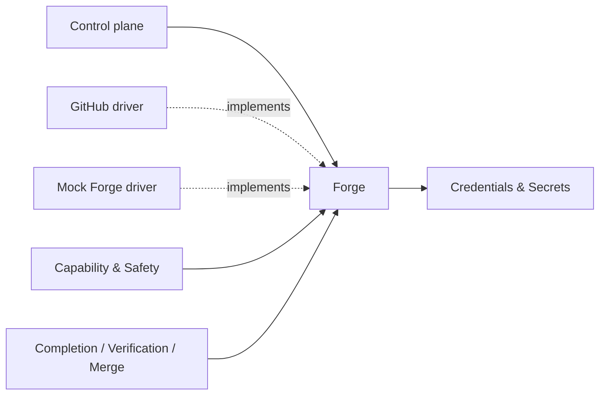

# Forge / Collaboration -- design

## Mandate

**Purpose.** The Forge contract — all **remote, credentialed** repository collaboration — with the
**GitHub** driver and a **mock**. The runner uses this seam; the worker never does.

### Responsibilities (in scope)
- The host-neutral **Forge contract**: **push a branch**, **create/update a PR**, read merge evidence
  (PR state, CI checks, reviews, review threads, branch protection / rulesets) **bound to an exact head
  SHA**, and perform **merge / enqueue / update-branch** with `expectedHeadSha`; plus **capability
  attestation** (`supportsRulesets`, `supportsMergeQueue`, `supportsThreadResolution`,
  `canInspectProtection`).
- Holds **remote credentials** (via fnd-04); the worker is never given them (AD-12).
- The **GitHub driver**: rulesets vs branch protection, merge queue, review-thread resolution,
  exact-head merge, admin/bypass **refusal**, GHES/version degrade.
- The **mock forge**: scripted evidence for offline pipeline tests.

### Out of scope
- The merge/completion **decision** (core-05) — this gathers evidence and performs actions, it does not
  decide. Local git (fnd-03). Process execution (prov-04).

### Requirements owned
FR-6 (forge evidence), FR-7 (perform push/PR/merge), NFR-EXT, NFR-TEST, the Forge slice of NFR-SEC.

### Dependencies (Dependency Rule)
- Depends on: fnd-04 (remote credentials). Implements the Forge contract.
- Must NOT: depend on the control plane.

### Required reading
Standard set + AD-12 in [decisions.md](../../../decisions.md) and the provider evidence/conformance rules
in [conventions.md](../../../conventions.md). GitHub API facts go in this domain's dated `evidence/`
appendix; prefer explicit, stable signals over fragile rollup fields.

### Deliverable
`README.md` defining: the Forge contract + attested capabilities (validated against GitHub **and** the
mock); the GitHub mapping (push, PR, the REST/GraphQL surface used, exact-head binding,
queue/threads/rulesets, admin/bypass refusal); the mock; the conformance suite; degraded modes
(auth/queue/threads unavailable → fail closed).

### Definition of done (domain-specific)
- The contract is satisfiable by GitHub AND the mock; all reads bound to an exact head SHA.
- Remote credentials live only here (never reach the worker); missing/unknown forge state fails closed.
- No undocumented/unstable field is load-bearing.

### Open questions
- GHES coverage; trusted-check source configuration; auto-resolving review threads (default: no).

## 1. Purpose & boundaries

Forge / Collaboration is the provider seam for remote, credentialed repository collaboration. The
runner uses it for branch push, PR create/update, PR comments, evidence collection, update-branch,
merge queue enqueue, and merge. The worker never receives Forge credentials or performs Forge
actions. Out of scope: completion/merge decisions, local git evidence, process execution, credential
policy, and task status; those belong to Control plane, Workspace & Repository, Execution Host,
Credentials & Secrets, and Work Source.

## 2. Required reading

Read: `README.md`, `architecture.md`, `conventions.md`, `glossary.md`, `requirements.md`,
`decisions.md`, `_templates/domain-design-template.md`, this README's Mandate, the fnd-04 charter, fnd-04
`design.md`, and fnd-04 `contracts-and-events.md`. GitHub evidence is in
`evidence/2026-06-18/`.

## 3. Context diagram



`Forge -> Credentials & Secrets` is this domain's only dependency. The Forge contract does not depend
on the Control plane, and no core module imports the GitHub driver.

## 4. Design

The seam separates remote facts from decisions. Forge gathers PR, CI/status, review, review thread,
protection/ruleset, and queue evidence bound to an exact head SHA; Control plane decides what that
evidence means. Every irreversible action requires `expectedHeadSha`; the driver re-reads the remote
PR head and refuses when it is missing, unknown, or different.

Data model: `ForgeRepoRef` names provider, host, owner, repo, default base ref, and credential
reference id. `ForgeBranchRef` binds branch name, local head SHA from Workspace & Repository, remote
head SHA, and push result. `PullRequestRef` carries provider PR id, number/url, base/head refs,
author identity, and head SHA. `ForgeEvidenceSnapshot` carries PR state, base/head SHAs, status/check
rollup, reviews, unresolved threads, protection/ruleset facts, queue facts, provider scope, and
evidence refs. `ForgeActionResult` is accepted, refused, or degraded with observed head SHA,
redaction fingerprint ids, and credential audit event ids.

GitHub mapping validated by evidence: PR reads expose PR state, base/head OIDs, status check rollup,
review decision, review threads, merge state, and merge queue membership. Repository reads expose
branch protection and rulesets separately. Merge, enqueue, and update-branch inputs include
`expectedHeadOid`, which maps to `expectedHeadSha`. Review-thread resolution is a capability, not
default behavior; the default contract reads thread state and comments. PR comments support
runner-authored run status/comment exchange through create/update comment operations. Push is remote
git owned by Forge and needs a disposable writable remote in the conformance suite.

Credential scoping follows fnd-04's approved phase vocabulary: `push`, `PR create/update`, `evidence
refresh`, `review metadata`, and `merge`. Mapping: `pushBranch` -> `push`; `upsertPullRequest`,
`publishComment`, `updateBranch` -> `PR create/update`; `collectEvidence` -> `evidence refresh` and
`review metadata`; `enqueue`/`merge` -> `merge`; optional thread resolution -> `review metadata`. No
new credential phases are introduced. Worker scopes are rejected before material is resolved.
Forge responses are redacted before persistence and reference fnd-04 audit events.

Admin and bypass behavior is absent from the contract. If success requires admin override, bypass,
force-push, or ignoring rules, the driver returns `forge-admin-bypass-refused`.

Mock Forge is not a looser fake. It runs scripted scenarios against the same types, exact-head
checks, capability attestations, degraded states, and event payloads as GitHub. The dated mock
conformance snapshot in `evidence/2026-06-18/` covers adversarial head SHA, CI, review, thread,
ruleset, queue, credential, and auth signals.

## 5. Contracts & interfaces

```ts
type ForgeCapability =
  | "supportsRulesets"
  | "supportsMergeQueue"
  | "supportsThreadResolution"
  | "canInspectProtection";

interface ForgeContract {
  probeCapabilities(scope: ForgeScope): CapabilityAttestation[];
  pushBranch(req: PushBranchRequest): ForgeActionResult;
  upsertPullRequest(req: PullRequestUpsertRequest): ForgeActionResult;
  publishComment(req: PullRequestCommentRequest): ForgeActionResult;
  collectEvidence(req: EvidenceRequest): ForgeEvidenceSnapshot | ForgeDegraded;
  updateBranch(req: ExpectedHeadActionRequest): ForgeActionResult;
  enqueue(req: ExpectedHeadActionRequest): ForgeActionResult;
  merge(req: ExpectedHeadActionRequest): ForgeActionResult;
}
interface EvidenceRequest { repo: ForgeRepoRef; pullRequest: PullRequestRef; expectedHeadSha: string; credentialScope: CredentialScope }
interface ExpectedHeadActionRequest extends EvidenceRequest { method?: "merge" | "squash" | "rebase"; comment?: string }
```

Capability attestations use the shared `CapabilityAttestation` shape. Exact-head support is not
optional; a driver that cannot bind reads and actions to the PR head does not implement Forge.
Consumes from fnd-04: `CredentialRef`, `CredentialScope`, injection/redaction results, and credential
audit event ids. Exposes to Control plane: contract methods and event-ready action/evidence payloads.

## 6. Events & data

Forge contributes event payloads for the run event log; the caller appends them.

- `CapabilityAttestation`: Forge capability probe result.
- `ForgeBranchPushed`, `ForgePullRequestUpserted`, `ForgeCommentPublished`: remote action results
  bound to observed head SHA.
- `ForgeEvidenceCollected`: `ForgeEvidenceSnapshot` and evidence refs.
- `ForgeBranchUpdated`, `ForgeMergeQueued`, `ForgePullRequestMerged`: expected-head action results.
- `ForgeActionRefused`: named degraded/refusal state and observed provider facts.

All Forge events reference fnd-04 credential audit ids when credentials were used, and provider text
is redacted before persistence.

## 7. Behavior diagram

```mermaid
sequenceDiagram
  participant CP as Control plane
  participant FG as Forge
  participant C as Credentials & Secrets
  participant GH as GitHub driver
  CP->>FG: probeCapabilities(scope)
  FG-->>CP: CapabilityAttestation events
  CP->>FG: pushBranch(localHeadSha, runner scope)
  FG->>C: resolve runner Forge credential
  FG->>GH: push remote branch
  FG-->>CP: ForgeBranchPushed(observedHeadSha)
  CP->>FG: upsertPullRequest(headRef, baseRef)
  FG-->>CP: ForgePullRequestUpserted(headSha)
  CP->>FG: collectEvidence(expectedHeadSha)
  FG->>GH: read PR, checks, reviews, threads, protection, queue
  FG-->>CP: ForgeEvidenceCollected(bound to expectedHeadSha)
  CP->>FG: merge(expectedHeadSha)
  FG->>GH: re-read head; merge only if exact
  FG-->>CP: ForgePullRequestMerged or ForgeActionRefused
  FG->>C: finish + destroy credential material
```

## 8. Failure & degraded modes

- `forge-credential-unavailable` / `forge-auth-denied`: fnd-04 denies credentials or provider rejects
  the scoped credential.
- `forge-head-mismatch`: observed PR head differs from `expectedHeadSha`; refuse action.
- `forge-state-unknown`: required PR/check/review state is absent or ambiguous.
- `forge-protection-uninspectable` / `forge-rulesets-unattested`: protection or ruleset state cannot
  be freshly proven.
- `forge-merge-queue-unavailable` / `forge-review-threads-uninspectable`: queue or thread state cannot
  be proven.
- `forge-admin-bypass-refused`: success requires admin/bypass behavior outside the contract.
- `forge-ghes-capability-unknown`: provider/version is outside the attested support matrix.
- `forge-rate-limited` / `forge-redaction-unavailable`: fresh evidence or safe persistence is blocked.

Capability gates treat every degraded mode as absent capability. Unknown external state fails closed.

## 9. Testing strategy

Requirements satisfied: FR-6 forge evidence, FR-7 runner-owned Forge actions, NFR-EXT, NFR-TEST, the
Forge slice of NFR-SEC, plus NFR-SAFE and NFR-DET support through exact-head evidence.

NFR-TEST: control-plane tests use Mock Forge with zero real network or processes. Provider
conformance for each real driver includes schema probes, disposable-repo smoke tests for
push/PR/comment/evidence/update/enqueue/merge, recorded incident replays, and adversarial mocks that
omit, delay, or lie about signals. Replay tests prove decisions use recorded Forge events, not live
provider state.

Focused tests: exact-head mismatch refuses all write actions; missing protection/rulesets/queue/thread
capability degrades rather than guessing; worker credential scopes cannot invoke Forge; provider
output is redacted; admin/bypass paths are unreachable; mock and GitHub snapshots satisfy the same
contract fields.

## 10. Open questions

- GHES coverage and version gates remain open.
- Trusted-check source configuration remains open.
- Auto-resolving review threads defaults to no; enabling it needs explicit policy.
- GitHub write-side smoke probes require a disposable writable remote; the schema appendix validates
  contract shape but not side-effect execution.

## 11. Definition of done

- [x] All sections complete; guidance notes removed.
- [x] Files are focused; no sub-files needed beyond evidence snapshots.
- [x] Complies with the Dependency Rule; dependencies listed and justified.
- [x] Uses glossary vocabulary.
- [x] States the FR/NFR ids satisfied; shows how NFR-TEST is met.
- [x] Failure/degraded modes defined (fail-closed).
- [x] Provider domains: contract validated against GitHub schema evidence and Mock Forge conformance evidence; write-side smoke is captured as an open implementation probe.
- [x] Diagrams present and consistent with architecture.md naming.
