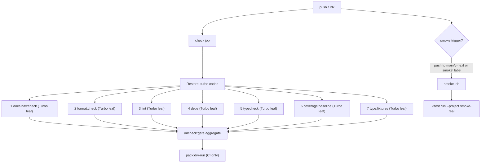

# Check Gate

`pnpm check` is the required local and CI gate that every implementation story must
pass. Nothing merges to `v-next` without a green gate.

The gate runs via Turborepo (`turbo run //#check:gate`). Each of the seven leaf steps is
a cacheable root task with declared `inputs`/`outputs`. Turbo runs them concurrently,
caches each by its input hash, and skips any leaf whose inputs are unchanged since the
last run. A cache hit replays the original exit code and logs — it cannot turn a red
step green.

The one ordering constraint is `coverage:baseline` depends on `typecheck`: the test
lanes import the built (`dist/`) entry points of workspace packages (e.g. `sdk`,
`testkit`), so `tsc -b` must produce — or restore from cache — those outputs before the
suites run. The other four leaves have no inter-dependencies and run in parallel.

## Step Composition

| # | Script | Tool | What It Checks |
|---|---|---|---|
| 1 | `docs:nav:check` | `node tooling/docs-nav/generate-nav.mjs --check` | Docs navigation freshness — fails if generated nav blocks are stale |
| 2 | `format:check` | `biome format .` | Non-writing formatting check — catches whitespace and style drift |
| 3 | `lint` | `biome lint .` | Lint rules — catches obvious errors early |
| 4 | `deps` | `depcruise --config .dependency-cruiser.cjs packages tooling tests` | Dependency-graph rules — no cycles, no orphans, no package-boundary violations |
| 5 | `typecheck` | `tsc -b` | TypeScript project references — full compilation of all composite projects |
| 6 | `coverage:baseline` | `vitest run --project unit --project integration --project conformance-mock --coverage` | Unit, integration, and conformance-mock suites under V8 coverage; enforces 90% thresholds |
| 7 | `type:fixtures` | `node tooling/type-fixtures/run-type-fixtures.ts` | Compiles every `tsconfig.negative.json` / `tsconfig.public.json` under `packages/**/tests/**` with `tsc --noEmit`; a negative must fail compilation, a public must pass. Finding zero fixtures is a clean no-op (logged) — it enforces compile-time AC proofs at the standing gate instead of leaving them outside the build graph |

**Ordering rationale.** The numeric order is cheapest-first for documentation purposes.
Turbo runs the leaves concurrently, so the numeric order does not determine execution
sequence — the only real edge is `coverage:baseline` waiting on `typecheck` (see above).
Each task otherwise fails independently rather than blocking the others.

**Redundancy elimination.** The old gate ran `test:unit`, `test:int`, and `test:conf`
as plain steps and then re-ran the same three suites inside `coverage:baseline`. The
duplicate pass (~14s on V8 instrumentation) was eliminated: `coverage:baseline` already
runs all three suites and enforces coverage thresholds, so the plain test runs are no
longer part of the gate. `test:unit`, `test:int`, and `test:conf` scripts remain
available for targeted local runs.

`format:check` is pinned to the gate behavior rather than a stale flag spelling:
the command must be non-writing and fail on formatting drift. Biome 2.5 rejects the
older `--check` flag, while `biome format .` preserves files and exits non-zero when
formatting would change.

Stories may cite the format behavior as normative, but must validate any literal
command spelling against the pinned tool version before freezing it into a story
contract.

## Local Inner Loop

Run `pnpm check` locally before pushing. Turbo runs all seven leaf tasks, restoring
cache hits from `.turbo/` when inputs are unchanged. Warm no-op or docs-only re-runs
complete in under a second. A cold run (all cache misses) completes in roughly 16–20s.
Smoke tests and pack dry-run are intentionally excluded from `pnpm check`.

## CI Cache

CI persists `.turbo` between runs using `actions/cache@v6`, keyed by OS and
`github.sha` with OS-level restore keys for partial hits. On a PR push that only touches
docs or config, the test and typecheck tasks replay from cache, and the gate completes
in seconds.

The CI jobs set `PNPM_STORE_DIR` to `${{ github.workspace }}/.pnpm-store`, cache
that directory directly with `actions/cache@v6`, and pass the configured store
explicitly to pnpm commands. Install uses `--store-dir "$PNPM_STORE_DIR"`; gate,
pack, and smoke script commands use `--config.store-dir="$PNPM_STORE_DIR"`. This is
required because `pnpm/action-setup@v6` sets `PNPM_HOME`, and pnpm's global virtual store
resolves `pnpm store path` under `PNPM_HOME` unless the repo store wins explicitly.
`pnpm-workspace.yaml` enables pnpm's global virtual store; the virtual-store links live
under `<store-path>/links` and are distinct from pnpm's content-addressable package
store.

`pnpm check:ci` runs with `--force` (recomputes all tasks, still populates the cache
for downstream local hits) and is available when a guaranteed cold run is required.

## CI Split

The `check` job (all seven leaf tasks via Turbo, plus `pack:dry-run`) is a required
branch-protection check. `pack:dry-run` runs only in CI because it exercises packaging
metadata that is meaningless before `pnpm install` with a lockfile.

The `smoke` job runs `vitest run --project smoke-real`. It fires on pushes to `main`
or `v-next`, or on PRs labelled `smoke`. It is **not** a required branch-protection
check yet; it is inert until real drivers and the native containment helper land (all
smoke tests currently pass via `passWithNoTests: true`). Add it to branch protection
once the first real smoke test is committed.

## Smoke Tests Are Excluded

Smoke tests require real processes, network, credentials, or external services. They
are not part of `pnpm check` and must not be made a dependency of the fast local loop.
See [test-lanes.md](test-lanes.md) for the `smoke-real` lane definition.

## Coverage Scope

`coverage:baseline` currently instruments the `unit`, `integration`, and
`conformance-mock` Vitest projects. It is a fast local baseline, not proof that every
story helper named in an implementation contract met its stated coverage bar.

Stories that claim coverage over helpers must name the command and lane(s) that
instrument that helper scope. The aggregate baseline satisfies a story only when it
actually includes the helper's test lane and source paths; otherwise the story must
name a lane-specific coverage command or narrow the stated scope.

## Gate Integrity

A story is not done until `pnpm check` passes end-to-end without modification to the
gate itself. Do not skip steps, adjust thresholds, or widen the `no-orphan` exclusion
list to make the gate green. Investigate and fix the underlying issue instead.

<!-- DOCS-NAV (generated — do not edit by hand) -->

---

**↑ Up:** [Engineering Policy Index](./README.md) · **← Prev:** [Engineering Policy Index](./README.md) · **Next →:** [Codex GitHub Code Review](./codex-github-code-review.md)

<!-- /DOCS-NAV -->
