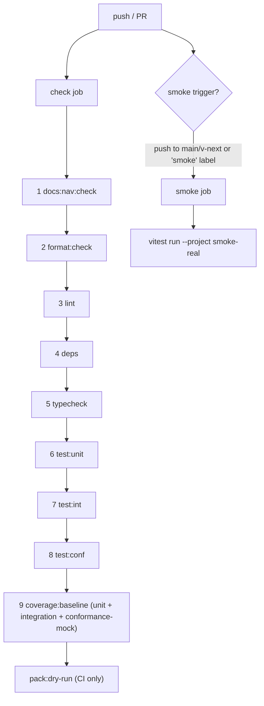

# Check Gate

`pnpm check` is the required local and CI gate that every implementation story must
pass. It runs nine steps in sequence, fail-fast, cheapest first. Nothing merges to
`v-next` without a green gate.

## Step Composition

| # | Script | Tool | What It Checks |
|---|---|---|---|
| 1 | `docs:nav:check` | `node tooling/docs-nav/generate-nav.mjs --check` | Docs navigation freshness — fails if generated nav blocks are stale, before anything compiles |
| 2 | `format:check` | `biome format .` | Non-writing formatting check — catches whitespace and style drift before anything compiles |
| 3 | `lint` | `biome lint .` | Lint rules — catches obvious errors early |
| 4 | `deps` | `depcruise --config .dependency-cruiser.cjs packages tooling tests` | Dependency-graph rules — no cycles, no orphans, and package-boundary violations |
| 5 | `typecheck` | `tsc -b` | TypeScript project references — full compilation of all composite projects |
| 6 | `test:unit` | `vitest run --project unit` | Hermetic unit tests |
| 7 | `test:int` | `vitest run --project integration` | Integration tests (real filesystem, no network) |
| 8 | `test:conf` | `vitest run --project conformance-mock --passWithNoTests` | Conformance suites against mock drivers (hermetic); passes empty until provider mocks land |
| 9 | `coverage:baseline` | Vitest coverage reporter across unit, integration, and conformance-mock lanes | Baseline coverage instrumentation for hermetic helpers until implementation packages land |

**Ordering rationale.** Steps are arranged cheapest-first so that the most common
mistakes (stale docs nav, formatting, lint) are caught in under a second, before the
type-checker or test runner is invoked. A failure in step 1 saves the full cost of
steps 2–9.

`format:check` is pinned to the gate behavior rather than a stale flag spelling:
the command must be non-writing and fail on formatting drift. Biome 2.5 rejects the
older `--check` flag, while `biome format .` preserves files and exits non-zero when
formatting would change.

Stories may cite the format behavior as normative, but must validate any literal
command spelling against the pinned tool version before freezing it into a story
contract.

## Local Inner Loop

Run `pnpm check` locally before pushing. All nine steps run. The gate completes in
seconds when packages are small and hermetic lanes have no real I/O. Smoke tests and
pack dry-run are intentionally excluded from `pnpm check` so the local loop stays fast.

## CI Split

The `check` job (all nine steps plus `pack:dry-run`) is a required branch-protection
check. `pack:dry-run` runs only in CI because it exercises packaging metadata that is
meaningless before `pnpm install` with a lockfile.

The `smoke` job runs `vitest run --project smoke-real`. It fires on pushes to `main`
or `v-next`, or on PRs labelled `smoke`. It is **not** a required branch-protection
check yet; it is inert until real drivers and the native containment helper land (all
smoke tests currently pass via `passWithNoTests: true`). Add it to branch protection
once the first real smoke test is committed.

## Smoke Tests Are Excluded

Smoke tests require real processes, network, credentials, or external services. They
are not part of `pnpm check` and must not be made a dependency of the fast local loop.
See [test-lanes.md](test-lanes.md) for the `smoke-real` lane definition.

## Coverage Scope

`coverage:baseline` currently instruments the `unit`, `integration`, and
`conformance-mock` Vitest projects. It is a fast local baseline, not proof that every
story helper named in an implementation contract met its stated coverage bar.

Stories that claim coverage over helpers must name the command and lane(s) that
instrument that helper scope. The aggregate baseline satisfies a story only when it
actually includes the helper's test lane and source paths; otherwise the story must
name a lane-specific coverage command or narrow the stated scope.

## Gate Integrity

A story is not done until `pnpm check` passes end-to-end without modification to the
gate itself. Do not skip steps, adjust thresholds, or widen the `no-orphan` exclusion
list to make the gate green. Investigate and fix the underlying issue instead.

<!-- DOCS-NAV (generated — do not edit by hand) -->

---

**↑ Up:** [Engineering Policy Index](./README.md) · **← Prev:** [Engineering Policy Index](./README.md) · **Next →:** [Dependency Policy](./dependency-policy.md)

<!-- /DOCS-NAV -->
