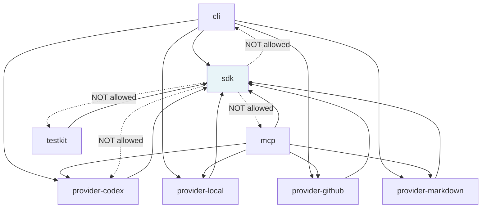

# Dependency Rule Enforcement

The architecture dependency rule — `sdk` → pure runtime only; `provider-*` → `sdk`;
`cli`/`mcp` → `sdk` + `provider-*`; `testkit` → `sdk` (test-only) — is enforced by
two independent guards. Violations must be caught before code reaches the `v-next`
branch.

The ground truth for package names and the complete allowed/forbidden edge table is
[docs/design/20-sdk-and-packaging/dependency-rules.md](../design/20-sdk-and-packaging/dependency-rules.md).

## Guard 1 — dependency-cruiser (`pnpm deps`)

dependency-cruiser analyses the import graph at build time and reports violations as
errors that fail `pnpm check` (step 3). It is configured in
`.dependency-cruiser.cjs` and runs against `packages/`, `tooling/`, and `tests/`.

### Active baseline rules

Two graph-hygiene rules are always active:

| Rule | What It Forbids |
|---|---|
| `no-circular` | Any import cycle of any length |
| `no-orphans` | Modules with no imports and no importers (excludes `*.test.*`, `*.d.ts`, `tooling/`, `tests/`, `*.config.*`, `*.cjs`) |

These catch graph hygiene problems across target packages as soon as they are added.

### Target package rules

The active package-boundary rules are named for the frozen package target:

| Rule | What It Forbids |
|---|---|
| `sdk-must-not-import-runtime-packages` | `sdk` importing `provider-*`, `cli`, `mcp`, or `testkit` |
| `sdk-must-not-import-banned-external-libraries` | `sdk` importing provider clients, process helpers, executable runtimes, or CLI parsers |
| `sdk-must-not-import-child-process` | `sdk` importing `node:child_process` or `child_process` |
| `provider-production-must-not-import-executables-or-testkit` | `provider-*` production source importing `cli`, `mcp`, or `testkit` |
| `provider-*-must-not-import-peer-provider` | Concrete providers importing peer provider packages |
| `testkit-must-import-sdk-only` | `testkit` importing providers or executable packages; self-imports and `sdk` are allowed |
| `production-must-not-import-testkit-or-fixtures` | Production source importing `testkit`, conformance helpers, fixtures, or test helpers |
| `octokit-github-provider-only` | Octokit outside `provider-github` |
| `execa-local-provider-only` | Execa or native containment helpers outside `provider-local` |
| `mcp-runtime-mcp-only` | MCP server runtime outside `mcp` |
| `cli-parser-cli-only` | CLI parser or terminal rendering libraries outside `cli` |
| `no-runtime-di-container` | Runtime package imports of dependency injection containers |
| `sqlite-store-adapter-only` | SQLite/native store libraries outside store adapters |

These rules are safe before the target package directories exist: dependency-cruiser
matches no source files for absent packages and begins enforcing each rule as soon as a
matching package lands.

## Guard 2 — TypeScript Project References

`tsconfig.json` is a solution file that references `tsconfig.infra.json`. As target
package directories are created, add their composite `tsconfig.json` files to the root
solution file so `tsc -b` typechecks all working source.

Project references enforce at compile time that a package can only import another
package that is explicitly declared as a reference. A missing reference causes `tsc -b`
to report a `TS6305` or `TS6307` error. This is independent of dependency-cruiser and
catches violations before the test runner runs.

**Pattern for target packages:**

```jsonc
// packages/provider-local/tsconfig.json
{
  "extends": "../../tsconfig.base.json",
  "compilerOptions": {
    "outDir": "./dist",
    "rootDir": "./src",
    "composite": true
  },
  "include": ["src"],
  "references": [
    // Only packages this package is explicitly allowed to import:
    { "path": "../sdk" }
  ]
}
```

## Allowed Dependency Graph



*Solid arrows: allowed import direction. Dashed arrows: explicitly forbidden.*

## How the Two Guards Relate

dependency-cruiser catches import-graph violations in the compiled output.
TypeScript project references catch them earlier, at compile time, by refusing to
resolve types across undeclared references. Having both means a violation must defeat
two independent checks to reach the verify gate's test steps — it will not.

<!-- DOCS-NAV (generated — do not edit by hand) -->

---

**↑ Up:** [Engineering Policy Index](./README.md) · **← Prev:** [Dependency Policy](./dependency-policy.md) · **Next →:** [Test Lanes](./test-lanes.md)

<!-- /DOCS-NAV -->
