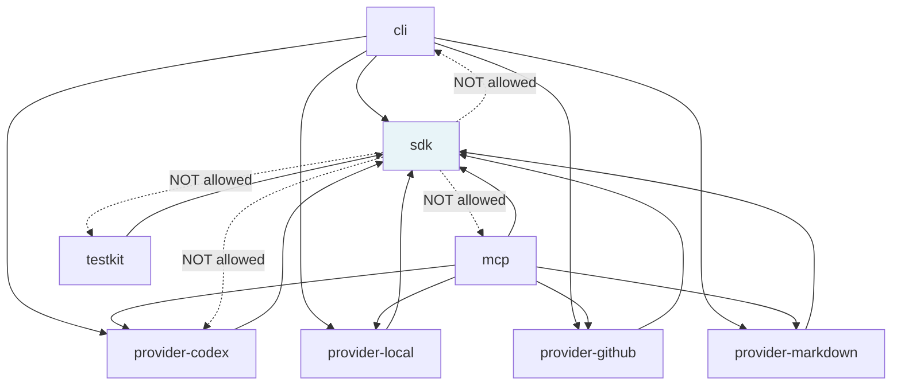

# Dependency Rule Enforcement

The architecture dependency rule — `sdk` → pure runtime only; `provider-*` → `sdk`;
`cli`/`mcp` → `sdk` + `provider-*`; `testkit` → `sdk` (test-only) — is enforced by
two independent guards. Violations must be caught before code reaches the `v-next`
branch.

The ground truth for package names and the complete allowed/forbidden edge table is
[docs/design/20-sdk-and-packaging/dependency-rules.md](../design/20-sdk-and-packaging/dependency-rules.md).

## Guard 1 — dependency-cruiser (`pnpm deps`)

dependency-cruiser analyses the import graph at build time and reports violations as
errors that fail `pnpm check` (step 3). It is configured in
`.dependency-cruiser.cjs` and runs against `packages/`, `tooling/`, and `tests/`.

### Active baseline rules

Two rules are active from the start, before any packages exist:

| Rule | What It Forbids |
|---|---|
| `no-circular` | Any import cycle of any length |
| `no-orphans` | Modules with no imports and no importers (excludes `*.test.*`, `*.d.ts`, `tooling/`, `tests/`, `*.config.*`, `*.cjs`) |

These catch graph hygiene problems as soon as the first packages are added.

### Layer-rule template (design-owned — not yet active)

The following rules are a template. Design owners activate them in
`.dependency-cruiser.cjs` once real package paths are known. Do not activate them
before packages exist; pattern mismatches against an empty `packages/` directory
produce false positives.

**Checklist for design owners:**

- [ ] **`sdk` must not import `provider-*`, `cli`, `mcp`, or `testkit`.**
  `from: { path: '^packages/sdk' }` → `to: { path: '^packages/(provider-|cli|mcp|testkit)' }`

- [ ] **`sdk` must not import banned external libraries.**
  Ban `octokit`, `@octokit/*`, `execa`, the native containment helper, any concrete
  Codex client, the MCP server runtime, and any CLI parser.

- [ ] **`provider-*` must not import `cli`, `mcp`, or `testkit` in production source.**
  `from: { path: '^packages/provider-', pathNot: '\\.(test|spec)\\.' }` →
  `to: { path: '^packages/(cli|mcp|testkit)' }`

- [ ] **`provider-*` must not import peer providers.**
  `from: { path: '^packages/provider-' }` →
  `to: { path: '^packages/provider-', pathNot: 'same package' }`

- [ ] **Production source must not import `testkit` or test fixtures.**
  `from: { pathNot: '\\.(test|spec)\\.' }` →
  `to: { path: '^packages/testkit|(^|/)__fixtures__/' }`

Bind these templates to real package path patterns before the first implementation
package is added. The `.dependency-cruiser.cjs` file includes comments pointing here.

## Guard 2 — TypeScript Project References

`tsconfig.json` is a solution file that references `tsconfig.infra.json`. Design
owners add per-package `tsconfig.json` files with `"composite": true` and reference
them from the root solution file or a per-layer solution file.

Project references enforce at compile time that a package can only import another
package that is explicitly declared as a reference. A missing reference causes `tsc -b`
to report a `TS6305` or `TS6307` error. This is independent of dependency-cruiser and
catches violations before the test runner runs.

**Pattern for new packages:**

```jsonc
// packages/my-package/tsconfig.json
{
  "extends": "../../tsconfig.base.json",
  "compilerOptions": {
    "outDir": "./dist",
    "rootDir": "./src",
    "composite": true
  },
  "include": ["src"],
  "references": [
    // Only packages this package is explicitly allowed to import:
    { "path": "../sdk" }
  ]
}
```

## Allowed Dependency Graph



*Solid arrows: allowed import direction. Dashed arrows: explicitly forbidden.*

## How the Two Guards Relate

dependency-cruiser catches import-graph violations in the compiled output.
TypeScript project references catch them earlier, at compile time, by refusing to
resolve types across undeclared references. Having both means a violation must defeat
two independent checks to reach the verify gate's test steps — it will not.
