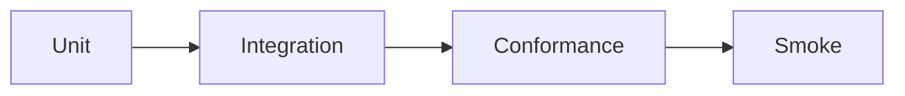

# Test lanes

## Unit

Pure local behavior.

## Integration

Multiple SDK modules or local storage/workspace ports.

## Conformance

Provider contract behavior and testkit mocks.

## Smoke

Real processes, real network, real credentials, or real provider SDKs.
