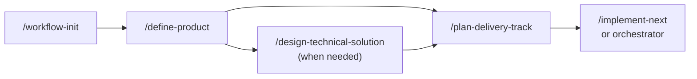

# Getting started

A guided walkthrough of the agentic-workflow-kit pipeline, using the worked **Linkly** example shipped in
[`examples/`](../examples/). Linkly is a minimal URL shortener; the example takes it from PRD to a
sequenced tracker so you can see the shape before running the tools on your own repo.

> Install commands track the current aligned plugin/package release — see
> [Project status](../README.md#project-status).
> The local checkout commands below remain useful for development and smoke validation.

## Prerequisites

```bash
pnpm install
pnpm check        # Biome lint + typecheck + Vitest — should be green
```

The plugin install includes a package-backed MCP runtime for `workflow-autopilot`. The standalone
orchestrator CLI is available locally as:

```bash
pnpm agentic-workflow-kit -- --help
```

## The pipeline at a glance



Each step writes into the shared contract (`.workflow/config.yaml` + a markdown tracker) that the
next step reads. See [architecture.md](./architecture.md) for the full picture.

## 1. Initialize a repo

In a target repo, run the skill:

```text
/workflow-init
```

It detects your package manager, CI, default branch, and branch protection, picks a PR/merge
preset, writes `.workflow/config.yaml`, and scaffolds a tracks index plus an example tracker. It is
idempotent — re-running reconciles missing keys and never overwrites an existing config or tracker
without confirmation.

Pick the preset that matches your repo (you can change it later by editing the `pr:` block):

| Preset | Use when |
| --- | --- |
| `push-and-merge` | You ship fast: open a PR, best-effort local checks, auto-squash-merge. |
| `gated-automerge` | You have CI + a bot reviewer: wait on both, then auto-merge. |
| `push-only` | Humans gate merges: open a PR and stop. |

## 2. Author a PRD

```text
/define-product
```

A guided interview produces a multi-file PRD under `<prdsDir>/<slug>/`. The worked result looks
like [examples/example-prd/](../examples/example-prd/README.md): a `README.md` index with a document
map, then numbered sections (`01-context`, `08-acceptance-criteria`, and so on). The PRD owns
*what/why*; it carries ID'd acceptance criteria (e.g. `L-1`, `A-1`) that the tracker links back to.

## 3. Plan technical solution when needed

```text
/design-technical-solution
```

For simple products, `define-product` can recommend going straight to `plan-delivery-track`. For complex
technical work - new modules, data/query changes, AI prompts/tools, observability, migrations,
security boundaries, or multi-system integration - `design-technical-solution` writes
`<prdsDir>/<slug>/technical-solution.md` before tracker decomposition.

## 4. Decompose into a tracker

```text
/plan-delivery-track
```

`plan-delivery-track` reads the PRD, requires a technical solution for complex technical PRDs, and emits a tracker
plus lightweight story briefs. The worked result is
[examples/example-tracker/](../examples/example-tracker/README.md):

- a **dependency graph** (Mermaid) showing hard dependencies,
- a **status matrix** table — one row per story (`LK01`, `LK02`, `LK03`), each mapping back to a
  PRD acceptance-criteria ID,
- **story briefs** under `stories/`, which are not implementation-ready,
- **parallelism rules** explaining why each wave is ordered the way it is.

Validate that a tracker actually parses by pointing the orchestrator at it:

```bash
pnpm agentic-workflow-kit -- list-stories --tracks-dir examples --config presets/push-only.yaml
pnpm agentic-workflow-kit -- list-eligible --tracks-dir examples --config presets/push-only.yaml
```

agentic-workflow-kit's own repo ships no `.workflow/config.yaml`, so we point the orchestrator at the
`push-only` preset (a safe read/no-merge config); in a real consumer repo that ran `/workflow-init`,
the config is auto-discovered and the flag is unnecessary.

`list-eligible` applies the eligibility rule (status is pickable, unowned, all dependencies
complete) — see the decision diagram in [architecture.md](./architecture.md#eligibility).

## 5. Implement

Two ways to drive the same tracker:

**Interactive — one story at a time:**

```text
/implement-next
```

Takes the next eligible story end-to-end: isolate (worktree/branch) → spec review → plan →
implement → review → verify → mark done → ship under your `pr:` policy.

**Autonomous — fan out:**

When installed as a Claude Code or Codex plugin, invoke `workflow-autopilot` and prefer the plugin-provided
MCP tools. Use the standalone CLI when developing this repo, running CI checks, or troubleshooting
outside a plugin session:

```bash
pnpm agentic-workflow-kit -- mcp check                 # verify the Codex MCP tool schema
pnpm agentic-workflow-kit -- run-eligible --dry-run --tracks-dir examples --config presets/push-only.yaml    # show what would dispatch, no side effects
pnpm agentic-workflow-kit -- run-eligible --tracks-dir examples --config presets/push-only.yaml              # launch child sessions (needs the Codex CLI)
```

The orchestrator launches up to `orchestrator.maxParallel` child sessions, re-reads the tracker
after each returns, and treats the tracker row — not the child's prose — as the completion
authority. Run artifacts land under `.codex/agentic-workflow-kit/runs/<runId>/`; inspect them with:

```bash
pnpm agentic-workflow-kit -- analyze-run .codex/agentic-workflow-kit/runs/<runId>
```

When a launch looks stuck, inspect before retrying:

```bash
pnpm agentic-workflow-kit -- watch-run .codex/agentic-workflow-kit/runs/<runId>
pnpm agentic-workflow-kit -- analyze-run .codex/agentic-workflow-kit/runs/<runId>
```

Do not edit run artifacts or tracker rows by hand while a child may still be active. Session ids,
session logs, observed child progress, worktree activity, or not-yet-stale launch timestamps mean
the safe action is to wait or keep observing. Parent supervisor polls only prove the parent loop
woke up; they are not child progress. If a duplicate active launch blocks a retry, use `watch-run` /
`analyze-run` output to prove the previous child is stale before any recovery action. Recovery must
be evidence-based: check child progress, branch and remote state, open or merged PR state, tracker
status on the configured base branch, latest commit evidence, and worktree cleanliness before taking
over. If any evidence is ambiguous, stop with "manual recovery required" instead of editing a child
branch or worktree.

Autopilot uses three timeout concepts. `orchestrator.childStartupTimeoutMs` bounds the startup
handshake before a child links a session or reports progress; stale startup orphans with no session,
heartbeat, result, or worktree activity are safe to retry after this window. After startup
acknowledgement, `orchestrator.childNoProgressTimeoutMs` detects silent children and is reset by
child session linkage or progress; `orchestrator.childMaxRuntimeMs` is the absolute wall-clock cap.
Full PR/review/merge stories often need a larger wall-clock cap than the old 30-minute timeout
because healthy progress can include implementation, checks, PR creation, review, fix batches,
merge, and cleanup.

`analyze-run` also accepts compatible interactive `/implement-next` journals written to the same
run directory shape. When `events.ndjson` is present, the analyzer also reconstructs review
downgrades, pre-PR review execution blockers, review findings, local fix batches, PR review
findings, resolved threads, final verification, merge/cleanup status, and the journal-order event
timeline even if a session log is unavailable. When session logs are available, the analyzer also
summarizes pre-PR review subagent loops from `spawn_agent`, `wait_agent`, and `close_agent` calls.
A review that ran and returned `BLOCK` findings is reported as a review result;
`pre_pr_review_blocked` is reserved for cases where the review step could not run.
Per-story analyzer output includes primary linkage status, diagnostic session candidates, failed
`spawn_agent` attempts, supervisor poll versus observed progress timestamps, recovery/takeover
events, verification evidence, merge/cleanup evidence, PR review fix-batch policy, and the
completion authority used by the gate. When child/base evidence says a story merged but the
parent-local snapshot still says `implementing`, analyzer reports that stale parent snapshot
explicitly.

For auto-merge workflows, a story can complete after the PR has already landed: tracker complete
status plus a merge commit on the configured base branch is accepted as completion evidence even
when `git.commitOnBase: forbid`. Runtime files under `.codex/agentic-workflow-kit/runs/` are ignored
for dirty-check purposes.

For MCP dispatch, non-dry-run `run_eligible` returns as soon as the initial child sessions are
launched and the run artifact directory exists. Treat that response as a launch receipt, then use
`watch_run` for active state and `analyze_run` for the post-run explanation.

For UI stories, rendered verification can fall back to repo Playwright/e2e gates when the Browser
connector or local browser-safe env is unavailable. Record the downgrade reason and evidence in the
run journal/final handoff; avoid ad hoc browser scripts unless the story explicitly requires them.

When supervising long runs, prefer coarse polling on meaningful state changes over micro-polling.
Use `watch-run` for active state and `analyze-run` for decisions: wait, complete, blocked, or manual
recovery required.

## 6. Ship and repeat

Each story ships under the declarative `pr:` policy from step 1. Repeat steps 4–5 until the tracker
is drained. Switch ship behavior at any time by editing the `pr:` block in `.workflow/config.yaml`
— no skill changes required.

## Next

- [architecture.md](./architecture.md) — how the pieces fit and the runtime flow
- [../references/config-schema.md](../references/config-schema.md) — tune `.workflow/config.yaml`
- [../references/tracker-contract.md](../references/tracker-contract.md) — the tracker format in full
