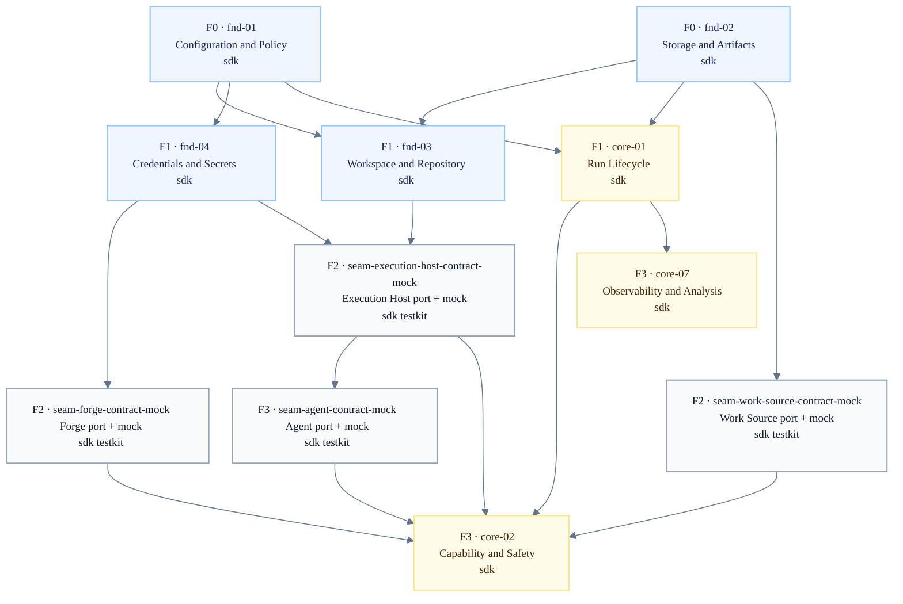
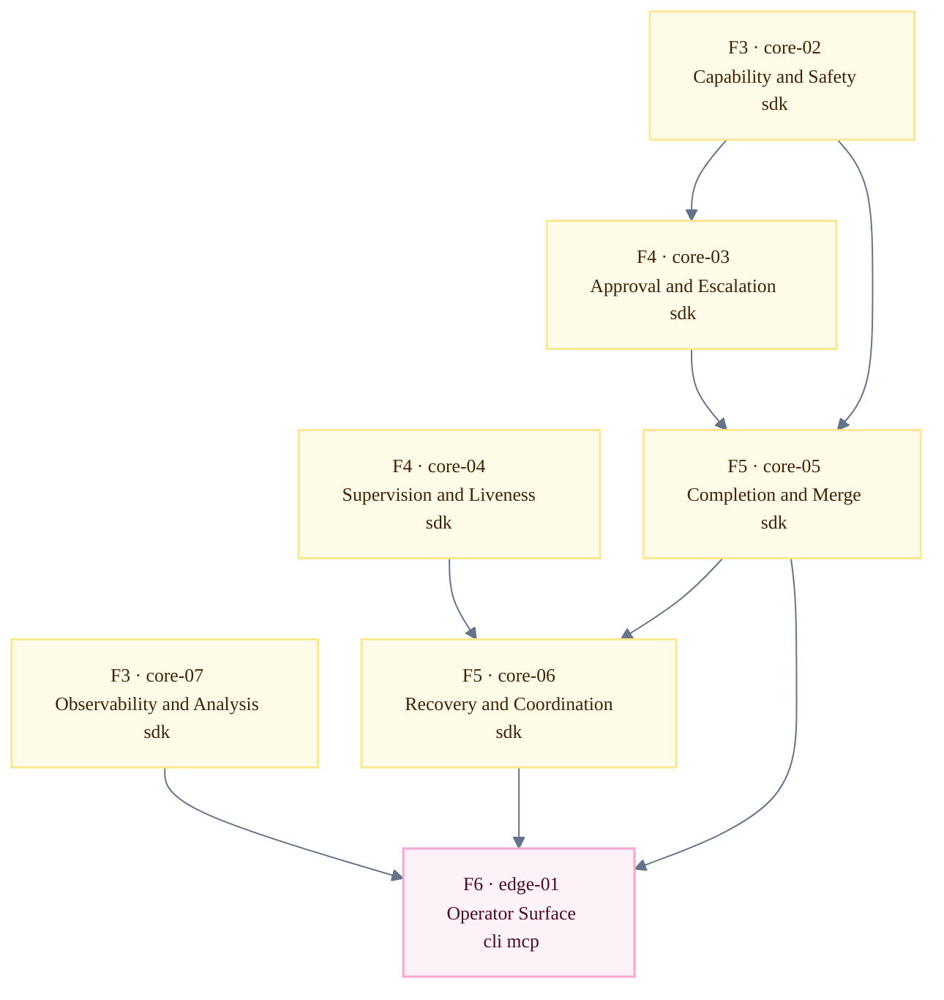

# Domain dependency DAG

The diagrams show readable frontier flow; the tables are the authoritative source of truth,
including the complete direct dependency record. The design corpus remains the source of truth for
each individual edge.

The domain graph is split into two DAGs so the planning view stays readable in normal Markdown
previews. The first DAG shows how foundation domains and provider seam contracts become available; the
second DAG shows how the core uses those established contracts to control runs, decide completion,
recover, and expose operator entry points.

The split is visual only. `core-02` and `core-07` bridge the two diagrams: they are introduced in
the foundation/provider view, then repeated as context in the run-control view. The direct dependency
table below is the complete audit surface for the combined graph.

## Foundation and provider contracts

> This DAG covers the dependency build-up from independent foundation domains through provider-facing
> contracts and first core gates. It answers: "what foundation and external-system contracts must
> exist before run-control logic can be planned?"

Provider seam contract + mock nodes are implementation-planning nodes, not new design domains. They
represent the SDK provider port plus testkit mock/conformance surface that core can build and test
against. Provider domain ids (`prov-01` through `prov-04`) remain homes for real driver mapping,
live/provider evidence, provider-specific conformance, and production readiness.

## Run control and operator surface

> This DAG starts from the established core gates and analysis surface, then shows the control-plane
> spine that handles approval, supervision, completion, recovery, and operator entry points. It
> differs from the foundation/provider view by consuming seam contract+mock nodes rather than defining
> them.

`core-02` and `core-07` are repeated as context from F3.

## Package legend

Package colors are shown in the legend because Mermaid renderers may escape inline HTML inside node
labels.

| Label                                                                                                                  | Package             |
| ---------------------------------------------------------------------------------------------------------------------- | ------------------- |
| sdk     | `sdk`               |
| testkit | `testkit`           |
| md      | `provider-markdown` |
| gh      | `provider-github`   |
| local   | `provider-local`    |
| codex   | `provider-codex`    |
| cli     | `cli`               |
| mcp     | `mcp`               |

## Domain table

| Domain id | Name                                    | Frontier | Target package markers                |
| --------- | --------------------------------------- | -------: | ------------------------------------- |
| `fnd-01`  | Configuration & Policy                  |        0 | `sdk`                                 |
| `fnd-02`  | Storage & Artifacts                     |        0 | `sdk`                                 |
| `fnd-03`  | Workspace & Repository                  |        1 | `sdk`                                 |
| `fnd-04`  | Credentials & Secrets                   |        1 | `sdk`                                 |
| `core-01` | Run Lifecycle & Event State             |        1 | `sdk`                                 |
| `seam-work-source-contract-mock` | Work Source seam contract + mock | 2 | `sdk`, `testkit` |
| `seam-forge-contract-mock` | Forge seam contract + mock | 2 | `sdk`, `testkit` |
| `seam-execution-host-contract-mock` | Execution Host seam contract + mock | 2 | `sdk`, `testkit` |
| `seam-agent-contract-mock` | Agent seam contract + mock | 3 | `sdk`, `testkit` |
| `core-02` | Capability & Safety                     |        3 | `sdk`                                 |
| `core-07` | Observability & Analysis                |        3 | `sdk`                                 |
| `core-03` | Approval & Escalation                   |        4 | `sdk`                                 |
| `core-04` | Supervision & Liveness                  |        4 | `sdk`                                 |
| `core-05` | Completion, Verification & Merge        |        5 | `sdk`                                 |
| `core-06` | Recovery, Reconciliation & Coordination |        5 | `sdk`                                 |
| `prov-03` | Work Source real driver                 | production readiness | `provider-markdown` |
| `prov-02` | Forge / Collaboration real driver       | production readiness | `provider-github`   |
| `prov-04` | Execution Host real driver              | production readiness | `provider-local`    |
| `prov-01` | Agent Execution real driver             | production readiness | `provider-codex`    |
| `edge-01` | Operator & Entry Surface                |        6 | `cli`, `mcp`                          |

## Frontier table

Published build order: foundation -> seam ports & mocks (in `sdk`/`testkit`) -> core spine -> core
gates -> real drivers (parallel) -> edge.

| Frontier | Label                     | Domains                         |
| -------: | ------------------------- | ------------------------------- |
|        0 | Independent foundation    | `fnd-01`, `fnd-02`              |
|        1 | Foundation dependents     | `fnd-03`, `fnd-04`, `core-01`   |
|        2 | Provider seam ports and mocks | `seam-work-source-contract-mock`, `seam-forge-contract-mock`, `seam-execution-host-contract-mock` |
|        3 | Agent seam contract and core gates | `seam-agent-contract-mock`, `core-02`, `core-07` |
|        4 | Run control               | `core-03`, `core-04`            |
|        5 | Completion and recovery   | `core-05`, `core-06`            |
|        6 | Operator surface          | `edge-01`                       |

Real driver stories for `prov-03`, `prov-02`, `prov-04`, and `prov-01` proceed in parallel once
their contract+mock surfaces exist. They are production-readiness work and do not block SDK/core
build/test readiness.

## First Package Appearance

| Package             | Graph label | First frontier | Trigger domain              |
| ------------------- | ----------- | -------------: | --------------------------- |
| `sdk`               | `sdk`       |              0 | `fnd-01` / `fnd-02`         |
| `testkit`           | `testkit`   |              2 | first provider contract domains |
| `provider-markdown` | `md`        | production readiness | `prov-03` real-driver story |
| `provider-github`   | `gh`        | production readiness | `prov-02` real-driver story |
| `provider-local`    | `local`     | production readiness | `prov-04` real-driver story |
| `provider-codex`    | `codex`     | production readiness | `prov-01` real-driver story |
| `cli`               | `cli`       |              6 | `edge-01`                   |
| `mcp`               | `mcp`       |              6 | `edge-01`                   |

## Direct Dependencies

| Domain or planning node | Direct dependencies                                                                              |
| --------- | ------------------------------------------------------------------------------------------------ |
| `fnd-01`  | none                                                                                             |
| `fnd-02`  | none                                                                                             |
| `fnd-03`  | `fnd-01`, `fnd-02`                                                                               |
| `fnd-04`  | `fnd-01`                                                                                         |
| `core-01` | `fnd-01`, `fnd-02`                                                                               |
| `seam-work-source-contract-mock` | `fnd-02`                                                                                         |
| `seam-forge-contract-mock` | `fnd-04`                                                                                         |
| `seam-execution-host-contract-mock` | `fnd-03`, `fnd-04`                                                                               |
| `seam-agent-contract-mock` | `seam-execution-host-contract-mock`, `fnd-04`                                                     |
| `prov-03` | `seam-work-source-contract-mock`                                                                 |
| `prov-02` | `seam-forge-contract-mock`, `fnd-04`                                                             |
| `prov-04` | `seam-execution-host-contract-mock`, `fnd-03`, `fnd-04`                                          |
| `prov-01` | `seam-agent-contract-mock`, `seam-execution-host-contract-mock`, `fnd-04`                         |
| `core-02` | `core-01`, `fnd-01`, `seam-agent-contract-mock`, `seam-forge-contract-mock`, `seam-work-source-contract-mock`, `seam-execution-host-contract-mock` |
| `core-07` | `core-01`, `fnd-02`                                                                              |
| `core-03` | `core-01`, `core-02`, `fnd-01`, `seam-agent-contract-mock`                                      |
| `core-04` | `core-01`, `seam-agent-contract-mock`, `seam-execution-host-contract-mock`                      |
| `core-05` | `core-01`, `core-02`, `core-03`, `fnd-01`, `fnd-03`, `seam-forge-contract-mock`, `seam-execution-host-contract-mock` |
| `core-06` | `core-01`, `core-02`, `core-04`, `core-05`, `fnd-02`, `seam-agent-contract-mock`, `seam-forge-contract-mock`, `seam-work-source-contract-mock`, `seam-execution-host-contract-mock` |
| `edge-01` | `core-01`, `core-02`, `core-03`, `core-04`, `core-05`, `core-06`, `core-07`                      |

## Maintenance rule

Update this file when domain frontmatter or the domain catalog changes. The diagram is a readable
projection; the table is the audit surface.

<!-- DOCS-NAV (generated — do not edit by hand) -->

---

**↑ Up:** [implementation contract](./README.md) · **← Prev:** [implementation contract](./README.md) · **Next →:** [package rollout](./package-rollout.md)

<!-- /DOCS-NAV -->
