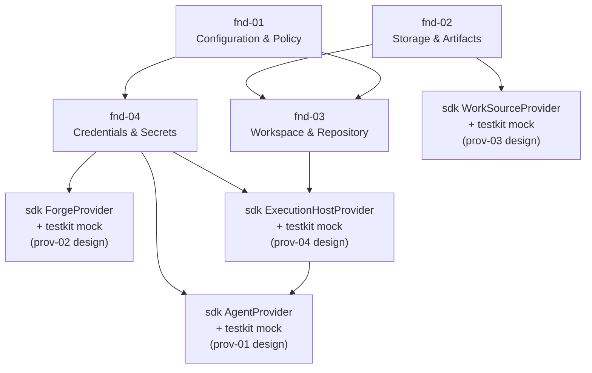
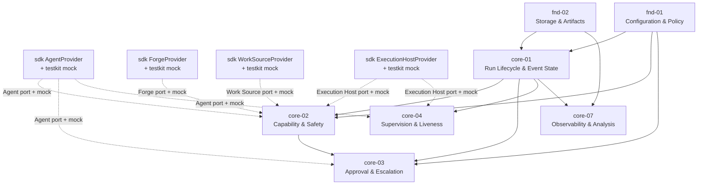
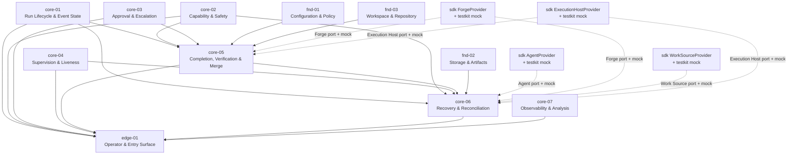

# Domain dependency DAG

This document is the first re-derived implementation artifact for kit-vnext. It gives the
domain-level dependency picture before deriving implementation epics and story contracts.

It is deliberately domain-granular. It does not assign package files, story IDs, worker ownership, or
PR batches. The next artifact should translate this DAG into an epic DAG and dispatch-ready story
contracts.

## Sources

- [`../design/30-domain-reference/domain-catalog.md`](../design/30-domain-reference/domain-catalog.md)
- [`../design/30-domain-reference/README.md`](../design/30-domain-reference/README.md)
- Layer and domain `README.md` files under [`../design/30-domain-reference/`](../design/30-domain-reference/)
- [`../design/20-sdk-and-packaging/package-target.md`](../design/20-sdk-and-packaging/package-target.md)
- [`../design/20-sdk-and-packaging/sdk-boundary.md`](../design/20-sdk-and-packaging/sdk-boundary.md)
- [`../design/20-sdk-and-packaging/testkit-and-conformance.md`](../design/20-sdk-and-packaging/testkit-and-conformance.md)

## Reading rules

- Edges are direct dependencies stated in domain frontmatter, domain mandates, or the domain catalog.
- Provider domain docs define normative seam behavior. The implementation home for those contracts is
  `packages/sdk`; mocks and conformance helpers belong in `packages/testkit`; concrete
  `packages/provider-*` drivers come later.
- When a core dependency mentions a provider seam below, read it as "SDK provider port + shared DTOs
  + testkit mock/conformance surface shaped by the provider-domain design," not as a concrete
  provider package dependency.
- The package target is SDK-centered. Design domains do not map one-to-one to packages.

## Domain nodes

| ID | Domain | Layer | Primary implementation surface |
|---|---|---|---|
| `fnd-01` | Configuration & Policy | Foundation | SDK config, resolved policy, adoption diagnostics |
| `fnd-02` | Storage & Artifacts | Foundation | SDK storage ports, in-memory defaults, artifact refs, leases |
| `fnd-03` | Workspace & Repository | Foundation | SDK workspace contract and local git evidence model |
| `fnd-04` | Credentials & Secrets | Foundation | SDK credential/redaction/egress policy contracts |
| `prov-01` | Agent Execution | Providers | Normative Agent seam design; SDK `AgentProvider` port; testkit mock; Codex driver later |
| `prov-02` | Forge / Collaboration | Providers | Normative Forge seam design; SDK `ForgeProvider` port; testkit mock; GitHub driver later |
| `prov-03` | Work Source | Providers | Normative Work Source seam design; SDK `WorkSourceProvider` port; testkit mock; Markdown driver |
| `prov-04` | Execution Host | Providers | Normative Execution Host seam design; SDK `ExecutionHostProvider` port; testkit mock; Local driver later |
| `core-01` | Run Lifecycle & Event State | Core | SDK event log, writer, lifecycle, projections |
| `core-02` | Capability & Safety | Core | SDK capability registry and gate evaluation |
| `core-03` | Approval & Escalation | Core | SDK approval relay, decision model, park/resume |
| `core-04` | Supervision & Liveness | Core | SDK liveness fold, wait primitive, termination handoff |
| `core-05` | Completion, Verification & Merge | Core | SDK evidence predicates and merge readiness |
| `core-06` | Recovery, Reconciliation & Coordination | Core | SDK recovery classifier and coordination |
| `core-07` | Observability & Analysis | Core | SDK telemetry and analysis invariant |
| `edge-01` | Operator & Entry Surface | Edge | CLI/MCP command envelope and human-facing controls |

## Direct dependency table

| Domain | Direct dependencies | Notes |
|---|---|---|
| `fnd-01` | none | Root config/policy source. |
| `fnd-02` | none | Root persistence, lease, artifact substrate. |
| `fnd-03` | `fnd-01`, `fnd-02` | Consumes repo policy and storage leases/artifacts; local git only. |
| `fnd-04` | `fnd-01` | Consumes credential refs and egress source policy. |
| `prov-03` | `fnd-02` | Work Source design shapes the SDK port and mock; Markdown driver later uses storage leases and artifact refs. |
| `prov-02` | `fnd-04` | Forge design shapes the SDK port and mock; GitHub driver later consumes runner-scoped credentials and redaction. |
| `prov-04` | `fnd-03`, `fnd-04` | Execution Host design shapes the SDK port and mock; Local driver later runs against workspace and injection/redaction policy. |
| `prov-01` | `prov-04`, `fnd-04` | Agent design shapes the SDK port and mock; Codex driver later runs workers on Execution Host with worker-safe credentials. |
| `core-01` | `fnd-01`, `fnd-02` | Run log and lifecycle consume resolved policy and storage primitives. |
| `core-02` | `core-01`, `fnd-01`, SDK provider ports + testkit mocks | Gates evaluate recorded events plus capability attestations from provider ports. |
| `core-03` | `core-01`, `core-02`, `fnd-01`, SDK Agent port + testkit mock | Approval consumes policy, capability gates, event log, and neutral Agent approval shapes. |
| `core-04` | `core-01`, SDK Agent and Execution Host ports + testkit mocks | Liveness consumes Agent events and hands termination to Execution Host. |
| `core-07` | `core-01`, `fnd-02` | Analysis consumes the run log and artifact refs; sibling event payloads are data, not dependencies. |
| `core-05` | `core-01`, `core-02`, `core-03`, `fnd-01`, `fnd-03`, SDK Forge and Execution Host ports + testkit mocks | Completion consumes evidence, gates, approval decisions, local git evidence, verify capture, and Forge evidence. |
| `core-06` | `core-01`, `core-02`, `core-04`, `core-05`, `fnd-02`, all SDK provider ports + testkit mocks | Recovery consumes recorded state, liveness/completion facts, storage leases, and all seam evidence. |
| `edge-01` | `core-01` through `core-07` | Edge calls Control plane ports and contains no run logic or driver imports. |

## How to read the DAG

Use this document in three passes:

1. Read [Topological bands](#topological-bands) for the implementation order.
2. Use [Direct dependency table](#direct-dependency-table) when you need the exact edge list.
3. Use the split views below when you need the shape without the full graph.

Solid arrows are direct domain dependencies. Dotted arrows are SDK provider port + testkit mock
prerequisites derived from provider-domain design; they do not require the real driver to exist yet.

## Split DAG views

### Foundation and SDK provider ports

Concrete driver order should be derived later. At the domain level, this view only says which SDK
ports and testkit mocks become available from foundation outputs and provider-domain design.

### Core spine and early control

This is the first core build picture. `core-01` is the spine; `core-02`, `core-03`, `core-04`, and
`core-07` build on it with SDK provider ports and testkit mocks, not real drivers.

### Late integration and edge

This is intentionally last. `core-05`, `core-06`, and `edge-01` consume many predecessor contracts and
should be epic outputs only after the core spine, SDK provider ports, and testkit mocks exist.

## Topological bands

These bands are an implementation reading order, not final epics.

| Band | Contents | Why this band exists |
|---|---|---|
| 0 | `fnd-01`, `fnd-02` | Root policy and storage substrates. |
| 1 | `fnd-03`, `fnd-04`, SDK `WorkSourceProvider` + testkit mock from `prov-03` design | Workspace and credentials consume root foundation; Work Source port/mocks can begin from storage. |
| 2 | SDK `ExecutionHostProvider` and `ForgeProvider` + testkit mocks from `prov-04`/`prov-02` design, `core-01` | Execution Host and Forge ports/mocks consume foundation; Run Lifecycle can start once config/storage exist. |
| 3 | SDK `AgentProvider` + testkit mock from `prov-01` design, `core-02`, `core-07` | Agent port/mock depends on Execution Host port/mock; capability gates and analysis build on Run Lifecycle. |
| 4 | `core-03`, `core-04` | Approval and supervision consume the run log plus Agent/Host ports and mocks. |
| 5 | `core-05` | Completion needs gates, approval decisions, workspace evidence, Execution Host verify, and Forge evidence. |
| 6 | `core-06` | Recovery consumes the run log, capability, liveness, completion, storage coordination, and all seams. |
| 7 | `edge-01` | Edge is the final thin operator surface over the Control plane. |

## Implementation implications

1. Provider-domain implementation should split into at least three story classes:
   - SDK-owned provider port and shared DTOs shaped by the provider-domain design.
   - Testkit mock/conformance surface for that SDK port.
   - First concrete driver, with real-driver evidence where the design requires it.
2. Core domains that depend on provider ports should not wait for real drivers. They should build
   against SDK provider ports and testkit mocks.
3. `core-01` is the first core spine. Most other core domains consume its event envelopes, writer,
   replay, projections, lifecycle, or cursor vocabulary.
4. `core-05` and `core-06` should not be first implementation epics. They are integration-heavy and
   consume too many predecessor contracts.
5. `edge-01` should stay thin and late. A thin CLI vertical slice may appear earlier only as an
   executable wrapper over already-built SDK calls, not as a place to hold run logic.

## Inputs to the epic DAG

The epic DAG should preserve these constraints:

- Start with SDK package skeleton, deterministic ports, and the two root foundation slices.
- Add SDK provider interface catalogs and testkit mocks before core domains that consume provider ports.
- Split concrete providers by risk: Markdown before Local/GitHub/Codex because it is file-backed and
  avoids process/network/credential risk.
- Keep every epic reviewable by package surface and evidence type, not by design-domain folder alone.

<!-- DOCS-NAV (generated — do not edit by hand) -->

---

**↑ Up:** [implementation contract](./README.md) · **← Prev:** [work item authoring guide](./work-item-authoring-guide.md) · **Next →:** [epic dependency DAG](./epic-dag.md)

<!-- /DOCS-NAV -->
