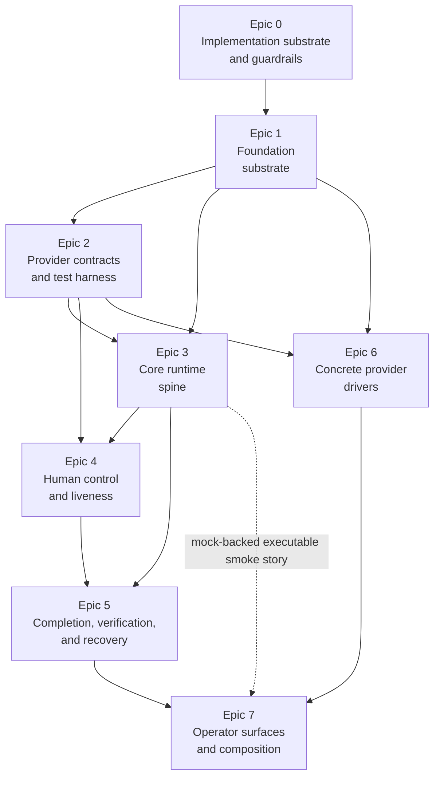
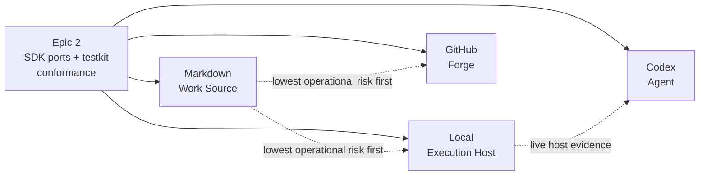

# Epic dependency DAG

This document translates the domain dependency picture into high-level implementation milestones.
It is a planning artifact between [`domain-dag.md`](domain-dag.md) and dispatch-ready story
contracts.

An epic is a milestone. It should describe a reviewable capability band, not a package task, provider
driver, or story group. Stories under each epic will later carry the concrete package surfaces,
interfaces, DTOs, tests, and evidence packs.

## Sources

- [`domain-dag.md`](domain-dag.md)
- [`../design/10-architecture/architecture.md`](../design/10-architecture/architecture.md)
- [`../design/20-sdk-and-packaging/package-target.md`](../design/20-sdk-and-packaging/package-target.md)
- [`../design/20-sdk-and-packaging/sdk-boundary.md`](../design/20-sdk-and-packaging/sdk-boundary.md)
- [`../design/20-sdk-and-packaging/provider-ports.md`](../design/20-sdk-and-packaging/provider-ports.md)
- [`../design/20-sdk-and-packaging/storage-port-types.md`](../design/20-sdk-and-packaging/storage-port-types.md)
- [`../design/20-sdk-and-packaging/cli-and-mcp-wrappers.md`](../design/20-sdk-and-packaging/cli-and-mcp-wrappers.md)
- [`../design/20-sdk-and-packaging/concrete-providers.md`](../design/20-sdk-and-packaging/concrete-providers.md)
- [`../design/20-sdk-and-packaging/testkit-and-conformance.md`](../design/20-sdk-and-packaging/testkit-and-conformance.md)
- [`../design/30-domain-reference/domain-catalog.md`](../design/30-domain-reference/domain-catalog.md)

## Reading rules

- Hard arrows are milestone readiness dependencies. They answer "what must exist before this epic can
  close?"
- Dotted arrows are story-order or evidence-order guidance. They do not imply package imports or
  top-level epic dependencies.
- Provider interfaces and shared DTOs are SDK-owned. Provider mocks, conformance helpers, and
  incident fixtures are testkit-owned.
- Concrete providers do not unblock core logic that can be built against SDK ports and testkit mocks.
- CLI and MCP stay thin. A mock-backed executable smoke story may happen earlier, but production
  composition waits for the core runtime, recovery path, and concrete providers.

## Epic nodes

| ID | Milestone | Done when | Main story groups |
|---|---|---|---|
| `Epic 0` | Implementation substrate and guardrails | The eight-package workspace shape, static dependency guardrails, TypeScript references, exports conventions, and local check gate are ready for feature work. | Package graph; dependency-cruiser rules; root solution wiring; package templates |
| `Epic 1` | Foundation substrate | The SDK has the root deterministic substrate: config/policy, storage/artifact/lease ports plus in-memory defaults, workspace/repository contracts, and credential/redaction/egress policy contracts. | `fnd-01`; `fnd-02`; `fnd-03`; `fnd-04` |
| `Epic 2` | Provider contract layer and test harness | The SDK owns the four provider interfaces and `CapabilityAttestation`; testkit owns mocks, conformance helpers, and incident fixture inputs. | Provider ports; shared DTOs; capability attestation; testkit mocks; conformance baseline |
| `Epic 3` | Core runtime spine | The deterministic SDK runtime can record, replay, project, gate, and analyze runs against SDK ports and testkit mocks. | Run lifecycle; event state; projections; capability gates; observability and analysis |
| `Epic 4` | Human control and liveness loop | Approval, escalation, park/resume, supervision, liveness, wait, and termination-handoff behavior are modeled and testable without concrete providers. | Approval and escalation; supervision and liveness; failure/degraded outcomes |
| `Epic 5` | Completion, verification, and recovery | The SDK can decide completion and merge readiness from evidence, then classify recovery and reconciliation actions safely. | Completion predicates; verify capture; merge readiness; recovery classifier; coordination leases |
| `Epic 6` | Concrete provider drivers | The four concrete provider packages pass conformance and produce the evidence their seams require. | Markdown Work Source; Local Execution Host; GitHub Forge; Codex Agent |
| `Epic 7` | Operator surfaces and end-to-end composition | CLI and MCP expose thin operator surfaces over the SDK, wire default providers/storage, and prove the supported end-to-end flows. | CLI; MCP; default composition helper; filesystem store wiring; operator attention and explainability |

## Direct dependency table

| Epic | Hard dependencies | Why |
|---|---|---|
| `Epic 0` | none | Package and guardrail substrate comes first. |
| `Epic 1` | `Epic 0` | Foundation code needs package boundaries and dependency enforcement. |
| `Epic 2` | `Epic 1` | Provider contracts and mocks use foundation policy, credentials, workspace, and storage DTOs. |
| `Epic 3` | `Epic 1`, `Epic 2` | Core runtime consumes foundation ports plus provider attestations/mocks. A `core-01` story may start after `Epic 1`; the epic closes only after provider-consuming core stories exist. |
| `Epic 4` | `Epic 2`, `Epic 3` | Approval and liveness consume Agent/Execution Host ports plus run lifecycle and capability gates. |
| `Epic 5` | `Epic 3`, `Epic 4` | Completion and recovery consume run state, gates, approval decisions, liveness facts, storage coordination, and seam evidence. |
| `Epic 6` | `Epic 1`, `Epic 2` | Concrete providers implement SDK ports, use foundation contracts, and prove conformance. They can proceed in parallel with core after the contract layer is stable. |
| `Epic 7` | `Epic 5`, `Epic 6` | Production composition needs the SDK control path and real providers. A mock-backed executable smoke story may happen after `Epic 3`. |

## Milestone DAG

The dotted edge allows an early thin CLI smoke story without making operator production composition
available too soon.

## Provider story-order guidance

This is not a top-level epic split. It is scheduling guidance for stories inside `Epic 6`.

Markdown remains first by risk because it is file-backed and avoids process, network, and credential
risk. Local and GitHub can proceed as separate story streams once their port contracts and
conformance suites exist. Codex can type against the SDK Agent port after `Epic 2`, but real live
smoke evidence depends on a working Execution Host story.

## Demoted story groups

The earlier low-level DAG slices are still useful, but they belong under epics as story groups:

| Previous low-level slice | New home |
|---|---|
| Package graph and guardrails | `Epic 0` story group |
| SDK config, policy, storage, workspace, credentials | `Epic 1` story groups |
| SDK provider ports, shared DTOs, testkit mocks, conformance baseline | `Epic 2` story groups |
| Run lifecycle, event envelopes, projections, capability gates, observability | `Epic 3` story groups |
| Approval, escalation, supervision, liveness, wait, termination handoff | `Epic 4` story groups |
| Completion predicates, verify capture, merge readiness, recovery, reconciliation | `Epic 5` story groups |
| Markdown, Local, GitHub, and Codex concrete drivers | `Epic 6` story groups |
| CLI, MCP, default composition, filesystem storage wiring, operator attention | `Epic 7` story groups |

## Story contract inputs

The next artifact should create one epic charter per milestone, then split each charter into
dispatch-ready story contracts using [`work-item-authoring-guide.md`](work-item-authoring-guide.md).
Those contracts should:

1. Keep the epic charter high level: purpose, included domains, milestone dependencies, outputs, and
   readiness for downstream epics.
2. Put package paths, exact DTOs, event types, failure tokens, and test commands in story contracts,
   not in the epic DAG.
3. Split `Epic 2` stories so SDK production interfaces are not conflated with testkit mocks and
   conformance helpers.
4. Require provider conformance before live driver smoke evidence is counted as meaningful.
5. Keep `Epic 7` mock-backed smoke and production composition as separate stories.

<!-- DOCS-NAV (generated — do not edit by hand) -->

---

**↑ Up:** [implementation contract](./README.md) · **← Prev:** [domain dependency DAG](./domain-dag.md) · **Next →:** [Engineering Policy Index](../engineering/README.md)

<!-- /DOCS-NAV -->
