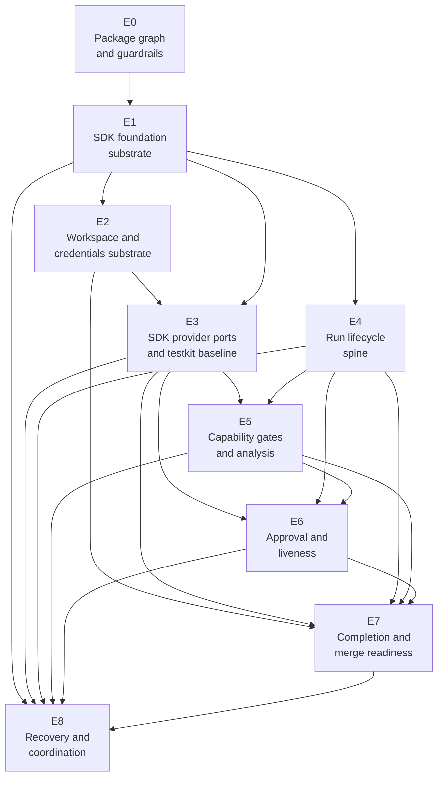
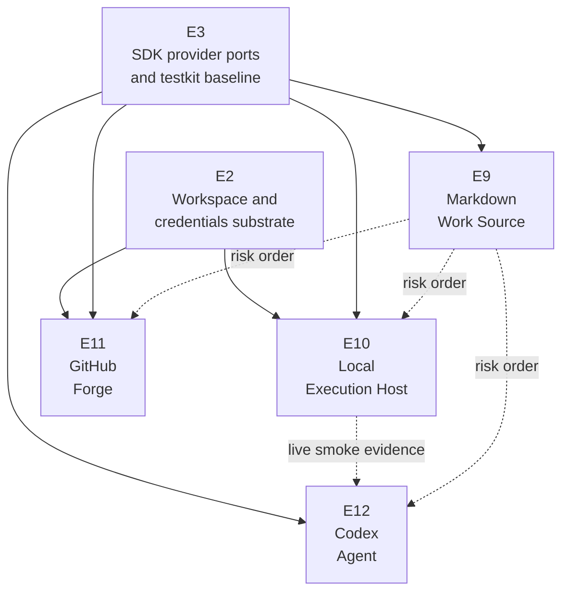
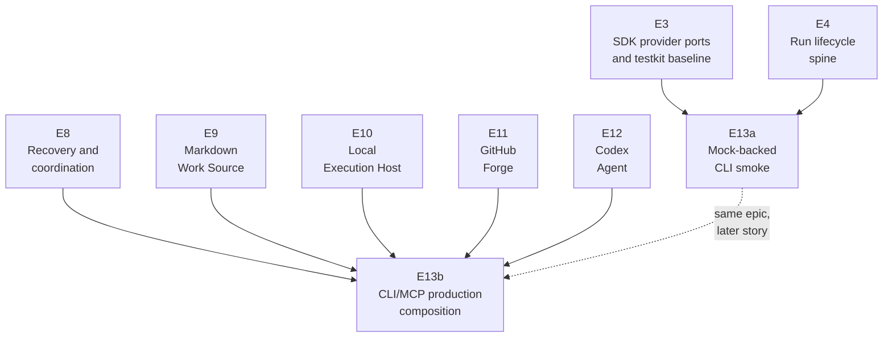

# Epic dependency DAG

This document translates the domain dependency picture into implementation epics. It is a planning
artifact between [`domain-dag.md`](domain-dag.md) and dispatch-ready story contracts.

An epic is larger than a story and smaller than the whole rebuild. It groups work by package surface,
dependency boundary, and evidence type. It is not a PR batch, not a worker assignment, and not a
one-to-one copy of the design-domain list.

## Sources

- [`domain-dag.md`](domain-dag.md)
- [`../design/10-architecture/architecture.md`](../design/10-architecture/architecture.md)
- [`../design/20-sdk-and-packaging/package-target.md`](../design/20-sdk-and-packaging/package-target.md)
- [`../design/20-sdk-and-packaging/sdk-boundary.md`](../design/20-sdk-and-packaging/sdk-boundary.md)
- [`../design/20-sdk-and-packaging/provider-ports.md`](../design/20-sdk-and-packaging/provider-ports.md)
- [`../design/20-sdk-and-packaging/storage-port-types.md`](../design/20-sdk-and-packaging/storage-port-types.md)
- [`../design/20-sdk-and-packaging/cli-and-mcp-wrappers.md`](../design/20-sdk-and-packaging/cli-and-mcp-wrappers.md)
- [`../design/20-sdk-and-packaging/concrete-providers.md`](../design/20-sdk-and-packaging/concrete-providers.md)
- [`../design/20-sdk-and-packaging/testkit-and-conformance.md`](../design/20-sdk-and-packaging/testkit-and-conformance.md)
- [`../design/30-domain-reference/domain-catalog.md`](../design/30-domain-reference/domain-catalog.md)

## Reading rules

- Hard arrows are implementation readiness dependencies. A downstream epic should not get
  dispatch-ready story contracts until those inputs exist.
- Dotted arrows are risk-order or evidence-order edges. They do not imply package imports.
- Provider interfaces and shared DTOs are SDK-owned. Provider mocks, conformance helpers, and
  incident fixtures are testkit-owned.
- Concrete providers do not unblock core logic that can be built against SDK ports and testkit mocks.
- CLI and MCP stay thin. A mock-backed CLI smoke story may happen early, but production composition
  waits for the relevant SDK runtime and concrete providers.

## Epic nodes

| ID | Epic | Package surface | Design scope | Primary outputs |
|---|---|---|---|---|
| `E0` | Package graph and guardrails | workspace, tooling | Package target, dependency rules, check gate | Eight package directories, package manifests, TypeScript references, dependency-cruiser rules, exports/types conventions |
| `E1` | SDK foundation substrate | `packages/sdk` | `fnd-01`, `fnd-02` | Config/policy model, storage port interfaces, in-memory storage defaults, deterministic clock/id ports, storage failure tokens |
| `E2` | SDK workspace and credentials substrate | `packages/sdk` | `fnd-03`, `fnd-04` | Local workspace/repository contracts, local git evidence model, credential refs, redaction and egress policy contracts |
| `E3` | SDK provider ports and testkit baseline | `packages/sdk`, `packages/testkit` | `prov-01` through `prov-04` contract surfaces | Four provider interfaces, `CapabilityAttestation`, shared provider DTOs, testkit mocks, conformance helper skeleton |
| `E4` | Run lifecycle spine | `packages/sdk` | `core-01` | Event envelopes, append/replay integration, run lifecycle state machine, projections, task snapshot model |
| `E5` | Capability gates and analysis base | `packages/sdk`, `packages/testkit` | `core-02`, `core-07` | Capability registry, gate evaluation, telemetry/analysis invariants, incident fixture inputs for gate outcomes |
| `E6` | Approval and liveness control | `packages/sdk` | `core-03`, `core-04` | Approval relay model, park/resume states, supervision fold, wait primitive, termination handoff model |
| `E7` | Completion and merge readiness | `packages/sdk` | `core-05` | Evidence predicates, verify capture model, merge readiness predicate, policy snapshot handling, fail-closed outcomes |
| `E8` | Recovery and coordination | `packages/sdk`, `packages/testkit` | `core-06` | Recovery classifier, reconciliation actions, repo-level lease coordination, action-safety gates, adversarial fixture coverage |
| `E9` | Markdown Work Source provider | `packages/provider-markdown` | `prov-03` concrete driver | Markdown tracker parser, claim/release/status writes, Work Source conformance, file-backed evidence |
| `E10` | Local Execution Host provider | `packages/provider-local` | `prov-04` concrete driver | Local process execution, containment/kill probes, runner-owned verify command capture, Execution Host conformance |
| `E11` | GitHub Forge provider | `packages/provider-github` | `prov-02` concrete driver | Push/PR/check/review/merge operations, runner-scoped credential use, Forge conformance, live evidence gates |
| `E12` | Codex Agent provider | `packages/provider-codex` | `prov-01` concrete driver | Codex session linkage, approval transport, tool/progress observation, Agent conformance, live smoke evidence |
| `E13` | Edge composition and operator surface | `packages/cli`, `packages/mcp` | `edge-01` | `createWorkflowKit` wiring, filesystem store wiring, default composition helper, CLI commands, MCP tools, operator attention and explainability |

## Direct dependency table

| Epic | Hard dependencies | Notes |
|---|---|---|
| `E0` | none | Establishes the package and static dependency frame. |
| `E1` | `E0` | First SDK runtime substrate. |
| `E2` | `E1` | Workspace consumes config/storage; credentials consume policy. |
| `E3` | `E1`, `E2` | All four SDK provider ports and testkit mocks need the foundation substrate. |
| `E4` | `E1` | Run lifecycle depends on config and storage, not provider ports. |
| `E5` | `E3`, `E4` | Gates consume recorded attestations from SDK ports; analysis consumes the run log. |
| `E6` | `E3`, `E4`, `E5` | Approval consumes capability gates; supervision consumes Agent and Execution Host ports. |
| `E7` | `E2`, `E3`, `E4`, `E5`, `E6` | Completion consumes workspace evidence, gates, approvals, Forge and Execution Host ports. |
| `E8` | `E1`, `E3`, `E4`, `E5`, `E6`, `E7` | Recovery consumes run state, gates, liveness, completion, storage coordination, and all seams. |
| `E9` | `E3` | First concrete provider by risk order. |
| `E10` | `E2`, `E3` | Uses workspace and credential/redaction contracts plus the Execution Host port. |
| `E11` | `E2`, `E3` | Uses credential/redaction contracts plus the Forge port. |
| `E12` | `E3` | Package-level dependency is the SDK Agent port; production smoke evidence also needs a real Execution Host provider. |
| `E13` | `E3`, `E4` for mock smoke; `E8`, `E9`, `E10`, `E11`, `E12` for production composition | Keep mock smoke and production composition as separate stories inside the epic. |

## Split DAG views

### SDK and testkit spine

This is the core critical path. `E4` can run before all provider ports are done because `core-01`
only needs config and storage. Provider-consuming core epics wait for `E3`.

### Concrete providers

The dotted provider edges are scheduling guidance, not import edges. Markdown is first because it is
file-backed and avoids process, network, and credential risk. Local and GitHub can become separate
story streams once the SDK port and testkit conformance surface exist. Codex can type against the SDK
Agent port after `E3`, but real smoke evidence needs a working Execution Host provider.

### Edge and vertical slices

The early smoke story proves the SDK can be driven from an executable wrapper without moving run
logic into the edge. The production composition story waits for recovery, concrete providers, and
filesystem/default wiring.

## Topological bands

These bands are a story-authoring order. They are not PR batches.

| Band | Epics | Why this band exists |
|---|---|---|
| 0 | `E0` | Establish package graph and dependency guardrails before code lands in packages. |
| 1 | `E1` | Build the SDK root substrate: config, policy, storage ports, and in-memory defaults. |
| 2 | `E2`, `E4` | Workspace/credentials and run lifecycle can proceed after the foundation substrate. |
| 3 | `E3` | Provider-consuming core and all concrete drivers need SDK ports and testkit mocks. |
| 4 | `E5`, `E9` | Capability/analysis and the low-risk Markdown provider can begin once ports and lifecycle exist. |
| 5 | `E6`, `E10`, `E11` | Approval/liveness and the Local/GitHub providers consume the established port surfaces. |
| 6 | `E7`, `E12` | Completion integrates gates/approval/workspace/Forge/Host; Codex follows port plus host evidence. |
| 7 | `E8` | Recovery is late because it consumes the whole control spine. |
| 8 | `E13` production composition | Edge remains thin and depends on the SDK runtime plus concrete providers. |

## Story contract inputs

The next artifact should turn each epic into an epic charter, then split each charter into story
contracts using [`work-item-authoring-guide.md`](work-item-authoring-guide.md). In those contracts:

1. `E0` should carry the workspace and dependency-rule acceptance criteria that every later package
   depends on.
2. SDK epics should enumerate exact DTOs, event types, failure tokens, and projection outputs from
   the design docs.
3. `E3` should separate SDK production interfaces from testkit mocks and conformance helpers.
4. Provider epics should require conformance tests before live driver smoke evidence is considered
   meaningful.
5. `E13` should keep mock-backed smoke and production composition as separate stories so the early
   vertical slice does not drag concrete-provider risk into the first CLI proof.

<!-- DOCS-NAV (generated — do not edit by hand) -->

---

**↑ Up:** [implementation contract](./README.md) · **← Prev:** [domain dependency DAG](./domain-dag.md) · **Next →:** [Engineering Policy Index](../engineering/README.md)

<!-- /DOCS-NAV -->
