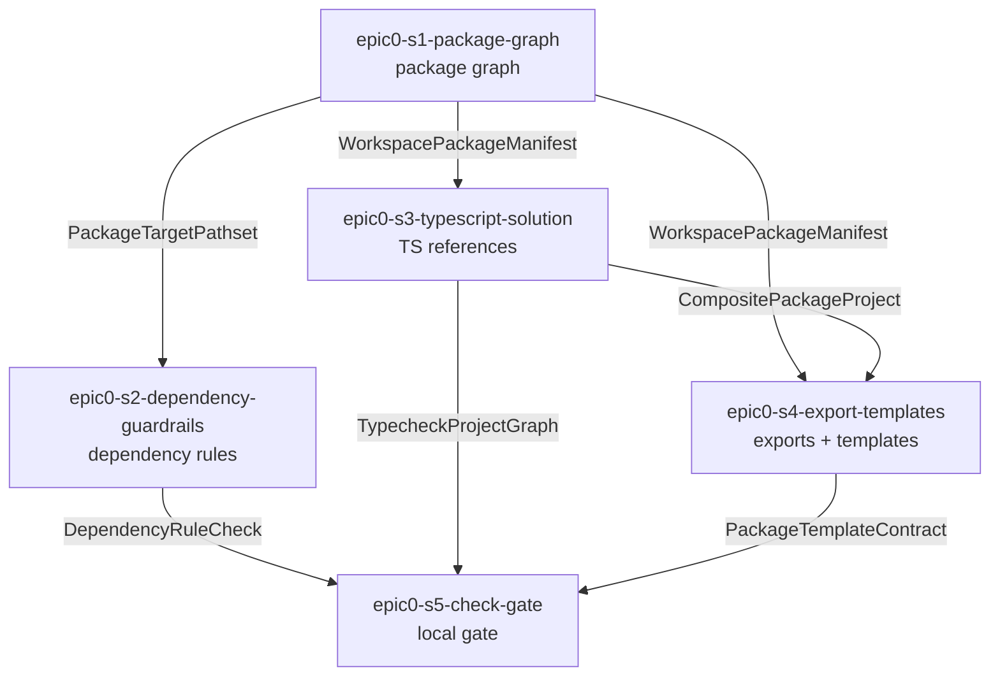

# Epic 0 Story DAG

Epic 0 has no included domains, so this DAG slices the epic's frozen `Outputs` rather than domain
signals. Each node is one dispatch-ready story, each edge is an intra-epic dependency created by a
shared contract one producer story defines and its consumers cite.

## Sources

- [`README.md`](./README.md)
- [`../../epic-dag.md`](../../epic-dag.md)
- [`../../../design/20-sdk-and-packaging/package-target.md`](../../../design/20-sdk-and-packaging/package-target.md)
- [`../../../design/20-sdk-and-packaging/dependency-rules.md`](../../../design/20-sdk-and-packaging/dependency-rules.md)
- [`../../../design/20-sdk-and-packaging/sdk-boundary.md`](../../../design/20-sdk-and-packaging/sdk-boundary.md)
- [`../../../engineering/dependency-policy.md`](../../../engineering/dependency-policy.md)
- [`../../../engineering/dependency-rule-enforcement.md`](../../../engineering/dependency-rule-enforcement.md)
- [`../../../engineering/test-lanes.md`](../../../engineering/test-lanes.md)
- [`../../../engineering/testing-policy.md`](../../../engineering/testing-policy.md)
- [`../../../engineering/check-gate.md`](../../../engineering/check-gate.md)

## Reading rules

- Node = one story contract and one reviewable ownership scope for the later implementation run.
- Edge = a hard intra-epic dependency because the consumer needs a contract, path layout, or command
  surface produced by the dependency.
- Epic 0 coverage reads against the frozen `Outputs` table in the epic charter.
- The producer of the package workspace layout is `epic0-s1-package-graph`; all later substrate
  stories cite its package list and path layout instead of redefining it.

## Story nodes

| story id | one-line job | Output covered | owned pathset | suggested tier |
|---|---|---|---|---|
| `epic0-s1-package-graph` | Create the eight-package workspace skeleton and package identity map. | Eight-package workspace skeleton matching the frozen package boundary. | `pnpm-workspace.yaml`, `packages/*/package.json`, `packages/*/README.md`, `packages/*/src/**`, `packages/*/tests/**` | standard |
| `epic0-s2-dependency-guardrails` | Enforce the Dependency Rule with dependency-cruiser package-boundary rules and fixtures. | Static dependency guardrails that enforce the Dependency Rule. | `.dependency-cruiser.cjs`, `tooling/dep-cruiser/**`, `tests/dependency-rules/**` | standard |
| `epic0-s3-typescript-solution` | Wire root and package TypeScript project references for the frozen package graph. | Root TypeScript solution wiring and package reference conventions. | `tsconfig.json`, `tsconfig.base.json`, `tsconfig.*.json`, `packages/*/tsconfig.json` | standard |
| `epic0-s4-export-templates` | Define package export conventions and reusable package templates for later domain stories. | Package export conventions and reusable package templates for later domain stories. | `tooling/package-templates/**`, `tooling/package-exports/**`, `tests/package-templates/**` | standard |
| `epic0-s5-check-gate` | Wire the local `pnpm check` gate across docs nav, format, lint, deps, typecheck, and test lanes. | Local `pnpm check` gate wired so later epics can prove format, lint, dependency, typecheck, and test lanes through one command. | `package.json`, `biome.json`, `vitest.config.ts`, `tooling/no-side-effects.setup.ts`, `tooling/docs-nav/**`, `tests/gate/**` | standard |

## Dependency table

| story | depends on | shared contract creating the edge |
|---|---|---|
| `epic0-s1-package-graph` | none | Producer of `epic0-s1-package-graph/PackageTargetPathset` and `epic0-s1-package-graph/WorkspacePackageManifest`. |
| `epic0-s2-dependency-guardrails` | `epic0-s1-package-graph` | Consumes `epic0-s1-package-graph/PackageTargetPathset` so every guardrail rule targets the frozen package paths. |
| `epic0-s3-typescript-solution` | `epic0-s1-package-graph` | Consumes `epic0-s1-package-graph/WorkspacePackageManifest` to create project references only for target packages. |
| `epic0-s4-export-templates` | `epic0-s1-package-graph`, `epic0-s3-typescript-solution` | Consumes `epic0-s1-package-graph/WorkspacePackageManifest` and `epic0-s3-typescript-solution/CompositePackageProject` for export and template conventions. |
| `epic0-s5-check-gate` | `epic0-s2-dependency-guardrails`, `epic0-s3-typescript-solution`, `epic0-s4-export-templates` | Consumes `epic0-s2-dependency-guardrails/DependencyRuleCheck`, `epic0-s3-typescript-solution/TypecheckProjectGraph`, and `epic0-s4-export-templates/PackageTemplateContract` as gate steps. |

## Story graph

## Topological bands

| band | stories | delivery note |
|---|---|---|
| 1 | `epic0-s1-package-graph` | Establishes the path and package identity producer. |
| 2 | `epic0-s2-dependency-guardrails`, `epic0-s3-typescript-solution` | Independent consumers of the package graph. |
| 3 | `epic0-s4-export-templates` | Consumes package graph plus TypeScript project shape. |
| 4 | `epic0-s5-check-gate` | Final gate composition after guardrail, typecheck, and template surfaces exist. |

## Shared contracts

| shared shape | producer | consumers |
|---|---|---|
| `PackageTargetPathset` | `epic0-s1-package-graph` | `epic0-s2-dependency-guardrails`, `epic0-s4-export-templates` |
| `WorkspacePackageManifest` | `epic0-s1-package-graph` | `epic0-s3-typescript-solution`, `epic0-s4-export-templates` |
| `CompositePackageProject` | `epic0-s3-typescript-solution` | `epic0-s4-export-templates`, `epic0-s5-check-gate` |
| `DependencyRuleCheck` | `epic0-s2-dependency-guardrails` | `epic0-s5-check-gate` |
| `PackageTemplateContract` | `epic0-s4-export-templates` | `epic0-s5-check-gate` |

## Gate 3 self-check

- Coverage closed: every Epic 0 Output maps to exactly one story in the epic charter's `Outputs` table.
- No invented nodes: every story exists because of one frozen Output.
- Single producer per shared shape: every cross-story shape above names one producer.
- Acyclic labelled edges: the graph has four bands and every edge names its contract.
- Defensible sizing: each node owns one substrate surface and can carry falsifiable ACs.
- Dispatch-ready: every node names an owned pathset and sits in a delivery band.

<!-- DOCS-NAV (generated — do not edit by hand) -->

---

**↑ Up:** [Epic 0 - Implementation substrate and guardrails](./README.md) · **← Prev:** [epic0-s5-check-gate - local check gate implementation story](./stories/epic0-s5-check-gate.md) · **Next →:** [Epic 1 - Foundation substrate](../epic-1-foundation-substrate/README.md)

<!-- /DOCS-NAV -->
