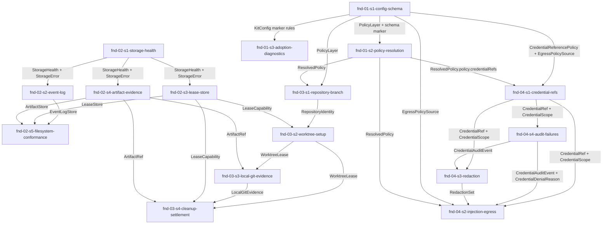

# Epic 1 Story DAG

Epic 1 turns the four Foundation domain charters into dispatch-ready story contracts. Each node owns
one coherent SDK foundation surface, and each edge names the shared type, event, port, or evidence
shape that creates the dependency.

## Sources

- [`README.md`](./README.md)
- [`../../epic-dag.md`](../../epic-dag.md)
- [`../../domains/foundation/fnd-01-configuration-and-policy.md`](../../domains/foundation/fnd-01-configuration-and-policy.md)
- [`../../domains/foundation/fnd-02-storage-and-artifacts.md`](../../domains/foundation/fnd-02-storage-and-artifacts.md)
- [`../../domains/foundation/fnd-03-workspace-and-repository.md`](../../domains/foundation/fnd-03-workspace-and-repository.md)
- [`../../domains/foundation/fnd-04-credentials-and-secrets.md`](../../domains/foundation/fnd-04-credentials-and-secrets.md)
- [`../../../design/30-domain-reference/foundation/configuration-and-policy/README.md`](../../../design/30-domain-reference/foundation/configuration-and-policy/README.md)
- [`../../../design/30-domain-reference/foundation/storage-and-artifacts/README.md`](../../../design/30-domain-reference/foundation/storage-and-artifacts/README.md)
- [`../../../design/30-domain-reference/foundation/workspace-and-repository/README.md`](../../../design/30-domain-reference/foundation/workspace-and-repository/README.md)
- [`../../../design/30-domain-reference/foundation/credentials-and-secrets/README.md`](../../../design/30-domain-reference/foundation/credentials-and-secrets/README.md)
- [`../../../engineering/testing-policy.md`](../../../engineering/testing-policy.md)
- [`../../../engineering/test-lanes.md`](../../../engineering/test-lanes.md)
- [`../../../engineering/dependency-policy.md`](../../../engineering/dependency-policy.md)
- [`../../../engineering/dependency-rule-enforcement.md`](../../../engineering/dependency-rule-enforcement.md)
- [`../../../engineering/check-gate.md`](../../../engineering/check-gate.md)

## Reading rules

- Node = one story contract and one reviewable implementation scope for a later delivery run.
- Edge = an intra-epic dependency because a consumer story uses a shared shape produced by another
  story.
- Every `Story Group Signal` in the Epic 1 charter maps to exactly one story node.
- Consumers cite `<producer-story>/<type>` for shared shapes; they do not redeclare shape fields.
- Foundation event payloads may be owned here, but the core-01 run event envelope and append protocol
  remain out of scope for Epic 1.

## Story nodes

| story id | one-line job | domain(s) | claimed signals covered | owned pathset | suggested tier |
|---|---|---|---|---|---|
| `fnd-01-s1-config-schema` | Define vNext config schema, policy blocks, safe defaults, and consumer policy shapes. | `fnd-01` | Config schema and accepted vNext marker; Safe defaults, default-off capabilities, and deferred autonomy rejection; Consumer policy shapes for capability, approval, escalation, merge, credential refs, and egress. | `packages/sdk/src/foundation/configuration-policy/schema/**`, `packages/sdk/src/foundation/configuration-policy/defaults/**`, `packages/sdk/src/foundation/configuration-policy/policy-shapes/**`, `packages/sdk/tests/foundation/configuration-policy/schema/**` | standard |
| `fnd-01-s2-policy-resolution` | Resolve policy deterministically and return provenance plus resolution append intents. | `fnd-01` | Deterministic precedence across defaults, profile, and operator override; Per-field provenance and policy-resolution event payloads. | `packages/sdk/src/foundation/configuration-policy/resolution/**`, `packages/sdk/src/foundation/configuration-policy/provenance/**`, `packages/sdk/src/foundation/configuration-policy/events/**`, `packages/sdk/tests/foundation/configuration-policy/resolution/**` | standard |
| `fnd-01-s3-adoption-diagnostics` | Diagnose legacy, unknown, or incompatible config/artifacts and fail closed. | `fnd-01` | Adoption diagnostics for legacy, unknown, or incompatible config and artifacts. | `packages/sdk/src/foundation/configuration-policy/adoption/**`, `packages/sdk/tests/foundation/configuration-policy/adoption/**` | standard |
| `fnd-02-s1-storage-health` | Define storage health, storage errors, and fail-closed degraded modes. | `fnd-02` | Storage health and fail-closed degraded modes. | `packages/sdk/src/foundation/storage/health/**`, `packages/sdk/src/foundation/storage/errors/**`, `packages/sdk/tests/foundation/storage/health/**` | standard |
| `fnd-02-s2-event-log` | Implement event-log persistence contracts, durability classes, receipts, and replay health. | `fnd-02` | Event-log persistence, durability classes, append receipts, and replay health. | `packages/sdk/src/foundation/storage/event-log/**`, `packages/sdk/tests/foundation/storage/event-log/**` | elevated |
| `fnd-02-s3-lease-store` | Implement lease acquire, renew, release, read, and fence contracts with epoch fencing. | `fnd-02` | Lease acquisition, renewal, release, and epoch fencing. | `packages/sdk/src/foundation/storage/leases/**`, `packages/sdk/tests/foundation/storage/leases/**` | standard |
| `fnd-02-s4-artifact-evidence` | Implement artifact refs, scratch refs, tombstones, exports, and evidence bundles. | `fnd-02` | Artifact refs, scratch refs, digest metadata, redaction hooks, tombstones, and export manifests; Evidence bundles that preserve stable refs, digests, and redacted-by-default exports. | `packages/sdk/src/foundation/storage/artifacts/**`, `packages/sdk/src/foundation/storage/evidence-bundles/**`, `packages/sdk/tests/foundation/storage/artifacts/**` | elevated |
| `fnd-02-s5-filesystem-conformance` | Add filesystem-backed storage behavior and conformance fixtures over storage ports. | `fnd-02` | Filesystem-backed storage behavior and conformance fixtures. | `packages/sdk/src/foundation/storage/filesystem/**`, `packages/sdk/tests/foundation/storage/conformance/**`, `packages/sdk/tests/fixtures/storage/**` | elevated |
| `fnd-03-s1-repository-branch` | Define repository identity, local-only branch model, and public API boundary checks. | `fnd-03` | Repository identity and local-only branch model; Boundary checks proving no remote, credential, process, CI, PR, check, review, or merge fields. | `packages/sdk/src/foundation/workspace-repository/repository/**`, `packages/sdk/src/foundation/workspace-repository/branch/**`, `packages/sdk/src/foundation/workspace-repository/boundary/**`, `packages/sdk/tests/foundation/workspace-repository/boundary/**` | standard |
| `fnd-03-s2-worktree-setup` | Implement worktree lease lifecycle plus declared setup and freshness handoff. | `fnd-03` | Worktree lease lifecycle and cleanup state; Declared setup metadata and freshness evaluation handoff. | `packages/sdk/src/foundation/workspace-repository/worktree/**`, `packages/sdk/src/foundation/workspace-repository/setup/**`, `packages/sdk/tests/foundation/workspace-repository/worktree/**` | elevated |
| `fnd-03-s3-local-git-evidence` | Record local git evidence, diff/stat artifact refs, and local-only evidence events. | `fnd-03` | Local git evidence for branch existence, commits, base/head SHAs, merge base, diff, and working tree state. | `packages/sdk/src/foundation/workspace-repository/evidence/**`, `packages/sdk/tests/foundation/workspace-repository/evidence/**` | standard |
| `fnd-03-s4-cleanup-settlement` | Implement cleanup tombstones, blocked cleanup records, and missing/moved worktree settlement. | `fnd-03` | Cleanup tombstones, blocked cleanup records, and missing or moved worktree settlement. | `packages/sdk/src/foundation/workspace-repository/cleanup/**`, `packages/sdk/tests/foundation/workspace-repository/cleanup/**` | standard |
| `fnd-04-s1-credential-refs` | Validate credential refs, scopes, allowed parties, hosts, TTLs, and policy digests. | `fnd-04` | Credential references, scopes, allowed parties, phases, hosts, TTL, and policy digests. | `packages/sdk/src/foundation/credentials-secrets/refs/**`, `packages/sdk/src/foundation/credentials-secrets/scopes/**`, `packages/sdk/tests/foundation/credentials-secrets/refs/**` | standard |
| `fnd-04-s4-audit-failures` | Define credential audit events, tamper fields, denial records, and failure token catalog. | `fnd-04` | Credential audit events, tamper-evidence fields, finish and destroy records, and denial records; Failure modes for unresolved refs, denied scopes, worker Forge exposure, missing audit, failed redaction, missing egress attestation, and unconfirmed destruction. | `packages/sdk/src/foundation/credentials-secrets/audit/**`, `packages/sdk/src/foundation/credentials-secrets/failures/**`, `packages/sdk/tests/foundation/credentials-secrets/audit/**` | elevated |
| `fnd-04-s3-redaction` | Implement recursive redaction sets and redacted value contracts. | `fnd-04` | Redaction sets for telemetry, process output, provider responses, and artifacts. | `packages/sdk/src/foundation/credentials-secrets/redaction/**`, `packages/sdk/tests/foundation/credentials-secrets/redaction/**` | elevated |
| `fnd-04-s2-injection-egress` | Implement injection planning and egress-policy issuance with worker/runner separation. | `fnd-04` | Injection plans that distinguish runner-only Forge credentials from worker-safe grants; Egress policy issuance and matching attestation evidence before confined credential release. | `packages/sdk/src/foundation/credentials-secrets/injection/**`, `packages/sdk/src/foundation/credentials-secrets/egress/**`, `packages/sdk/tests/foundation/credentials-secrets/injection/**` | elevated |

## Dependency table

| story | depends on | shared contract creating the edge |
|---|---|---|
| `fnd-01-s1-config-schema` | none | Producer of `fnd-01-s1-config-schema/KitConfig`, `RunConfigInput`, `PolicyLayer`, `PolicyLayerPatch`, policy block types, `CredentialReferencePolicy`, and `EgressPolicySource`. |
| `fnd-01-s2-policy-resolution` | `fnd-01-s1-config-schema` | Consumes `fnd-01-s1-config-schema/PolicyLayer` and `PolicyLayerPatch`; produces `ResolvedPolicy`, `FieldProvenance`, `ConfigFieldResolved`, `ConfigResolved`, and `PolicyResolutionFailed`. |
| `fnd-01-s3-adoption-diagnostics` | `fnd-01-s1-config-schema` | Consumes `fnd-01-s1-config-schema/KitConfig` marker rules; produces `AdoptionSource`, `ArtifactSource`, `AdoptionReport`, `AdoptionDiagnostic`, and `AdoptionDiagnosticEmitted`. |
| `fnd-02-s1-storage-health` | none | Producer of `fnd-02-s1-storage-health/StorageHealth`, `StorageError`, and `StorageErrorCode`. |
| `fnd-02-s2-event-log` | `fnd-02-s1-storage-health` | Consumes `fnd-02-s1-storage-health/StorageHealth`; produces `EventLogStore`, `DurabilityClass`, `LogHandle`, `AppendBatch`, `AppendReceipt`, `NonDurableAck`, and `StoredRecord`. |
| `fnd-02-s3-lease-store` | `fnd-02-s1-storage-health` | Consumes `fnd-02-s1-storage-health/StorageError`; produces `LeaseStore`, `LeaseCapability`, and `LeaseSnapshot`. |
| `fnd-02-s4-artifact-evidence` | `fnd-02-s1-storage-health` | Consumes `fnd-02-s1-storage-health/StorageHealth`; produces `ArtifactStore`, `ArtifactRef`, `ScratchArtifactRef`, `ExportManifest`, and artifact tombstone metadata. |
| `fnd-02-s5-filesystem-conformance` | `fnd-02-s2-event-log`, `fnd-02-s3-lease-store`, `fnd-02-s4-artifact-evidence` | Consumes `EventLogStore`, `LeaseStore`, and `ArtifactStore` to prove filesystem-backed behavior and conformance fixtures. |
| `fnd-03-s1-repository-branch` | `fnd-01-s1-config-schema`, `fnd-01-s2-policy-resolution` | Consumes `fnd-01-s1-config-schema/PolicyLayer` and `fnd-01-s2-policy-resolution/ResolvedPolicy` only as policy input; produces `RepositoryIdentity` and local branch model. |
| `fnd-03-s2-worktree-setup` | `fnd-03-s1-repository-branch`, `fnd-02-s3-lease-store` | Consumes `RepositoryIdentity` and `fnd-02-s3-lease-store/LeaseCapability`; produces `WorktreeLease`, `DeclaredSetup`, and `SetupEvaluation`. |
| `fnd-03-s3-local-git-evidence` | `fnd-03-s2-worktree-setup`, `fnd-02-s4-artifact-evidence` | Consumes `WorktreeLease` and `fnd-02-s4-artifact-evidence/ArtifactRef`; produces `LocalGitEvidence` and `LocalGitEvidenceRecorded`. |
| `fnd-03-s4-cleanup-settlement` | `fnd-03-s2-worktree-setup`, `fnd-03-s3-local-git-evidence`, `fnd-02-s3-lease-store`, `fnd-02-s4-artifact-evidence` | Consumes `WorktreeLease`, `LocalGitEvidence`, `LeaseCapability`, and `ArtifactRef` for cleanup tombstones and settlement records. |
| `fnd-04-s1-credential-refs` | `fnd-01-s1-config-schema`, `fnd-01-s2-policy-resolution` | Consumes `CredentialReferencePolicy`, `CredentialRefSource`, and `ResolvedPolicy.policy.credentialRefs`; produces `CredentialRef`, `CredentialScope`, and `SecretRef`. |
| `fnd-04-s4-audit-failures` | `fnd-04-s1-credential-refs` | Consumes `CredentialRef` and `CredentialScope`; produces `AuditBase`, `CredentialAuditEvent`, `CredentialUseDenied`, `CredentialMaterialDestroyed`, and `CredentialDenialReason`. |
| `fnd-04-s3-redaction` | `fnd-04-s1-credential-refs`, `fnd-04-s4-audit-failures` | Consumes `CredentialRef`, `CredentialScope`, and `CredentialAuditEvent`; produces `RedactionSet`, `RedactedInput`, and `RedactedValue`. |
| `fnd-04-s2-injection-egress` | `fnd-04-s1-credential-refs`, `fnd-04-s4-audit-failures`, `fnd-04-s3-redaction`, `fnd-01-s1-config-schema`, `fnd-01-s2-policy-resolution` | Consumes `CredentialRef`, `CredentialScope`, `CredentialAuditEvent`, `RedactionSet`, `EgressPolicySource`, and `ResolvedPolicy`; produces `InjectionPlan`, `InjectionBinding`, `EgressPolicy`, `RequiredAttester`, and `NegativeProbe`. |

## Story graph

## Topological bands

| band | stories | delivery note |
|---|---|---|
| 1 | `fnd-01-s1-config-schema`, `fnd-02-s1-storage-health` | Root policy and storage-health producers. |
| 2 | `fnd-01-s2-policy-resolution`, `fnd-01-s3-adoption-diagnostics`, `fnd-02-s2-event-log`, `fnd-02-s3-lease-store`, `fnd-02-s4-artifact-evidence` | Consumers of schema or storage health; independent within the band. |
| 3 | `fnd-02-s5-filesystem-conformance`, `fnd-03-s1-repository-branch`, `fnd-04-s1-credential-refs` | Storage conformance and first consumers of resolved policy. |
| 4 | `fnd-03-s2-worktree-setup`, `fnd-04-s4-audit-failures` | Worktree setup consumes leases; credential audit consumes refs/scopes. |
| 5 | `fnd-03-s3-local-git-evidence`, `fnd-04-s3-redaction` | Local evidence and redaction consume their producers without depending on each other. |
| 6 | `fnd-03-s4-cleanup-settlement`, `fnd-04-s2-injection-egress` | Cleanup consumes evidence; injection consumes refs, audit, redaction, and egress source policy. |

## Shared contracts

| shared shape | producer | consumers |
|---|---|---|
| `KitConfig`, `PolicyLayer`, `PolicyLayerPatch`, `CredentialReferencePolicy`, `EgressPolicySource` | `fnd-01-s1-config-schema` | `fnd-01-s2-policy-resolution`, `fnd-01-s3-adoption-diagnostics`, `fnd-03-s1-repository-branch`, `fnd-04-s1-credential-refs`, `fnd-04-s2-injection-egress` |
| `ResolvedPolicy`, `FieldProvenance`, `ConfigurationPolicyAppendIntent` | `fnd-01-s2-policy-resolution` | `fnd-03-s1-repository-branch`, `fnd-04-s1-credential-refs`, `fnd-04-s2-injection-egress` |
| `StorageHealth`, `StorageError`, `StorageErrorCode` | `fnd-02-s1-storage-health` | `fnd-02-s2-event-log`, `fnd-02-s3-lease-store`, `fnd-02-s4-artifact-evidence` |
| `EventLogStore` | `fnd-02-s2-event-log` | `fnd-02-s5-filesystem-conformance` |
| `LeaseCapability`, `LeaseStore` | `fnd-02-s3-lease-store` | `fnd-02-s5-filesystem-conformance`, `fnd-03-s2-worktree-setup`, `fnd-03-s4-cleanup-settlement` |
| `ArtifactRef`, `ArtifactStore`, `ExportManifest` | `fnd-02-s4-artifact-evidence` | `fnd-02-s5-filesystem-conformance`, `fnd-03-s3-local-git-evidence`, `fnd-03-s4-cleanup-settlement` |
| `RepositoryIdentity` | `fnd-03-s1-repository-branch` | `fnd-03-s2-worktree-setup` |
| `WorktreeLease`, `DeclaredSetup`, `SetupEvaluation` | `fnd-03-s2-worktree-setup` | `fnd-03-s3-local-git-evidence`, `fnd-03-s4-cleanup-settlement` |
| `LocalGitEvidence` | `fnd-03-s3-local-git-evidence` | `fnd-03-s4-cleanup-settlement` |
| `CredentialRef`, `CredentialScope`, `SecretRef` | `fnd-04-s1-credential-refs` | `fnd-04-s4-audit-failures`, `fnd-04-s3-redaction`, `fnd-04-s2-injection-egress` |
| `AuditBase`, `CredentialAuditEvent`, `CredentialDenialReason` | `fnd-04-s4-audit-failures` | `fnd-04-s3-redaction`, `fnd-04-s2-injection-egress` |
| `RedactionSet`, `RedactedInput`, `RedactedValue` | `fnd-04-s3-redaction` | `fnd-04-s2-injection-egress` |
| `InjectionPlan`, `EgressPolicy`, `RequiredAttester`, `NegativeProbe` | `fnd-04-s2-injection-egress` | Epic 2 provider ports, Epic 3 capability gates, Epic 6 concrete drivers |

## Gate 3 self-check

- Coverage closed: every Epic 1 `Story Group Signal` maps to exactly one story id in the epic charter.
- No invented nodes: every story exists because of one or more claimed signals from the frozen domain
  charters.
- Single producer per shared shape: every shared shape above names one producer story.
- Acyclic labelled edges: the graph has six topological bands and every edge names a contract.
- Defensible sizing: each node owns one cohesive Foundation surface and can carry falsifiable ACs.
- Dispatch-ready: every node names one owned pathset and a suggested delivery tier.

<!-- DOCS-NAV (generated — do not edit by hand) -->

---

**↑ Up:** [Epic 1 - Foundation substrate](./README.md) · **← Prev:** [fnd-04-s4-audit-failures - audit failures implementation story](./stories/fnd-04-s4-audit-failures.md) · **Next →:** [Epic 2 - Provider contract layer and test harness](../epic-2-provider-contract-layer-and-test-harness/README.md)

<!-- /DOCS-NAV -->
