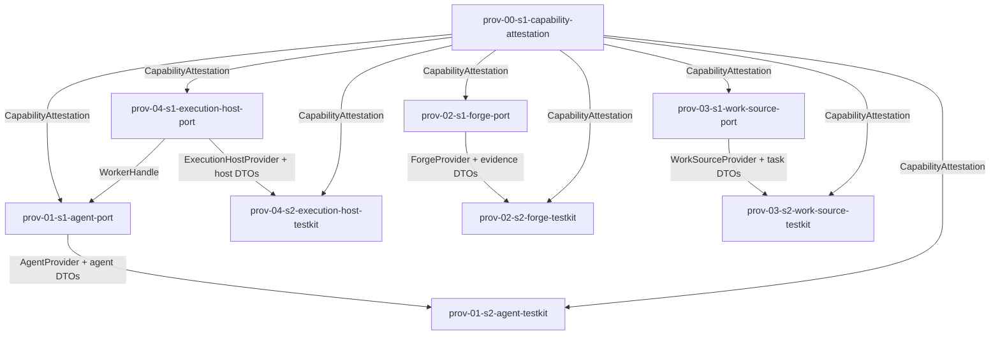

# Epic 2 Story DAG

Epic 2 turns the four Provider domain charters into dispatch-ready story contracts. It splits each
seam into an **SDK production port producer** (the `*Provider` interface, its shared DTO catalog, and
its capability-attestation specialization) and a **testkit consumer** (the programmable mock,
conformance helpers, and incident fixtures), per the `epic-dag.md` rule that SDK interfaces must not
be conflated with testkit mocks. One shared shape — the generic `CapabilityAttestation<Capability>`
envelope consumed by all four seams — is declared once by a dedicated catalog node so no two stories
redeclare it. Each edge names the shared type, port, or evidence shape that creates the dependency.

## Sources

- [`README.md`](./README.md)
- [`../../epic-dag.md`](../../epic-dag.md)
- [`../../domains/providers/prov-01-agent-execution.md`](../../domains/providers/prov-01-agent-execution.md)
- [`../../domains/providers/prov-02-forge-collaboration.md`](../../domains/providers/prov-02-forge-collaboration.md)
- [`../../domains/providers/prov-03-work-source.md`](../../domains/providers/prov-03-work-source.md)
- [`../../domains/providers/prov-04-execution-host.md`](../../domains/providers/prov-04-execution-host.md)
- [`../../../design/20-sdk-and-packaging/provider-ports.md`](../../../design/20-sdk-and-packaging/provider-ports.md)
- [`../../../design/20-sdk-and-packaging/provider-interface-model.md`](../../../design/20-sdk-and-packaging/provider-interface-model.md)
- [`../../../design/20-sdk-and-packaging/sdk-boundary.md`](../../../design/20-sdk-and-packaging/sdk-boundary.md)
- [`../../../design/20-sdk-and-packaging/testkit-and-conformance.md`](../../../design/20-sdk-and-packaging/testkit-and-conformance.md)
- [`../../../design/20-sdk-and-packaging/concrete-providers.md`](../../../design/20-sdk-and-packaging/concrete-providers.md)
- [`../../../design/20-sdk-and-packaging/package-target.md`](../../../design/20-sdk-and-packaging/package-target.md)
- [`../../../design/20-sdk-and-packaging/dependency-rules.md`](../../../design/20-sdk-and-packaging/dependency-rules.md)
- [`../epic-0-implementation-substrate-and-guardrails/stories/epic0-s1-package-graph.md`](../epic-0-implementation-substrate-and-guardrails/stories/epic0-s1-package-graph.md)
- [`../epic-0-implementation-substrate-and-guardrails/stories/epic0-s4-export-templates.md`](../epic-0-implementation-substrate-and-guardrails/stories/epic0-s4-export-templates.md)
- [`../../../engineering/testing-policy.md`](../../../engineering/testing-policy.md)
- [`../../../engineering/test-lanes.md`](../../../engineering/test-lanes.md)
- [`../../../engineering/dependency-policy.md`](../../../engineering/dependency-policy.md)
- [`../../../engineering/dependency-rule-enforcement.md`](../../../engineering/dependency-rule-enforcement.md)
- [`../../../engineering/check-gate.md`](../../../engineering/check-gate.md)

## Reading rules

- Node = one story contract and one reviewable implementation scope for a later delivery run.
- Edge = an intra-epic dependency because a consumer story uses a shared shape produced by another
  story.
- Every `Story Group Signal` the Epic 2 charter owns maps to exactly one story node, or to named
  `split` parts when one signal is genuinely divided (the capability-attestation signals; see
  [Shared contracts](#shared-contracts)).
- Consumers cite `<producer-story>/<type>` for shared shapes; they do not redeclare shape fields.
- **SDK vs testkit split.** Production provider interfaces, shared DTOs, and the `CapabilityAttestation`
  type are SDK-owned (`packages/sdk`); programmable mocks, conformance helpers, and incident fixtures
  are testkit-owned (`packages/testkit`). `testkit` depends on `sdk`; `sdk` must never import
  `testkit` (`testkit-and-conformance.md`, `sdk-boundary.md`, `dependency-rules.md`).
- **Concrete drivers are out of scope.** Codex, GitHub, Markdown, and Local drivers, live probes, and
  real credentials belong to Epic 6; Epic 2 ships ports, mocks, and conformance baselines only.
- The `prov-00` id denotes the shared cross-seam SDK attestation substrate, not a fifth provider
  domain; it owns the one shape every seam consumes.

## Slicing: signals -> stories

Each provider domain contributes four `Story Group Signal`s to Epic 2: (1) the SDK port interface and
its shared DTO catalog; (2) the seam's capability-attestation payloads; (3) the testkit mock; (4) the
testkit conformance helpers and incident-replay inputs. The slice keeps SDK production surface and
testkit surface in separate stories and gives the one cross-seam shape a single home:

- **Signals 1 + 2 -> one SDK port story per seam.** The interface, its DTO catalog, and the seam's
  `*Capability` union plus its `probeCapabilities` attestation specialization are one cohesive
  SDK-owned type surface in one package, sharing one test lane. They are produced together.
- **Signal 2 is `split`.** The *seam-specific* capability union and attestation specialization stay in
  the seam port story; the *shared* generic `CapabilityAttestation<Capability>` envelope (plus
  `CapabilityProvider`, `CapabilityAttestationResult`, and the freshness invariant) is the once-owned
  catalog in `prov-00-s1-capability-attestation`. See [Shared contracts](#shared-contracts).
- **Signals 3 + 4 -> one testkit story per seam.** The mock provider, its conformance helpers, and its
  incident fixtures are one cohesive testkit-owned surface in one package; the mock's adversarial
  streams are the fixtures the conformance helpers replay, so they share tests and ship together.

## Sizing note

Each SDK port story owns one `*Provider` interface plus its DTO catalog, failure-token union, and
attestation specialization — a 6–9 AC surface landing as one reviewable PR. Each testkit story owns
one mock plus its conformance helpers and fixtures — a 6–8 AC surface. The Forge port and Forge
testkit carry the largest DTO and adversarial-scenario surfaces in the epic; both remain one cohesive
seam surface (one package, one test lane) and so stay single stories, but they carry the `elevated`
tier as the orchestrator's effort floor.

## Shared contracts

`CapabilityAttestation<Capability extends string = string>` is **one** SDK-owned generic shape
(`provider-ports.md` "Shared attestation payload"; `provider-interface-model.md`: "The attestation
type is SDK-owned … testkit only validates against the SDK type — it does not redefine it"). Each
seam's `probeCapabilities` returns `CapabilityAttestation<XCapability>[]`, specializing the one
envelope with its own capability union. A shape consumed across all four seams must have exactly one
producer, so it is declared once in `prov-00-s1-capability-attestation` and cited verbatim by every
port and testkit story; none redeclares it.

This makes each seam's signal 2 ("X capability attestation payloads for …") a **`split`**: the shared
envelope part is owned by `prov-00-s1-capability-attestation`; the seam-specific capability union and
attestation specialization part is owned by that seam's port story. This is the catalog-owner /
behavior-owner split: the catalog node owns the envelope type and the freshness invariant ("a
capability that cannot be freshly and positively attested is treated as absent — self-report is never
sufficient", `provider-interface-model.md`), and each seam port story owns the behavior that emits its
specialized attestations.

`WorkerHandle` is owned by the Execution Host seam (`provider-ports.md` "External supporting types":
`WorkerHandle | SDK provider ports, Execution Host section`) and consumed by the Agent seam
(`AgentStartRequest.hostWorker`, `AgentResumeRequest.hostWorker`). It is the only intra-Epic-2
cross-seam DTO edge; all other cross-owned types (`ArtifactRef`, `CredentialScope`, `EgressPolicy`,
`InjectionBinding`, `RedactionSet`, `NegativeProbe`, `CredentialParty`, `CredentialUsePlanned`) are
Epic 1 Foundation contracts consumed as frozen inputs, not intra-epic edges.

The conformance obligation "mock success alone is not conformance … broken providers must fail the
suite" with positive / negative / stale / adversarial scenarios (`testkit-and-conformance.md`) is a
shared **invariant**, not a shared type. The design names no shared conformance-harness symbol, so it
is carried as a domain non-negotiable cited in every testkit story rather than as an invented shared
node (see [Design observations](#design-observations)).

### Public import paths

Every shared shape is exported from its package's public entrypoint per Epic 0's
`epic0-s4-export-templates/PackageExportConvention`; the package identity is fixed by
`epic0-s1-package-graph` (`packages/sdk`, `packages/testkit`). Consumers import SDK shapes from the
`sdk` package public entrypoint and testkit shapes from the `testkit` package public entrypoint; no
consumer reaches into a private module path. Each port story carries a public-exposure AC and a
public-import test for its exported shapes; each testkit story does the same for its exported mock and
conformance helpers.

| shared shape | producer | public import path | consumers |
|---|---|---|---|
| `CapabilityAttestation<Capability>`, `CapabilityProvider`, `CapabilityAttestationResult` | `prov-00-s1-capability-attestation` | `sdk` public entrypoint | all four port stories; all four testkit stories |
| `ExecutionHostProvider`, host DTOs, `HostCapability`, `HostAttestationDetails`, `WorkerHandle`, `HostFailureReason` | `prov-04-s1-execution-host-port` | `sdk` public entrypoint | `prov-01-s1-agent-port` (`WorkerHandle`); `prov-04-s2-execution-host-testkit` |
| `ForgeProvider`, exact-head evidence DTOs, `ForgeCapability`, `ForgeFailureToken` | `prov-02-s1-forge-port` | `sdk` public entrypoint | `prov-02-s2-forge-testkit` |
| `WorkSourceProvider`, Track/Task/TaskSnapshot/claim/release/status DTOs, `WorkSourceCapability`, `WorkSourceError` | `prov-03-s1-work-source-port` | `sdk` public entrypoint | `prov-03-s2-work-source-testkit` |
| `AgentProvider`, agent DTOs, `AgentCapability`, `AgentFailureReason` | `prov-01-s1-agent-port` | `sdk` public entrypoint | `prov-01-s2-agent-testkit` |

## Story nodes

| story id | one-line job | domain(s) | claimed signals covered | owned pathset | suggested tier |
|---|---|---|---|---|---|
| `prov-00-s1-capability-attestation` | Define the shared SDK `CapabilityAttestation<Capability>` envelope, provider discriminator, result enum, and freshness invariant. | shared (`prov-01`..`prov-04`) | `split`: shared-envelope part of each seam's "capability attestation payloads" signal. | `packages/sdk/src/providers/attestation/**`, `packages/sdk/tests/providers/attestation/**` | standard |
| `prov-04-s1-execution-host-port` | Define the SDK `ExecutionHostProvider` interface, host/workspace/worker/observation/command/termination DTOs, host capability attestations, and host failure tokens. | `prov-04` | SDK Execution Host provider interface and workspace/worker/host-observation/command/termination DTOs; `split`: Execution Host capability attestations (kill, containment strength, structured tool exit, egress confinement). | `packages/sdk/src/providers/execution-host/**`, `packages/sdk/tests/providers/execution-host/**` | elevated |
| `prov-02-s1-forge-port` | Define the SDK `ForgeProvider` interface, exact-head evidence DTO catalog, Forge capability attestations, and Forge failure tokens. | `prov-02` | SDK Forge provider interface and exact-head evidence DTO catalog; `split`: Forge capability attestations (rulesets, merge queue, review-thread resolution, protection inspection). | `packages/sdk/src/providers/forge/**`, `packages/sdk/tests/providers/forge/**` | elevated |
| `prov-03-s1-work-source-port` | Define the SDK `WorkSourceProvider` interface, Track/Task/TaskSnapshot/claim/release/status DTOs, Work Source capability attestations, and `WorkSourceError`. | `prov-03` | SDK Work Source provider interface and Track, Task, TaskSnapshot, claim, release, and status DTOs; `split`: Work Source capability attestations (tracks, claim, status write, dependencies). | `packages/sdk/src/providers/work-source/**`, `packages/sdk/tests/providers/work-source/**` | standard |
| `prov-01-s1-agent-port` | Define the SDK `AgentProvider` interface, shared agent DTOs and event union, Agent capability attestations, and Agent failure tokens. | `prov-01` | SDK Agent provider interface and shared DTO catalog; `split`: Agent capability attestations (approval relay, resume, structured tool exit, Guardian observation, host parentage). | `packages/sdk/src/providers/agent/**`, `packages/sdk/tests/providers/agent/**` | elevated |
| `prov-04-s2-execution-host-testkit` | Build the testkit mock host with positive, degraded, incomplete-capture, and termination scenarios plus conformance helpers for host observation, command capture, injection separation, and capability freshness. | `prov-04` | Testkit mock host scenarios; Conformance helpers for host observation, command capture, injection separation, and capability freshness, and incident fixtures. | `packages/testkit/src/execution-host/**`, `packages/testkit/src/fixtures/execution-host/**`, `packages/testkit/tests/execution-host/**` | elevated |
| `prov-02-s2-forge-testkit` | Build the testkit Mock Forge with exact-head, degraded, credential, and ambiguous-state scenarios plus conformance helpers for Forge reads and expected-head write actions. | `prov-02` | Testkit Mock Forge scenarios; Conformance helpers for Forge reads and expected-head write actions, and incident fixtures. | `packages/testkit/src/forge/**`, `packages/testkit/src/fixtures/forge/**`, `packages/testkit/tests/forge/**` | elevated |
| `prov-03-s2-work-source-testkit` | Build the testkit mock backlog with dependency, status, claim, stale-digest, and degraded-storage scenarios plus conformance helpers for status authority separation and race-safe task mutation. | `prov-03` | Testkit mock backlog scenarios; Conformance helpers for status authority separation and race-safe task mutation, and incident fixtures. | `packages/testkit/src/work-source/**`, `packages/testkit/src/fixtures/work-source/**`, `packages/testkit/tests/work-source/**` | standard |
| `prov-01-s2-agent-testkit` | Build the testkit mock Agent provider with positive, degraded, and adversarial event streams plus conformance helpers for Agent behavior and incident-replay inputs. | `prov-01` | Testkit mock Agent provider scenarios; Conformance helpers for Agent provider behavior and incident replay inputs. | `packages/testkit/src/agent/**`, `packages/testkit/src/fixtures/agent/**`, `packages/testkit/tests/agent/**` | elevated |

## Dependency table

| story | depends on | shared contract creating the edge |
|---|---|---|
| `prov-00-s1-capability-attestation` | none | Producer of `prov-00-s1-capability-attestation/CapabilityAttestation`, `CapabilityProvider`, and `CapabilityAttestationResult`. |
| `prov-04-s1-execution-host-port` | `prov-00-s1-capability-attestation` | Consumes `prov-00-s1-capability-attestation/CapabilityAttestation`; produces `ExecutionHostProvider`, host DTOs, `HostCapability`, `HostAttestationDetails`, `WorkerHandle`, and `HostFailureReason`. |
| `prov-02-s1-forge-port` | `prov-00-s1-capability-attestation` | Consumes `prov-00-s1-capability-attestation/CapabilityAttestation`; produces `ForgeProvider`, exact-head evidence DTOs, `ForgeCapability`, and `ForgeFailureToken`. |
| `prov-03-s1-work-source-port` | `prov-00-s1-capability-attestation` | Consumes `prov-00-s1-capability-attestation/CapabilityAttestation`; produces `WorkSourceProvider`, Track/Task/TaskSnapshot/claim/release/status DTOs, `WorkSourceCapability`, and `WorkSourceError`. |
| `prov-01-s1-agent-port` | `prov-00-s1-capability-attestation`, `prov-04-s1-execution-host-port` | Consumes `prov-00-s1-capability-attestation/CapabilityAttestation` and `prov-04-s1-execution-host-port/WorkerHandle`; produces `AgentProvider`, agent DTOs, `AgentCapability`, and `AgentFailureReason`. |
| `prov-04-s2-execution-host-testkit` | `prov-04-s1-execution-host-port`, `prov-00-s1-capability-attestation` | Consumes `prov-04-s1-execution-host-port/ExecutionHostProvider` and host DTOs, and `prov-00-s1-capability-attestation/CapabilityAttestation` for capability-freshness conformance. |
| `prov-02-s2-forge-testkit` | `prov-02-s1-forge-port`, `prov-00-s1-capability-attestation` | Consumes `prov-02-s1-forge-port/ForgeProvider` and exact-head evidence DTOs, and `prov-00-s1-capability-attestation/CapabilityAttestation`. |
| `prov-03-s2-work-source-testkit` | `prov-03-s1-work-source-port`, `prov-00-s1-capability-attestation` | Consumes `prov-03-s1-work-source-port/WorkSourceProvider` and task DTOs, and `prov-00-s1-capability-attestation/CapabilityAttestation`. |
| `prov-01-s2-agent-testkit` | `prov-01-s1-agent-port`, `prov-00-s1-capability-attestation` | Consumes `prov-01-s1-agent-port/AgentProvider` and agent DTOs, and `prov-00-s1-capability-attestation/CapabilityAttestation`. |

## Story graph

## Topological bands

| band | stories | delivery note |
|---|---|---|
| 1 | `prov-00-s1-capability-attestation` | Root shared-attestation catalog; every port and testkit story consumes it. |
| 2 | `prov-04-s1-execution-host-port`, `prov-02-s1-forge-port`, `prov-03-s1-work-source-port` | SDK port producers that depend only on the attestation catalog; independent within the band. |
| 3 | `prov-01-s1-agent-port`, `prov-04-s2-execution-host-testkit`, `prov-02-s2-forge-testkit`, `prov-03-s2-work-source-testkit` | Agent port consumes `WorkerHandle`; the three band-2 ports' testkits consume their committed ports. Independent within the band. |
| 4 | `prov-01-s2-agent-testkit` | Agent testkit consumes the committed Agent port. |

## Gate 3 self-check

- **Coverage closed.** Every Epic 2 `Story Group Signal` maps to exactly one story node or named
  `split` parts: each seam's signals 1, 3, and 4 map to one node; each seam's signal 2 is `split`
  between its port story (seam capability union + specialization) and
  `prov-00-s1-capability-attestation` (shared envelope). The charter `Owning story` columns are
  backfilled on freeze.
- **No invented nodes.** Every node covers a charter signal (or a named `split` part of one);
  `prov-00-s1-capability-attestation` covers the shared-envelope split-part of all four seams'
  signal 2.
- **Single producer per shared shape.** `CapabilityAttestation` has one producer
  (`prov-00-s1-capability-attestation`); `WorkerHandle` has one producer
  (`prov-04-s1-execution-host-port`); each seam's port and DTOs have one producer. No shape is
  redeclared.
- **Acyclic, labelled edges.** Four topological bands; every edge names the shared shape that creates
  it.
- **Defensible sizing.** No node bundles unrelated signals; the SDK-vs-testkit split and the
  attestation catalog keep each node at one cohesive surface with a falsifiable AC set.
- **Dispatch-ready.** Every node names one owned pathset and a topological band; every edge is a
  commit-gate; every node carries a suggested tier (mandatory because every node carries a
  public-exposure AC).
- **Seams are importable.** Every cross-story shape records its public import path (the `sdk` or
  `testkit` public entrypoint per Epic 0's export convention); each producer carries the
  public-exposure AC that exposes it there.

## Design observations

Recorded for the characterization-review pass; none blocks freeze. The SDK port and testkit surface
names below are coined by Epic 2 story contracts (the design fixes the roles and semantics; naming the
exported symbol and import path is the story's job per `epic-dag.md` "Story contract inputs" and R3):

- The design names no shared conformance-harness symbol; the positive/negative/stale/adversarial
  obligation is carried as a per-testkit-story domain non-negotiable, not an invented shared node.
- The design names no concrete mock, conformance-helper, or incident-fixture symbols; each story
  coins them under its package and states the public import path.
- `CapabilityAttestation.details` is typed `Record<string, unknown>` while `HostAttestationDetails`
  exists as a separate interface; `prov-04-s1-execution-host-port` resolves this by exposing
  `HostAttestationDetails` as the host seam's attestation-detail payload, leaving the generic
  envelope untyped, as the design defines both shapes.

<!-- DOCS-NAV (generated — do not edit by hand) -->

---

**↑ Up:** [Epic 2 - Provider contract layer and test harness](./README.md) · **← Prev:** [prov-04-s2-execution-host-testkit - testkit Execution Host mock, conformance, and incident fixtures implementation story](./stories/prov-04-s2-execution-host-testkit.md) · **Next →:** [Epic 3 - Core runtime spine](../epic-3-core-runtime-spine/README.md)

<!-- /DOCS-NAV -->
