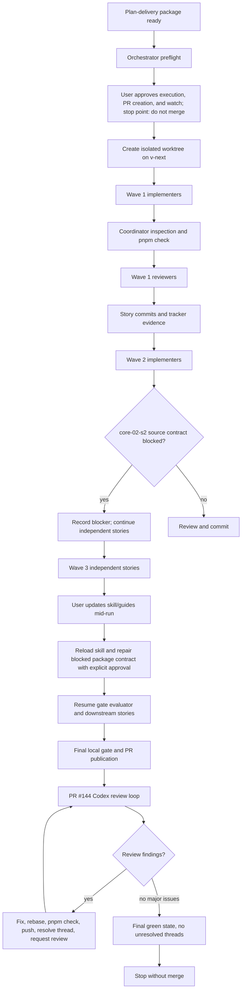
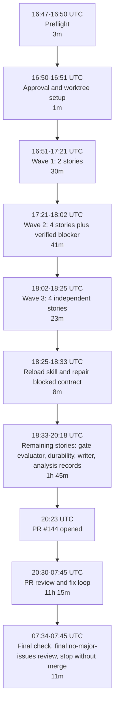

# Epic 3 Delivery Retro Report

Generated: 2026-06-24

Subject: Epic 3 core runtime spine implementation delivery in `workflow-kit`.

Primary run: orchestrator session `019ef561-420b-7391-ab8b-d87aef2ea3e9`.

Primary PR: https://github.com/aryeko/agentic-workflow-kit/pull/144.

Time basis: timeline timestamps are UTC unless stated otherwise. The original Codex desktop environment used Asia/Jerusalem local time, UTC+03:00 on these dates.

## Executive Summary

Epic 3 delivery succeeded in the operational sense: the orchestrated branch reached a green required check, all live PR review threads were resolved, Codex's final PR comment reported no major issues on head `2c0b260c68`, and the run respected the requested stop point by not merging.

The orchestration model worked best where it enforced evidence-first coordination: dependency waves, worker isolation, independent review, coordinator inspection, tracker evidence, full-gate verification, and explicit stop boundaries. The orchestrator repeatedly avoided trusting worker prose alone and instead used local gates, tracker updates, commits, rebases, live PR state, and review-thread state as the source of truth.

The delivery became expensive after PR publication. The PR review loop produced 94 review threads, including 29 P1 and 59 P2 badge-bearing first comments, plus 6 unbadged or P3/other comments. The final git range contains 76 commits, 46 of them `fix:` commits. This means story-level implementation and review got the branch to a publishable shape, but a large amount of cross-story correctness was still discovered late by PR review.

The spawned implementer/reviewer sessions were useful but incomplete. They kept pathsets mostly scoped, caught real blockers, and produced reviewed story slices. They did not reliably prove shared package exports, cross-story invariants, full-gate state, or PR-level runtime behavior. The coordinator had to integrate, normalize, patch, gate, and later respond to many external review findings.

The main recommendation is to strengthen the pre-PR integration layer: add a cross-story invariant sweep, make normalized observability story-aware, reduce watcher noise, and teach story reviewers to inspect composed package behavior rather than only their local story surface.

## Task, Motivation, and Success Criteria

The task was to perform a retrospective on the Epic 3 implementation delivery, covering both the long orchestrator session and the spawned implementer/reviewer sessions.

The motivation was not to narrate the transcript. The goal was to learn which parts of the orchestration model should be preserved, which parts became costly, which mid-run lessons should be durable, and which recommendations should inform future `workflow-kit` orchestrated-delivery operators and skill/guide maintainers.

Success criteria used for this report:

- Separate observed facts from interpretation.
- Split orchestrator-session behavior from spawned-session behavior.
- Identify recurring defect or process classes, not just one-off bugs.
- Include planning handoff, story-wave execution, spawned sessions, mid-run skill/guide learning, PR #144 publication/review, repeated review fixes, final green state, and the explicit "do not merge" stop point.
- Avoid editing repo, PR, tracker, skill, guide, or docs during the retro.
- Use temporary retro artifacts only under `/tmp/codex-epic3-retro/`.

## Scope and Handles

Primary sources inspected:

- Execution package: `/Users/aryekogan/repos/workflow-kit/.worktrees/orchestrated-epic3/docs/implementation/epics/epic-3-core-runtime-spine/execution`
- Execution plan: `/Users/aryekogan/repos/workflow-kit/.worktrees/orchestrated-epic3/docs/implementation/epics/epic-3-core-runtime-spine/execution/plan.md`
- Execution tracker: `/Users/aryekogan/repos/workflow-kit/.worktrees/orchestrated-epic3/docs/implementation/epics/epic-3-core-runtime-spine/execution/tracker.md`
- Orchestrator JSONL: `/Users/aryekogan/.codex/sessions/2026/06/23/rollout-2026-06-23T19-47-32-019ef561-420b-7391-ab8b-d87aef2ea3e9.jsonl`
- Worktree: `/Users/aryekogan/repos/workflow-kit/.worktrees/orchestrated-epic3`
- Branch: `codex/orchestrated-epic3`
- PR: `https://github.com/aryeko/agentic-workflow-kit/pull/144`
- Base branch: `origin/v-next`
- Computed git range: `b8d33470056052410bb6abbf549ce54bee9d56c6..2c0b260c68364a549d29a32af09d54b33d4ccc58`

Temporary retro artifacts:

- Normalized events: `/tmp/codex-epic3-retro/events.jsonl`
- Git log extract: `/tmp/codex-epic3-retro/git-log.txt`
- PR GraphQL extract: `/tmp/codex-epic3-retro/pr144.json`
- This report: `/tmp/codex-epic3-retro/epic3-delivery-retro-report.md`

## Method

The retro followed the repo-local `delivery-retro` skill and its analysis contract.

Steps executed:

1. Loaded the `delivery-retro` skill and analysis contract.
2. Verified live branch state in the Epic 3 worktree.
3. Computed the git range from `git merge-base origin/v-next HEAD..HEAD`.
4. Imported the orchestrator JSONL into normalized events under `/tmp/codex-epic3-retro/events.jsonl`.
5. Summarized normalized observability events.
6. Ran `analyze-delivery-run.mjs` with the execution package, session JSONL, normalized events, PR #144, worker ids, repo path, and git range.
7. Parsed the executed tracker for story status, implementer/reviewer identities, approval rounds, blockers, evidence, and story commit hashes.
8. Queried live PR state with GitHub CLI.
9. Queried PR review threads through GraphQL and reduced them into priority, path, and resolution counts.
10. Inspected orchestrator status messages for process milestones, watcher behavior, blocker handling, and final stop-state evidence.

Evidence classes used in this report:

- `observed`: directly present in a source artifact, normalized event, git output, or live PR query.
- `reconstructed`: derived by joining sources, usually tracker aliases to normalized event timestamps.
- `partial`: source exists but lacks enough structure to make the metric exact.
- `unavailable`: not exposed by inspected sources.

No token usage is estimated. Token figures are only reported where usage fields were exposed by the normalized event summary.

## Delivery Process Diagram

## Timeline

The normalized run spans `2026-06-23T16:47:37Z` to `2026-06-24T07:45:47Z`, about 14h 58m. In local Asia/Jerusalem time, that is 2026-06-23 19:47 to 2026-06-24 10:45.

The first half delivered the story graph. The second half was mostly PR review churn.

The earlier Gantt form was too dense for GitHub's Mermaid renderer at this scale, so the durable report
uses a vertical phase timeline and keeps the exact timestamps in the table below.

### Timeline Table

| Time UTC | Duration | Event | Evidence class |
|---|---:|---|---|
| 2026-06-23 16:47 | 3m | Session starts, package/preflight inspection begins. | observed |
| 2026-06-23 16:50 | 1m | User approval moves run from preflight to execution; worktree setup begins. | observed |
| 2026-06-23 16:51 | 30m | Wave 1: `core-01-s1`, `core-02-s1` implemented, reviewed, gated, committed, and tracker evidence recorded. | observed/reconstructed |
| 2026-06-23 17:21 | 41m | Wave 2: four stories implemented and approved; `core-02-s2` stopped on a verified source-contract blocker. | observed/reconstructed |
| 2026-06-23 18:02 | 23m | Wave 3: projections, cursor wait, analyzer, and CLI/MCP parity smoke delivered, with analyzer needing two review-fix rounds. | observed/reconstructed |
| 2026-06-23 18:25 | 8m | User-updated orchestration guidance is reloaded; blocked `core-02-s2` contract is repaired under explicit user direction. | observed |
| 2026-06-23 18:33 | 35m | Repaired `core-02-s2` gate evaluator implemented, reviewed, fixed, approved, committed, and tracker evidence recorded. | observed/reconstructed |
| 2026-06-23 19:09 | 9m | `core-02-s3` gate-record durability implemented and approved. | reconstructed |
| 2026-06-23 19:19 | 31m | `core-01-s4` run event log/writer implemented; reviewer requested fixes; rereview approved. | reconstructed |
| 2026-06-23 19:52 | 26m | `core-07-s3` analysis records implemented, pre-review type fixes applied, reviewer approved. | reconstructed |
| 2026-06-23 20:23 | 11h 22m to closeout | PR #144 opened. | observed |
| 2026-06-23 20:30 | 11h 15m | First Codex PR review findings appear; repeated fix/rebase/check/push/review loop begins. | observed |
| 2026-06-24 07:34 | 1m | Required `check` job succeeds on final head; `smoke` is skipped. | observed |
| 2026-06-24 07:45 | stop | Final Codex comment reports no major issues; live state has no unresolved review threads; branch remains unmerged. | observed |

## Story and Spawned-Session Outcomes

The tracker records all 14 stories as `done`. Normalized events record 30 spawned workers/reviewers and 18 review-completion events. Because normalized `worker_spawned` events did not include `storyId`, per-story timing below is reconstructed by joining stable worker ids and aliases from the tracker/transcript to event timestamps.

There is one alias consistency issue: for several later stories, the executed tracker records final aliases such as Lovelace/Turing, Shannon/Hopper, and Lamport/Dijkstra, while normalized event summaries for the same stable worker ids show aliases Harvey/Ohm, McClintock/Rawls, and Planck/Hegel. Agent ids align; aliases drifted. This is an observability defect and is why the report treats agent ids and story rows as stronger evidence than nicknames.

| Story | Wave | Reconstructed session window | Duration | Review rounds | Outcome |
|---|---:|---|---:|---:|---|
| `core-01-s1-event-contracts` | 1 | 16:51 to 17:14 | 23m | 1 | Approved; SDK root `Result` export made explicit. |
| `core-02-s1-capability-registry` | 1 | 16:51 to 17:17 | 26m | 2 | Freeze finding fixed. |
| `core-01-s2-replay-and-corruption` | 2 | 17:21 to 17:45 | 24m | 2 | Missing `RunAppendRejected.failureCode` fixed. |
| `core-01-s3-lifecycle-and-linkage` | 2 | 17:21 to 17:43 | 22m | 1 | Coordinator fixed terminal-state membership typing. |
| `core-02-s2-gate-evaluator` | 2 then repaired | 17:21 to 19:07 | 106m | 2 | Initial source-contract blocker verified; later repaired, implemented, and reviewed. |
| `core-07-s1-telemetry-and-metrics` | 2 | 17:21 to 17:53 | 32m | 2 | Freeze finding fixed. |
| `edge-01-s1-operator-command-contract` | 2 | 17:22 to 17:51 | 29m | 1 | Approved. |
| `core-01-s5-projections` | 3 | 18:02 to 18:16 | 14m | 1 | Coordinator fixed reverse scan and launch guards before review. |
| `core-01-s6-cursor-wait` | 3 | 18:02 to 18:10 | 8m | 1 | Approved. |
| `core-07-s2-analyzer` | 3 | 18:02 to 18:25 | 22m | 3 | Public import and coverage findings fixed. |
| `edge-01-s2-cli-mcp-parity-smoke` | 3 | 18:03 to 18:23 | 21m | 2 | Public testkit import fixed. |
| `core-02-s3-gate-record-durability` | 3 after repair | 19:09 to 19:18 | 9m | 1 | Approved. |
| `core-01-s4-run-event-log-and-writer` | 4 | 19:19 to 19:50 | 31m | 2 | Epoch, rejection, and lost-ack re-fencing findings fixed. |
| `core-07-s3-analysis-records-and-reports` | 4 | 19:52 to 20:18 | 26m | 1 | Pre-review type fixes; reviewer accepted async/options surface and reconstructed keying. |

Review-round distribution:

| Rounds | Story count |
|---:|---:|
| 1 | 8 |
| 2 | 5 |
| 3 | 1 |

Interpretation: the spawned review layer did meaningful work. It caught real implementation bugs before commit. But it did not catch enough cross-story runtime and package-level failures to prevent a long PR review loop.

## Orchestrator Behavior

### What Worked

Dependency gating worked. The orchestrator did not unlock downstream stories merely because an implementer finished. It waited for approval, local evidence, story commit, tracker evidence commit, and current dependency state.

Worker isolation mostly worked. Implementers were instructed not to stage, commit, push, update tracker, or touch other pathsets. The coordinator retained commit authority and tracker authority.

Coordinator inspection mattered. The orchestrator caught and repaired shared export collisions, formatting failures, public typecheck issues, readonly tuple/string typing, and dependency-rule classification problems before treating work as ready.

The `core-02-s2` blocker was handled correctly. The implementer stopped rather than inventing missing policy semantics. The orchestrator verified the blocker against the source contract, left it blocked, continued independent work, then repaired the package only after explicit user instruction and after reloading updated skill guidance.

Rebasing and gate discipline were strong. During the PR loop, the orchestrator repeatedly rebased on `origin/v-next`, ran `pnpm check`, pushed with `--force-with-lease`, resolved threads, and requested review again.

The final stop point was honored. The user approved PR creation and watching but explicitly said not to merge. The run stopped with PR #144 open, green required checks, no unresolved review threads, final no-major-issues comment, and no merge.

### What Failed or Became Expensive

Late PR review dominated the run. Story-wave execution from preflight to PR creation took roughly 3h 36m. PR review and fix cycling then ran roughly 11h 22m from PR creation to closeout. Most of the elapsed time was after publication.

Watcher behavior was noisy and unreliable. The transcript repeatedly records quiet watchers, exited watchers without terminal output, stale/no useful state, and direct live polling as the practical source of truth. This created unnecessary operator attention cost.

Agent-thread capacity management was manual. Completed or blocked workers/reviewers had to be closed to free slots. The orchestrator hit thread limits during review dispatch.

Story-level observability was insufficient. Normalized events recorded run-level turns, usage, workers, and review completions, but `worker_spawned` had `storyId: null`. The alias scanner returned no usable aliases. Per-story durations, per-story token usage, and exact worker turn counts are unavailable without transcript reconstruction.

The PR-review loop was too granular. The repeated cycle was: receive one or a few issues, patch, run gate, rebase, push, resolve, request review, wait. This was safe, but expensive. A stronger local invariant sweep would likely have batched or prevented many of these issues.

## PR Review Churn

Live and GraphQL PR evidence:

| Metric | Value | Evidence class |
|---|---:|---|
| PR number | 144 | observed |
| PR state | open | observed live |
| Base branch | `v-next` | observed live |
| Head branch | `codex/orchestrated-epic3` | observed live |
| Final head | `2c0b260c68364a549d29a32af09d54b33d4ccc58` | observed live |
| Required `check` | success at 2026-06-24T07:34:41Z | observed live |
| `smoke` | skipped at 2026-06-24T07:33:25Z | observed live |
| Review threads | 94 total | observed |
| Resolved threads | 94 | observed |
| Unresolved threads | 0 | observed |
| P1 badge threads | 29 | observed by body parse |
| P2 badge threads | 59 | observed by body parse |
| P3/unbadged/other | 6 | observed by body parse |
| `@codex review` requests | 47 | observed from PR comments |
| Codex review objects | 31 | observed from PR query |
| Final no-major-issues comment | 2026-06-24T07:45:09Z on `2c0b260c68` | observed live |

Top review hot spots by file:

| Threads | Path |
|---:|---|
| 13 | `packages/sdk/src/core/capability/evaluator/guarantee-predicates.ts` |
| 8 | `packages/sdk/src/core/capability/evaluator/attestation-consumption.ts` |
| 8 | `packages/sdk/src/core/run-lifecycle/log/append-validation.ts` |
| 6 | `packages/sdk/src/core/observability/records/terminal-invariant.ts` |
| 5 | `packages/sdk/src/core/observability/records/record-analysis-outcome.ts` |
| 4 | `packages/sdk/src/core/run-lifecycle/lifecycle/transition-validator.ts` |
| 4 | `packages/sdk/src/core/run-lifecycle/log/append-envelopes.ts` |
| 4 | `packages/sdk/src/core/run-lifecycle/lifecycle/linkage-resolver.ts` |
| 4 | `packages/sdk/src/core/run-lifecycle/log/create-run.ts` |
| 4 | `packages/sdk/src/core/run-lifecycle/log/append-writer.ts` |

The hot spots cluster around:

- Capability gate denial/fail-closed logic.
- Evidence and attestation chronology.
- Run append validation and digest/order guarantees.
- Lifecycle/linkage authority.
- Terminal analysis and idempotency invariants.
- Cursor-bounded analysis/report behavior.

These are not random implementation bugs. They are composed runtime invariants that span story boundaries.

## Results

### Delivery Result

Observed final state:

- All 14 tracker stories are `done`.
- Branch `codex/orchestrated-epic3` is at `2c0b260c68364a549d29a32af09d54b33d4ccc58`.
- Git range from `origin/v-next` merge base to head contains 76 commits.
- PR #144 is open against `v-next`.
- Required `check` succeeded on final head.
- `smoke` skipped as expected for the check workflow.
- PR review threads are all resolved.
- Final Codex comment says no major issues on `2c0b260c68`.
- The run did not merge.

### Observability Result

Observed normalized event summary:

- Events inspected: 4,473.
- Turns: 2,078 total.
- User turns: 37.
- Assistant turns: 2,041.
- Worker spawns: 30.
- Worker completions: 41.
- Review completions: 18.
- Reported cumulative usage fields: 323,352,689 input, 314,029,824 cached input, 654,400 output, 104,288 reasoning, 324,007,089 total.

Limits:

- Per-story token usage is unavailable.
- Per-story duration is reconstructed, not directly recorded.
- Worker aliases are not reliably discoverable from normalized events alone.
- The analyzer reported missing story-level `review-rounds`, `duration`, and `token-usage` fields for every story.

### Git Result

Observed git range:

`b8d33470056052410bb6abbf549ce54bee9d56c6..2c0b260c68364a549d29a32af09d54b33d4ccc58`

Commit count:

- 76 commits total.
- 46 `fix:` commits.

Interpretation: the post-publication review loop accounts for a large share of the final commit stack. This is the clearest quantitative signal that the expensive part of the delivery was not initial story execution but late defect discovery.

## Cause Analysis

### Package and Story Contract Quality

The package was good enough to execute: it had 14 ready stories, wave ordering, prompts, tracker rows, pathsets, verification guidance, and reviewer prompts. This enabled parallel delivery.

The package was not complete enough to avoid all execution-time planning repair. `core-02-s2` had a real policy-shape gap. The implementer correctly stopped instead of inventing missing semantics. This is a success for worker safety, but a readiness miss for the package.

Recommendation implication: package readiness review should include a "would an implementer need to invent a policy shape, event payload, or authority rule?" pass for safety-critical stories.

### Worker Prompt Clarity

Worker prompts were strong on scope control, path ownership, mutation limits, and evidence report shape. This helped prevent uncontrolled edits.

They were weaker on composed package invariants. Several failures were not local to one file; they emerged when capability gates, replay, lifecycle, writer durability, and analysis records interacted.

Recommendation implication: prompts should include a package-surface and composition checklist, not only local AC coverage.

### Coordinator Process

The coordinator was the strongest part of the run. It enforced dependency readiness, performed central inspection, normalized formatting/typecheck issues, controlled commits, updated tracker rows, handled rebases, and preserved the stop point.

The coordinator also absorbed too much manual supervision cost: closing workers to free slots, polling watchers, manually interpreting PR review state, and repeating many review cycles.

Recommendation implication: retain coordinator authority, but automate or structure its bookkeeping better.

### Review Depth

Story reviewers were useful. They found real issues before commit: frozen catalogs, missing failure code, public imports, coverage shortfall, provider-domain matching, replayable evidence, writer epoch order, rejection durability, lost-ack re-fencing.

Story reviewers were not enough. PR review found many P1/P2 issues in cross-story runtime invariants. This means the review model needs another layer between story review and PR publication.

Recommendation implication: add a pre-PR integration reviewer or deterministic invariant sweep.

### Verification and Gate Coverage

`pnpm check` was necessary and repeatedly protected the branch. It caught formatting, lint, dependency, typecheck, test, and coverage failures.

`pnpm check` was not sufficient to assert semantic completeness. Many PR review findings required adding new scenario tests that the original story tests did not include.

Recommendation implication: full gate stays mandatory, but safety-critical domains need scenario matrices derived from invariants, not only story ACs.

### PR Review Loop Design

The loop was safe and disciplined: fix, test, rebase, gate, push, resolve, rerequest.

The loop was inefficient: 47 review requests, 31 Codex review objects, 94 threads, and 46 fix commits. The watcher often failed to produce a clean terminal summary, forcing direct polling.

Recommendation implication: change review handling from single-thread reactive mode to batched review rounds where possible, with a quiet and authoritative watcher.

### Observability Gaps

Normalized observability is good enough for run-level metrics. It is not good enough for story-level retros.

The missing fields are exactly the fields needed for operator improvement:

- story id on spawn/completion/review events
- prompt path
- wave
- dependency state
- reviewer round number
- commit hash
- gate command and outcome
- token usage scoped to worker/story
- duration scoped to worker/story
- reason for close/block/retry

Recommendation implication: make story observability a first-class contract of orchestrated delivery.

## What Worked Well

1. Evidence-first orchestration.

The run repeatedly used external evidence over worker self-report: `pnpm check`, focused tests, tracker evidence, git commits, live PR threads, and final PR state.

2. Dependency-ready semantics.

Downstream stories were not unlocked until upstream work was implemented, reviewed, approved, checked, committed, and recorded. This avoided dependency confusion in a 14-story graph.

3. Worker/runner separation.

Workers wrote code but did not commit, push, update tracker, create PRs, or merge. The orchestrator retained runner authority.

4. Blocker honesty.

`core-02-s2` stopped on a real source-contract gap. The run did not paper over the missing semantics.

5. Mid-run adaptation.

The orchestrator reloaded updated guidance and incorporated the new readiness rule without restarting the run.

6. Final stop discipline.

The branch reached a review-clean and check-green state, then stopped without merge as requested.

## What Did Not Work Well

1. PR review found too much too late.

The PR reviewer effectively became the deepest integration reviewer. That is too late for the volume and severity of findings observed here.

2. Watch supervision was noisy.

The watcher produced many non-actionable waits and sometimes exited without useful terminal output. Direct polling became the reliable path.

3. Story observability was under-structured.

Retro analysis had to reconstruct story timelines from aliases and tracker text. The analyzer could not directly report per-story duration, review rounds, or usage.

4. Thread-cap management was manual.

The run repeatedly had to close completed or blocked workers/reviewers to free capacity.

5. Package repair blurred execution boundaries.

The repair was correct because it was explicitly requested, but the need for repair during delivery shows that package readiness did not fully prove implementability.

6. Local gates lacked invariant breadth.

The gate verified existing tests. It did not know enough about missing runtime invariant cases until PR review described them.

## Recommendations

### P0: Add Pre-PR Integration Invariant Sweep

Before PR creation, run a dedicated integration review or script-assisted checklist over composed runtime behavior.

Required checks for future Epic 3-like work:

- Capability gates fail closed on missing, stale, malformed, future, or self-report evidence.
- Attestation consumption respects provider domain, scope, chronology, and replayability.
- Run append validates creation, lifecycle, linkage, epoch, digest, retry, and terminal idempotency ordering.
- Analysis records preserve terminal invariants, cursor bounds, redaction, report refs, and idempotency.
- Public package exports and public testkit imports are verified from package entrypoints.

Expected effect: move many PR-review P1/P2 findings into local pre-publication review.

### P0: Make Observability Story-Aware

Add structured fields to orchestration events:

- `storyId`
- `wave`
- `role`
- `agentId`
- `alias`
- `promptPath`
- `round`
- `dependsOn`
- `unlockedByCommit`
- `status`
- `blockerCode`
- `storyCommit`
- `trackerCommit`
- `gateCommand`
- `gateResult`
- `tokenUsage`
- `startedAt`
- `completedAt`

Expected effect: future retros can compute story duration, review rounds, blocked time, worker cost, and throughput without transcript reconstruction.

### P1: Add a Batched PR Review Strategy

When PR review produces repeated findings in the same invariant family, stop requesting review after each tiny fix. Instead:

1. Collect all current unresolved threads.
2. Cluster by invariant class.
3. Search for sibling issues.
4. Patch the class.
5. Run focused tests plus `pnpm check`.
6. Resolve all affected threads.
7. Request one review.

Expected effect: fewer review requests and fewer single-fix commits.

### P1: Quiet and Harden Watch Mode

Watcher output should emit only:

- review requested
- changes requested
- approval/no-major-issues
- timeout
- CI failure
- unresolved-thread count changed
- direct user decision needed

It should persist enough state to explain why it exited. If it exits without a verdict, the wrapper should automatically run the authoritative poll and print the normalized result.

Expected effect: lower operator attention cost and less transcript noise.

### P1: Strengthen Package Readiness Review for Safety-Critical Stories

Add a pre-execution question for each high-risk story:

Can an implementer complete this without inventing a policy shape, event payload, authority rule, ordering rule, or acceptance predicate?

If not, the story is not ready.

Expected effect: blockers like `core-02-s2` are fixed before orchestration starts.

### P1: Upgrade Story Reviewer Prompts

Story reviewers should inspect:

- local AC compliance
- allowed pathset
- public package surface
- sibling pattern consistency
- dependent-story assumptions
- cross-story invariant candidates
- tests that could falsely pass

Expected effect: reviewers catch more defects before PR publication.

### P2: Add Worker-Pool Lifecycle Automation

The orchestrator should automatically close terminal workers/reviewers after:

- summary captured
- status recorded
- any required fix-routing decision made
- no live dependency on context remains

Expected effect: fewer thread-cap interruptions.

### P2: Preserve Stable Agent Identity

Use stable ids as primary identity and aliases only as display labels. If aliases change after compaction or reload, the tracker and event stream should still join cleanly.

Expected effect: retro and audit tools do not misattribute work.

## Candidate Durable Lessons

Promote these because they recur or represent process-level behavior:

- A dependency is not ready until implementation, review, coordinator inspection, gate evidence, story commit, tracker evidence, and current commit hash are all present.
- Worker self-report is not evidence. Treat it as a pointer to evidence.
- For long PR watch loops, the source of truth is live PR review-thread state plus checks, not watcher output alone.
- Explicit user approval is required before repairing planning/package artifacts during execution.
- PR publication is not a substitute for integration review; a pre-PR invariant sweep is needed for safety-critical runtime stories.
- Story-level observability must be structured at capture time, not reconstructed from transcript text.

Do not promote these as general lessons without more data:

- Individual implementation bugs that were isolated to one file and do not expose a broader invariant class.
- Alias names of specific workers, except as evidence of the alias/identity observability gap.
- Exact token totals as cost conclusions, because only session-level cumulative usage fields were exposed.

## Uncertainty and Limits

- The normalized analyzer did not expose story-level duration, review-round, or token fields. Per-story duration is reconstructed by alias/id joins.
- Worker aliases drift or differ between tracker and normalized event text for some later stories. Stable agent ids are stronger evidence than names.
- Git commit timestamps after rebases are not reliable for early story execution timing; normalized session event timestamps are used instead.
- PR priority counts are parsed from first review-thread bodies. Badge-bearing P1/P2 counts are reliable from the captured text, but the 6 other comments are a mix of unbadged and P3/other review comments.
- The GitHub `reviewDecision` field was not used as the final source because it was empty/unstable in queried output. Final state is based on final Codex comment, zero unresolved review threads, and green required check.
- Token usage is reported only as observed session-level usage fields. It should not be treated as per-story cost or exact billable usage.

## References

Primary local references:

- `/Users/aryekogan/repos/workflow-kit/.agents/skills/delivery-retro/SKILL.md`
- `/Users/aryekogan/repos/workflow-kit/.agents/skills/delivery-retro/references/analysis-contract.md`
- `/Users/aryekogan/repos/workflow-kit/.worktrees/orchestrated-epic3/docs/implementation/epics/epic-3-core-runtime-spine/execution/plan.md`
- `/Users/aryekogan/repos/workflow-kit/.worktrees/orchestrated-epic3/docs/implementation/epics/epic-3-core-runtime-spine/execution/tracker.md`
- `/Users/aryekogan/.codex/sessions/2026/06/23/rollout-2026-06-23T19-47-32-019ef561-420b-7391-ab8b-d87aef2ea3e9.jsonl`
- `/tmp/codex-epic3-retro/events.jsonl`
- `/tmp/codex-epic3-retro/git-log.txt`
- `/tmp/codex-epic3-retro/pr144.json`

Commands and tools used:

- `node .agents/skills/delivery-retro/scripts/import-session-observability.mjs`
- `node .agents/skills/delivery-retro/scripts/summarize-delivery-observability.mjs`
- `node .agents/skills/delivery-retro/scripts/analyze-delivery-run.mjs`
- `git merge-base origin/v-next HEAD`
- `git rev-parse HEAD`
- `git log --reverse`
- `gh pr view 144 --repo aryeko/agentic-workflow-kit`
- GitHub GraphQL review-thread query for PR #144

External/live reference:

- PR #144: https://github.com/aryeko/agentic-workflow-kit/pull/144

<!-- DOCS-NAV (generated — do not edit by hand) -->

---

**↑ Up:** [Epic 3 - Core runtime spine](./README.md) · **← Prev:** [Epic 3 - story DAG](./story-dag.md) · **Next →:** [Epic 3 Execution Package Plan](./execution/plan.md)

<!-- /DOCS-NAV -->
