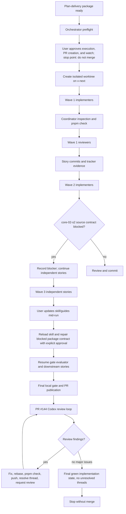
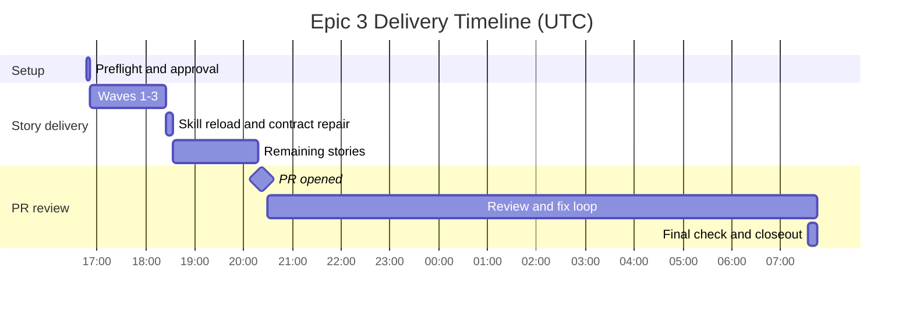

# Process and Timeline

## Delivery Process

## Timeline

The normalized run spans `2026-06-23T16:47:37Z` to `2026-06-24T07:45:47Z`, about 14h 58m. In local
Asia/Jerusalem time, that is 2026-06-23 19:47 to 2026-06-24 10:45.

The first half delivered the story graph. The second half was mostly PR review churn.

## Timeline Table

| Time UTC | Duration | Event | Evidence class |
|---|---:|---|---|
| 2026-06-23 16:47 | 3m | Session starts, package/preflight inspection begins. | observed |
| 2026-06-23 16:50 | 1m | User approval moves run from preflight to execution; worktree setup begins. | observed |
| 2026-06-23 16:51 | 30m | Wave 1: `core-01-s1`, `core-02-s1` implemented, reviewed, gated, committed, and tracker evidence recorded. | observed/reconstructed |
| 2026-06-23 17:21 | 41m | Wave 2: four stories implemented and approved; `core-02-s2` stopped on a verified source-contract blocker. | observed/reconstructed |
| 2026-06-23 18:02 | 23m | Wave 3: projections, cursor wait, analyzer, and CLI/MCP parity smoke delivered, with analyzer needing two review-fix rounds. | observed/reconstructed |
| 2026-06-23 18:25 | 8m | User-updated orchestration guidance is reloaded; blocked `core-02-s2` contract is repaired under explicit user direction. | observed |
| 2026-06-23 18:33 | 35m | Repaired `core-02-s2` gate evaluator implemented, reviewed, fixed, approved, committed, and tracker evidence recorded. | observed/reconstructed |
| 2026-06-23 19:09 | 9m | `core-02-s3` gate-record durability implemented and approved. | reconstructed |
| 2026-06-23 19:19 | 31m | `core-01-s4` run event log/writer implemented; reviewer requested fixes; rereview approved. | reconstructed |
| 2026-06-23 19:52 | 26m | `core-07-s3` analysis records implemented, pre-review type fixes applied, reviewer approved. | reconstructed |
| 2026-06-23 20:23 | 11h 22m to closeout | PR #144 opened. | observed |
| 2026-06-23 20:30 | 11h 15m | First Codex PR review findings appear; repeated fix/rebase/check/push/review loop begins. | observed |
| 2026-06-24 07:34 | 1m | Required `check` job succeeds on final implementation head; `smoke` is skipped. | observed |
| 2026-06-24 07:45 | stop | Final Codex comment reports no major issues; live state has no unresolved review threads; branch remains unmerged. | observed |

## Orchestrator Behavior

### What Worked

Dependency gating worked. The orchestrator did not unlock downstream stories merely because an
implementer finished. It waited for approval, local evidence, story commit, tracker evidence commit,
and current dependency state.

Worker isolation mostly worked. Implementers were instructed not to stage, commit, push, update
tracker, or touch other pathsets. The coordinator retained commit authority and tracker authority.

Coordinator inspection mattered. The orchestrator caught and repaired shared export collisions,
formatting failures, public typecheck issues, readonly tuple/string typing, and dependency-rule
classification problems before treating work as ready.

The `core-02-s2` blocker was handled correctly. The implementer stopped rather than inventing missing
policy semantics. The orchestrator verified the blocker against the source contract, left it blocked,
continued independent work, then repaired the package only after explicit user instruction and after
reloading updated skill guidance.

Rebasing and gate discipline were strong. During the PR loop, the orchestrator repeatedly rebased on
`origin/v-next`, ran `pnpm check`, pushed with `--force-with-lease`, resolved threads, and requested
review again.

The final stop point was honored. The user approved PR creation and watching but explicitly said not
to merge.

### What Became Expensive

Late PR review dominated the run. Story-wave execution from preflight to PR creation took roughly
3h 36m. PR review and fix cycling then ran roughly 11h 22m from PR creation to closeout.

Watcher behavior was noisy and unreliable. The transcript repeatedly records quiet watchers, exited
watchers without terminal output, stale/no useful state, and direct live polling as the practical
source of truth.

Agent-thread capacity management was manual. Completed or blocked workers/reviewers had to be closed
to free slots.

The PR-review loop was safe but granular: receive one or a few issues, patch, run gate, rebase, push,
resolve, request review, wait. A stronger local invariant sweep would likely have batched or prevented
many of these issues.

<!-- DOCS-NAV (generated — do not edit by hand) -->

---

**↑ Up:** [Epic 3 Delivery Retro](./README.md) · **← Prev:** [Epic 3 Delivery Retro](./README.md) · **Next →:** [Spawned Sessions](./02-spawned-sessions.md)

<!-- /DOCS-NAV -->
