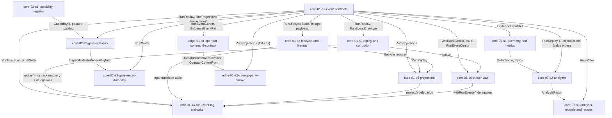

# Epic 3 Story DAG

Epic 3 turns the core runtime spine into 14 dispatch-ready story contracts across four domains. The
load-bearing decision is that `core-01`'s contract surface (`core-01-s1-event-contracts`) is the
single producer of every shared run-log shape; the other thirteen stories consume it. Because the
gate evaluator, analyzer, and operator smoke take run **value types** (`RunReplay`, `RunProjections`,
`RunEventCursor`) rather than the `RunEventLog` object, the cross-domain seam is the contracts story,
not the runtime behaviors — so `core-02`, `core-07`, and `edge-01` can be built and tested from
fixtures against `core-01-s1` without waiting on `core-01`'s replay/projection/writer behaviors. Each
edge below names the exact shared type, event, or evidence shape that creates the dependency.

## Sources

- This epic's charter: [`README.md`](./README.md).
- [`../../epic-dag.md`](../../epic-dag.md) — Epic 3 hard edges (depends on Epic 1, Epic 2; consumed by
  Epic 4, Epic 5) and the dotted mock-backed-smoke edge to Epic 7.
- Included domain charters:
  [`core-01`](../../domains/core/core-01-run-lifecycle-and-state.md),
  [`core-02`](../../domains/core/core-02-capability-and-safety.md),
  [`core-07`](../../domains/core/core-07-observability-and-analysis.md),
  [`edge-01`](../../domains/edge/edge-01-operator-surface.md).
- Normative design the included domains derive from:
  [`run-lifecycle-and-state/`](../../../design/30-domain-reference/core/run-lifecycle-and-state/README.md)
  (`contracts.md`, `event-log-writer-and-corruption.md`, `projections-lifecycle-and-tests.md`),
  [`capability-and-safety/`](../../../design/30-domain-reference/core/capability-and-safety/README.md)
  (`capability-registry.md`, `gate-evaluation-and-records.md`),
  [`observability-and-analysis/`](../../../design/30-domain-reference/core/observability-and-analysis/README.md)
  (`analysis-contract.md`),
  [`operator-surface/`](../../../design/30-domain-reference/edge/operator-surface/README.md)
  (`command-surface-and-envelopes.md`).
- Engineering policies that constrain delivery:
  [dependency-rules](../../../design/20-sdk-and-packaging/dependency-rules.md),
  [test-lanes](../../../engineering/test-lanes.md),
  [`epic0-s4-export-templates`](../epic-0-implementation-substrate-and-guardrails/stories/epic0-s4-export-templates.md)
  (`PackageExportConvention` for the public `sdk` entrypoint).
- Cross-epic frozen inputs: Epic 1 foundation ports (`fnd-02` `EventLogStore`, `LeaseStore`,
  `ArtifactStore`, `DurabilityClass`, `StorageHealth`, `LeaseCapability`; `fnd-01` resolved policy)
  and Epic 2
  [`prov-00-s1-capability-attestation/CapabilityAttestation`](../epic-2-provider-contract-layer-and-test-harness/stories/prov-00-s1-capability-attestation.md).

## Reading rules

- Node = one story contract and one reviewable implementation scope for a later delivery run.
- Edge = an intra-epic dependency because a consumer story uses a shared shape produced by another
  story. Cross-epic frozen inputs (Epic 1/2) are not edges; they are named in each story's frozen
  inputs.
- Every `Story Group Signal` the epic owns maps to exactly one story node, or to named `split` parts
  recorded in the charter coverage table.
- Consumers cite `<producer-story>/<type>` verbatim for shared shapes; they do not redeclare shape
  fields.
- **Value-type vs runtime-object seam.** `core-02`, `core-07`, and `edge-01` consume `core-01`'s
  *types* from `core-01-s1` (built from fixtures in their tests). They do **not** depend on
  `core-01`'s replay/projection/writer/wait *behaviors* (`s2`/`s4`/`s5`/`s6`), because their entry
  functions take `RunReplay` / `RunProjections` / `RunWriter` as values, not a `RunEventLog`.
- **Catalog/behavior ownership.** `core-01-s3` owns the lifecycle legal-transition table and session
  linkage rules (the invariant/catalog); `core-01-s4` cites it to enforce transitions at append and
  `core-01-s5` cites it to fold lifecycle state. Neither re-declares the table.
- **Type-only contract producers.** A contract story may declare an interface it does not fully
  implement in this epic (e.g. `core-01-s1` declares `RunEventLog` while `core-01-s4` implements it).
  The type is declared **once** by the producer; later stories/epics implement behaviors against it and
  never widen or re-declare it. (Note: `edge-01-s1` is *not* such a case — it declares only the
  self-contained envelope substrate, not `OperatorControlPort`; see scope decision 3.)
- **Production source must not import `testkit`.** Per
  [dependency-rules](../../../design/20-sdk-and-packaging/dependency-rules.md), `cli`/`mcp` production
  source imports `sdk` only. Where a story's smoke needs a testkit fake, the production module
  receives the port (control port, identity resolver, clock) by **injection** and only the story's
  **test files** import the testkit fake (test files are exempt from the production-testkit rule).

## Epic-specific scope decisions (reviewable)

These decisions shape node boundaries and must be graded in the characterization review. Each entry
records rationale, design trace, falsification, and escalation.

### Decision: contracts-as-single-producer

- Rationale: all `core-01` types and the `RunEventLog` / `RunWriter` interface declarations live in
  `core-01-s1` (the design's `contracts.md` surface). Behavior stories (`s2`/`s3`/`s4`/`s5`/`s6`)
  implement against it and never redeclare a contract type. This is the seam-density mitigation: the
  shape everyone imports is declared once, in a stable type-only story.
- Design trace: `docs/design/30-domain-reference/core/run-lifecycle-and-state/contracts.md` (the
  single host-neutral contract surface and `RunEventLog` / `RunWriter` declarations).
- Falsification: any `core-01` value type or `RunEventLog` / `RunWriter` interface declaration appears
  in a behavior story, or a consumer imports a redeclared behavior-local shape instead of the
  `core-01-s1` producer.
- Escalation: if a behavior detail seems required to declare a shared shape, stop and raise a
  story-DAG defect against this scope decision; do not split or duplicate the type surface.

### Decision: run-event-log-assembled-in-s4

- Rationale: the concrete log object exposes `createRun` / `openWriter` directly and delegates
  `replay` / `project` / `waitRunEvents` to the `s2` / `s5` / `s6` modules. `s4` therefore depends on
  `s2`, `s3`, `s5`, `s6`; it proves the write-path behaviors itself and proves delegation by a single
  equivalence AC (the read behaviors are proven in their own stories, not re-proven here).
- Design trace: `docs/design/30-domain-reference/core/run-lifecycle-and-state/contracts.md`
  (`RunEventLog` methods); `docs/design/30-domain-reference/core/run-lifecycle-and-state/event-log-writer-and-corruption.md`
  (writer, `createRun`, append, durability, and corruption behavior).
- Falsification: `core-01-s4` re-proves replay/projection/cursor semantics beyond delegation
  equivalence, or `s2`/`s5`/`s6` assemble the concrete `RunEventLog` facade instead of owning their
  behavior modules.
- Escalation: if facade assembly needs a read behavior change, raise a dependency or contract defect
  against the owning story; do not widen `core-01-s4` to re-own replay, projection, or cursor semantics.

### Decision: edge-01-command-substrate-only

- Rationale: the design's full 11-method `OperatorControlPort` and several of its param/view types
  reference types owned by later epics (approval params -> `core-03`/Epic 4; recovery params ->
  `core-06`/Epic 5; the operator audit payload references `PolicyGrantScope` from `core-03`). Epic 3
  runs before those epics, so it cannot declare the full port type-only without depending on types that
  do not yet exist. Therefore `edge-01-s1` declares only what is self-contained and is exactly what the
  single owned signal ("CLI and MCP command parity over the shared operator command envelope") needs:
  the `OperatorCommandEnvelope` substrate (`OperatorActionKind`, actor/target/error/event-ref types),
  the `preview-run`/`start-run`/`inspect-run` param + view types, the `OperatorActionRecorded` payload,
  and the `OperatorCommandResult` shape, each restricted to fields whose types resolve from `core-01`
  or `edge-01` itself.
- Design trace: `docs/design/30-domain-reference/edge/operator-surface/command-surface-and-envelopes.md`
  (full `OperatorControlPort`, command-envelope substrate, preview/start/inspect actions, and
  later-epic param/view surface).
- Falsification: Epic 3 declares the named `OperatorControlPort`, forwards references to a later-epic
  type, or adds any action/param/view beyond the self-contained preview/start/inspect subset.
- Escalation: if the audit payload or result genuinely cannot be declared without a later-epic type,
  stop and raise a design-sequencing gap; do not invent a placeholder type or widen Epic 3's scope.

## Story nodes

| story id | one-line job | domain(s) | claimed signals covered | owned pathset | suggested tier |
|---|---|---|---|---|---|
| `core-01-s1-event-contracts` | Declare the host-neutral run-log contract surface: every type plus the `RunEventLog`/`RunWriter` interfaces, as the single shared producer. | `core-01` | Run event envelope and append receipt vocabulary (+ catalog owner of cursor, projection, payload, lifecycle-state, and failure-token types). | `packages/sdk/src/core/run-lifecycle/contracts/**`, `packages/sdk/tests/core/run-lifecycle/contracts/**` | elevated |
| `core-01-s2-replay-and-corruption` | Implement `replay()`: assemble `RunReplay` from `fnd-02` `EventLogStore.replay`, validate envelopes, and classify tail/interior/unavailable health. | `core-01` | Replay health, tail/interior corruption classes, and partial-write handling (replay side). | `packages/sdk/src/core/run-lifecycle/replay/**`, `packages/sdk/tests/core/run-lifecycle/replay/**` | standard |
| `core-01-s3-lifecycle-and-linkage` | Own the legal lifecycle transition table + terminal guardrails and the append-only session linkage rules as a pure validate/fold module. | `core-01` | Lifecycle transition records and terminal-state guardrails; session link and supersession records. | `packages/sdk/src/core/run-lifecycle/lifecycle/**`, `packages/sdk/tests/core/run-lifecycle/lifecycle/**` | standard |
| `core-01-s4-run-event-log-and-writer` | Implement the concrete `RunEventLog` + `RunWriter`: leased writer, epoch fencing, monotonic sequence, atomic-batch durability, transition enforcement, lost-ack recovery; delegate read methods. | `core-01` | Single leased writer, writer epoch fencing, monotonic sequence, and stale-writer rejection. | `packages/sdk/src/core/run-lifecycle/log/**`, `packages/sdk/tests/core/run-lifecycle/log/**` | elevated |
| `core-01-s5-projections` | Implement `project()`: the pure `state`/`summary`/`metrics`/`launch` projections with reducer totality and deterministic rebuild. | `core-01` | Pure `state`, `summary`, `metrics`, and `launch` projections. | `packages/sdk/src/core/run-lifecycle/projections/**`, `packages/sdk/tests/core/run-lifecycle/projections/**` | standard |
| `core-01-s6-cursor-wait` | Implement `waitRunEvents()`: the bounded poll-over-replay cursor primitive with no lease/projection/mutation side effects. | `core-01` | Low-level cursor wait primitive as the substrate later wrapped by supervision. | `packages/sdk/src/core/run-lifecycle/cursor-wait/**`, `packages/sdk/tests/core/run-lifecycle/cursor-wait/**` | standard |
| `core-02-s1-capability-registry` | Declare the capability registry: `CapabilityId`, `CapabilityMode`, the v1 posture/guarantee-requirement catalog, and explicit deferral. | `core-02` | Capability registry and v1 capability posture; mode handling for `manual` and `assisted` with deferred capabilities represented explicitly. | `packages/sdk/src/core/capability/registry/**`, `packages/sdk/tests/core/capability/registry/**` | elevated |
| `core-02-s2-gate-evaluator` | Implement `evaluateCapabilityGate(request, replay, projections)`: guarantee predicates, attestation consumption, and the `CapabilityGateRecordPayload` + denial-reason catalog. | `core-02` | Guarantee predicates over committed evidence and attestations; freshness/expiry/scope/negative/contradictory/absent attestation handling; `CapabilityGateRecord` payloads and denial reasons (payload + denial part). | `packages/sdk/src/core/capability/evaluator/**`, `packages/sdk/tests/core/capability/evaluator/**` | elevated |
| `core-02-s3-gate-record-durability` | Append the `CapabilityGateRecord` event at `barrier` via `RunWriter` and fail closed when the record is unwritable. | `core-02` | `CapabilityGateRecord` barrier durability; fail-closed for unwritable gate records (durability/unwritable part). | `packages/sdk/src/core/capability/record/**`, `packages/sdk/tests/core/capability/record/**` | standard |
| `core-07-s1-telemetry-and-metrics` | Declare the telemetry topic taxonomy over committed run events and the honest `MetricValue<T>` wrapper. | `core-07` | Telemetry topic taxonomy over committed run events; honest metric value wrapper (available/partial/unavailable). | `packages/sdk/src/core/observability/telemetry/**`, `packages/sdk/tests/core/observability/telemetry/**` | standard |
| `core-07-s2-analyzer` | Implement the pure analyzer: `classifyTrigger` auto-fire triggers and `analyze(request, snapshot)` over a deterministic snapshot. | `core-07` | Pure analyzer snapshot/rule-set-digest/version/`analyzedAt` inputs; auto-fire triggers for terminal/blocked/supervision-lost/recovery-decision/stale-progress evidence; failure signals for degraded input and rule errors (analyzer part). | `packages/sdk/src/core/observability/analyzer/**`, `packages/sdk/tests/core/observability/analyzer/**` | elevated |
| `core-07-s3-analysis-records-and-reports` | Implement `recordAnalysisOutcome`: `AnalysisRecorded`/`AnalysisFailed` events, redacted write-once report refs, and the terminal-analysis invariant. | `core-07` | `AnalysisRecorded`/`AnalysisFailed` payloads and terminal-analysis invariant; redacted write-once analysis report artifact refs; failure signals for artifact/redaction/unwritable/missing-invariant (records part). | `packages/sdk/src/core/observability/records/**`, `packages/sdk/tests/core/observability/records/**` | elevated |
| `edge-01-s1-operator-command-contract` | Declare the shared operator command-envelope substrate (type-only) in the SDK: `OperatorCommandEnvelope`, `OperatorActionKind`, actor/target/error/event-ref types, the preview/start/inspect param + view types, the `OperatorActionRecorded` payload, and the `OperatorCommandResult` shape (fields resolving from `core-01`/`edge-01` only). Does NOT declare `OperatorControlPort` (Epic 7). | `edge-01` | CLI and MCP command parity over the shared operator command envelope (envelope-substrate part). | `packages/sdk/src/edge/operator-command/**`, `packages/sdk/tests/edge/operator-command/**` | elevated |
| `edge-01-s2-cli-mcp-parity-smoke` | Prove the mock-backed executable smoke: CLI and MCP build byte-identical envelopes for preview/start/inspect, each driving one injected structural fake control surface and one audit event. CLI/MCP production builders import `sdk` only and take the fake control surface/identity/clock by injection; only the test files import the testkit fake. | `edge-01` | CLI and MCP command parity over the shared operator command envelope (executable smoke part). | `packages/testkit/src/operator/**`, `packages/testkit/src/fixtures/operator/**`, `packages/cli/src/operator-smoke/**`, `packages/cli/tests/operator/**`, `packages/mcp/src/operator-smoke/**`, `packages/mcp/tests/operator/**` | standard |

## Dependency table

| story | depends on | shared contract creating the edge |
|---|---|---|
| `core-01-s1-event-contracts` | none (Epic 1 `fnd-02` types are frozen inputs) | Producer of all `core-01` types + `RunEventLog`/`RunWriter` interfaces. |
| `core-01-s2-replay-and-corruption` | `core-01-s1-event-contracts` | Consumes `core-01-s1/RunReplay`, `RunEventEnvelope`, `RunReplayFailure`, `RunLogHealthRecord`, `RunDegradedHealth`; produces the `replay()` behavior. |
| `core-01-s3-lifecycle-and-linkage` | `core-01-s1-event-contracts` | Consumes `core-01-s1/RunLifecycleState`, `RunLifecycleTransitionPayload`, `SessionLinkedPayload`, `SessionLinkSupersededPayload`; produces the legal-transition table + linkage rules. |
| `core-01-s4-run-event-log-and-writer` | `core-01-s1-event-contracts`, `core-01-s2-replay-and-corruption`, `core-01-s3-lifecycle-and-linkage`, `core-01-s5-projections`, `core-01-s6-cursor-wait` | Implements `core-01-s1/RunEventLog`+`RunWriter`; uses `s2` replay for lost-ack recovery, `s3` table for transition enforcement, and delegates `project`/`waitRunEvents` to `s5`/`s6`. |
| `core-01-s5-projections` | `core-01-s1-event-contracts`, `core-01-s2-replay-and-corruption`, `core-01-s3-lifecycle-and-linkage` | Consumes `core-01-s1/RunProjections`(+4 projection types); folds over `s2` `RunReplay` using the `s3` lifecycle reducer. |
| `core-01-s6-cursor-wait` | `core-01-s1-event-contracts`, `core-01-s2-replay-and-corruption` | Consumes `core-01-s1/WaitRunEventsRequest`+`WaitRunEventsResult`+`RunEventCursor`; polls over `s2` replay. |
| `core-02-s1-capability-registry` | none (Epic 2 `CapabilityAttestation` is a frozen input) | Producer of `CapabilityId`, `CapabilityMode`, posture/guarantee-requirement catalog. |
| `core-02-s2-gate-evaluator` | `core-02-s1-capability-registry`, `core-01-s1-event-contracts` | Consumes `core-02-s1` registry + `core-01-s1/RunReplay`,`RunProjections`,`RunEventEnvelope`,`RunDegradedHealth`,`EvidenceEventRef` (value types) + Epic 2 `CapabilityAttestation`; produces `CapabilityGateRecordPayload` + evaluator + denial catalog. |
| `core-02-s3-gate-record-durability` | `core-02-s2-gate-evaluator`, `core-01-s1-event-contracts` | Consumes `core-02-s2/CapabilityGateRecordPayload` + `core-01-s1/RunWriter`,`RunEventEnvelope`; appends the gate record at `barrier`. |
| `core-07-s1-telemetry-and-metrics` | `core-01-s1-event-contracts` | Consumes `core-01-s1/EvidenceEventRef` (in `MetricValue`) and names committed event types; produces topic taxonomy + `MetricValue<T>`. |
| `core-07-s2-analyzer` | `core-07-s1-telemetry-and-metrics`, `core-01-s1-event-contracts` | Consumes `core-07-s1/MetricValue` + topics and `core-01-s1/RunReplay`,`RunProjections`,`RunEventEnvelope`,`RunEventCursor`,`RunDegradedHealth`,`EvidenceEventRef` (value types); produces `analyze`+`classifyTrigger`+`AnalysisRequest`/`AnalysisSnapshot`/`AnalysisResult`. |
| `core-07-s3-analysis-records-and-reports` | `core-07-s2-analyzer`, `core-01-s1-event-contracts` | Consumes `core-07-s2/AnalysisResult`(+`AnalysisFailure`) + `core-01-s1/RunWriter` + Epic 1 `fnd-02 ArtifactStore`; produces `AnalysisRecorded`/`AnalysisFailed` + `recordAnalysisOutcome` + redacted report refs. |
| `edge-01-s1-operator-command-contract` | `core-01-s1-event-contracts` | Consumes `core-01-s1/RunEventCursor`+`EvidenceEventRef` (in `OperatorCommandResult`); produces the operator command-envelope substrate (type-only): envelope, `OperatorActionKind`, actor/target/error/event-ref types, preview/start/inspect param+view types, `OperatorActionRecorded`, `OperatorCommandResult` shape. |
| `edge-01-s2-cli-mcp-parity-smoke` | `edge-01-s1-operator-command-contract`, `core-01-s1-event-contracts` | Consumes `edge-01-s1/OperatorCommandEnvelope`,`OperatorCommandResult`, preview/start/inspect params/views + `core-01-s1/RunProjections`,`RunEventCursor` (fixture value types); produces the testkit structural fake control surface + the injection-based CLI/MCP smoke builders + parity tests. |

## Shared shapes — one producer per shape

| shared shape | producer | public import path | consumers |
|---|---|---|---|
| `RunEventEnvelope`, `EvidenceEventRef`, `Result`, `RunDurabilityClass`, `RunLifecycleState`, `RunDegradedHealth`, `AppendIntent`, `RunAppendReceipt`, `CreateRunInput`, `RunReplay`, `RunEventCursor`, `WaitRunEventsRequest`/`Result`, `RunProjections` (+ 4 projection types), `RunAppendFailure`(`Code`), `RunReplayFailure`, all `*Payload` types, `RunLogHealthRecord`/`RunLogCorruptionRecord`, `RunEventLog`, `RunWriter` | `core-01-s1-event-contracts` | `sdk` entrypoint | `core-01-s2`..`s6`, `core-02-s2`/`s3`, `core-07-s1`/`s2`/`s3`, `edge-01-s1`/`s2` |
| Lifecycle legal-transition table + lifecycle reducer + session linkage rules | `core-01-s3-lifecycle-and-linkage` | `sdk` entrypoint | `core-01-s4` (enforce), `core-01-s5` (fold) |
| `replay()` + `RunReplay` assembly | `core-01-s2-replay-and-corruption` | `sdk` entrypoint | `core-01-s4`, `core-01-s5`, `core-01-s6` |
| `CapabilityId`, `CapabilityMode`, posture/guarantee-requirement catalog | `core-02-s1-capability-registry` | `sdk` entrypoint | `core-02-s2` |
| `CapabilityGateRecordPayload`, `GuaranteeEvaluation`, `AttestationRef`, `CapabilityGateScope`, `GateDecision`, `CapabilityGateFailureReason`, `evaluateCapabilityGate` | `core-02-s2-gate-evaluator` | `sdk` entrypoint | `core-02-s3`, (Epic 4/5 downstream) |
| `MetricValue<T>` + telemetry topic taxonomy | `core-07-s1-telemetry-and-metrics` | `sdk` entrypoint | `core-07-s2`, `core-07-s3` |
| `AnalysisRequest`, `AnalysisSnapshot`, `AnalysisResult`, `AnalysisFailure`, `AnalysisTrigger`, `classifyTrigger`, `analyze` | `core-07-s2-analyzer` | `sdk` entrypoint | `core-07-s3` |
| `OperatorCommandEnvelope`, `OperatorActionKind`, actor/target/error/event-ref types, preview/start/inspect param + view types, `OperatorActionRecorded` payload, `OperatorCommandResult` shape (`core-01`/`edge-01`-resolving fields only) | `edge-01-s1-operator-command-contract` | `sdk` entrypoint | `edge-01-s2` (Epic 3); Epic 7 operator-production stories |

## Story graph

## Topological bands

| band | stories | delivery note |
|---|---|---|
| 1 | `core-01-s1-event-contracts`, `core-02-s1-capability-registry` | Root catalogs. `core-01-s1` is the shared run-log producer everyone cites; `core-02-s1` depends only on the frozen Epic 2 attestation. Independent within the band. |
| 2 | `core-01-s2-replay-and-corruption`, `core-01-s3-lifecycle-and-linkage`, `core-02-s2-gate-evaluator`, `core-07-s1-telemetry-and-metrics`, `edge-01-s1-operator-command-contract` | First consumers of the contract surface. `core-02-s2` proceeds here against `core-01-s1` value types without waiting on `core-01` runtime behaviors. Independent within the band. |
| 3 | `core-01-s5-projections`, `core-01-s6-cursor-wait`, `core-02-s3-gate-record-durability`, `core-07-s2-analyzer`, `edge-01-s2-cli-mcp-parity-smoke` | Read-path behaviors and second-layer consumers. Independent within the band. |
| 4 | `core-01-s4-run-event-log-and-writer`, `core-07-s3-analysis-records-and-reports` | Integration layer: the assembled `RunEventLog` (composing `s2`/`s5`/`s6`) and the analysis-record writer (consuming the analyzer result). Independent within the band. |

<!-- DOCS-NAV (generated — do not edit by hand) -->

---

**↑ Up:** [Epic 3 - Core runtime spine](./README.md) · **← Prev:** [Epic 3 - Core runtime spine](./README.md) · **Next →:** [Epic 3 - stories](./stories/README.md)

<!-- /DOCS-NAV -->
