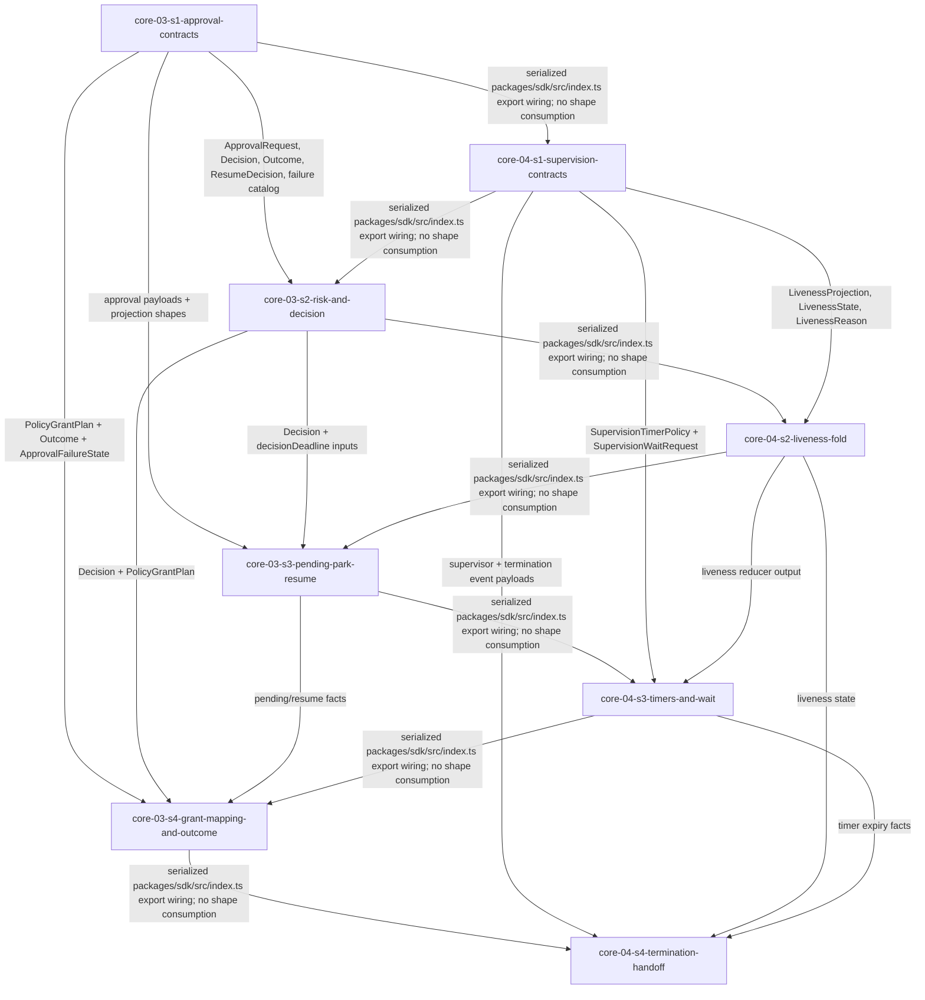

# Epic 4 Story DAG

Epic 4 turns the human-control and liveness loop into eight dispatch-ready story contracts across
`core-03` Approval & Escalation and `core-04` Supervision & Liveness. The load-bearing seam decision is
to hoist shared value types, event payloads, projection shapes, and failure catalogs into type-only
contract stories, then have behavior stories consume those producer shapes. Runtime-object edges remain
only where a behavior calls an upstream object such as `RunWriter`, `RunEventLog.waitRunEvents`,
`AgentProvider`, or `ExecutionHostProvider`.

## Sources

- This epic charter: [`README.md`](./README.md).
- [`../../epic-dag.md`](../../epic-dag.md) - Epic 4 depends on Epic 2 and Epic 3; Epic 5 consumes Epic
  4 approval, liveness, and termination facts.
- Included domain charters:
  [`core-03`](../../domains/core/core-03-approval-and-escalation.md) and
  [`core-04`](../../domains/core/core-04-supervision-and-liveness.md).
- Normative design:
  [`approval-and-escalation/`](../../../design/30-domain-reference/core/approval-and-escalation/README.md)
  (`decision-model.md`, `park-resume-and-failures.md`, `interfaces-events-and-tests.md`) and
  [`supervision-and-liveness/`](../../../design/30-domain-reference/core/supervision-and-liveness/README.md)
  (`liveness-model.md`).
- Cross-epic frozen inputs: Epic 1 `ResolvedPolicy`, `ApprovalPolicy`, `EscalationPolicy`, and
  provenance; Epic 2 `AgentProvider`, `ExecutionHostProvider`, `ScopedGrant`,
  `CapabilityAttestation`, and testkit mocks; Epic 3 `RunEventEnvelope`, `RunWriter`, `RunReplay`,
  `RunProjections`, `RunEventCursor`, `waitRunEvents`, session linkage, `evaluateCapabilityGate`, and
  committed `CapabilityGateRecord` behavior.
- Engineering policies:
  [dependency policy](../../../engineering/dependency-policy.md),
  [test lanes](../../../engineering/test-lanes.md), and [check gate](../../../engineering/check-gate.md).

## Reading rules

- Node = one story contract and one reviewable implementation scope for a later delivery run.
- Edge = an intra-epic dependency because a consumer story uses a shared shape or behavior produced by
  another story, or because two otherwise independent stories must serialize a shared public-entrypoint
  write. Cross-epic frozen inputs are named in story contracts, not shown as intra-epic edges.
- Every `Story Group Signal` Epic 4 owns maps to exactly one story node, or to named `split` parts in
  this DAG and the charter ownership table.
- Consumers cite `<producer-story>/<type>` verbatim for shared shapes; they do not redeclare shape
  fields.
- Core stories use the `sdk` package only. Concrete Codex/Local providers, process kill mechanics,
  network, CLI/MCP entry surfaces, execution packages, and completion/recovery decisions are out of
  scope.

## Epic-specific scope decisions

### Decision: approval-contracts-single-producer

- Rationale: `ApprovalRequest`, `Decision`, `Outcome`, `ResumeDecision`, approval event payloads,
  `ApprovalProjection`, and `ApprovalFailureState` are value types consumed by multiple approval
  behavior stories and later epics. They live in `core-03-s1-approval-contracts`; behavior stories
  import those shapes.
- Design trace: `decision-model.md` defines the neutral shapes and grant taxonomy;
  `interfaces-events-and-tests.md` defines the interfaces, event payloads, and projection shapes.
- Falsification: any approval behavior story redeclares an approval value type, payload, projection, or
  failure token instead of importing the `core-03-s1` producer.
- Escalation: if a behavior cannot be expressed against the producer shapes, raise a story-DAG defect;
  do not duplicate the type surface.

### Decision: approval-failure-catalog-vs-raising-behavior

- Rationale: one failure-state union spans the domain, but separate behaviors raise separate tokens.
  `core-03-s1` owns the catalog; `core-03-s2` raises policy/risk/gate decision tokens,
  `core-03-s3` raises pending/park/resume/log/session tokens, and `core-03-s4` raises grant-mapping,
  relay/channel, and outcome tokens.
- Design trace: `park-resume-and-failures.md` lists `ApprovalFailureState` and maps each token to a
  fail-closed behavior.
- Falsification: a failure token has no behavior story proving its trigger, or a behavior emits an
  uncatalogued token.
- Escalation: if the design lacks a token for a behavior, stop and file a design gap rather than
  inventing one.

### Decision: durable-gate-record-before-assisted-grant

- Rationale: `evaluateCapabilityGate` produces a pure payload, but assisted grant behavior is allowed
  only after Epic 3 records a committed `CapabilityGateRecord` at `barrier`. Epic 4 stories therefore
  branch on the committed gate event/projection, not on an uncommitted evaluator return.
- Design trace: approval design requires `escalation-auto-grant` allow after core-02 records a gate;
  Epic 3 splits evaluator payload from gate-record durability.
- Falsification: assisted auto-grant proceeds from a pure evaluator result, from an explicit Epic 3
  `core-02-s3` `gate-record-unwritable` result, or with no committed gate event id.
- Escalation: if a caller needs speculative gate decisions, route that to a later design; Epic 4 records
  replayable facts only.

### Decision: supervision-contracts-single-producer

- Rationale: `LivenessState`, `LivenessReason`, `LivenessProjection`, `SupervisionTimerPolicy`,
  `SupervisionWaitRequest`, supervision event payloads, timer names, advance classes, and termination
  fact shapes are value types consumed by the fold, timer/wait, termination, Epic 5, and Epic 7. They
  live in `core-04-s1-supervision-contracts`.
- Design trace: `supervision-and-liveness/README.md` defines inputs, wait behavior, event payloads, and
  emitted facts; `liveness-model.md` defines liveness state, reasons, and projection.
- Falsification: a supervision behavior story redeclares these shapes or imports private behavior-local
  versions.
- Escalation: if a later Epic 5 recovery shape seems required, defer it by name and keep Epic 4 facts
  self-contained.

### Decision: sdk-entrypoint-export-serialization

- Rationale: every Epic 4 story exposes public SDK shapes or functions and carries a public-import test.
  The only current package public entrypoint file is `packages/sdk/src/index.ts`, so every story pathset
  that proves public exposure includes that shared file. The stories are sequenced in a single
  public-entrypoint wiring order (`core-03-s1` -> `core-04-s1` -> `core-03-s2` -> `core-04-s2` ->
  `core-03-s3` -> `core-04-s3` -> `core-03-s4` -> `core-04-s4`) so each implementer edits the
  committed barrel state instead of racing another writer. Cross-domain serialization edges do not imply
  shape consumption unless the dependency table says so.
- Design trace: Epic 0 export convention requires exported SDK shapes to be importable through the
  `sdk` public entrypoint, and the authoring standard permits shared-file pathset overlap when the
  package records the overlap accurately.
- Falsification: a story requires a public-import AC while excluding `packages/sdk/src/index.ts` from its
  owned pathset, or delivery runs two public-entrypoint writers concurrently against the shared file.
- Escalation: if the SDK gains per-domain public barrels that remove the shared-file collision, return to
  the DAG and remove this serialization edge instead of keeping artificial ordering.

### Decision: wait-wrapper-does-not-prove-liveness

- Rationale: `waitRunEvents` is a wrapper over the Epic 3 cursor primitive; it validates the cursor and
  delegates reads. The design explicitly says waits, timeouts, projection reads, reconnects, and parent
  polls never refresh liveness. The wait wrapper is therefore separate from the liveness fold.
- Design trace: `supervision-and-liveness/README.md` says the wrapper never appends, reads projections,
  refreshes liveness, or treats wait success as proof; `liveness-model.md` lists waits among
  non-refreshers.
- Falsification: wait success, timeout, projection read, parent poll, or reconnect changes
  `LivenessProjection.lastWorkerEventSequence`, `lastProgressSequence`, or state to `active`.
- Escalation: if operator wait needs side effects, route it to Epic 7 operator surface rather than
  widening core-04.

### Decision: termination-handoff-not-host-kill

- Rationale: Epic 4 asks `ExecutionHostProvider.terminateWorker` and records proof facts; it never
  signals, kills, reaps, proves empty containment, or imports Local provider behavior.
- Design trace: `supervision-and-liveness/README.md` and `liveness-model.md` state termination is a
  handoff to Execution Host; concrete kill mechanics are out of scope.
- Falsification: SDK core imports process APIs, Local provider code, or implements containment proof
  directly.
- Escalation: host behavior gaps belong to Epic 6 `prov-04`; completion/recovery decisions over the
  facts belong to Epic 5.

## Story nodes

| story id | one-line job | domain(s) | claimed signals covered | owned pathset | suggested tier |
|---|---|---|---|---|---|
| `core-03-s1-approval-contracts` | Declare the approval value types, event payloads, projection shapes, interfaces, and failure-state catalog as the single approval contract producer. | `core-03` | Neutral `ApprovalRequest`, decision, outcome, and scoped-grant records (contract part); `split`: fail-closed catalog. | `packages/sdk/src/core/approval/contracts/**`, `packages/sdk/src/index.ts`, `packages/sdk/tests/core/approval/contracts/**` | elevated |
| `core-03-s2-risk-and-decision` | Implement normalization, deterministic risk classification, v1 mode ladder, committed gate consumption, and pure decision output. | `core-03` | Deterministic low, medium, and high risk classification signals; V1 mode ladder: policy allowlist to human, with high risk always requiring a human; `split`: policy/risk/gate fail-closed behavior. | `packages/sdk/src/core/approval/decision/**`, `packages/sdk/src/index.ts`, `packages/sdk/tests/core/approval/decision/**` | elevated |
| `core-03-s3-pending-park-resume` | Persist pending approval before decision, compute live/final deadlines, park/resume/expire requests, and fold approval projections. | `core-03` | Pending approval persistence before decision; Parked approval, resumed approval, and expired approval facts; `split`: pending/session/expiry/event-log fail-closed behavior. | `packages/sdk/src/core/approval/pending/**`, `packages/sdk/src/core/approval/projections/**`, `packages/sdk/src/index.ts`, `packages/sdk/tests/core/approval/pending/**`, `packages/sdk/tests/core/approval/projections/**` | elevated |
| `core-03-s4-grant-mapping-and-outcome` | Map policy grants to Agent `ScopedGrant`, answer or deny through Agent approval relay, and record outcome audit facts. | `core-03` | Mapping from policy-level grants to Agent-provider scoped grants; `split`: relay/channel/mapping/outcome fail-closed behavior; neutral records behavior part. | `packages/sdk/src/core/approval/grants/**`, `packages/sdk/src/core/approval/outcomes/**`, `packages/sdk/src/index.ts`, `packages/sdk/tests/core/approval/grants/**`, `packages/sdk/tests/core/approval/outcomes/**` | elevated |
| `core-04-s1-supervision-contracts` | Declare liveness/supervision value types, timer and wait inputs, event payloads, projection shapes, and failure-reason catalog. | `core-04` | Supervisor start, liveness advanced, timer expired, supervision lost, termination requested, worker terminated, and supervisor stopped facts (contract part); `split`: fail-closed reason catalog. | `packages/sdk/src/core/supervision/contracts/**`, `packages/sdk/src/index.ts`, `packages/sdk/tests/core/supervision/contracts/**` | elevated |
| `core-04-s2-liveness-fold` | Implement the pure liveness fold over committed event values plus sampled clock, including advancing and never-refresh event classes. | `core-04` | Liveness state fold over committed events and explicit clock input; Current-session event classes that advance liveness; Event classes that explicitly never refresh liveness. | `packages/sdk/src/core/supervision/liveness/**`, `packages/sdk/src/index.ts`, `packages/sdk/tests/core/supervision/liveness/**` | elevated |
| `core-04-s3-timers-and-wait` | Evaluate startup/idle/no-progress/per-tool/approval-SLA/max-runtime timers and wrap the Epic 3 cursor wait primitive without liveness side effects. | `core-04` | Startup, idle, no-progress, per-tool, approval-SLA, and max-runtime timer signals; `waitRunEvents` wrapper behavior and cursor validation. | `packages/sdk/src/core/supervision/timers/**`, `packages/sdk/src/core/supervision/wait/**`, `packages/sdk/src/index.ts`, `packages/sdk/tests/core/supervision/timers/**`, `packages/sdk/tests/core/supervision/wait/**` | elevated |
| `core-04-s4-termination-handoff` | Record supervisor lifecycle, supervision-lost, termination-requested, worker-terminated, and supervisor-stopped facts through `RunWriter` and Execution Host handoff. | `core-04` | Supervisor start, liveness advanced, timer expired, supervision lost, termination requested, worker terminated, and supervisor stopped facts (behavior part); `split`: cursor/linkage/progress/stale/termination fail-closed behavior. | `packages/sdk/src/core/supervision/termination/**`, `packages/sdk/src/index.ts`, `packages/sdk/tests/core/supervision/termination/**` | elevated |

## Dependency table

| story | depends on | shared contract creating the edge |
|---|---|---|
| `core-03-s1-approval-contracts` | none | Producer of `ApprovalRequest`, `ApprovalMode`, `ApprovalRisk`, `ApprovalState`, `ApprovalSubject`, `PolicyGrantScope`, `PolicyGrantPlan`, `Decision`, `Outcome`, `ResumeDecision`, `ApprovalFailureState`, approval event payloads, `ApprovalProjection`, and approval interfaces; first owner of shared `packages/sdk/src/index.ts` export wiring. |
| `core-03-s2-risk-and-decision` | `core-03-s1-approval-contracts`, `core-04-s1-supervision-contracts` | Consumes approval value types, `ApprovalDecisionInput`, `Decision`, `ApprovalFailureState`, and policy grant taxonomy from `core-03-s1`; depends on `core-04-s1` only for serialized shared `packages/sdk/src/index.ts` export wiring; produces normalization, risk classifier, and decision behavior. |
| `core-03-s3-pending-park-resume` | `core-03-s1-approval-contracts`, `core-03-s2-risk-and-decision`, `core-04-s2-liveness-fold` | Consumes approval event/projection shapes, `Decision`, `ResumeDecision`, and deadlines from approval producers; depends on `core-04-s2` only for serialized shared `packages/sdk/src/index.ts` export wiring; produces pending persistence, park/resume/expiry behavior, and projection folds. |
| `core-03-s4-grant-mapping-and-outcome` | `core-03-s1-approval-contracts`, `core-03-s2-risk-and-decision`, `core-03-s3-pending-park-resume`, `core-04-s3-timers-and-wait` | Consumes `PolicyGrantPlan`, `Decision`, pending/resume facts, `Outcome`, and Agent `ScopedGrant`; depends on `core-04-s3` only for serialized shared `packages/sdk/src/index.ts` export wiring; produces grant mapping and outcome recording behavior. |
| `core-04-s1-supervision-contracts` | `core-03-s1-approval-contracts` | Producer of `SupervisionInputs`, `Clock`, `SupervisionTimerPolicy`, `SupervisionWaitRequest`, `SupervisionTimerName`, `LivenessAdvanceClass`, `LivenessState`, `LivenessReason`, `LivenessProjection`, supervision event payloads, and termination fact shapes; depends on `core-03-s1` only for serialized shared `packages/sdk/src/index.ts` export wiring and consumes no approval shapes. |
| `core-04-s2-liveness-fold` | `core-04-s1-supervision-contracts`, `core-03-s2-risk-and-decision` | Consumes liveness value types, timer names, advance classes, and event payload shapes from `core-04-s1`; depends on `core-03-s2` only for serialized shared `packages/sdk/src/index.ts` export wiring; produces the pure liveness reducer and non-refresh catalog. |
| `core-04-s3-timers-and-wait` | `core-04-s1-supervision-contracts`, `core-04-s2-liveness-fold`, `core-03-s3-pending-park-resume` | Consumes timer policy, `LivenessProjection`, `SupervisionWaitRequest`, and Epic 3 `RunEventCursor`; depends on `core-03-s3` only for serialized shared `packages/sdk/src/index.ts` export wiring; produces timer evaluation and `waitRunEvents` wrapper behavior. |
| `core-04-s4-termination-handoff` | `core-04-s1-supervision-contracts`, `core-04-s2-liveness-fold`, `core-04-s3-timers-and-wait`, `core-03-s4-grant-mapping-and-outcome` | Consumes liveness/timer facts, supervisor event payloads, and Execution Host termination DTOs; depends on `core-03-s4` only for serialized shared `packages/sdk/src/index.ts` export wiring; produces supervision-lost and termination handoff behavior. |

## Shared shapes - one producer per shape

| shared shape | producer | public import path | consumers |
|---|---|---|---|
| Approval value types, approval event payloads, `ApprovalFailureState`, approval projections, approval interfaces | `core-03-s1-approval-contracts` | `sdk` entrypoint | `core-03-s2`, `core-03-s3`, `core-03-s4`, Epic 5, Epic 7 |
| Risk classifier and decision behavior | `core-03-s2-risk-and-decision` | `sdk` entrypoint | `core-03-s3`, `core-03-s4`, Epic 5 |
| Pending/park/resume/expiry behavior and projection folds | `core-03-s3-pending-park-resume` | `sdk` entrypoint | `core-03-s4`, Epic 5, Epic 7 |
| Grant mapping and approval outcome recording behavior | `core-03-s4-grant-mapping-and-outcome` | `sdk` entrypoint | Epic 5, Epic 7 |
| Supervision value types, liveness projection, timer/wait inputs, supervisor event payloads, termination fact shapes | `core-04-s1-supervision-contracts` | `sdk` entrypoint | `core-04-s2`, `core-04-s3`, `core-04-s4`, Epic 5, Epic 7 |
| Liveness reducer and event-class catalog | `core-04-s2-liveness-fold` | `sdk` entrypoint | `core-04-s3`, `core-04-s4`, Epic 5 |
| Timer evaluation and wait wrapper | `core-04-s3-timers-and-wait` | `sdk` entrypoint | `core-04-s4`, Epic 7 |
| Termination handoff and supervisor lifecycle behavior | `core-04-s4-termination-handoff` | `sdk` entrypoint | Epic 5, Epic 7 |

## Story graph

## Topological bands

| band | stories | delivery note |
|---|---|---|
| 1 | `core-03-s1-approval-contracts` | Root approval value-type, event, projection, and failure catalog; first serialized writer of `packages/sdk/src/index.ts`. |
| 2 | `core-04-s1-supervision-contracts` | Root supervision value-type, event, projection, and failure catalog; adds supervision contract exports to the committed SDK barrel. |
| 3 | `core-03-s2-risk-and-decision` | Approval decision behavior; adds decision exports to the committed SDK barrel. |
| 4 | `core-04-s2-liveness-fold` | First supervision behavior consumer; adds liveness exports to the committed SDK barrel. |
| 5 | `core-03-s3-pending-park-resume` | Durable approval pending/resume behavior; adds pending/projection exports to the committed SDK barrel. |
| 6 | `core-04-s3-timers-and-wait` | Supervision timer/wait behavior; adds timer/wait exports to the committed SDK barrel. |
| 7 | `core-03-s4-grant-mapping-and-outcome` | Approval provider-port handoff; adds grant/outcome exports to the committed SDK barrel. |
| 8 | `core-04-s4-termination-handoff` | Supervision provider-port handoff behavior; adds termination exports to the committed SDK barrel. |

## Gate 3 self-check

- **Coverage closed.** Every Epic 4 `Story Group Signal` maps to exactly one story id or named split in
  the Epic 4 charter; no placeholder ownership remains after freeze.
- **No invented nodes.** Each story exists because it covers one or more `core-03` or `core-04` signals
  claimed by the Epic 4 charter.
- **Single producer per shared shape.** Approval value types are produced by `core-03-s1`; supervision
  value types are produced by `core-04-s1`; behavior stories consume those shapes and do not redeclare
  them.
- **Acyclic, labelled edges.** The graph has eight topological bands and every edge names the shape or
  behavior contract that creates it.
- **Defensible sizing.** No node bundles unrelated domains; each node owns one coherent SDK core surface
  and can carry 3-10 falsifiable ACs.
- **Dispatch-ready.** Every node names an owned pathset and suggested tier. Every node exposes public SDK
  surface, so every node carries `elevated` as the suggested tier floor.
- **Seams are importable.** Cross-story shapes are exported through the `sdk` public entrypoint; producer
  stories carry public-exposure ACs and consumer stories name the producer/story shape they import.
- **Shared SDK barrel is explicit.** Every story with a public-import test includes
  `packages/sdk/src/index.ts`, and the topological bands serialize all eight public-entrypoint writers so
  no worker must satisfy an SDK public-import AC while the shared barrel is outside its allowed writes or
  concurrently owned by another wave peer.

<!-- DOCS-NAV (generated — do not edit by hand) -->

---

**↑ Up:** [Epic 4 - Human control and liveness loop](./README.md) · **← Prev:** [core-04-s4-termination-handoff - supervision termination handoff implementation story](./stories/core-04-s4-termination-handoff.md) · **Next →:** [Epic 5 - Completion, verification, and recovery](../epic-5-completion-verification-and-recovery/README.md)

<!-- /DOCS-NAV -->
