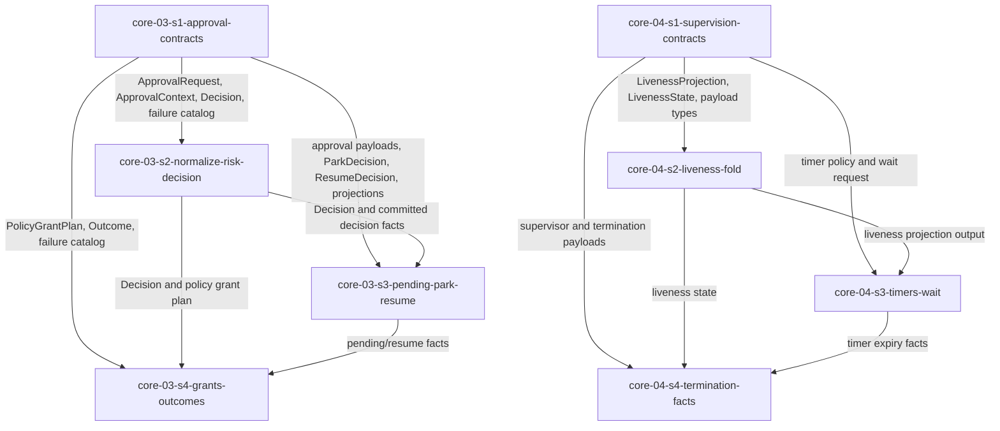

# Epic 4 Story DAG

Epic 4 converts the human-control and liveness design into eight implementation stories. The split is
driven by two seam rules: shared value types are produced once by type-only contract stories, and
runtime behavior stories consume those types without redeclaring them. Approval owns human-control
facts; supervision owns liveness and termination facts. Neither domain owns completion, recovery,
operator UI, concrete provider behavior, or execution-package dispatch.

## Sources

- This epic charter: [`README.md`](./README.md).
- [`../../epic-dag.md`](../../epic-dag.md): Epic 4 depends on Epics 2 and 3; Epic 5 consumes its facts.
- Included domain charters:
  [`core-03`](../../domains/core/core-03-approval-and-escalation.md) and
  [`core-04`](../../domains/core/core-04-supervision-and-liveness.md).
- Approval design:
  [`approval-and-escalation/README.md`](../../../design/30-domain-reference/core/approval-and-escalation/README.md),
  [`decision-model.md`](../../../design/30-domain-reference/core/approval-and-escalation/decision-model.md),
  [`park-resume-and-failures.md`](../../../design/30-domain-reference/core/approval-and-escalation/park-resume-and-failures.md),
  and
  [`interfaces-events-and-tests.md`](../../../design/30-domain-reference/core/approval-and-escalation/interfaces-events-and-tests.md).
- Supervision design:
  [`supervision-and-liveness/README.md`](../../../design/30-domain-reference/core/supervision-and-liveness/README.md)
  and
  [`liveness-model.md`](../../../design/30-domain-reference/core/supervision-and-liveness/liveness-model.md).
- Frozen cross-epic producers: Epic 1 fnd-01 resolved policy and fnd-02 `ArtifactStore` /
  `ArtifactRef.id`; Epic 2 Agent and Execution Host provider ports, `ScopedGrant`, and
  `CapabilityAttestation`; Epic 3 run-log contracts, writer, replay/projection/cursor surfaces,
  session linkage, capability registry, and committed `CapabilityGateRecord` behavior.
- Engineering constraints: [`check-gate.md`](../../../engineering/check-gate.md),
  [`test-lanes.md`](../../../engineering/test-lanes.md), and Epic 0 SDK export convention.

## Reading Rules

- Node = one story contract and one later reviewable implementation scope.
- Edge = a consumer uses a value type, behavior, or recorded fact from a producer.
- Cross-epic frozen inputs are not intra-epic edges; each story names them in its contract.
- Consumers cite `<story>/<shape>` verbatim and never redeclare cross-story shapes.
- Public import remains part of DONE, but Epic 4 stories do not own `packages/sdk/src/index.ts`.
  Public entrypoint wiring belongs to the dedicated export-aggregation owner defined in
  `docs/design/20-sdk-and-packaging/sdk-boundary.md`; Epic 4 stories own their domain source, tests, and
  public-import evidence proving that the owner has aggregated their symbols.

## Scope Decisions

### approval-types-first

- Rationale: `ApprovalRequest`, `ApprovalContext`, decisions, park/resume results, event payloads,
  protected-policy binding, projections, and failure tokens are values consumed by three approval
  behavior stories and later epics.
- Design trace: `decision-model.md` neutral shapes; `interfaces-events-and-tests.md` interfaces,
  payloads, `ApprovalParkInput`, `ParkDecision`, `ResumeDecision`, and `ProtectedPolicyApprovalBinding`.
- Falsification: any approval behavior story redeclares these shapes or omits a required produced-field
  source such as `promptRef`, `requestedAt`, `classifiedAt`, or protected-policy binding fields.
- Escalation: raise a story contract defect; do not duplicate or weaken the type producer.

### prompt-ref-is-an-input-not-ambient-state

- Rationale: core-03 now depends on fnd-02 because orchestration persists the approval prompt before
  normalization and passes the resulting `ArtifactRef.id` as `ApprovalContext.promptRef`. `normalize`
  remains pure and reads no artifact store or ambient time.
- Design trace: approval README flow `persist prompt -> normalize`; decision-model field provenance
  table for `promptRef` and `requestedAt`.
- Falsification: `normalize` mints a prompt reference, reads the clock, or accepts an
  `ApprovalRequest` without `promptRef` / `requestedAt`.
- Escalation: if prompt persistence cannot be injected before normalization, stop as a source-contract
  gap in core-03 orchestration.

### committed-gate-before-assisted-grant

- Rationale: assisted auto-grant can only branch on a committed `CapabilityGateRecord`; an evaluator
  return or worker narration is not durable evidence.
- Design trace: approval mode ladder and Epic 3 `core-02-s3` gate-record durability story.
- Falsification: a grant decision proceeds without a committed allow event id, or treats a failed gate
  append as allow.
- Escalation: model append failure as explicit input and fail closed.

### supervision-types-first

- Rationale: liveness states, reasons, timer policy, wait request, event payloads, and termination fact
  shapes are values consumed by fold, timer/wait, termination, Epic 5, and Epic 7.
- Design trace: supervision README contracts/events and liveness-model projection.
- Falsification: behavior stories redeclare `LivenessState`, `LivenessReason`, payloads, or timer names.
- Escalation: return to the type producer rather than adding behavior-local shapes.

### wait-is-not-liveness-proof

- Rationale: `waitRunEvents` wraps the Epic 3 cursor wait and never appends, refreshes liveness, reads
  projections, renews leases, or proves worker progress.
- Design trace: supervision README wait paragraph and liveness-model non-refresh list.
- Falsification: wait success, timeout, poll, projection read, or reconnect changes liveness state or
  progress sequences.
- Escalation: operator-side side effects belong to Epic 7, not core-04.

### termination-is-provider-handoff

- Rationale: core-04 requests termination through `ExecutionHostProvider.terminateWorker` and records
  facts. It never signals, kills, reaps, proves empty containment, or imports Local provider behavior.
- Design trace: supervision README and liveness-model termination handoff.
- Falsification: SDK core imports process APIs or concrete provider kill helpers.
- Escalation: host behavior gaps belong to provider-driver epics; recovery decisions belong to Epic 5.

## Story Nodes

| story id | job | domains | claimed signals | owned pathset | suggested tier |
|---|---|---|---|---|---|
| `core-03-s1-approval-contracts` | Produce all approval value types, event payloads, projections, binding shapes, interfaces, and failure catalog. | `core-03` | Neutral records contract part; fail-closed catalog split. | `packages/sdk/src/core/approval/contracts/**`, `packages/sdk/tests/core/approval/contracts/**` | elevated |
| `core-03-s2-normalize-risk-decision` | Normalize approval requests, classify risk with explicit time, record risk and decision facts, and apply the v1 ladder. | `core-03` | Risk classification; v1 mode ladder; risk/decision neutral records behavior; policy/risk/gate failure behavior. | `packages/sdk/src/core/approval/decision/**`, `packages/sdk/tests/core/approval/decision/**` | elevated |
| `core-03-s3-pending-park-resume` | Persist request/pending facts, produce park decisions, resume or expire pending approvals, and fold projections. | `core-03` | Pending persistence; parked/resumed/expired facts; pending/session/expiry/log failure behavior. | `packages/sdk/src/core/approval/pending/**`, `packages/sdk/src/core/approval/projections/**`, `packages/sdk/tests/core/approval/pending/**`, `packages/sdk/tests/core/approval/projections/**` | elevated |
| `core-03-s4-grants-outcomes` | Map policy grants to Agent `ScopedGrant`, answer/deny through the Agent relay, and record outcomes. | `core-03` | Policy-to-Agent scoped grants; relay/channel/mapping/outcome behavior; outcome neutral records behavior. | `packages/sdk/src/core/approval/grants/**`, `packages/sdk/src/core/approval/outcomes/**`, `packages/sdk/tests/core/approval/grants/**`, `packages/sdk/tests/core/approval/outcomes/**` | elevated |
| `core-04-s1-supervision-contracts` | Produce supervision/liveness value types, timer/wait inputs, event payloads, projections, and reason catalog. | `core-04` | Supervisor/liveness/timer/termination fact contract part; fail-closed reason catalog split. | `packages/sdk/src/core/supervision/contracts/**`, `packages/sdk/tests/core/supervision/contracts/**` | elevated |
| `core-04-s2-liveness-fold` | Fold committed current-session events plus clock into liveness state and event-class facts. | `core-04` | Liveness fold; advancing event classes; never-refresh event classes. | `packages/sdk/src/core/supervision/liveness/**`, `packages/sdk/tests/core/supervision/liveness/**` | elevated |
| `core-04-s3-timers-wait` | Evaluate the six supervision timers and wrap Epic 3 cursor wait without liveness side effects. | `core-04` | Timer signals; `waitRunEvents` wrapper and cursor validation. | `packages/sdk/src/core/supervision/timers/**`, `packages/sdk/src/core/supervision/wait/**`, `packages/sdk/tests/core/supervision/timers/**`, `packages/sdk/tests/core/supervision/wait/**` | elevated |
| `core-04-s4-termination-facts` | Append supervisor lifecycle/lost/termination facts and hand stale owned workers to Execution Host. | `core-04` | Supervisor facts behavior part; cursor/linkage/progress/stale/termination failure behavior. | `packages/sdk/src/core/supervision/termination/**`, `packages/sdk/tests/core/supervision/termination/**` | elevated |

## Dependency Table

| story | depends on | edge contract |
|---|---|---|
| `core-03-s1-approval-contracts` | none | Produces approval values, payloads, projections, interfaces, and failure catalog. |
| `core-04-s1-supervision-contracts` | none | Produces supervision values, payloads, projections, interfaces, and failure catalog. |
| `core-03-s2-normalize-risk-decision` | `core-03-s1-approval-contracts` | Consumes approval contract values and produces normalization/risk/decision behavior plus `ApprovalRiskClassified` and `ApprovalDecisionRecorded` facts. |
| `core-04-s2-liveness-fold` | `core-04-s1-supervision-contracts` | Consumes supervision values and produces liveness fold behavior. |
| `core-03-s3-pending-park-resume` | `core-03-s1-approval-contracts`, `core-03-s2-normalize-risk-decision` | Consumes approval payloads, `Decision`, `ParkDecision`, `ResumeDecision`, and pending/projection behavior. |
| `core-04-s3-timers-wait` | `core-04-s1-supervision-contracts`, `core-04-s2-liveness-fold` | Consumes timer policy, liveness projection, wait request, and liveness output. |
| `core-03-s4-grants-outcomes` | `core-03-s1-approval-contracts`, `core-03-s2-normalize-risk-decision`, `core-03-s3-pending-park-resume` | Consumes approval request/decision/pending values and Agent grant shapes. |
| `core-04-s4-termination-facts` | `core-04-s1-supervision-contracts`, `core-04-s2-liveness-fold`, `core-04-s3-timers-wait` | Consumes supervision payloads, liveness/timer facts, and Execution Host termination DTOs. |

## Shared Shapes

| shared shape | producer | public import path | consumers |
|---|---|---|---|
| Approval values, interfaces, payloads, projections, `ProtectedPolicyApprovalBinding`, failure catalog | `core-03-s1-approval-contracts` | `sdk` via export-aggregation owner | `core-03-s2`, `core-03-s3`, `core-03-s4`, Epic 5, Epic 7 |
| Normalization, risk classifier, decision functions, `ApprovalRiskClassified`, and `ApprovalDecisionRecorded` facts | `core-03-s2-normalize-risk-decision` | `sdk` via export-aggregation owner | `core-03-s3`, `core-03-s4`, Epic 5 |
| Pending/park/resume/expiry functions and projection fold | `core-03-s3-pending-park-resume` | `sdk` via export-aggregation owner | `core-03-s4`, Epic 5, Epic 7 |
| Grant mapping, Agent answer relay, and outcome recording | `core-03-s4-grants-outcomes` | `sdk` via export-aggregation owner | Epic 5, Epic 7 |
| Supervision values, payloads, timer/wait inputs, projection, reason catalog | `core-04-s1-supervision-contracts` | `sdk` via export-aggregation owner | `core-04-s2`, `core-04-s3`, `core-04-s4`, Epic 5, Epic 7 |
| Liveness fold and event-class catalog | `core-04-s2-liveness-fold` | `sdk` via export-aggregation owner | `core-04-s3`, `core-04-s4`, Epic 5 |
| Timer evaluation and wait wrapper | `core-04-s3-timers-wait` | `sdk` via export-aggregation owner | `core-04-s4`, Epic 7 |
| Supervisor and termination fact recording | `core-04-s4-termination-facts` | `sdk` via export-aggregation owner | Epic 5, Epic 7 |

## Story Graph

## Topological Bands

| band | stories | delivery note |
|---|---|---|
| 1 | `core-03-s1-approval-contracts`, `core-04-s1-supervision-contracts` | Independent root value producers; public entrypoint aggregation is owned outside the story pathsets. |
| 2 | `core-03-s2-normalize-risk-decision`, `core-04-s2-liveness-fold` | First behavior consumers of their own domain contract surfaces. |
| 3 | `core-03-s3-pending-park-resume`, `core-04-s3-timers-wait` | Second behavior layer: approval pending/projections and supervision timers/wait. |
| 4 | `core-03-s4-grants-outcomes`, `core-04-s4-termination-facts` | Provider-port handoff behaviors over already-produced facts. |

## Gate 3 Evidence

- Coverage closed: the Epic 4 charter table maps every owned `core-03` and `core-04` signal to one
  story id or named split matching the nodes above.
- No invented nodes: every node traces to a charter signal and a cited design surface.
- Single producer per shared shape: approval values live in `core-03-s1`; supervision values live in
  `core-04-s1`; behavior stories consume them.
- Acyclic labelled graph: four ordered bands; every edge names value-shape or behavior consumption.
- Defensible sizing: each story owns one domain surface and focused, falsifiable ACs.
- Dispatch-ready: every story has one path boundary and an `elevated` tier floor because each exposes
  public SDK surface through the export-aggregation owner.
- Seams importable: every cross-story shape names `sdk` as the public import path; producer stories own
  public-import ACs but do not own the shared SDK entrypoint file.
- Producer-closure enforced: story contracts name construction sources for required produced fields and
  public symbols, including `promptRef`, `requestedAt`, `classifiedAt`, risk/decision event ids,
  protected-policy binding fields, timer deadlines, and termination proof fields.

<!-- DOCS-NAV (generated — do not edit by hand) -->

---

**↑ Up:** [Epic 4 - Human control and liveness loop](./README.md) · **← Prev:** [core-04-s4-termination-facts - supervision termination facts implementation story](./stories/core-04-s4-termination-facts.md) · **Next →:** [Epic 5 - Completion, verification, and recovery](../epic-5-completion-verification-and-recovery/README.md)

<!-- /DOCS-NAV -->
