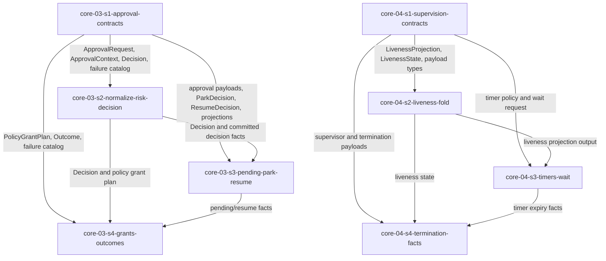

# Epic 4 Story DAG

Epic 4 converts the human-control and liveness design into eight implementation stories. The split is
driven by two seam rules: shared value types are produced once by type-only contract stories, and
runtime behavior stories consume those types without redeclaring them. Approval owns human-control
facts; supervision owns liveness and termination facts. Neither domain owns completion, recovery,
operator UI, concrete provider behavior, or execution-package dispatch.

## Sources

- This epic charter: [`README.md`](./README.md).
- [`../../epic-dag.md`](../../epic-dag.md): Epic 4 depends on Epics 2 and 3; Epic 5 consumes its facts.
- Included domain charters:
  [`core-03`](../../domains/core/core-03-approval-and-escalation.md) and
  [`core-04`](../../domains/core/core-04-supervision-and-liveness.md).
- Approval design:
  [`approval-and-escalation/README.md`](../../../design/30-domain-reference/core/approval-and-escalation/README.md),
  [`decision-model.md`](../../../design/30-domain-reference/core/approval-and-escalation/decision-model.md),
  [`park-resume-and-failures.md`](../../../design/30-domain-reference/core/approval-and-escalation/park-resume-and-failures.md),
  and
  [`interfaces-events-and-tests.md`](../../../design/30-domain-reference/core/approval-and-escalation/interfaces-events-and-tests.md).
- Supervision design:
  [`supervision-and-liveness/README.md`](../../../design/30-domain-reference/core/supervision-and-liveness/README.md)
  and
  [`liveness-model.md`](../../../design/30-domain-reference/core/supervision-and-liveness/liveness-model.md).
- Frozen cross-epic producers: Epic 1 fnd-01 resolved policy and fnd-02 `ArtifactStore` /
  `ArtifactRef.id`; Epic 2 Agent and Execution Host provider ports, `ScopedGrant`, and
  `CapabilityAttestation`; Epic 3 run-log contracts, writer, replay/projection/cursor surfaces,
  session linkage, capability registry, and committed `CapabilityGateRecord` behavior.
- Engineering constraints: [`check-gate.md`](../../../engineering/check-gate.md),
  [`test-lanes.md`](../../../engineering/test-lanes.md), and Epic 0 SDK export convention.

## Reading Rules

- Node = one story contract and one later reviewable implementation scope.
- Edge = a consumer uses a value type, behavior, or recorded fact from a producer.
- Cross-epic frozen inputs are not intra-epic edges; each story names them in its contract.
- Consumers cite `<story>/<shape>` verbatim and never redeclare cross-story shapes.
- Public import is part of DONE. `packages/sdk/src/index.ts` is a **normal owned file**: each
  public-symbol story **owns its own export line(s)** in it end-to-end (export + public-import test),
  per `docs/design/20-sdk-and-packaging/sdk-boundary.md`. Every Epic 4 story therefore includes
  `packages/sdk/src/index.ts` in its owned pathset alongside its domain source and tests. The barrel is
  an **append-only aggregation point** (not logic-bearing): concurrent stories add disjoint export lines
  and a line-level overlap is resolved by rebase when the orchestrator advances the wave, never by
  serializing the stories.

## Scope Decisions

### approval-types-first

- Rationale: `ApprovalRequest`, `ApprovalContext`, decisions, park/resume results, event payloads,
  protected-policy binding, projections, and failure tokens are values consumed by three approval
  behavior stories and later epics.
- Design trace: `decision-model.md` neutral shapes; `interfaces-events-and-tests.md` interfaces,
  payloads, `ApprovalParkInput`, `ParkDecision`, `ResumeDecision`, and `ProtectedPolicyApprovalBinding`.
- Falsification: any approval behavior story redeclares these shapes or omits a required produced-field
  source such as `promptRef`, `requestedAt`, `classifiedAt`, or protected-policy binding fields.
- Escalation: raise a story contract defect; do not duplicate or weaken the type producer.

### prompt-ref-is-an-input-not-ambient-state

- Rationale: core-03 now depends on fnd-02 because orchestration persists the approval prompt before
  normalization and passes the resulting `ArtifactRef.id` as `ApprovalContext.promptRef`. `normalize`
  remains pure and reads no artifact store or ambient time.
- Design trace: approval README flow `persist prompt -> normalize`; decision-model field provenance
  table for `promptRef` and `requestedAt`.
- Falsification: `normalize` mints a prompt reference, reads the clock, or accepts an
  `ApprovalRequest` without `promptRef` / `requestedAt`.
- Escalation: if prompt persistence cannot be injected before normalization, stop as a source-contract
  gap in core-03 orchestration.

### committed-gate-before-assisted-grant

- Rationale: assisted auto-grant can only branch on a committed `CapabilityGateRecord`; an evaluator
  return or worker narration is not durable evidence.
- Design trace: approval mode ladder and Epic 3 `core-02-s3` gate-record durability story.
- Falsification: a grant decision proceeds without a committed allow event id, or treats a failed gate
  append as allow.
- Escalation: model append failure as explicit input and fail closed.

### decision-facts-live-with-the-decider

- Rationale: `ApprovalRiskClassified` and `ApprovalDecisionRecorded` live with the story that computes
  the risk and decision values. Moving append responsibility to a later story would pass an
  uncommitted decision value across a story seam before the event log makes it authoritative.
- Design trace: approval README section 7 sequence appends `ApprovalRiskClassified` during
  classification and `ApprovalDecisionRecorded` immediately after decision before Agent answer.
- Falsification: a story other than `core-03-s2-normalize-risk-decision` appends those facts, or
  `core-03-s2` lacks `RunWriter` in its frozen inputs.
- Escalation: raise a story-contract defect; do not split decision computation from decision fact
  recording.

### workspace-boundary-via-frozen-worktree-lease

- Rationale: `core-03-s2` approval risk classification tests workspace containment
  (`ApprovalRequest.cwd` for the low-risk rule, `ApprovalRequest.filePaths` for the high-risk rule)
  against the trusted `WorktreeLease.worktreePath` supplied by the approval composition assembler as
  `ApprovalContext.worktreePath` and copied into `ApprovalRequest.worktreePath` — never the
  agent-supplied `cwd`. When `worktreePath` is absent, containment is unprovable and the rules fail
  closed. This closes the prior P1 fail-open that approximated the workspace root from the spoofable
  agent `cwd`.
- Design trace: the PR #159 workspace→approval seam —
  `decision-model.md` (`ApprovalRequest.worktreePath`, the "Workspace containment" classifier paragraph,
  and the `worktreePath ← context.worktreePath` field-provenance construction row) and
  `interfaces-events-and-tests.md` (`ApprovalContext.worktreePath` and the normalize-copy prose).
- Falsification: `core-03-s2` sources the workspace boundary from the agent request (or the agent `cwd`),
  or any implementation leaves the lease-origin boundary unsourced.
- Escalation: if the approval composition assembler cannot source `ApprovalContext.worktreePath` from
  the run's `WorktreeLease.worktreePath`, STOP — do not infer it from the agent request.

### supervision-types-first

- Rationale: liveness states, reasons, timer policy, wait request, event payloads, and termination fact
  shapes are values consumed by fold, timer/wait, termination, Epic 5, and Epic 7.
- Design trace: supervision README contracts/events and liveness-model projection.
- Falsification: behavior stories redeclare `LivenessState`, `LivenessReason`, payloads, or timer names.
- Escalation: return to the type producer rather than adding behavior-local shapes.

### wait-is-not-liveness-proof

- Rationale: `waitRunEvents` wraps the Epic 3 cursor wait and never appends, refreshes liveness, reads
  projections, renews leases, or proves worker progress.
- Design trace: supervision README wait paragraph and liveness-model non-refresh list.
- Falsification: wait success, timeout, poll, projection read, or reconnect changes liveness state or
  progress sequences.
- Escalation: operator-side side effects belong to Epic 7, not core-04.

### termination-is-provider-handoff

- Rationale: core-04 requests termination through `ExecutionHostProvider.terminateWorker` and records
  facts. It never signals, kills, reaps, proves empty containment, or imports Local provider behavior.
- Design trace: supervision README and liveness-model termination handoff.
- Falsification: SDK core imports process APIs or concrete provider kill helpers.
- Escalation: host behavior gaps belong to provider-driver epics; recovery decisions belong to Epic 5.

### barrel-is-per-story-owned

- Rationale: `packages/sdk/src/index.ts` is a normal owned file. Each of the eight public-symbol stories
  owns its own export line(s) end-to-end (export + public-import test) and carries that line in its owned
  pathset — no dedicated barrel-owner role exists. This is the reformed barrel model in
  `sdk-boundary.md` and `authoring-standard/40-story-dag.md`.
- Design trace: `docs/design/20-sdk-and-packaging/sdk-boundary.md` §Public entrypoint ownership; barrel
  rule in `authoring-standard/40-story-dag.md` (each public-symbol story owns its own `index.ts` export
  line).
- Falsification: a story exposes a public symbol without owning its export line, or a story declares the
  barrel unowned / delegates it to a dedicated barrel-owner role, or two same-wave stories are serialized
  solely because they share the barrel.
- Escalation: a real logic conflict on the barrel (not a trivial line-level replay) means a same-logic
  violation upstream — escalate; do not introduce a special ownership role.

### concurrency-by-same-logic-rule

- Rationale: same-wave eligibility is governed by the same-logic rule, not pathset disjointness. Every
  band pairs stories on disjoint logic-bearing source dirs (`approval/**` vs `supervision/**` and
  disjoint sub-modules), and the only shared file is the append-only barrel — so no wave serializes and
  no architect override is required.
- Design trace: same-logic concurrency rule (canonical) in `authoring-standard/40-story-dag.md`; the
  Concurrency section of this DAG.
- Falsification: a band pairs two stories that modify the same logic-bearing file, or an architect
  override is asserted without a recorded one-line rationale.
- Escalation: if a future signal forces two same-logic stories into one band, re-slice or record an
  architect override with rationale; do not silently allow a shared logic-bearing file.

## Story Nodes

| story id | job | domains | claimed signals | owned pathset | suggested tier |
|---|---|---|---|---|---|
| `core-03-s1-approval-contracts` | Produce all approval value types, event payloads, projections, binding shapes, interfaces, and failure catalog. | `core-03` | Neutral records contract part; fail-closed catalog split. | `packages/sdk/src/core/approval/contracts/**`, `packages/sdk/tests/core/approval/contracts/**`, `packages/sdk/src/index.ts` (own export lines) | elevated |
| `core-03-s2-normalize-risk-decision` | Normalize approval requests, classify risk with explicit time, record risk and decision facts, and apply the v1 ladder. | `core-03` | Risk classification; v1 mode ladder; risk/decision neutral records behavior; policy/risk/gate failure behavior. | `packages/sdk/src/core/approval/decision/**`, `packages/sdk/tests/core/approval/decision/**`, `packages/sdk/src/index.ts` (own export lines) | elevated |
| `core-03-s3-pending-park-resume` | Persist request/pending facts, produce park decisions, resume or expire pending approvals, and fold projections. | `core-03` | Pending persistence; parked/resumed/expired facts; pending/session/expiry/log failure behavior. | `packages/sdk/src/core/approval/pending/**`, `packages/sdk/src/core/approval/projections/**`, `packages/sdk/tests/core/approval/pending/**`, `packages/sdk/tests/core/approval/projections/**`, `packages/sdk/src/index.ts` (own export lines) | elevated |
| `core-03-s4-grants-outcomes` | Map policy grants to Agent `ScopedGrant`, answer/deny through the Agent relay, and record outcomes. | `core-03` | Policy-to-Agent scoped grants; relay/channel/mapping/outcome behavior; outcome neutral records behavior. | `packages/sdk/src/core/approval/grants/**`, `packages/sdk/src/core/approval/outcomes/**`, `packages/sdk/tests/core/approval/grants/**`, `packages/sdk/tests/core/approval/outcomes/**`, `packages/sdk/src/index.ts` (own export lines) | elevated |
| `core-04-s1-supervision-contracts` | Produce supervision/liveness value types, timer/wait inputs, event payloads, projections, and reason catalog. | `core-04` | Supervisor/liveness/timer/termination fact contract part; fail-closed reason catalog split. | `packages/sdk/src/core/supervision/contracts/**`, `packages/sdk/tests/core/supervision/contracts/**`, `packages/sdk/src/index.ts` (own export lines) | elevated |
| `core-04-s2-liveness-fold` | Fold committed current-session events plus clock into liveness state and event-class facts. | `core-04` | Liveness fold; advancing event classes; never-refresh event classes. | `packages/sdk/src/core/supervision/liveness/**`, `packages/sdk/tests/core/supervision/liveness/**`, `packages/sdk/src/index.ts` (own export lines) | elevated |
| `core-04-s3-timers-wait` | Evaluate the six supervision timers and wrap Epic 3 cursor wait without liveness side effects. | `core-04` | Timer signals; `waitRunEvents` wrapper and cursor validation. | `packages/sdk/src/core/supervision/timers/**`, `packages/sdk/src/core/supervision/wait/**`, `packages/sdk/tests/core/supervision/timers/**`, `packages/sdk/tests/core/supervision/wait/**`, `packages/sdk/src/index.ts` (own export lines) | elevated |
| `core-04-s4-termination-facts` | Append supervisor lifecycle/lost/termination facts and hand stale owned workers to Execution Host. | `core-04` | Supervisor facts behavior part; cursor/linkage/progress/stale/termination failure behavior. | `packages/sdk/src/core/supervision/termination/**`, `packages/sdk/tests/core/supervision/termination/**`, `packages/sdk/src/index.ts` (own export lines) | elevated |

## Dependency Table

| story | depends on | edge contract |
|---|---|---|
| `core-03-s1-approval-contracts` | none | Produces approval values, payloads, projections, interfaces, and failure catalog. |
| `core-04-s1-supervision-contracts` | none | Produces supervision values, payloads, projections, interfaces, and failure catalog. |
| `core-03-s2-normalize-risk-decision` | `core-03-s1-approval-contracts` | Consumes approval contract values and the trusted `WorktreeLease.worktreePath` supplied as `ApprovalContext.worktreePath` by composition (the workspace boundary for risk containment, copied into `ApprovalRequest.worktreePath`), and produces normalization/risk/decision behavior plus `ApprovalRiskClassified` and `ApprovalDecisionRecorded` facts. |
| `core-04-s2-liveness-fold` | `core-04-s1-supervision-contracts` | Consumes supervision values and produces liveness fold behavior. |
| `core-03-s3-pending-park-resume` | `core-03-s1-approval-contracts`, `core-03-s2-normalize-risk-decision` | Consumes approval payloads, `Decision`, `ParkDecision`, `ResumeDecision`, and pending/projection behavior. |
| `core-04-s3-timers-wait` | `core-04-s1-supervision-contracts`, `core-04-s2-liveness-fold` | Consumes timer policy, liveness projection, wait request, and liveness output. |
| `core-03-s4-grants-outcomes` | `core-03-s1-approval-contracts`, `core-03-s2-normalize-risk-decision`, `core-03-s3-pending-park-resume` | Consumes approval request/decision/pending values and Agent grant shapes. |
| `core-04-s4-termination-facts` | `core-04-s1-supervision-contracts`, `core-04-s2-liveness-fold`, `core-04-s3-timers-wait` | Consumes supervision payloads, liveness/timer facts, and Execution Host termination DTOs. |

## Shared Shapes

| shared shape | producer | public import path | consumers |
|---|---|---|---|
| Approval values, interfaces, payloads, projections, `ProtectedPolicyApprovalBinding`, failure catalog | `core-03-s1-approval-contracts` | `sdk` | `core-03-s2`, `core-03-s3`, `core-03-s4`, Epic 5, Epic 7 |
| Normalization, risk classifier, decision functions, `ApprovalRiskClassified`, and `ApprovalDecisionRecorded` facts | `core-03-s2-normalize-risk-decision` | `sdk` | `core-03-s3`, `core-03-s4`, Epic 5 |
| Pending/park/resume/expiry functions and projection fold | `core-03-s3-pending-park-resume` | `sdk` | `core-03-s4`, Epic 5, Epic 7 |
| Grant mapping, Agent answer relay, and outcome recording | `core-03-s4-grants-outcomes` | `sdk` | Epic 5, Epic 7 |
| Supervision values, payloads, timer/wait inputs, projection, reason catalog | `core-04-s1-supervision-contracts` | `sdk` | `core-04-s2`, `core-04-s3`, `core-04-s4`, Epic 5, Epic 7 |
| Liveness fold and event-class catalog | `core-04-s2-liveness-fold` | `sdk` | `core-04-s3`, `core-04-s4`, Epic 5 |
| Timer evaluation and wait wrapper | `core-04-s3-timers-wait` | `sdk` | `core-04-s4`, Epic 7 |
| Supervisor and termination fact recording | `core-04-s4-termination-facts` | `sdk` | Epic 5, Epic 7 |
| `WorktreeLease.worktreePath` (trusted workspace boundary) | `fnd-03` Workspace & Repository lease creation | `sdk` | Approval composition assembler injects into `ApprovalContext.worktreePath`; `core-03-s2-normalize-risk-decision` consumes the normalized `ApprovalRequest.worktreePath` |

Worktree-path producer closure (two hops, both closed):

1. Intra-epic field-type declaration. The optional fields `ApprovalContext.worktreePath` and
   `ApprovalRequest.worktreePath` are **produced** (declared) by `core-03-s1-approval-contracts` — which
   owns the approval value types under `packages/sdk/src/core/approval/contracts/**` — and **consumed** by
   `core-03-s2-normalize-risk-decision` (which copies `ApprovalContext.worktreePath` onto
   `ApprovalRequest.worktreePath` in `normalize` and tests workspace containment against it). `core-03-s1`
   is the wave-1 root producer and `core-03-s2` its wave-2 consumer, so this hop is closed within the epic
   with no unproduced-consumed defect; `core-03-s2` never redeclares the field.
2. Composition value injection. The trusted workspace-root value is `WorktreeLease.worktreePath`, produced
   by Workspace & Repository and resolved by the approval composition assembler for the run. The assembler
   supplies it as `ApprovalContext.worktreePath`; `core-03-s2-normalize-risk-decision` copies that value
   into `ApprovalRequest.worktreePath` and tests containment against it. This is a composition concern,
   not a run-lifecycle projection dependency, and `core-03-s2` never redeclares the field.

Forward note (composition, Epic 7): the eventual `ApprovalContext` assembler injects `worktreePath` from
the run's `WorktreeLease.worktreePath` — recorded here so the dependency is not lost when the assembler is
planned.

## Story Graph

## Topological Bands

| band | stories | delivery note |
|---|---|---|
| 1 | `core-03-s1-approval-contracts`, `core-04-s1-supervision-contracts` | Independent root value producers on disjoint source dirs; each owns its own export lines in the shared `packages/sdk/src/index.ts` (append-only, rebase-resolved). |
| 2 | `core-03-s2-normalize-risk-decision`, `core-04-s2-liveness-fold` | First behavior consumers of their own domain contract surfaces. |
| 3 | `core-03-s3-pending-park-resume`, `core-04-s3-timers-wait` | Second behavior layer: approval pending/projections and supervision timers/wait. |
| 4 | `core-03-s4-grants-outcomes`, `core-04-s4-termination-facts` | Provider-port handoff behaviors over already-produced facts. |

## Concurrency (same-logic rule)

Same-wave eligibility follows the canonical same-logic rule in
[`authoring-standard/40-story-dag.md`](../../../implementation-authoring/authoring-standard/40-story-dag.md):
two non-dependent stories share a wave only when their owned pathsets share no *logic-bearing* file
(file-level granularity).

- In every band the two parallel stories own **disjoint logic-bearing source dirs** —
  `core/approval/**` versus `core/supervision/**` at the top level, and disjoint sub-modules
  (`contracts` / `decision` / `pending` / `projections` / `grants` / `outcomes` versus
  `contracts` / `liveness` / `timers` / `wait` / `termination`) within each domain. No band pairs two
  stories that modify the same logic-bearing file.
- The only file shared across same-wave stories is `packages/sdk/src/index.ts`. It is an **append-only
  aggregation point and not logic-bearing**: each story adds its own disjoint export line(s), and a
  line-level overlap is resolved by rebase when the orchestrator advances the wave — never by serializing
  the stories. Sharing the barrel therefore does **not** block any wave.
- No architect override is required: file-level granularity already clears every band without an
  exemption.

## Gate 3 Evidence

- Coverage closed: the Epic 4 charter table maps every owned `core-03` and `core-04` signal to one
  story id or named split matching the nodes above.
- No invented nodes: every node traces to a charter signal and a cited design surface.
- Single producer per shared shape: approval values live in `core-03-s1`; supervision values live in
  `core-04-s1`; behavior stories consume them.
- Acyclic labelled graph: four ordered bands; every edge names value-shape or behavior consumption.
- Defensible sizing: each story owns one domain surface and 5-9 falsifiable ACs, except
  `core-03-s2-normalize-risk-decision`, which is intentionally larger to keep normalization, risk
  classification, decision computation, and risk/decision fact recording in one cohesive full decision
  path. Splitting it would reintroduce a cross-story decision handoff; its elevated tier and 95%
  branch coverage quality bar absorb the load.
- Dispatch-ready: every story has one path boundary (its domain source/tests plus its own export lines
  in `packages/sdk/src/index.ts`) and an `elevated` tier floor because each exposes public SDK surface.
- Seams importable: every cross-story shape names `sdk` as the public import path; each producer story
  owns its own `index.ts` export line(s) for the symbols it exposes and proves them with a public-import
  AC. The barrel is a normal owned file shared as an append-only aggregation point.
- Same-logic concurrency holds: see the Concurrency section — every band's parallel stories own disjoint
  logic-bearing source dirs and share only the append-only barrel, so no wave serializes and no architect
  override is needed.
- Producer-closure enforced: story contracts name construction sources for required produced fields and
  public symbols, including `promptRef`, `requestedAt`, `classifiedAt`, risk/decision event ids,
  protected-policy binding fields, timer deadlines, and termination proof fields.
- Whole-graph event/record producer reconciliation: every event/record consumed by any Epic 4 story (or
  named in the included design seams) maps to exactly one declared producer node, per the table below.

### Event / record producer reconciliation

Each event/record emitted in the included approval and supervision seams has exactly one **appending
producer** story in this epic; no consumed event/record is orphaned. The producer is the story that
**appends** the event to the run log (making it authoritative), distinct from a story that computes the
values it carries — e.g. `core-04-s2` folds liveness as a pure value (never appends) and `core-04-s3`
computes timer-expiry facts with no side effects, while `core-04-s4` is the single appender of every
supervision fact. Downstream cross-epic consumers (Epic 5 recovery, Epic 7 operator UI) read these facts
but produce none of them.

| event / record | appending producer story | value source (if distinct) | intra-epic consumers |
|---|---|---|---|
| `ApprovalRequested` / `ApprovalPendingPersisted` | `core-03-s3-pending-park-resume` | — | `core-03-s4`, projection fold |
| `ApprovalRiskClassified` | `core-03-s2-normalize-risk-decision` | — | `core-03-s3`, `core-03-s4` |
| `ApprovalDecisionRecorded` | `core-03-s2-normalize-risk-decision` | — | `core-03-s3`, `core-03-s4` |
| `ApprovalParked` / `ApprovalResumed` | `core-03-s3-pending-park-resume` | `Decision` from `core-03-s2` | `core-03-s4`, projection fold |
| `ApprovalOutcomeRecorded` | `core-03-s4-grants-outcomes` | — | projection fold |
| `SupervisorStarted` | `core-04-s4-termination-facts` | — | terminal projection |
| `LivenessAdvanced` | `core-04-s4-termination-facts` | liveness fold + `LivenessAdvanceClass` from `core-04-s2` | terminal projection |
| `LivenessTimerExpired` | `core-04-s4-termination-facts` | timer-expiry facts from `core-04-s3` | terminal projection |
| `LivenessStateChanged` | `core-04-s4-termination-facts` | liveness state from `core-04-s2` | terminal projection |
| `SupervisionLost` | `core-04-s4-termination-facts` | liveness reason / unestablished termination proof | terminal projection |
| `SupervisorTerminationRequested` | `core-04-s4-termination-facts` | stale-worker eligibility + host capability | terminal projection |
| `WorkerTerminated` | `core-04-s4-termination-facts` | termination proof from Execution Host | terminal projection |
| `SupervisorStopped` | `core-04-s4-termination-facts` | terminal source event ids | terminal projection |

Payload *types* for every row are declared once by the domain contract story (`core-03-s1` /
`core-04-s1`) and cited verbatim; the contract stories declare types only and append nothing.

<!-- DOCS-NAV (generated — do not edit by hand) -->

---

**↑ Up:** [Epic 4 - Human control and liveness loop](./README.md) · **← Prev:** [core-04-s4-termination-facts - supervision termination facts implementation story](./stories/core-04-s4-termination-facts.md) · **Next →:** [Epic 5 - Completion, verification, and recovery](../epic-5-completion-verification-and-recovery/README.md)

<!-- /DOCS-NAV -->
