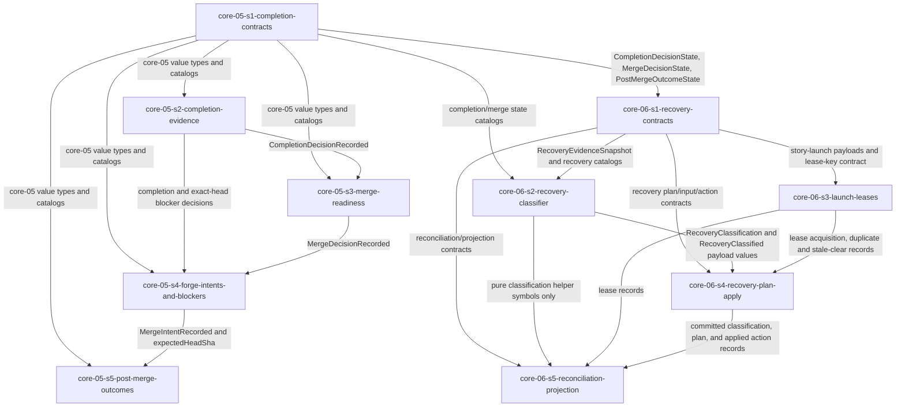

# Epic 5 Story DAG

Epic 5 turns completion, merge readiness, and recovery into ten dispatch-ready stories. The split keeps
shared state unions and event payloads in type-only contract producers, then lets independent behavior
stories run in parallel when they consume only those value types and do not share logic-bearing files.
Completion owns exact-head evidence and merge facts; recovery owns deterministic classification,
coordination leases, recovery plans, and reconciliation records. Neither domain gathers provider data,
executes commands, mutates Work Source state, performs a real merge, or implements concrete drivers.

## Sources

- This epic charter: [`README.md`](./README.md).
- [`../../epic-dag.md`](../../epic-dag.md): Epic 5 depends on Epics 3 and 4; Epic 7 consumes Epic 5.
- Included domain charters:
  [`core-05`](../../domains/core/core-05-completion-and-merge.md) and
  [`core-06`](../../domains/core/core-06-recovery-and-reconciliation.md).
- Completion design:
  [`completion-and-merge/README.md`](../../../design/30-domain-reference/core/completion-and-merge/README.md)
  and
  [`evidence-model-and-predicates.md`](../../../design/30-domain-reference/core/completion-and-merge/evidence-model-and-predicates.md).
- Recovery design:
  [`recovery-and-reconciliation/README.md`](../../../design/30-domain-reference/core/recovery-and-reconciliation/README.md)
  and
  [`recovery-model.md`](../../../design/30-domain-reference/core/recovery-and-reconciliation/recovery-model.md).
- Frozen cross-epic producers: Epic 1 fnd-01 resolved merge/change policy, fnd-02 leases, and fnd-03
  local git evidence contracts; Epic 2 provider ports and capability attestations; Epic 3 run-log,
  replay/projection/cursor, lifecycle, writer, and `CapabilityGateRecord` contracts; Epic 4
  protected-policy approval facts, liveness projections, supervision-lost, and termination facts.
- Engineering constraints: [`check-gate.md`](../../../engineering/check-gate.md),
  [`test-lanes.md`](../../../engineering/test-lanes.md), and Epic 0 SDK export convention.

## Reading Rules

- Node = one story contract and one later reviewable implementation scope.
- Edge = a consumer uses a value type, event payload, behavior, or catalog from a producer.
- Cross-epic frozen inputs are not intra-epic edges; each story names them in its contract.
- Consumers cite `<producer-story>/<shape>` verbatim and never redeclare cross-story shapes.
- Public import is part of DONE. Every public-symbol story owns its own `packages/sdk/src/index.ts`
  export line(s). The SDK barrel is append-only aggregation, not logic-bearing, so same-wave stories
  sharing only that file remain parallel-safe and rebase their export lines at wave merge-back.
- The package/module path convention follows the core layer plus domain slug: `packages/sdk/src/core/completion/**`
  and `packages/sdk/src/core/recovery/**`, with matching `packages/sdk/tests/core/.../**` paths.

## Scope Decisions

### core-05-types-before-behavior

- Rationale: completion, merge, post-merge, changed-file, and Forge-intent state unions and payload
  shapes are value types consumed by every core-05 behavior story and by core-06 recovery.
- Design trace: completion contracts and event/data sections define `CompletionDecisionPayload`,
  `MergeDecisionPayload`, `CompletionDecisionState`, `MergeDecisionState`, `PostMergeOutcomeState`,
  and core-05 barrier events.
- Falsification: any behavior story redeclares these unions/payloads or core-06 references them without
  depending on `core-05-s1-completion-contracts`.
- Escalation: return to the type producer; do not duplicate the shape in a consumer.

### completion-and-merge-are-separate-decisions

- Rationale: `completion-verified` proves local/verification evidence; `merge-ready` additionally
  requires Forge, review/thread, branch freshness, policy, protection, and `auto-merge` gate evidence.
- Design trace: completion design separates completion evidence from merge prerequisites and states the
  merge predicate as an all-conditions fail-closed rule.
- Falsification: a story lets Forge/review evidence block `completion-verified` unless the worker claim
  explicitly asserted merge readiness, or records a merge intent without `merge-ready`.
- Escalation: story-contract defect in the offending consumer; do not weaken the predicate.

### recovery-contracts-consume-completion-types-not-behavior

- Rationale: `RecoveryEvidenceSnapshot` contains core-05 state values. The classifier is pure over a
  supplied snapshot, so it depends on the core-05 type producer, not on completion/merge evaluator
  behavior. This preserves parallelism while keeping single ownership of the state unions.
- Design trace: recovery model imports `CompletionDecisionState`, `MergeDecisionState`, and
  `PostMergeOutcomeState` as snapshot fields; recovery design says classification receives snapshots
  and no provider clients or mutable state.
- Falsification: a core-06 story calls a core-05 evaluator or redeclares completion state unions instead
  of consuming the snapshot value fields.
- Escalation: re-point the dependency to `core-05-s1-completion-contracts` or stop on a source gap.

### classifier-and-lease-work-can-run-together

- Rationale: after `core-06-s1-recovery-contracts`, the pure classifier/action-safety logic and
  story-launch lease coordination own disjoint logic-bearing modules. They share only recovery value
  types and the SDK barrel export line aggregator, so they are same-wave safe.
- Design trace: recovery model splits stable rule order/action-safety matrix from lease coordination
  and duplicate/stale-launch flows.
- Falsification: the classifier writes lease state or the lease story embeds classifier state-ordering
  rules beyond citing produced recovery-state literals.
- Escalation: split the leaked responsibility back to its owner; do not serialize solely because both
  stories export SDK symbols.

### blocker-pr-is-not-completion-or-merge

- Rationale: blocker-evidence PR intents publish recorded blocker states for a safe exact head, but never
  imply task completion, queue, enqueue, or merge.
- Design trace: blocker-evidence PR behavior lists eligible states and excludes merge intents,
  ambiguous heads, dirty/missing local evidence, outside-allowlist changes, unwritable events, and
  Forge-unavailable write paths.
- Falsification: a blocker intent is emitted for an ineligible state, for a merge operation, or without a
  clean unambiguous `expectedHeadSha`.
- Escalation: story-contract defect in `core-05-s4-forge-intents-and-blockers`.

### recovery-is-appended-events-not-manual-repair

- Rationale: core-06 never edits logs, projections, Work Source records, provider artifacts, or lease
  files by hand. Recovery and stale-launch clearing are supported controls plus appended evidence.
- Design trace: recovery design mandate and lease coordination rules prohibit blind relaunches, manual
  edits, and claim clearing after unverified termination.
- Falsification: a story clears a lease or claim through direct file/state mutation, or treats process
  absence as a safety input.
- Escalation: stop as a story defect; concrete provider mechanics are later-epic concerns.

### concurrency-by-same-logic-rule

- Rationale: topological bands below maximize safe parallelism without sharing logic-bearing files.
  Same-wave stories use disjoint source/test directories; the only shared file is the SDK barrel, an
  append-only aggregation point.
- Design trace: same-logic concurrency rule in `authoring-standard/40-story-dag.md`.
- Falsification: a band pairs stories that both modify the same logic-bearing file.
- Escalation: re-slice or record a specific architect override; no override is required for this DAG.

## Story Nodes

| story id | job | domains | claimed signals | owned pathset | suggested tier |
|---|---|---|---|---|---|
| `core-05-s1-completion-contracts` | Produce completion/merge value types, state catalogs, event payloads, evaluator interfaces, and failure-token catalogs. | `core-05` | Candidate-head contract part; policy snapshot record contract; completion/verification/merge/intent/post-merge payload and catalog parts. | `packages/sdk/src/core/completion/contracts/**`, `packages/sdk/tests/core/completion/contracts/**`, `packages/sdk/src/index.ts` (own export lines) | elevated |
| `core-05-s2-completion-evidence` | Select candidate head, evaluate protected-policy/changed-file gate, verify freshness, and append completion decisions. | `core-05` | Candidate-head selection and exact-head evidence refs; protected policy snapshot records and changed-file policy signals; completion decision states and `claim-evidence-mismatch`; verification freshness. | `packages/sdk/src/core/completion/evidence/**`, `packages/sdk/tests/core/completion/evidence/**`, `packages/sdk/src/index.ts` (own export lines) | elevated |
| `core-05-s3-merge-readiness` | Evaluate fail-closed merge readiness over completion, policy, Forge evidence, checks, reviews, protection, freshness, and capability gates. | `core-05` | Merge readiness predicate over policy, checks, review/thread evidence, branch freshness, protection, and capability gate records. | `packages/sdk/src/core/completion/merge-readiness/**`, `packages/sdk/tests/core/completion/merge-readiness/**`, `packages/sdk/src/index.ts` (own export lines) | elevated |
| `core-05-s4-forge-intents-and-blockers` | Record exact-head Forge operation intents, merge intents, and blocker-evidence PR intents without implying completion or merge. | `core-05` | Forge operation intent and merge intent records with `expectedHeadSha`; blocker-evidence PR intent separation. | `packages/sdk/src/core/completion/intents/**`, `packages/sdk/tests/core/completion/intents/**`, `packages/sdk/src/index.ts` (own export lines) | elevated |
| `core-05-s5-post-merge-outcomes` | Classify Forge merge action results into post-merge outcome facts and lifecycle targets. | `core-05` | Post-merge outcome classification into lifecycle targets. | `packages/sdk/src/core/completion/post-merge/**`, `packages/sdk/tests/core/completion/post-merge/**`, `packages/sdk/src/index.ts` (own export lines) | elevated |
| `core-06-s1-recovery-contracts` | Produce recovery snapshot, classifier, plan, event payload, lease-key, projection, action, safety, and failure catalog types. | `core-06` | Recovery evidence snapshot and classifier result records (snapshot/contract part); recovery taxonomy/action-safety/plan/lease/reconciliation payload contract parts. | `packages/sdk/src/core/recovery/contracts/**`, `packages/sdk/tests/core/recovery/contracts/**`, `packages/sdk/src/index.ts` (own export lines) | elevated |
| `core-06-s2-recovery-classifier` | Implement the pure stable-order recovery classifier, action-safety matrix, resume/restart eligibility, and deterministic `planId` inputs. | `core-06` | Recovery evidence snapshot and classifier result payloads (pure classifier behavior part); recovery state taxonomy and stable failure ordering; action-safety classes; resume eligibility; restart eligibility. | `packages/sdk/src/core/recovery/classifier/**`, `packages/sdk/tests/core/recovery/classifier/**`, `packages/sdk/src/index.ts` (own export lines) | elevated |
| `core-06-s3-launch-leases` | Enforce `story-launch:<workSourceId>:<trackId>:<taskId>` lease acquisition, duplicate blocking, and stale launch clearance requests. | `core-06` | Story-launch lease acquisition, duplicate blocking, and stale launch clearance request records. | `packages/sdk/src/core/recovery/leases/**`, `packages/sdk/tests/core/recovery/leases/**`, `packages/sdk/src/index.ts` (own export lines) | elevated |
| `core-06-s4-recovery-plan-apply` | Append committed recovery classification records, plan recovery actions, require `auto-recover` gates for autonomous actions, hand off provider controls, and record applied actions/lifecycle recovery edges. | `core-06` | Committed classification barrier event, recovery plan, gated stale-launch clear apply, and applied action lifecycle recovery-edge signals. | `packages/sdk/src/core/recovery/plans/**`, `packages/sdk/tests/core/recovery/plans/**`, `packages/sdk/src/index.ts` (own export lines) | elevated |
| `core-06-s5-reconciliation-projection` | Record blocked reconciliation and fold recovery projection fields for operator attention and downstream surfaces. | `core-06` | Blocked reconciliation records and recovery projection signals. | `packages/sdk/src/core/recovery/reconciliation/**`, `packages/sdk/src/core/recovery/projections/**`, `packages/sdk/tests/core/recovery/reconciliation/**`, `packages/sdk/tests/core/recovery/projections/**`, `packages/sdk/src/index.ts` (own export lines) | elevated |

## Dependency Table

| story | depends on | edge contract |
|---|---|---|
| `core-05-s1-completion-contracts` | none | Produces core-05 value types, state unions, event payloads, evaluator interfaces, and catalogs. |
| `core-05-s2-completion-evidence` | `core-05-s1-completion-contracts` | Consumes `CompletionReplayAnchor`, `CompletionEvidenceSet`, changed-file classes, completion states, and completion payloads. |
| `core-05-s3-merge-readiness` | `core-05-s1-completion-contracts`, `core-05-s2-completion-evidence` | Consumes completion decision facts and core-05 merge state/catalog types to produce `MergeDecisionRecorded`. |
| `core-05-s4-forge-intents-and-blockers` | `core-05-s1-completion-contracts`, `core-05-s2-completion-evidence`, `core-05-s3-merge-readiness` | Consumes exact-head completion/merge decisions to produce Forge operation intents, blocker-evidence PR intents, and merge intents. |
| `core-05-s5-post-merge-outcomes` | `core-05-s1-completion-contracts`, `core-05-s4-forge-intents-and-blockers` | Consumes merge intent/action-result evidence and post-merge outcome catalog to produce `PostMergeOutcomeRecorded`. |
| `core-06-s1-recovery-contracts` | `core-05-s1-completion-contracts` | Consumes core-05 state union types in `RecoveryEvidenceSnapshot`; produces core-06 contracts and catalogs. |
| `core-06-s2-recovery-classifier` | `core-06-s1-recovery-contracts`, `core-05-s1-completion-contracts` | Consumes recovery snapshot value types and core-05 state catalogs to classify recovery and compute stable plan inputs. |
| `core-06-s3-launch-leases` | `core-06-s1-recovery-contracts` | Consumes story-launch key/lease payload contracts and fnd-02 lease snapshots to produce lease acquisition, duplicate block, and stale-clearance request records. |
| `core-06-s4-recovery-plan-apply` | `core-06-s1-recovery-contracts`, `core-06-s2-recovery-classifier`, `core-06-s3-launch-leases` | Consumes `RecoveryClassification`/`RecoveryClassified` payload values, lease status, stale-clearance requests, and `RecoveryPlan` contracts to append the classification barrier event and plan/apply supported actions. |
| `core-06-s5-reconciliation-projection` | `core-06-s1-recovery-contracts`, `core-06-s2-recovery-classifier`, `core-06-s3-launch-leases`, `core-06-s4-recovery-plan-apply` | Consumes committed recovery events and plans, including the `core-06-s4` `RecoveryClassified` event, to record `ReconciliationBlocked` and fold recovery projection. |

## Shared Shapes

This table names only Gate 3 intra-epic consumers. Later Epic 6/Epic 7 surfaces may consume these public
symbols after Epic 5 lands, but they are downstream surfaces, not dependency edges in this frozen DAG.

| shared shape | producer | public import path | Gate 3 intra-epic consumers |
|---|---|---|---|
| `CompletionReplayAnchor`, `CompletionEvidenceSet`, `CompletionDecisionPayload`, `MergeDecisionPayload`, `CompletionDecisionState`, `MergeDecisionState`, `PostMergeOutcomeState`, changed-file classes, core-05 event payloads, evaluator interfaces, and core-05 failure/state catalogs | `core-05-s1-completion-contracts` | `sdk` | `core-05-s2`, `core-05-s3`, `core-05-s4`, `core-05-s5`, `core-06-s1`, `core-06-s2` |
| Candidate-head selection, protected policy snapshot behavior, changed-file gate behavior, verification freshness, and `CompletionDecisionRecorded` behavior | `core-05-s2-completion-evidence` | `sdk` | `core-05-s3`, `core-05-s4` |
| Merge readiness evaluator and `MergeDecisionRecorded` behavior | `core-05-s3-merge-readiness` | `sdk` | `core-05-s4` |
| Forge operation intent, merge intent, and blocker-evidence PR intent behavior | `core-05-s4-forge-intents-and-blockers` | `sdk` | `core-05-s5` |
| Post-merge outcome classification and `PostMergeOutcomeRecorded` behavior | `core-05-s5-post-merge-outcomes` | `sdk` | none inside this DAG; core-06 snapshot assemblers consume the produced fact shape via `core-05-s1` type and committed event evidence |
| `RecoveryEvidenceSnapshot`, `RecoveryClassification`, `RecoveryPlan`, `RecoveryPlanInput`, `RecoveryRecordInput`, recovery state/action/safety catalogs, lease payloads, reconciliation payload, recovery projection types, and core-06 failure catalog | `core-06-s1-recovery-contracts` | `sdk` | `core-06-s2`, `core-06-s3`, `core-06-s4`, `core-06-s5` |
| `classifyRecovery`, pure `RecoveryClassification` / `RecoveryClassified` payload values, stable rule order, action-safety matrix, resume/restart eligibility, and deterministic plan-id source values | `core-06-s2-recovery-classifier` | `sdk` | `core-06-s4` |
| Story-launch lease key rules, duplicate launch blocking, and stale launch clearance request behavior | `core-06-s3-launch-leases` | `sdk` | `core-06-s4`, `core-06-s5` |
| Committed `RecoveryClassified` barrier events, recovery plan/apply behavior, `auto-recover` gate requirement, gated stale-launch clear records, provider-control handoff records, and lifecycle recovery-edge requests | `core-06-s4-recovery-plan-apply` | `sdk` | `core-06-s5` |
| Blocked reconciliation records and recovery projection fold | `core-06-s5-reconciliation-projection` | `sdk` | none inside this DAG |

## DAG Edge Consumed Shape / Predicate Source Matrix

Every intra-epic consumer listed in `Shared Shapes` has the labelled dependency edge below and a
DAG-declared consumed shape or predicate source. No later-epic consumer is used as Gate 3 evidence.

| producer -> consumer edge | graph label | consumed shape / predicate source | consumer use |
|---|---|---|---|
| `core-05-s1` -> `core-05-s2` | core-05 value types and catalogs | `CompletionReplayAnchor`, `CompletionEvidenceSet`, `CompletionDecisionPayload`, `CompletionDecisionState`, changed-file classes, core-05 failure catalogs | candidate-head, changed-file, verification, and completion decision evaluation |
| `core-05-s1` -> `core-05-s3` | core-05 value types and catalogs | `MergeDecisionState`, `MergeDecisionPayload`, `CompletionDecisionPayload`, core-05 failure catalogs | merge predicate state output and completion-decision input typing |
| `core-05-s1` -> `core-05-s4` | core-05 value types and catalogs | intent payload types, blocker-eligible state catalog, completion/merge state catalogs | exact-head Forge, merge, and blocker intent record construction |
| `core-05-s1` -> `core-05-s5` | core-05 value types and catalogs | `PostMergeOutcomeState`, `PostMergeOutcomePayload`, `MergeIntentPayload` | post-merge outcome classification and record construction |
| `core-05-s1` -> `core-06-s1` | `CompletionDecisionState`, `MergeDecisionState`, `PostMergeOutcomeState` | core-05 state union value types | recovery snapshot completion/merge/post-merge fields without depending on core-05 behavior |
| `core-05-s1` -> `core-06-s2` | completion/merge state catalogs | core-05 completion, merge, and post-merge state catalogs | recovery classifier branches over completion and merge states |
| `core-05-s2` -> `core-05-s3` | `CompletionDecisionRecorded` | completion decision fact with `state`, `headSha`, `cursor`, evidence refs | merge readiness requires prior `completion-verified` for the same head |
| `core-05-s2` -> `core-05-s4` | completion and exact-head blocker decisions | completion decision state/head plus exact-head evidence refs | blocker-evidence intent eligibility and Forge operation intent binding |
| `core-05-s3` -> `core-05-s4` | `MergeDecisionRecorded` | merge decision state/head, gate ref, policy ref, Forge refs | merge intent requires `merge-ready`; blocker intent consumes non-ready merge states |
| `core-05-s4` -> `core-05-s5` | `MergeIntentRecorded` and `expectedHeadSha` | merge intent/action source event id and expected-head evidence | post-merge outcome classification after Forge action result |
| `core-06-s1` -> `core-06-s2` | `RecoveryEvidenceSnapshot` and recovery catalogs | recovery snapshot fields, state/action/safety catalogs, `RecoveryClassification` shape | pure recovery classifier and action-safety matrix |
| `core-06-s1` -> `core-06-s3` | story-launch payloads and lease-key contract | lease payload types, recovery failure catalogs, story-launch key shape | lease acquire, duplicate, and stale-clearance request records |
| `core-06-s1` -> `core-06-s4` | recovery plan/input/action contracts | `RecoveryPlan`, `RecoveryPlanInput`, `RecoveryRecordInput`, action/safety catalogs, payload types | recovery planning, apply record, and lifecycle edge request construction |
| `core-06-s1` -> `core-06-s5` | reconciliation/projection contracts | `ReconciliationBlocked` payload, projection type, recovery state/failure catalogs | blocked reconciliation and pure projection fold |
| `core-06-s2` -> `core-06-s4` | `RecoveryClassification` and `RecoveryClassified` payload values | classification state/action/safety, deterministic plan-id source values, classifier rule version, cursor, evidence refs | committed classification append, action planning, and auto-recover gate scope selection |
| `core-06-s2` -> `core-06-s5` | pure classification helper symbols only | `RecoveryClassification`/`RecoveryClassified` value types and helper exports; committed classification records come through `core-06-s4` | no direct projection over pure return values; retained only for public helper/import closure |
| `core-06-s3` -> `core-06-s4` | lease acquisition, duplicate and stale-clear records | `StaleLaunchClearanceRequested`, lease key/epoch evidence, lease status | gated stale-launch clear apply |
| `core-06-s3` -> `core-06-s5` | lease records | `StoryLaunchLeaseAcquired`, `DuplicateLaunchBlocked`, `StaleLaunchClearanceRequested` | active launch lease, duplicate status, and stale-clearance projection inputs |
| `core-06-s4` -> `core-06-s5` | committed classification, plan, and applied action records | `RecoveryClassified`, `RecoveryActionPlanned`, `RecoveryActionApplied`, `StoryLaunchLeaseCleared`, lifecycle edge requests | latest classification, recovery plan, applied action, parked state, and lease clear projection inputs |

## Whole-Graph Event / Record Producer Reconciliation

| event / record or value record | producer | consumers | closure |
|---|---|---|---|
| `RunEventCursor`, `EvidenceEventRef`, `RunReplay`, `RunProjections`, `RunWriter`, lifecycle states/session linkage | Epic 3 `core-01-s1-event-contracts` plus runtime stories | core-05 and core-06 stories | prior frozen producer |
| `CapabilityGateRecord` / `CapabilityGateScope` / `auto-merge` / `auto-recover` gate records | Epic 3 `core-02-s2-gate-evaluator` and `core-02-s3-gate-record-durability` | `core-05-s3`, `core-06-s4` | prior frozen producer |
| `ApprovalDecisionRecorded(protected-policy-change)` | Epic 4 `core-03-s2-normalize-risk-decision` | `core-05-s2` | prior frozen producer |
| Liveness, stale, supervision-lost, and termination facts | Epic 4 `core-04-s2-liveness-fold` and `core-04-s4-termination-facts` | `core-06-s2` | prior frozen producer |
| `LocalGitEvidenceRecorded`, `WorktreeLease`, changed paths, base/head evidence | Epic 1 fnd-03 Workspace & Repository contracts | `core-05-s2`, `core-05-s4` | prior frozen producer |
| `RunnerCommandCaptured`, `HostOperationFailed` | Epic 2 Execution Host port contracts | `core-05-s2`, `core-06-s2` | prior frozen producer |
| Forge evidence/action result events | Epic 2 Forge port contracts | `core-05-s3`, `core-05-s5`, `core-06-s2` | prior frozen producer |
| `ProtectedPolicySnapshotRecorded` | `core-05-s2-completion-evidence` | `core-05-s2`, `core-05-s3` | one producer |
| `CompletionDecisionRecorded` | `core-05-s2-completion-evidence` | `core-05-s3`, `core-05-s4`, core-06 snapshot assemblers | one producer |
| `MergeDecisionRecorded` | `core-05-s3-merge-readiness` | `core-05-s4`, core-06 snapshot assemblers | one producer |
| `ForgeOperationIntentRecorded` | `core-05-s4-forge-intents-and-blockers` | Forge driver story in Epic 6 / operator composition in Epic 7 | one producer |
| `MergeIntentRecorded` | `core-05-s4-forge-intents-and-blockers` | `core-05-s5`, Forge driver story in Epic 6 / operator composition in Epic 7 | one producer |
| `PostMergeOutcomeRecorded` | `core-05-s5-post-merge-outcomes` | core-06 snapshot assemblers, Epic 7 | one producer |
| `StoryLaunchLeaseAcquired` | `core-06-s3-launch-leases` | `core-06-s5`, Epic 7 | one producer |
| `DuplicateLaunchBlocked` | `core-06-s3-launch-leases` | `core-06-s5`, Epic 7 | one producer |
| `StaleLaunchClearanceRequested` | `core-06-s3-launch-leases` | `core-06-s4`, `core-06-s5` | one producer |
| `StoryLaunchLeaseCleared` | `core-06-s4-recovery-plan-apply` | `core-06-s5` | one producer |
| `RecoveryClassification` / `RecoveryClassified` payload value | `core-06-s2-recovery-classifier` | `core-06-s4` | pure value producer; no append intent |
| committed `RecoveryClassified` barrier event | `core-06-s4-recovery-plan-apply` | `core-06-s5`, Epic 7 | one writer/append producer before unattended plan/apply |
| `RecoveryActionPlanned` | `core-06-s4-recovery-plan-apply` | `core-06-s5`, Epic 7 | one producer |
| `RecoveryActionApplied` | `core-06-s4-recovery-plan-apply` | `core-06-s5`, Epic 7 | one producer |
| `ReconciliationBlocked` | `core-06-s5-reconciliation-projection` | Epic 7 operator attention surfaces | one producer |

## Whole-Graph Failure Token / Catalog Reconciliation

| catalog / union | authoritative producer | exact literals or source | consumers | closure |
|---|---|---|---|---|
| `CompletionDecisionState` | `core-05-s1-completion-contracts` | `completion-verified`, `completion-pending-evidence`, `claim-evidence-mismatch`, `verification-failed`, `verification-uncertain`, `workspace-dirty`, `head-ambiguous`, `changed-file-policy-absent`, `changed-files-outside-allowlist`, `protected-policy-change-unapproved`, `forge-evidence-unavailable`, `event-log-unwritable` | `core-05-s2`, `core-05-s3`, `core-05-s4`, core-06 snapshot consumers | one producer catalog with enforced fixtures |
| `MergeDecisionState` | `core-05-s1-completion-contracts` | `merge-ready`, `merge-policy-disabled`, `merge-required-check-missing`, `merge-required-check-failed`, `merge-review-not-approved`, `merge-unresolved-review-threads`, `merge-protection-snapshot-stale`, `merge-branch-not-fresh`, `merge-head-ambiguous`, `merge-forge-unavailable`, `merge-capability-denied`, `merge-intent-unwritable` | `core-05-s3`, `core-05-s4`, core-06 snapshot consumers | one producer catalog with enforced fixtures |
| `PostMergeOutcomeState` | `core-05-s1-completion-contracts` | `post-merge-confirmed`, `post-merge-retryable-refused`, `post-merge-blocked`, `post-merge-failed`, `post-merge-outcome-ambiguous` | `core-05-s5`, core-06 snapshot consumers | one producer catalog with enforced fixtures |
| Changed-file classes | `core-05-s1-completion-contracts` | `allowed-task-change`, `protected-policy-change`, `runner-evidence-change`, `outside-allowlist`, `unclassified` | `core-05-s2`, `core-05-s4` | one producer catalog with enforced fixtures |
| Blocker-evidence eligible states | `core-05-s1-completion-contracts` | completion: `completion-pending-evidence`, `claim-evidence-mismatch`, `verification-failed`, `verification-uncertain`, `protected-policy-change-unapproved`; merge: `merge-policy-disabled`, `merge-required-check-missing`, `merge-required-check-failed`, `merge-review-not-approved`, `merge-unresolved-review-threads`, `merge-protection-snapshot-stale`, `merge-branch-not-fresh`, `merge-capability-denied` | `core-05-s4` | one producer catalog with enforced fixtures |
| `RecoveryState` | `core-06-s1-recovery-contracts` | `clean-terminal`, `owned-session-resumable`, `evidence-refresh-retryable`, `owned-worker-stale-terminable`, `safe-empty-restartable`, `stale-launch-clearable`, `operator-approval-needed`, `lease-unavailable`, `log-unwritable`, `log-corrupt`, `launch-duplicate-active`, `owner-ambiguous`, `termination-ambiguous`, `supervision-stale-ambiguous`, `merge-outcome-ambiguous`, `provider-evidence-gap`, `manual-edits-forbidden`, `terminal-no-recovery` | `core-06-s2`, `core-06-s4`, `core-06-s5` | one producer catalog with enforced fixtures |
| `ActionSafetyClass` | `core-06-s1-recovery-contracts` | `auto-safe`, `operator-required`, `forbidden` | `core-06-s2`, `core-06-s4`, `core-06-s5` | one producer catalog with enforced fixtures |
| `RecoveryAction` | `core-06-s1-recovery-contracts` | `none`, `resume-owned-session`, `retry-evidence-refresh`, `request-termination`, `restart-from-cleared-state`, `clear-stale-launch`, `park-for-operator`, `block-run`, `fail-run` | `core-06-s2`, `core-06-s4`, `core-06-s5` | one producer catalog with enforced fixtures |
| Core-06 failure/degraded modes | `core-06-s1-recovery-contracts` | `lease-unavailable`, `log-unwritable`, `log-corrupt`, `owner-ambiguous`, `termination-ambiguous`, `supervision-stale-ambiguous`, `merge-outcome-ambiguous`, `provider-evidence-gap`, `manual-edits-forbidden`, `terminal-no-recovery` | `core-06-s2`, `core-06-s3`, `core-06-s4`, `core-06-s5` | one producer catalog with enforced fixtures |

## Safety Action Provenance Matrix

The regrade verifies that `auto-safe` means only "candidate action." Any unattended recovery, clear,
apply, or retry action must be authorized by a fresh pure classification producer, the committed
`RecoveryClassified` barrier event appended by `core-06-s4`, and a committed `auto-recover` gate record
before an applied action or clear record is emitted.

| safety action | pure classification producer | committed classification record producer | committed gate / record source | owning story and AC | closure |
|---|---|---|---|---|---|
| `resume-owned-session` | `core-06-s2-recovery-classifier` returns `owned-session-resumable`, `auto-safe`, `requiredGate: "auto-recover"` | `core-06-s4` appends `RecoveryClassified` from the `core-06-s2` payload before plan/apply | Epic 3 `CapabilityGateRecord(auto-recover)` matching action scope, evidence refs, and policy/mode before `RecoveryActionApplied` | `core-06-s4` AC-9, AC-2, and AC-4 | closed |
| `retry-evidence-refresh` | `core-06-s2-recovery-classifier` returns `evidence-refresh-retryable`, `auto-safe`, `requiredGate: "auto-recover"` | `core-06-s4` appends `RecoveryClassified` from the `core-06-s2` payload before gate request or provider-control handoff | Epic 3 `CapabilityGateRecord(auto-recover)` before provider-control handoff evidence can be recorded | `core-06-s4` AC-9, AC-2, and AC-4 | closed |
| `request-termination` | `core-06-s2-recovery-classifier` returns `owned-worker-stale-terminable`, `auto-safe`, `requiredGate: "auto-recover"` | `core-06-s4` appends `RecoveryClassified` from the `core-06-s2` payload before termination apply evidence | Epic 3 `CapabilityGateRecord(auto-recover)` plus supported `host-terminate` evidence refs before apply | `core-06-s4` AC-9, AC-2, and AC-4 | closed |
| `restart-from-cleared-state` | `core-06-s2-recovery-classifier` returns `safe-empty-restartable`, `auto-safe`, `requiredGate: "auto-recover"` | `core-06-s4` appends `RecoveryClassified` from the `core-06-s2` payload before restart planning | Epic 3 `CapabilityGateRecord(auto-recover)` and prior evidence that launch/writer/owner/termination/approval/claim are safe or released | `core-06-s2` AC-4; `core-06-s4` AC-9 and AC-2 | closed |
| `clear-stale-launch` / `StoryLaunchLeaseCleared` | `core-06-s2-recovery-classifier` returns `stale-launch-clearable`, `auto-safe`, `requiredGate: "auto-recover"` | `core-06-s4` appends `RecoveryClassified` from the stale-launch classification payload before clear apply | `core-06-s3` `StaleLaunchClearanceRequested` with matching key/epoch plus Epic 3 `CapabilityGateRecord(auto-recover)` before `StoryLaunchLeaseCleared` | `core-06-s3` AC-4; `core-06-s4` AC-9 and AC-8 | closed |
| lifecycle recovery-edge request | `core-06-s2` classification selects a recovery action and `core-06-s4` plan selects an approved lifecycle target | `core-06-s4` appends `RecoveryClassified` and cites it from plan/apply source ids | committed `RecoveryActionPlanned`/`RecoveryActionApplied` or blocked record; core-01 owns actual lifecycle transition append | `core-06-s4` AC-9 and AC-5; `core-06-s5` AC-2 | closed |

## Manifest Item -> AC -> Gate Lane Regrade Matrix

Every selected story contract was regraded for durable manifest coverage. The contract-local Coverage
Matrix remains the authoritative itemized manifest; this summary records the regrade result at Gate 1.

| story | manifest items regraded | AC coverage | standing gate lanes | closure |
|---|---|---|---|---|
| `core-05-s1-completion-contracts` | completion/merge/post-merge catalogs, changed-file and blocker catalogs, payload types, evaluator/replay/evidence shapes, SDK exports | AC-1..AC-10 | `type:fixtures`, `typecheck`, `coverage:baseline` | closed by story Coverage Matrix |
| `core-05-s2-completion-evidence` | candidate head, protected policy snapshot, changed-file gate, verification freshness, completion decision record, SDK exports | AC-1..AC-9 | `coverage:baseline`, `typecheck` | closed by story Coverage Matrix |
| `core-05-s3-merge-readiness` | all-true merge predicate, check/review/protection/branch/gate deny states, merge decision record, SDK exports | AC-1..AC-7 | `coverage:baseline`, `typecheck` | closed by story Coverage Matrix |
| `core-05-s4-forge-intents-and-blockers` | Forge operation intents, merge intents, blocker eligibility/forbidden states, append failures, SDK exports | AC-1..AC-6 | `coverage:baseline`, `typecheck` | closed by story Coverage Matrix |
| `core-05-s5-post-merge-outcomes` | post-merge outcome mappings, lifecycle target values, outcome record fields, SDK exports | AC-1..AC-6 | `coverage:baseline`, `typecheck` | closed by story Coverage Matrix |
| `core-06-s1-recovery-contracts` | recovery state/action/safety/provider-control catalogs, snapshot, event payloads, projection, coordinator/plan/record shapes, SDK exports | AC-1..AC-9 | `type:fixtures`, `typecheck`, `coverage:baseline` | closed by story Coverage Matrix |
| `core-06-s2-recovery-classifier` | stable rule order, action-safety matrix, resume/restart eligibility, fail-closed states, classified payload, plan-id input, SDK exports | AC-1..AC-8 | `coverage:baseline`, `typecheck` | closed by story Coverage Matrix |
| `core-06-s3-launch-leases` | story-launch key, acquisition record, duplicate block, stale-clearance request, fail-closed lease states, SDK exports | AC-1..AC-6 | `coverage:baseline`, `typecheck` | closed by story Coverage Matrix |
| `core-06-s4-recovery-plan-apply` | committed classification barrier event, deterministic plan, `auto-recover` gate enforcement, plan/apply records, stale-launch clear, lifecycle edges, append failure, SDK exports | AC-1..AC-9 | `coverage:baseline`, `typecheck` | closed by story Coverage Matrix |
| `core-06-s5-reconciliation-projection` | blocked reconciliation record, operator parking, projection fields, lease-clear epoch match, replay determinism, append failure, SDK exports | AC-1..AC-7 | `coverage:baseline`, `typecheck` | closed by story Coverage Matrix |

## Gate 1 Regrade Evidence

- Event/record producer-consumer reconciliation: regraded in `Whole-Graph Event / Record Producer
  Reconciliation`; every consumed event/record maps to one Epic 5 story or prior frozen producer, and
  external Epic 6/Epic 7 users are not used as Gate 3 dependency consumers.
- Manifest coverage: regraded in `Manifest Item -> AC -> Gate Lane Regrade Matrix`; every story's
  contract-local Coverage Matrix maps spec-surface items to `AC-n` and a standing gate lane.
- DAG edge closure: regraded in `DAG Edge Consumed Shape / Predicate Source Matrix`; every intra-epic
  consumer named by `Shared Shapes` has a labelled dependency edge and a declared consumed source.
- Safety action provenance: regraded in `Safety Action Provenance Matrix`; unattended recovery,
  clear, apply, and retry actions require the `core-06-s2` pure classification producer, the committed
  `core-06-s4` classification record producer, plus a committed `auto-recover` gate or a relevant
  apply/block record before action evidence is recorded.

## Story Graph

## Topological Bands

| band | stories | delivery note |
|---|---|---|
| 1 | `core-05-s1-completion-contracts` | Root public value-type producer for completion/merge states consumed by both domains. |
| 2 | `core-05-s2-completion-evidence`, `core-06-s1-recovery-contracts` | Parallel-safe: both consume core-05 contracts; source dirs are disjoint (`completion/evidence/**` vs `recovery/contracts/**`) and share only SDK barrel export lines. |
| 3 | `core-05-s3-merge-readiness`, `core-06-s2-recovery-classifier`, `core-06-s3-launch-leases` | Parallel-safe: merge readiness consumes completion decisions; classifier and lease coordination consume recovery contracts and own disjoint recovery modules. |
| 4 | `core-05-s4-forge-intents-and-blockers`, `core-06-s4-recovery-plan-apply` | Parallel-safe: Forge-intent work consumes core-05 merge/completion decisions; recovery planning consumes classifier/lease outputs. Disjoint logic-bearing modules. |
| 5 | `core-05-s5-post-merge-outcomes`, `core-06-s5-reconciliation-projection` | Final consumers. `core-05-s5` classifies Forge merge results; `core-06-s5` folds recovery records and may consume already-produced recovery facts. |

## Gate 3 Readiness

- [x] Coverage closed. Every Epic 5 signal maps to exactly one story id or a named split in the epic
      README.
- [x] No invented nodes. Every story traces to a listed core-05 or core-06 signal.
- [x] Single producer per shared shape. Shared value types and catalogs are produced by `core-05-s1`
      or `core-06-s1`; behaviors cite those producers.
- [x] Acyclic, labelled edges. The graph above is acyclic and every edge names the consumed contract.
- [x] No phantom consumers. Every intra-epic consumer listed above has a labelled dependency edge and a
      DAG-declared consumed shape or predicate in the edge matrix; later Epic 6/Epic 7 surfaces are
      downstream users, not Gate 3 consumers.
- [x] Defensible sizing. Each node owns one coherent value-type, predicate, intent, classifier, lease,
      planning, or projection surface.
- [x] Dispatch-ready. Each node has one owned pathset and a topological band. All public-symbol nodes
      carry an `elevated` suggested-tier floor.
- [x] Seams are importable. Every cross-story shape records public import path `sdk`, and producer
      stories own public-exposure ACs in their contracts.
- [x] Whole-graph event/record producer reconciliation recorded above.
- [x] Whole-graph failure-token/catalog reconciliation recorded above.
- [x] Manifest coverage, DAG-edge consumed-source closure, and safety-action provenance were regraded
      above under the hardened Gate 1 rules.

<!-- DOCS-NAV (generated — do not edit by hand) -->

---

**↑ Up:** [Epic 5 - Completion, verification, and recovery](./README.md) · **← Prev:** [core-06-s5-reconciliation-projection implementation story](./stories/core-06-s5-reconciliation-projection.md) · **Next →:** [Epic 6 - Concrete provider drivers](../epic-6-concrete-provider-drivers/README.md)

<!-- /DOCS-NAV -->
