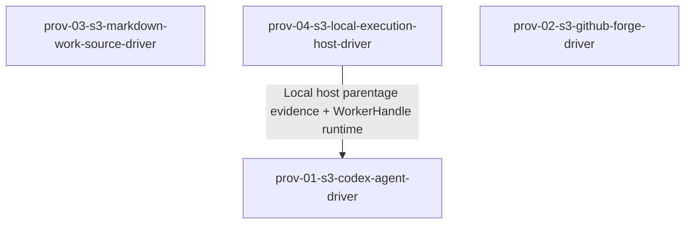

# Epic 6 Story DAG

Epic 6 turns the four concrete provider story-group signals into dispatch-ready driver stories. Each
node owns one provider package, proves the real driver against the SDK port and testkit conformance
baseline, and produces provider evidence without changing SDK contracts, core decisions, or operator
composition. The only intra-epic dependency is Codex live parentage evidence consuming the Local
Execution Host driver; all other shared contracts are prior frozen Epic 1 and Epic 2 producers.

## Sources

- This epic charter: [`README.md`](./README.md).
- [`../../epic-dag.md`](../../epic-dag.md): Epic 6 depends on Epics 1 and 2; Epic 7 consumes real
  providers for production composition.
- Included provider domain charters:
  [`prov-01`](../../domains/providers/prov-01-agent-execution.md),
  [`prov-02`](../../domains/providers/prov-02-forge-collaboration.md),
  [`prov-03`](../../domains/providers/prov-03-work-source.md), and
  [`prov-04`](../../domains/providers/prov-04-execution-host.md).
- Provider design:
  [`concrete-providers.md`](../../../design/20-sdk-and-packaging/concrete-providers.md),
  [`provider-ports.md`](../../../design/20-sdk-and-packaging/provider-ports.md),
  [`sdk-boundary.md`](../../../design/20-sdk-and-packaging/sdk-boundary.md),
  [`testkit-and-conformance.md`](../../../design/20-sdk-and-packaging/testkit-and-conformance.md),
  [`package-target.md`](../../../design/20-sdk-and-packaging/package-target.md), and
  [`dependency-rules.md`](../../../design/20-sdk-and-packaging/dependency-rules.md).
- Provider domain reference:
  [`agent-execution/`](../../../design/30-domain-reference/providers/agent-execution/),
  [`forge-collaboration/`](../../../design/30-domain-reference/providers/forge-collaboration/),
  [`work-source/`](../../../design/30-domain-reference/providers/work-source/), and
  [`execution-host/`](../../../design/30-domain-reference/providers/execution-host/).
- Frozen cross-epic producers: Epic 1 `fnd-02`, `fnd-03`, and `fnd-04` Foundation contracts; Epic 2
  provider ports, capability attestations, mocks, conformance helpers, and incident fixtures.
- Engineering constraints: [`check-gate.md`](../../../engineering/check-gate.md),
  [`test-lanes.md`](../../../engineering/test-lanes.md),
  [`testing-policy.md`](../../../engineering/testing-policy.md), and
  [`dependency-rule-enforcement.md`](../../../engineering/dependency-rule-enforcement.md).

## Reading Rules

- Node = one story contract and one later reviewable implementation scope.
- Edge = an intra-epic dependency because a consumer story uses live provider evidence or a runtime
  capability produced by another current-DAG story.
- Cross-epic frozen inputs are not intra-epic edges; each story names them in its contract.
- Concrete providers consume SDK ports and testkit conformance helpers from Epic 2. They must not
  redesign provider interfaces, own testkit mocks, or move provider behavior into the SDK/core.
- Provider packages may import `sdk` and their provider-specific runtime dependencies; production
  provider source must not import `testkit`, `cli`, `mcp`, or another provider package.
- Real processes, network, credentials, and external services are proven only in gated `smoke-real`
  tests or recorded provider evidence. `pnpm check` remains the local required gate but excludes smoke.

## Scope Decisions

### concrete-driver-per-provider

- Rationale: each Epic 6 signal is one concrete driver package whose contract, conformance, evidence,
  and dependency boundary are cohesive.
- Design trace: the Epic 6 charter lists four concrete provider outputs and
  `concrete-providers.md` maps `provider-markdown`, `provider-local`, `provider-github`, and
  `provider-codex` to their SDK ports.
- Falsification: one story changes two provider packages or a provider story edits an SDK port.
- Escalation: re-slice by provider or return to Epic 2 if a port change is required.

### prior-port-and-testkit-producers-stay-owned-by-epic-2

- Rationale: Epic 2 already owns the SDK provider interfaces, shared DTOs, capability-attestation
  envelope, mocks, and conformance helpers. Epic 6 implements drivers against those surfaces.
- Design trace: the Epic 2 story DAG marks concrete drivers out of scope and records each port/testkit
  producer.
- Falsification: an Epic 6 story redefines `WorkSourceProvider`, `ExecutionHostProvider`,
  `ForgeProvider`, `AgentProvider`, `CapabilityAttestation`, or testkit conformance helpers.
- Escalation: consume the frozen Epic 2 producer, or stop as a design-sequencing gap if the producer is
  insufficient.

### local-host-before-codex-live-parentage

- Rationale: Codex can type against the Agent port after Epic 2, but real `preservesHostProcessParentage`
  evidence requires a working Local Execution Host driver that can launch, observe, and terminate the
  worker under containment.
- Design trace: `epic-dag.md` says Codex live smoke evidence depends on a working Execution Host story;
  `codex-driver.md` requires a joint prov-01/prov-04 parentage probe.
- Falsification: the Codex story claims positive parentage, kill-dependent autonomy, or recovery powers
  using schema-only evidence or an observe-only daemon.
- Escalation: keep the capability negative until the Local driver evidence exists.

### provider-actions-are-port-methods-not-core-decisions

- Rationale: GitHub push/PR/merge, Markdown status writes, Local process execution, and Codex approval
  relay are provider method implementations. Completion, recovery, approval, liveness, and operator
  policy decisions remain in core or later Epic 7 composition.
- Design trace: every provider domain README lists core decisions and operator UX out of scope.
- Falsification: a provider story decides completion/merge readiness, approval risk, recovery action,
  liveness state, or operator UX.
- Escalation: move the decision back to its owning core/edge story.

### smoke-real-is-gated-evidence

- Rationale: real process, network, external service, and credentialed behavior cannot run in the fast
  local `pnpm check` gate. Driver contracts must still name the smoke evidence required before a live
  capability is claimed.
- Design trace: `test-lanes.md` defines `smoke-real` as the only lane permitted real processes or
  network, excluded from `pnpm check`.
- Falsification: a story claims real-driver capability from unit/integration/conformance-mock tests
  alone when the capability requires a live process, network, or credentialed provider.
- Escalation: record the capability as negative/absent until gated smoke or provider evidence exists.

## Story Nodes

| story id | job | domains | claimed signals | owned pathset | suggested tier |
|---|---|---|---|---|---|
| `prov-03-s3-markdown-work-source-driver` | Implement the concrete Markdown Work Source driver, including tracker parsing, race-safe mutation, TaskSnapshot artifacts, capability evidence, and real-driver conformance. | `prov-03` | Markdown concrete provider story group. | `packages/provider-markdown/src/**`, `packages/provider-markdown/tests/**`, `packages/provider-markdown/package.json`, `packages/provider-markdown/tsconfig.json` | elevated |
| `prov-04-s3-local-execution-host-driver` | Implement the concrete Local Execution Host driver, including workspace attachment, command capture, worker spawn/observation, termination proof, egress attestation, and real-driver conformance. | `prov-04` | Local concrete provider story group. | `packages/provider-local/src/**`, `packages/provider-local/tests/**`, `packages/provider-local/package.json`, `packages/provider-local/tsconfig.json` | elevated |
| `prov-02-s3-github-forge-driver` | Implement the concrete GitHub Forge driver, including exact-head reads/actions, PR/comment/evidence/update/enqueue/merge operations, credential-scoped redaction, and real-driver conformance. | `prov-02` | GitHub concrete provider story group. | `packages/provider-github/src/**`, `packages/provider-github/tests/**`, `packages/provider-github/package.json`, `packages/provider-github/tsconfig.json` | elevated |
| `prov-01-s3-codex-agent-driver` | Implement the concrete Codex Agent driver, including versioned schema probes, normalized events, approval answer mapping, resume, tool output refs, Guardian observations, parentage evidence, and real-driver conformance. | `prov-01` | Codex concrete provider story group. | `packages/provider-codex/src/**`, `packages/provider-codex/tests/**`, `packages/provider-codex/package.json`, `packages/provider-codex/tsconfig.json` | elevated |

## Dependency Table

| story | depends on | edge contract |
|---|---|---|
| `prov-03-s3-markdown-work-source-driver` | none | Consumes prior frozen `prov-03-s1` Work Source SDK port, `prov-03-s2` testkit conformance helpers, fnd-02 leases/artifacts, and `fnd-04` redaction. |
| `prov-04-s3-local-execution-host-driver` | none | Consumes prior frozen `prov-04-s1` Execution Host SDK port, `prov-04-s2` testkit conformance helpers, fnd-03 workspace handles, and fnd-04 injection/egress/redaction. |
| `prov-02-s3-github-forge-driver` | none | Consumes prior frozen `prov-02-s1` Forge SDK port, `prov-02-s2` testkit conformance helpers, and fnd-04 credential/redaction/audit contracts. |
| `prov-01-s3-codex-agent-driver` | `prov-04-s3-local-execution-host-driver` | Consumes Local driver live host process evidence and host-owned `WorkerHandle` runtime behavior to prove Codex parentage; also consumes prior frozen `prov-01-s1` Agent port and `prov-01-s2` testkit conformance helpers. |

## Story Graph

## Topological Bands

| band | stories | delivery note |
|---|---|---|
| 1 | `prov-03-s3-markdown-work-source-driver`, `prov-04-s3-local-execution-host-driver`, `prov-02-s3-github-forge-driver` | No intra-DAG producer edge among these stories. They own separate provider packages and share no logic-bearing files. Markdown is lowest operational risk; Local and GitHub can run in the same wave when delivery capacity allows. |
| 2 | `prov-01-s3-codex-agent-driver` | Codex live parentage evidence waits for the Local driver's host-owned worker launch and termination evidence. |

## Shared Shapes

| shared shape or predicate | producer | public import path | consumers |
|---|---|---|---|
| `WorkSourceProvider`, Work Source DTOs, `WorkSourceCapability`, `WorkSourceError`, Work Source testkit conformance helpers | Epic 2 `prov-03-s1-work-source-port` and `prov-03-s2-work-source-testkit` | `sdk`, `testkit` | `prov-03-s3-markdown-work-source-driver` |
| `ExecutionHostProvider`, host DTOs, `HostCapability`, `HostFailureReason`, Execution Host testkit conformance helpers | Epic 2 `prov-04-s1-execution-host-port` and `prov-04-s2-execution-host-testkit` | `sdk`, `testkit` | `prov-04-s3-local-execution-host-driver` |
| `ForgeProvider`, Forge DTOs, `ForgeCapability`, `ForgeFailureToken`, Forge testkit conformance helpers | Epic 2 `prov-02-s1-forge-port` and `prov-02-s2-forge-testkit` | `sdk`, `testkit` | `prov-02-s3-github-forge-driver` |
| `AgentProvider`, Agent DTOs, `AgentCapability`, `AgentFailureReason`, Agent testkit conformance helpers | Epic 2 `prov-01-s1-agent-port` and `prov-01-s2-agent-testkit` | `sdk`, `testkit` | `prov-01-s3-codex-agent-driver` |
| Local host-owned worker launch, containment, observation, and termination evidence | `prov-04-s3-local-execution-host-driver` | `provider-local` package public entrypoint plus SDK host DTOs | `prov-01-s3-codex-agent-driver` |
| `ArtifactRef`, `ArtifactStore`, `LeaseStore`, `WorktreeLease`, `CredentialScope`, `InjectionPlan`, `EgressPolicy`, `RedactionSet`, `CredentialAuditEvent`, `NegativeProbe` | Epic 1 fnd-02, fnd-03, and fnd-04 stories | `sdk` | all provider driver stories as applicable |

## DAG Edge Consumed Shape / Predicate Source Matrix

| producer -> consumer edge | graph label | consumed shape / predicate source | consumer use |
|---|---|---|---|
| `prov-04-s3` -> `prov-01-s3` | Local host parentage evidence + `WorkerHandle` runtime | Local driver smoke evidence that a worker command belongs to the host-owned `containmentRef`, plus SDK `WorkerHandle` fields from the host port | Codex `preservesHostProcessParentage` capability, kill-dependent liveness/recovery gating, and host-owned start/resume probes |

## Whole-Graph Event / Record Producer Reconciliation

| event / record or value record | shape producer | concrete value/evidence producer | consumers | closure |
|---|---|---|---|---|
| `CapabilityAttestation<WorkSourceCapability>` | Epic 2 `prov-03-s1-work-source-port` using `prov-00-s1-capability-attestation` | `prov-03-s3-markdown-work-source-driver` probes Markdown capabilities | Core capability gates, Epic 7 composition | one prior shape producer; one concrete driver evidence producer |
| `TaskView`, `TrackView`, `TaskSnapshot`, `ClaimResult`, `StatusWriteResult` | Epic 2 `prov-03-s1-work-source-port` | `prov-03-s3-markdown-work-source-driver` returns parsed/mutated Markdown values and artifact refs | Run lifecycle, completion/recovery consumers, Epic 7 | one prior shape producer; one concrete driver producer |
| `CapabilityAttestation<HostCapability>` | Epic 2 `prov-04-s1-execution-host-port` using `prov-00-s1-capability-attestation` | `prov-04-s3-local-execution-host-driver` probes Local capabilities | Core capability gates, Codex driver, Epic 7 | one prior shape producer; one concrete driver evidence producer |
| `HostWorkspaceHandle`, `WorkerHandle`, `HostObservation`, `CommandResult`, `TerminationResult`, `HostReleaseResult` | Epic 2 `prov-04-s1-execution-host-port` | `prov-04-s3-local-execution-host-driver` returns Local runtime values | Codex driver, supervision, completion/recovery, Epic 7 | one prior shape producer; one concrete driver producer |
| `CapabilityAttestation<ForgeCapability>` | Epic 2 `prov-02-s1-forge-port` using `prov-00-s1-capability-attestation` | `prov-02-s3-github-forge-driver` probes GitHub capabilities | Core capability gates, completion/merge, Epic 7 | one prior shape producer; one concrete driver evidence producer |
| `ForgeActionResult`, `ForgeDegraded`, `ForgeEvidenceSnapshot`, `ForgeObservedFacts` | Epic 2 `prov-02-s1-forge-port` | `prov-02-s3-github-forge-driver` returns exact-head GitHub facts/actions | Completion/merge/recovery, Epic 7 | one prior shape producer; one concrete driver producer |
| `CapabilityAttestation<AgentCapability>` | Epic 2 `prov-01-s1-agent-port` using `prov-00-s1-capability-attestation` | `prov-01-s3-codex-agent-driver` probes Codex capabilities | Core capability gates, approval/liveness/recovery, Epic 7 | one prior shape producer; one concrete driver evidence producer |
| `AgentSession`, `ApprovalAnswerChannel`, `AgentEvent`, `ToolObserved`, `GuardianReviewObserved`, `ApprovalAnswerResult`, `AgentReleaseResult` | Epic 2 `prov-01-s1-agent-port` | `prov-01-s3-codex-agent-driver` returns normalized Codex session/events/results | Approval, supervision, completion/recovery, Epic 7 | one prior shape producer; one concrete driver producer |
| `ArtifactRef`, `LeaseCapability`, `WorktreeLease`, `CredentialAuditEvent`, `RedactionSet`, `EgressPolicy` | Epic 1 fnd-02, fnd-03, and fnd-04 stories | consumed by provider driver stories; not re-produced here | Provider stories | prior frozen producers |

## Design-Named Event / Payload Reconciliation

Provider domains name event-ready payloads, but concrete providers do not append the run log. The
shape producer is the prior frozen SDK provider port (or generic attestation envelope), the concrete
driver produces the event-ready value/evidence, and core-01 remains the append/writer seam when a
caller records the value.

| design-named event / payload | shape producer | value/evidence producer | append writer | closure |
|---|---|---|---|---|
| `AgentCapabilityAttested` | Epic 2 `prov-01-s1` / `prov-00-s1` `CapabilityAttestation<AgentCapability>` | `prov-01-s3-codex-agent-driver` | core-01 caller-owned run writer | closed |
| `AgentSessionStarted` | Epic 2 `prov-01-s1` `AgentSession` | `prov-01-s3-codex-agent-driver` | core-01 caller-owned run writer | closed |
| `AgentSessionLinked` | Epic 2 `prov-01-s1` `AgentEvent.linked` | `prov-01-s3-codex-agent-driver` | core-01 caller-owned run writer | closed |
| `AgentProgressObserved` | Epic 2 `prov-01-s1` `AgentEvent.progress` | `prov-01-s3-codex-agent-driver` | core-01 caller-owned run writer | closed |
| `AgentApprovalRequested` | Epic 2 `prov-01-s1` `AgentApprovalRequest` / `AgentEvent.approval-requested` | `prov-01-s3-codex-agent-driver` | core-01 caller-owned run writer | closed |
| `AgentApprovalAnswered` | Epic 2 `prov-01-s1` `ApprovalAnswerResult` | `prov-01-s3-codex-agent-driver` | core-01 caller-owned run writer | closed |
| `AgentToolObserved` | Epic 2 `prov-01-s1` `ToolObserved` / `AgentEvent.tool-observed` | `prov-01-s3-codex-agent-driver` | core-01 caller-owned run writer | closed |
| `AgentGuardianReviewObserved` | Epic 2 `prov-01-s1` `GuardianReviewObserved` / `AgentEvent.guardian-review` | `prov-01-s3-codex-agent-driver` | core-01 caller-owned run writer | closed |
| `AgentSessionTerminal` | Epic 2 `prov-01-s1` `AgentEvent.terminal` | `prov-01-s3-codex-agent-driver` | core-01 caller-owned run writer | closed |
| `AgentObservationDegraded` | Epic 2 `prov-01-s1` `AgentFailure` / `AgentEvent.degraded` | `prov-01-s3-codex-agent-driver` | core-01 caller-owned run writer | closed |
| `AgentSessionReleased` | Epic 2 `prov-01-s1` `AgentReleaseResult` | `prov-01-s3-codex-agent-driver` | core-01 caller-owned run writer | closed |
| `HostWorkspaceAttached` | Epic 2 `prov-04-s1` `HostWorkspaceHandle` | `prov-04-s3-local-execution-host-driver` | core-01 caller-owned run writer | closed |
| `HostCapabilityAttested` | Epic 2 `prov-04-s1` / `prov-00-s1` `CapabilityAttestation<HostCapability>` | `prov-04-s3-local-execution-host-driver` | core-01 caller-owned run writer | closed |
| `WorkerSpawned` | Epic 2 `prov-04-s1` `WorkerHandle` | `prov-04-s3-local-execution-host-driver` | core-01 caller-owned run writer | closed |
| `HostOutputCaptured` | Epic 2 `prov-04-s1` `HostObservation.output` | `prov-04-s3-local-execution-host-driver` | core-01 caller-owned run writer | closed |
| `HostStructuredToolExitObserved` | Epic 2 `prov-04-s1` `HostObservation.structured-tool-exit` | `prov-04-s3-local-execution-host-driver` | core-01 caller-owned run writer | closed |
| `WorkerProcessExited` | Epic 2 `prov-04-s1` `HostObservation.process-exit` | `prov-04-s3-local-execution-host-driver` | core-01 caller-owned run writer | closed |
| `HostTerminationRequested` | Epic 2 `prov-04-s1` `TerminationPolicy` / request shape | caller request over prior SDK host port | core-01 caller-owned run writer | closed |
| `HostTerminationProved` | Epic 2 `prov-04-s1` `TerminationResult` / `TerminationProof` | `prov-04-s3-local-execution-host-driver` | core-01 caller-owned run writer | closed |
| `RunnerCommandStarted` | Epic 2 `prov-04-s1` `HostCommandRequest` | caller request over prior SDK host port | core-01 caller-owned run writer | closed |
| `RunnerCommandCaptured` | Epic 2 `prov-04-s1` `CommandResult` | `prov-04-s3-local-execution-host-driver` | core-01 caller-owned run writer | closed |
| `HostCredentialInjectionApplied` | Epic 1 fnd-04 `InjectionPlan` / Epic 2 `HostInjectionContext` | `prov-04-s3-local-execution-host-driver` applies the context | core-01 caller-owned run writer | closed |
| `HostCredentialMaterialDestroyed` | Epic 2 `prov-04-s1` `HostReleaseResult` plus Epic 1 fnd-04 audit records | `prov-04-s3-local-execution-host-driver` | core-01 caller-owned run writer | closed |
| `HostOperationFailed` | Epic 2 `prov-04-s1` `HostFailure` / `HostFailureReason` | `prov-04-s3-local-execution-host-driver` | core-01 caller-owned run writer | closed |
| `HostWorkspaceReleased` | Epic 2 `prov-04-s1` `HostReleaseResult` | `prov-04-s3-local-execution-host-driver` | core-01 caller-owned run writer | closed |
| Forge `CapabilityAttestation` | Epic 2 `prov-02-s1` / `prov-00-s1` `CapabilityAttestation<ForgeCapability>` | `prov-02-s3-github-forge-driver` | core-01 caller-owned run writer | closed |
| `ForgeBranchPushed` | Epic 2 `prov-02-s1` `ForgeActionResult` over `PushBranchRequest` | `prov-02-s3-github-forge-driver` | core-01 caller-owned run writer | closed |
| `ForgePullRequestUpserted` | Epic 2 `prov-02-s1` `ForgeActionResult` over `PullRequestUpsertRequest` | `prov-02-s3-github-forge-driver` | core-01 caller-owned run writer | closed |
| `ForgeCommentPublished` | Epic 2 `prov-02-s1` `ForgeActionResult` over `PullRequestCommentRequest` | `prov-02-s3-github-forge-driver` | core-01 caller-owned run writer | closed |
| `ForgeEvidenceCollected` | Epic 2 `prov-02-s1` `ForgeEvidenceSnapshot` | `prov-02-s3-github-forge-driver` | core-01 caller-owned run writer | closed |
| `ForgeBranchUpdated` | Epic 2 `prov-02-s1` `ForgeActionResult` over `ExpectedHeadActionRequest` | `prov-02-s3-github-forge-driver` | core-01 caller-owned run writer | closed |
| `ForgeMergeQueued` | Epic 2 `prov-02-s1` `ForgeActionResult` over `ExpectedHeadActionRequest` | `prov-02-s3-github-forge-driver` | core-01 caller-owned run writer | closed |
| `ForgePullRequestMerged` | Epic 2 `prov-02-s1` `ForgeActionResult` over `ExpectedHeadActionRequest` | `prov-02-s3-github-forge-driver` | core-01 caller-owned run writer | closed |
| `ForgeActionRefused` | Epic 2 `prov-02-s1` `ForgeActionResult.refused` / `ForgeDegraded` | `prov-02-s3-github-forge-driver` | core-01 caller-owned run writer | closed |

## Whole-Graph Failure Token / Catalog Reconciliation

| catalog / union | authoritative producer | exact literals or source | consumers | closure |
|---|---|---|---|---|
| `WorkSourceError` | Epic 2 `prov-03-s1-work-source-port` | `work-source-unavailable`, `track-malformed`, `dependency-unresolved`, `status-bucket-unknown`, `claim-conflict`, `claim-lock-unavailable`, `snapshot-artifact-unavailable`, `status-write-unavailable`, `status-authority-conflict` | `prov-03-s3` | prior frozen catalog; Markdown story proves every literal through conformance fixtures |
| `HostFailureReason` | Epic 2 `prov-04-s1-execution-host-port` | `host-capability-unattested`, `workspace-mount-unavailable`, `workspace-cwd-outside-mount`, `credential-injection-rejected`, `egress-confinement-unattested`, `worker-spawn-failed`, `host-observation-incomplete`, `termination-unproven`, `runner-command-capture-incomplete`, `credential-destroy-unconfirmed` | `prov-04-s3`, `prov-01-s3` | prior frozen catalog; Local story proves every literal through conformance/smoke fixtures |
| `ForgeFailureToken` | Epic 2 `prov-02-s1-forge-port` | `forge-credential-unavailable`, `forge-auth-denied`, `forge-head-mismatch`, `forge-state-unknown`, `forge-protection-uninspectable`, `forge-rulesets-unattested`, `forge-merge-queue-unavailable`, `forge-review-threads-uninspectable`, `forge-admin-bypass-refused`, `forge-ghes-capability-unknown`, `forge-rate-limited`, `forge-redaction-unavailable` | `prov-02-s3` | prior frozen catalog; GitHub story proves every literal through conformance/smoke fixtures |
| `AgentFailureReason` | Epic 2 `prov-01-s1-agent-port` | `agent-capability-unattested`, `agent-linkage-lost`, `approval-relay-unattested`, `approval-answer-channel-lost`, `agent-resume-unattested`, `structured-tool-exit-missing`, `tool-output-ref-missing`, `guardian-review-untrusted`, `host-parentage-unproven`, `agent-terminal-ambiguous` | `prov-01-s3` | prior frozen catalog; Codex story proves every literal through conformance/smoke fixtures |
| `CredentialDenialReason` and credential audit failures | Epic 1 `fnd-04-s4-audit-failures` plus `fnd-04-s2-injection-egress` | credential scope, worker Forge exposure, egress attestation, redaction, audit, and destruction failures | `prov-02-s3`, `prov-04-s3`, `prov-01-s3`, `prov-03-s3` when credentials/redaction are used | prior frozen catalog |
| `StorageError` / storage degraded modes | Epic 1 `fnd-02-s1-storage-health` and storage stories | storage health, lease, artifact, and degraded filesystem failures | `prov-03-s3`, `prov-04-s3`, `prov-01-s3` as artifact/lease/output refs are used | prior frozen catalog |

## Safety Action Provenance Matrix

| safety action | classification producer | committed gate / record source | owning story | closure |
|---|---|---|---|---|
| unattended recovery / clear / auto-retry | none in Epic 6 | none in Epic 6 | none | Epic 6 provider stories implement requested port methods only; recovery classification and `auto-recover` gates are Epic 5/core-owned. |
| GitHub `updateBranch` / `enqueue` / `merge` side effects | core-05 merge/completion decisions and explicit Forge requests, not provider-local classification | expected-head request and runner credential scope supplied by caller; provider refuses on head mismatch or denied credentials | `prov-02-s3-github-forge-driver` | not an unattended safety action; action execution is bounded by the SDK Forge port and expected-head request. |
| Markdown status write | caller-supplied `writeStatus` request with expected record digest | Work Source digest precondition and fnd-02 lease; task audit citation supplied by caller | `prov-03-s3-markdown-work-source-driver` | not an unattended recovery action; provider is the status authority and fails closed on digest/authority conflict. |

## Gate 3 Self-Check

- Coverage closed: all four Epic 6 `Story Group Signal`s map to exactly one story id in the epic
  charter.
- No invented nodes: every node covers a concrete-provider signal from the Epic 6 charter.
- Single producer per shared shape: SDK ports, DTOs, failure unions, testkit helpers, and Foundation
  shapes are prior frozen producers; only Local host parentage evidence is produced inside this DAG and
  consumed by Codex.
- Acyclic labelled edges: two topological bands; the single current-DAG edge is labelled with the
  Local host parentage evidence consumed by Codex.
- No phantom consumers: every current-DAG consumer has the Local->Codex dependency edge above and the
  consumed shape/predicate row in this DAG. Prior frozen consumers are covered through reconciliation
  rows.
- Defensible sizing: each node owns one provider package, one SDK port implementation surface, one
  conformance/smoke evidence pack, and no core decision logic.
- Dispatch-ready: every node names one owned pathset and a suggested tier. Public provider package
  exports are owned in each story's package pathset; no public SDK exports are added by Epic 6.
- Seams are importable: providers import SDK/testkit surfaces through public entrypoints and expose
  their factories through their package entrypoints.
- Event/record producer reconciliation: recorded above; every consumed record/value resolves to one
  prior frozen shape producer or one current concrete driver value producer.
- Failure-token/catalog reconciliation: recorded above; every consumed token resolves to one prior
  frozen authoritative catalog and the story contracts require enforced exact-literal fixtures.

<!-- DOCS-NAV (generated — do not edit by hand) -->

---

**↑ Up:** [Epic 6 - Concrete provider drivers](./README.md) · **← Prev:** [prov-04-s3-local-execution-host-driver implementation story](./stories/prov-04-s3-local-execution-host-driver.md) · **Next →:** [Epic 7 - Operator surfaces and end-to-end composition](../epic-7-operator-surfaces-and-composition/README.md)

<!-- /DOCS-NAV -->
