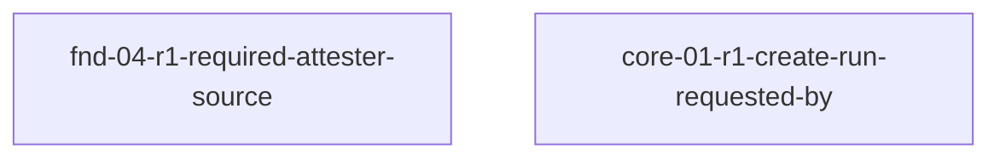

# Epic R1 - story DAG

## Sources

- This epic's charter: `docs/implementation/epics/epic-r1-closure-remediation/README.md`.
- Amended design (frozen, PR #151 `2858a4a`):
  - `docs/design/30-domain-reference/foundation/credentials-and-secrets/contracts-and-events.md`
    (`CredentialAuditContext`, `CredentialsAndSecretsContract`, `AuditBase`, `RequiredAttester`),
    `.../README.md`.
  - `docs/design/30-domain-reference/core/run-lifecycle-and-state/contracts.md` (`CreateRunInput`,
    `RunCreatedPayload`), `.../README.md`.
- fnd-01 producer of `EgressPolicySource` / `RequiredAttesterSource` (frozen, Epic 1):
  `docs/design/30-domain-reference/foundation/config-and-policy/`.
- Findings: `docs/reviews/2026-06-25-producer-consumer-closure-audit.md` (#5–#9, #18). Plan Phase C:
  `docs/reviews/2026-06-25-closure-remediation-plan.md`.
- Delivered code under remediation: `packages/sdk/src/foundation/credentials-secrets/**` (Epic 1),
  `packages/sdk/src/core/run-lifecycle/**` (Epic 3).

## Reading rules

- A **node** is one story: a coherent slice of delivered-code forward-fix with one owned pathset.
- An **edge** `A → B` means A depends on a shape or output B produces; it is labelled with the shared
  contract creating it.
- This epic claims **no new Story Group Signals**. Each node's acceptance criteria trace to the **frozen
  amended design seam** named in Sources, not to a claimed signal. Signal ownership stays with Epic 1
  (fnd-04) and Epic 3 (core-01); the global coverage rollup is unchanged.

## Epic-specific scope decisions (reviewable)

### Decision: zero-signal forward-fix epic

- Rationale: the surface under remediation was already delivered and its Story Group Signals are already
  owned by Epic 1 / Epic 3. Re-claiming them would violate exactly-once coverage. A remediation epic
  instead forward-fixes delivered code against the **frozen amended design**, owning zero signals.
- Design trace: `docs/implementation-authoring/authoring-standard/60-coverage.md` (a signal is `covered`
  by exactly one epic); `docs/reviews/2026-06-25-closure-remediation-plan.md` Phase C (forward-fix via a
  remediation epic, "never by reopening Epic 1/3 planning").
- Falsification: any node's `covers signals` names a Story Group Signal, or the global coverage rollup
  gains/changes a row because of this epic.
- Escalation: if a fix genuinely requires new signal ownership, STOP — that is new behaviour, out of this
  epic's scope; escalate to the owning epic.

### Decision: one independent story per domain (no intra-epic edge)

- Rationale: fnd-04 and core-01 live in different domains and packages and share no shape produced within
  this epic. They are independent forward-fixes and run in parallel.
- Design trace: the two seams are in disjoint design files and disjoint owned pathsets (Story nodes
  table).
- Falsification: a shared shape produced by one node and consumed by the other appears in the Shared
  shapes table.
- Escalation: if a shared shape emerges, add the producer→consumer edge and re-band before freezing.

### Decision: owned pathsets overlap delivered epics' files by design

- Rationale: a forward-fix edits already-delivered files. Epic 1 and Epic 3 are delivered and their
  charters/DAGs are frozen and not being re-run, so there is no live ownership contention — only this
  epic's stories modify these paths during this remediation.
- Design trace: charter Scope boundaries (In: editing delivered code + tests; Out: editing Epic 1/3
  planning artifacts).
- Falsification: this epic edits any Epic 1 or Epic 3 planning artifact (charter, story DAG, story
  contract) rather than code/tests.
- Escalation: if a fix cannot be made without changing an originating story contract, STOP and escalate
  a design-sequencing gap.

### Decision: ACs trace to amended design seam, not to behaviour beyond it

- Rationale: scope is strictly the threaded-context / sourced-field seam correction the amendment
  introduced — not new credential or run-lifecycle behaviour.
- Design trace: amended `CredentialsAndSecretsContract` and `CreateRunInput` definitions (Sources).
- Falsification: an AC asserts behaviour not present in the amended design lines.
- Escalation: STOP and escalate if closing a finding appears to need behaviour the amended design does
  not state.

## Story nodes

| story id | one-line job | domain(s) | claimed signals covered | owned pathset | suggested tier |
|---|---|---|---|---|---|
| `fnd-04-r1-required-attester-source` | Drop runtime-only `platform`/`driverVersion`/`runtimeMetadataAvailable` from `RequiredAttester`; remove the `'runtime-metadata-missing'` fabrication; rework the release-match to match on `driverId`/`scopeDigest`/`egressPolicyDigest` + fresh positive attestation (finding #7). #5/#6/#8/#9 verified already closed in delivered code | `fnd-04` | none (forward-fix; signal owner Epic 1 `fnd-04-s1..s4`) | `packages/sdk/src/foundation/credentials-secrets/**`, `packages/sdk/tests/foundation/credentials-secrets/**` | elevated |
| `core-01-r1-create-run-requested-by` | Add top-level required `requestedBy` to `CreateRunInput`, sourcing `RunCreatedPayload.requestedBy`; update lineage so the payload field is sourced from the input | `core-01` | none (forward-fix; signal owner Epic 3 `core-01-s1..`) | `packages/sdk/src/core/run-lifecycle/**`, `packages/sdk/tests/core/run-lifecycle/**` | light |

## Dependency table

| story | depends on | shared contract creating edge |
|---|---|---|
| `fnd-04-r1-required-attester-source` | — (consumes frozen fnd-01 `RequiredAttesterSource` and the amended fnd-04 design only) | none intra-epic |
| `core-01-r1-create-run-requested-by` | — (consumes the amended core-01 design only) | none intra-epic |

## Shared shapes — one producer per shape

This epic produces **no** new shared shape consumed by another story in this epic. Each story consumes
only shapes that already resolve to a frozen earlier epic/domain or to the frozen amended design:

| shared shape | producer | public import path | consumers |
|---|---|---|---|
| `RequiredAttesterSource` | fnd-01 (frozen, Epic 1) | existing fnd-01 public export | `fnd-04-r1-required-attester-source` (consumes; does not redeclare) |
| `RequiredAttester` (narrowed to the amended design shape) | frozen amended fnd-04 design (this epic implements, does not invent) | `sdk` foundation credentials-secrets entrypoint (existing) | implemented by `fnd-04-r1-required-attester-source` |
| `CreateRunInput`, `RunCreatedPayload` | frozen amended core-01 design (this epic implements) | `sdk` core run-lifecycle entrypoint (existing) | implemented by `core-01-r1` |

## Story graph

(Two independent nodes; no edges.)

## Topological bands

| band | stories | delivery note |
|---|---|---|
| 1 | `fnd-04-r1-required-attester-source`, `core-01-r1-create-run-requested-by` | Independent; deliver in parallel in separate worktrees. |

## Gate 3 — ready to freeze

- [x] Every signal covered maps exactly-once — N/A by design: this epic claims zero signals (see scope
  decision); each node traces to a frozen amended design seam instead.
- [x] No invented nodes — both nodes correspond to a delivered domain with a confirmed audit finding
  (#5–#9 fnd-04; #18 core-01).
- [x] Single producer per shape, no contract-into-consumer collapse — this epic produces no new shared
  shape; consumed shapes resolve to frozen fnd-01 / amended design (Shared shapes table).
- [x] Acyclic, labelled edges — no intra-epic edges; trivially acyclic.
- [x] Defensible node sizing — one node per domain seam; fnd-04 (broad, safety-sensitive) `elevated`,
  core-01 (single field) `light`.
- [x] Dispatch-ready — each node has a single owned pathset traceable to the design layer
  (`packages/sdk/src/foundation/credentials-secrets/**`, `packages/sdk/src/core/run-lifecycle/**`).
- [x] Seams importable — every declared type resolves to this epic's implementation of the frozen amended
  design or to an already-frozen earlier epic (fnd-01); no forward reference to a later epic.

<!-- DOCS-NAV (generated — do not edit by hand) -->

---

**↑ Up:** [Epic R1 - Delivered-code closure remediation](./README.md) · **← Prev:** [fnd-04-r1-required-attester-source - drop runtime-only RequiredAttester facts and fix release-match](./stories/fnd-04-r1-required-attester-source.md) · **Next →:** [implementation coverage rollup](../../coverage.md)

<!-- /DOCS-NAV -->
