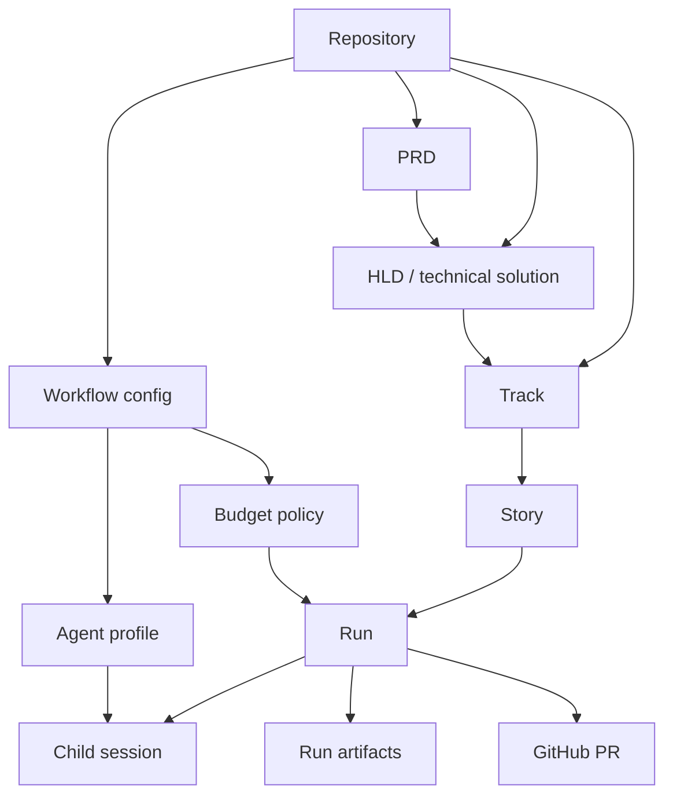

← [Back to README](./README.md)

# Domain model

## Entities

- **Repository** - the local software project where workflow config, docs, trackers, artifacts, and
  Git state live.
- **Workflow config** - repo policy for paths, statuses, verification, Git strategy, PR/merge
  behavior, host settings, budgets, and observability.
- **Workflow skill** - a guided product or delivery step, such as define product, design HLD, plan
  track, implement one story, or run track autopilot.
- **PRD** - product-level what and why, including roles, phases, metrics, and acceptance criteria.
- **HLD / technical solution** - high-level technical how for complex work, especially when data,
  runtime, integration, AI, observability, or deployment surfaces are involved.
- **Track** - contract-backed backlog that contains story IDs, dependencies, statuses, owners,
  specs, plans, and PR links.
- **Story** - the smallest executable delivery unit for the runtime.
- **Agent profile** - a named configurable agent such as story implementer, pre-PR reviewer,
  planner, analyzer, or recovery agent. Each profile owns defaults for prompt/template, model,
  reasoning effort, structured output contract, budget, and permission policy.
- **Run** - one runtime execution, either story-level or track-level, with state, events, child
  sessions, artifacts, metrics, and final outcome.
- **Child session** - an agent session launched by the runtime to perform bounded work.
- **Run artifact** - durable local evidence: state, events, metrics, transcripts, raw tool results,
  reports, and analysis data.
- **Budget policy** - per-agent-profile rules for warning, stopping new launches, stopping at a
  checkpoint, or aborting.
- **GitHub PR** - V1 collaboration unit for review, CI checks, review findings, merge, and branch
  cleanup.

## Relationships

---
Previous: [02-principles](./02-principles.md) · Next: [04-roles](./04-roles.md) · Up: [README](./README.md)
