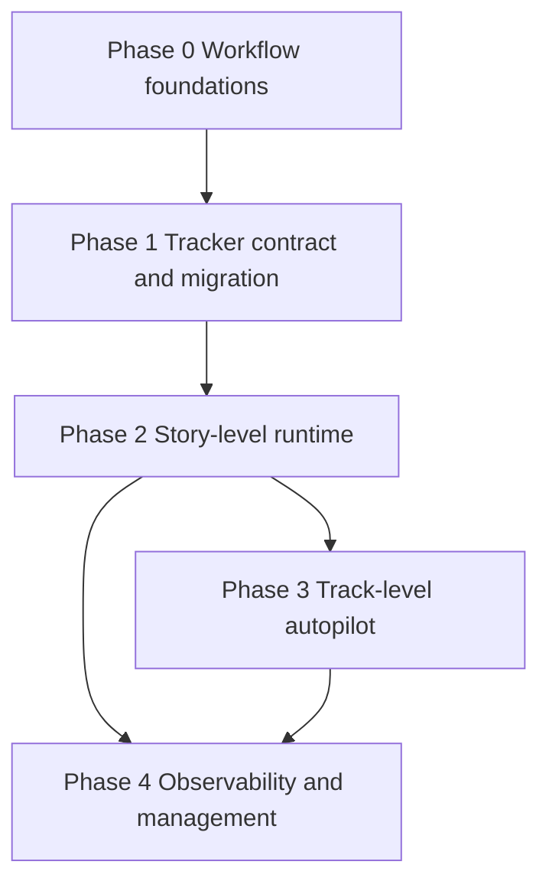

← [Back to README](./README.md)

# Phases

## Why phases

The product should ship in layers that preserve trust. The workflow authoring layer must work
before autonomous execution. Story-level execution must be dependable before track-level autopilot
scales it. Observability and recovery must arrive with runtime autonomy, not after it.

## Phase breakdown

### Phase 0 - Workflow foundations

- **Goal:** users can install/init the kit and run workflow skills independently.
- **Scope:** repo-local config, PRD definition, HLD definition, track planning, and clear contracts.
- **Exit bar:** each workflow step can start from existing context, not only from the previous kit
  step, and produces contract-compliant docs.

### Phase 1 - Tracker contract and migration

- **Goal:** existing plans and backlogs can become executable kit tracks.
- **Scope:** tracker contract, validation, listing, eligibility, ownership, and guided migration or
  import from existing docs/backlogs into the kit schema.
- **Exit bar:** runtime refuses arbitrary backlog formats but gives users a clear migration path.

### Phase 2 - Story-level runtime

- **Goal:** one story can be implemented end to end under repo policy.
- **Scope:** Codex-first child launch, worktree/branch setup, verification, pre-PR review, PR
  creation, GitHub CI/review gates, merge when configured, and local artifacts.
- **Exit bar:** a user can launch one eligible story and get either a verified PR/merge or a
  diagnosable stopped state.

### Phase 3 - Track-level autopilot

- **Goal:** the runtime can repeatedly dispatch eligible stories until the track is complete or
  blocked.
- **Scope:** eligibility loop, configurable parallelism, budget policies, stop conditions, recovery
  states, duplicate launch protection, and manual control.
- **Exit bar:** a user can approve an autopilot run and trust it to stop safely on ambiguity.

### Phase 4 - Observability and management

- **Goal:** users can understand and control autonomous work from CLI/MCP surfaces.
- **Scope:** realtime status, progress subscriptions, abort, transcript links, token/time/tool
  metrics, budget reporting, summary data, human reports, and behavior analysis.
- **Exit bar:** run artifacts are deep enough to power later TUI, dashboard, or MCP app surfaces.

## Dependency graph

---
Previous: [04-roles](./04-roles.md) · Next: [06-quality-bars](./06-quality-bars.md) · Up: [README](./README.md)
