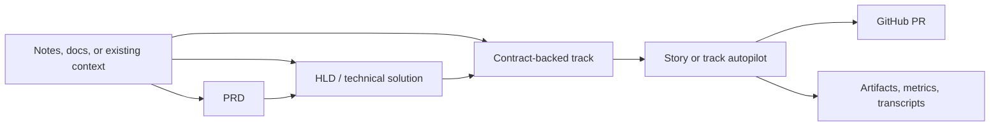

# agentic-workflow-kit redesign PRD

**Version 1 · June 2026 · draft**

agentic-workflow-kit is a local-first workflow kit and runtime for software teams using agentic
coding tools. It helps users define product intent, design high-level technical solutions, create
contract-backed delivery tracks, and run configurable autonomous implementation loops that produce
reviewable, verified GitHub pull requests.

## Document map

| # | Document | Purpose |
| --- | --- | --- |
| 1 | [01-context](./01-context.md) | Problem, opportunity, thesis, non-goals |
| 2 | [02-principles](./02-principles.md) | Operating tenets |
| 3 | [03-domain-model](./03-domain-model.md) | Conceptual model |
| 4 | [04-roles](./04-roles.md) | Personas + capabilities |
| 5 | [05-phases](./05-phases.md) | Product phases |
| 6 | [06-quality-bars](./06-quality-bars.md) | Cross-cutting quality requirements |
| 7 | [07-success-metrics](./07-success-metrics.md) | How success is measured |
| 8 | [08-acceptance-criteria](./08-acceptance-criteria.md) | Ship checklist |
| 9 | [09-risks-and-open-questions](./09-risks-and-open-questions.md) | Risks + open questions |
| 10 | [10-glossary](./10-glossary.md) | Terms |

## PRD vs technical-design boundary

This PRD owns what and why: the intended product, users, workflows, safety model, observability
expectations, and V1 acceptance criteria. It does not define the exact module layout, MCP protocol
shape, artifact schemas, driver APIs, or GitHub implementation details. Those belong in the
technical solution.

## Status & next steps

Draft. Technical solution: [technical-solution](./technical-solution.md). Next: run
`/plan-delivery-track` to decompose this PRD and technical solution into a tracker and story briefs.
