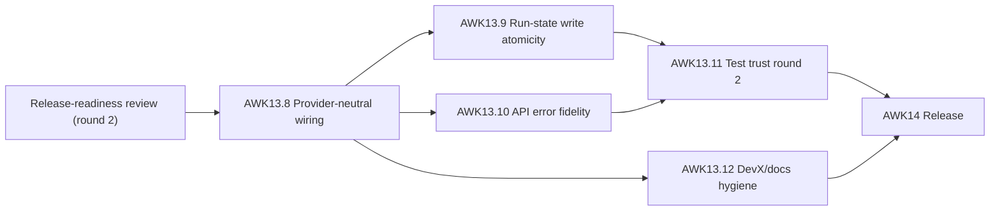

# agentic-workflow-kit release-hardening technical design (round 2)

**Source review:**
[release-readiness-review-2.md](../../tracks/agentic-workflow-kit-redesign/release-readiness-review-2.md)
**PRD criteria addressed:** HC-2, RUN-6, OBS-5, Q-2, Q-5, Q-8 (plus API-contract and DevX hygiene)

This is the round-2 remediation design for the gaps found after the first hardening pass
(AWK13.1–13.7) landed. It owns *high-level how*; it does not own exact implementation design — each
workstream becomes a tracker story (AWK13.8–AWK13.12) whose detailed technical story spec and
implementation plan are created by `implement-next` before code. The round-1 design principles still
hold; this round adds nothing that breaks them.

The decision recorded here ("address all findings, including the MEDIUM fast-follows, before V1"):
the provider-neutral wiring and public-API error fidelity are closed properly now rather than
deferred to a post-V1 track. These stories are the new final gate before AWK14.

## Design principles for the remediation

These extend the round-1 principles in
[release-hardening-design.md](./release-hardening-design.md); they are restated here because round 2
must not regress them.

1. **Compatibility-first.** Preserve existing artifact names, config keys, CLI/MCP tool names, and
   result envelopes. New config fields are optional with safe defaults; existing Codex configs keep
   working. Old run artifacts stay readable.
2. **Durability over speed.** Any state a recovery decision or a duplicate-launch guard depends on
   must survive a crash mid-write. Prefer atomic temp+rename over in-place overwrite; reuse the
   pattern already proven in `tracks/trackerClaimer.ts`.
3. **Contracts, not prose, at boundaries.** Public API error codes and child-control routing flow
   through typed contracts (`StoryRunner`, typed error classes), never through substring-matching of
   human-readable text or host-named side channels.
4. **Push host specifics behind the driver contract.** Round 1 cleared host identity out of
   `runner/`, `api/`, `scheduler/`, `tracks/`; round 2 finishes the job at the remaining edges
   (child-control MCP surface, artifact-dir derivation, resolved-config field, driver instantiation)
   so a second driver requires no edits outside the `drivers/` tree plus config aliasing.

---

## AWK13.8 — Provider-neutral wiring completion (HC-2, Q-8)

**Problem.** Round 1 made the core layers host-agnostic, but a second driver still cannot be added
without edits outside `drivers/`. `mcp/codexControl.ts` implements child reply/interrupt as a
standalone Codex path that spawns its own `StdioClientTransport` and hardcodes Codex tool-name
candidates, **bypassing `StoryRunner.controlChild`/`abort`**. The artifact root
`.codex/agentic-workflow-kit/runs` is hardcoded inside the *neutral* `ResolvedWorkflowConfig`
(`config/configLoader.ts`), `ResolvedWorkflowConfig.codex` is a provider-named field on a neutral
type (`types.ts:332`), and there is no driver factory — `new CodexMcpStoryRunner(...)` is hardcoded
at ~4 call sites.

**Design direction.** Compatibility-first; no breaking renames.

- Route the `codex_reply` / `codex_interrupt` MCP tools through the driver contract
  (`StoryRunner.controlChild` / `abort`) instead of the standalone path in `mcp/codexControl.ts`.
  Keep the existing tool names as back-compatible aliases; the Codex-specific transport/tool-name
  resolution moves behind the driver implementation.
- Introduce a driver factory/registry keyed by `OrchestratorDriver` so `CodexMcpStoryRunner` is
  instantiated in exactly one place; the ~4 call sites in `commands/handlers.ts` and
  `commands/handlerRuntimeUtils.ts` resolve the driver from the registry.
- Resolve the artifact root from the driver (or a single neutral constant) rather than hardcoding
  `.codex/...` in the neutral config; keep the existing path as the default so old runs stay
  readable and the on-disk contract is unchanged.
- Generalize `ResolvedWorkflowConfig.codex` via a neutral alias (e.g. `childSession` already present);
  keep `codex` readable as a compatibility alias.

**Acceptance.** Adding a second driver touches only the `drivers/` tree plus config aliasing — no
edits in `mcp/`, `config/`, `commands/`, or `types.ts` that branch on host identity. Existing Codex
configs and `codex_reply`/`codex_interrupt` calls keep working unchanged. Child reply/interrupt go
through `StoryRunner`.

**Affected surfaces.** `mcp/codexControl.ts`, `mcp/tools.ts`, `drivers/StoryRunner.ts`,
`drivers/codex-mcp/CodexMcpStoryRunner.ts`, `config/configLoader.ts`, `types.ts`,
`commands/handlers.ts`, `commands/handlerRuntimeUtils.ts`.

---

## AWK13.9 — Run-state write atomicity and durability (Q-2, OBS-5, RUN-6)

**Problem.** `FileArtifactStore.writeText` (and therefore `writeJson`) does a plain `writeFile` with
no temp-file + `rename` (`artifacts/FileArtifactStore.ts:11-19`). `state.json`, `summary.json`, and
every full-file artifact go through this path, so a crash mid-write corrupts run state — directly
undercutting the round-1 "harden run-state durability" claim (the *append* path was fixed; the
full-file path was not). Separately, the tracker claim lock has no stale-lock recovery: a process
that crashes holding `.lock` blocks all future claimants until manual cleanup
(`tracks/trackerClaimer.ts`).

**Design direction.**

- Make `writeText` atomic: write to a temp file in the target directory, then `rename` over the
  destination (rename is atomic within a filesystem). Reuse the exact pattern already in
  `tracks/trackerClaimer.ts` (temp write → rename → optional read-back verify). `writeJson` inherits
  atomicity for free since it delegates to `writeText`.
- Add stale-lock recovery to the claim lock: detect a dead holder via PID liveness and/or lock-age
  threshold and reclaim, rather than failing permanently after the timeout.
- Add a crash-recovery round-trip test (closes the round-1 H-2 residual): write `state.json` /
  `*.launch.json` via the **real** `FileArtifactStore`, simulate a restart (new reader), read the
  artifacts back, and assert the `RecoveryGuard` decision — replacing the current in-memory-only
  durability assertions.

**Acceptance.** A truncated/partial `state.json` is never observable: a reader either sees the old
complete file or the new complete file. A crashed claim holder no longer blocks claimants
indefinitely. The crash-recovery round-trip test exercises write → restart → read → recovery
against real files.

**Affected surfaces.** `artifacts/FileArtifactStore.ts`, `tracks/trackerClaimer.ts`, tests under
`tests/` (run-journal / recovery durability).

---

## AWK13.10 — Public API error fidelity (Q-5, API contract)

**Problem.** `api/facade.ts` classifies error codes by substring-matching human-readable English
(`message.includes('config')`, `'track'`, `'not eligible'`). This is brittle and order-dependent for
a **public** API contract — error messages are not a stable interface, and a not-found error that
mentions "config" misclassifies. `retryable` is also hardcoded `false` everywhere, making that
envelope field meaningless.

**Design direction.**

- Introduce typed error classes carrying a stable `code` (and a real `retryable` value). Throw sites
  that currently produce classified errors raise the typed error; the facade reads `error.code`
  instead of matching prose.
- Keep the existing `code` string values and envelope shape (compatibility-first) so current
  consumers see no change in the happy path — only the *classification mechanism* and previously
  meaningless `retryable` field change.

**Acceptance.** Error code is derived from the error's type, not its message text; renaming a
human-readable message does not change any code. `retryable` reflects the actual error class. Tests
assert code stability across message rewording.

**Affected surfaces.** `api/facade.ts`, a small `internal/errors.ts` (or the existing guards module),
the throw sites feeding the facade; tests.

---

## AWK13.11 — Test trust round 2 (Q-5, FUT-2)

**Problem.** The coverage ratchet is computed over a subset of suites: root `vitest.config.ts` has
no coverage block and the package config gates only `tests/**`, while high-value suites
(duplicate-launch-guard, both tracker-claimer concurrency tests, codex-control, run-analyzer,
workflow-runner) live in the *uninstrumented* root `test/**`. The reported 81.6%/72.2% understates
true coverage and the gate clears thresholds by a razor margin over a subset. There is also no
end-to-end story-run test, and the live Codex-control execution path is ~8% covered.

**Design direction.**

- Unify the vitest configs so coverage spans both `test/**` and `tests/**`; re-baseline the ratchet
  thresholds against the true combined number (still moving toward 90, no regression).
- Add one end-to-end story-run test: fake `StoryRunner` + real runner / journal / completion-gate /
  artifact store, asserting launch → verified-or-blocked outcome with artifacts written to disk.
- Add direct tests for the live `codex_reply` / `codex_interrupt` execution path (now routed through
  the contract per AWK13.8), lifting `mcp/codexControl.ts` above its floor.

**Acceptance.** A single coverage run reports one number spanning all suites and meets the
re-baselined thresholds. An e2e story-run test exists and asserts on-disk artifacts. The child-control
execution path has direct coverage.

**Affected surfaces.** `vitest.config.ts`, `packages/orchestrator/vitest.config.ts`, new tests under
`tests/`.

---

## AWK13.12 — DevX / docs hygiene round 2 (polish)

**Problem.** A few low-severity OSS-polish gaps remain after round 1: no `.github/CODEOWNERS`; the
`CODE_OF_CONDUCT.md` enforcement contact is a bare `@aryeko` GitHub handle; and one lone CamelCase
"WorkflowKit" sits in `docs/architecture.md:130` against otherwise consistent `agentic-workflow-kit`
naming.

**Design direction.**

- Add `.github/CODEOWNERS` (even a single-owner default) so review routing is explicit.
- Replace the bare handle in `CODE_OF_CONDUCT.md` with a contact address.
- Normalize the CamelCase naming nit in `docs/architecture.md`.

**Acceptance.** CODEOWNERS present and valid; CoC has a contact address; naming is consistent across
canonical docs.

**Affected surfaces.** `.github/CODEOWNERS` (new), `CODE_OF_CONDUCT.md`, `docs/architecture.md`.

---

## Sequencing

AWK13.8 lands first (seam work the others ride on). AWK13.9 and AWK13.10 follow in parallel on
disjoint surfaces. AWK13.11 lands after the behavioral stories so coverage reflects final shapes;
AWK13.12 is independent docs/DevX. AWK13.11 and AWK13.12 both gate AWK14. Detailed wave rules live in
the [tracker README](../../tracks/agentic-workflow-kit-redesign/README.md).
