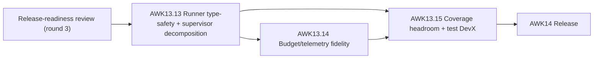

# agentic-workflow-kit release-hardening technical design (round 3)

**Source review:**
[release-readiness-review-3.md](../../tracks/agentic-workflow-kit-redesign/release-readiness-review-3.md)
**PRD criteria addressed:** OBS-4, POL-4, Q-2, Q-3, Q-5, Q-9

This is the round-3 remediation design for the residuals found after round 2 (AWK13.8–13.12) landed and
was independently re-verified as fixed at commit `d7c90b8`. It owns *high-level how*; each workstream
becomes a tracker story (AWK13.13–AWK13.15) whose detailed technical story spec and implementation plan
are created by `implement-next` before code. The round-1 and round-2 design principles still hold —
compatibility-first, durability over speed, contracts not prose at boundaries, host specifics behind the
driver contract — and this round must not regress them.

The residuals are lighter than round 2's (the HIGH durability/neutrality/prose-trust blockers already
landed). The decision recorded here: **close the one advertised-but-inert budget dimension and the
single type-safety hole before V1**, rather than ship a known no-op budget control and a documented
compiler gap. The supervision-core decomposition is bundled with the type-safety fix because both touch
the same runner internals and are best landed as one reshape.

## Design principles for the remediation

These extend the round-1/round-2 principles; restated because round 3 must not regress them.

1. **Compatibility-first.** No breaking renames of artifact names, config keys, CLI/MCP tool names, or
   result-envelope shapes. The residual host-named surfaces (`DEFAULT_ARTIFACT_ROOT_DIR`,
   `config.codex` alias) are **intentional back-compat** and stay; this round does not touch them.
2. **Honest telemetry, enforced contracts.** A budget dimension that config accepts must be one the
   runtime can actually enforce; otherwise it is not offered. Unavailable metrics stay null-with-reason,
   but config must not advertise a control that is structurally inert.
3. **Type safety is part of the contract.** The runtime's near-perfect type discipline
   (zero `any`/zero suppression) should extend to its internal call boundaries; a cycle break must not
   require defeating the compiler with `unknown` + structural cast.
4. **Behavioral changes precede the coverage re-baseline.** The ratchet is retuned only after the
   runner reshape and metric wiring land, so it reflects final shapes.

---

## AWK13.13 — Runner type-safety + supervisor decomposition (Q-2, Q-3)

**Problem.** Three runner helpers take `runner: unknown` and immediately cast it to a structural
interface — `runner/ChildSupervisor.ts:53` (`as ChildSupervisorRunner`),
`runner/ChildLaunchRecorder.ts:57` (`as ChildLaunchRunner`), `runner/WorkflowRunnerEligible.ts:44`
(`as EligibleWorkflowRunner`). This is a deliberate workaround for a cyclic dependency with
`WorkflowRunner` (which passes `this`), but it is the one place type safety is defeated in an otherwise
zero-`any`/zero-suppression package. Separately, `executeChildWithSupervisor`
(`runner/ChildSupervisor.ts:52`) is a single ~270-line function — four racing timeout promises plus
nested startup/lifecycle/polling closures — the hardest unit in the package to reason about.

**Design direction.** Compatibility-first; no behavior change.

- Introduce a typed runner-context interface (the union/superset of the existing
  `ChildSupervisorRunner` / `ChildLaunchRunner` / `EligibleWorkflowRunner` structural shapes, or a
  per-helper typed parameter) and type each helper's parameter as that interface instead of `unknown`.
  Remove the `as` casts. `WorkflowRunner` continues to pass `this`; the cycle is broken at the type
  layer by depending on the narrow interface, not the concrete class.
- Decompose `executeChildWithSupervisor` into named collaborators (e.g. startup-claim handling, timeout
  racing, lifecycle handling, supervisor polling) so the top-level function reads as orchestration. Keep
  the externally observable supervision behavior — timeouts, abort propagation, recovery-guard wiring —
  byte-for-byte identical; this is a structural refactor verified by the existing supervisor tests.

**Acceptance.** No `runner: unknown` or structural `as <…>Runner` cast remains in `runner/`. The
supervisor's public behavior is unchanged (existing tests pass without modification beyond mechanical
import moves). Typecheck and the full gate stay green.

**Affected surfaces.** `runner/ChildSupervisor.ts`, `runner/ChildLaunchRecorder.ts`,
`runner/WorkflowRunnerEligible.ts`, `runner/WorkflowRunner.ts` (parameter types only), possibly a small
shared `runner/` context type.

---

## AWK13.14 — Budget/telemetry fidelity (OBS-4, POL-4, Q-5)

**Problem.** `RunJournal` hardcodes `failedToolCalls: nullableMetric(null, …sessionLogMetrics)`
(`runner/RunJournal.ts:305`), so the metric is always null. POL-4 advertises `failedToolCalls` as a
configurable per-profile budget dimension and POL-5 maps breaches to warn/stop/checkpoint/abort, but
because the observed value is always null the dimension can never trip — an advertised control that is
structurally inert. The null itself is honest (PRD: "when host telemetry exposes them"); the defect is
the config/runtime mismatch.

**Design direction.** Pick the honest option the host actually supports — to be decided in the detailed
spec against the Codex session-log shape:

- **Preferred — wire it.** If the session-log metrics the Codex driver already parses expose failed
  tool calls (the driver parses tool activity in `drivers/codex-mcp/evidenceParser.ts`), derive
  `failedToolCalls` from them and surface it through `metrics/` into `summary.json` / `budgets.json`, so
  the budget dimension becomes enforceable. Keep null-with-reason as the fallback when a given run's
  host telemetry genuinely lacks it.
- **Fallback — retire the dimension.** If the host cannot supply it, remove `failedToolCalls` from the
  configurable budget dimensions (or mark it explicitly unsupported in `config/schema.ts` with a
  validation note) so config never offers a control the runtime cannot enforce, and document the
  limitation in the runtime-artifact/budget contract and the AWK14 release notes.

Either way, leave `tokenTelemetryLive: false` and the existing null-with-reason machinery
(`metrics/availability.ts`) unchanged — those are already honest.

**Acceptance.** A `failedToolCalls` budget either actually trips on real failed-tool-call counts, or the
dimension is no longer accepted by config and the limitation is documented. No config field advertises a
budget control that is structurally inert.

**Affected surfaces.** `runner/RunJournal.ts`, `metrics/` (budget/availability), `config/schema.ts`,
possibly `drivers/codex-mcp/evidenceParser.ts`; `references/runtime-artifact-contract.md`; tests under
`tests/`.

---

## AWK13.15 — Coverage headroom + test DevX (Q-5, Q-9)

**Problem.** The unified ratchet passes but with razor-thin headroom — branches clear by **+0.18** — so
one uncovered branch added later turns CI red. Separately, the v8 coverage provider crashes with
`ENOENT .../coverage/.tmp/coverage-0.json` when a prior `pnpm test` was interrupted and left a stale
`coverage/` directory; CI from a clean checkout is unaffected, but local contributors hit a crash that
looks like a test failure.

**Design direction.** Lands last so the re-baseline reflects the post-AWK13.13/13.14 shapes.

- Add targeted tests for the thinnest-covered branches (identify via the combined coverage report) to
  lift real headroom on branches and statements, then re-baseline the ratchet thresholds upward (no
  regression; keep moving toward 90).
- Make `pnpm test` (or a `pretest` step) clean the `coverage/` temp directory before running, or
  configure the v8 provider to tolerate/clear stale temp state, so an interrupted prior run does not
  crash the next local run.

**Acceptance.** The combined coverage gate passes with visibly more headroom on its thinnest metric, and
`pnpm test` succeeds after a previously interrupted run from the same working tree.

**Affected surfaces.** `vitest.config.ts`, root `package.json` scripts, new tests under `tests/`.

---

## Sequencing

AWK13.13 lands first (it reshapes runner internals the others ride). AWK13.14 follows because
`RunJournal` lives in `runner/`. AWK13.15 lands last so the re-baselined ratchet reflects final shapes.
All three gate AWK14. Detailed wave rules live in the
[tracker README](../../tracks/agentic-workflow-kit-redesign/README.md).

## Release-note carry-forward for AWK14

Independent of the stories above, AWK14 should record two honest, intentional limitations in the release
notes so consumers are not surprised: (1) live token telemetry is off
(`tokenTelemetryLive: false`) and token breakdowns are null-with-reason unless the host exposes them;
(2) the structured-output contract is *recorded but not enforced* (`structuredOutputEnforced: false`) —
POL-3 configurability is met, enforcement is future work.
