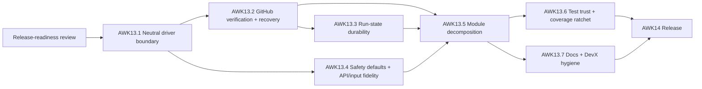

# agentic-workflow-kit release-hardening technical design

**Source review:**
[release-readiness-review.md](../../tracks/agentic-workflow-kit-redesign/release-readiness-review.md)
**PRD criteria addressed:** TRK-2, RUN-4, RUN-6, POL-1, OBS-1, HC-2, HC-3, Q-2, Q-5, Q-7, Q-8, Q-10

This is a high-level remediation design for the gaps found in the release-readiness review. It owns
*high-level how*; it does not own exact implementation design — each workstream becomes a tracker
story (AWK13.1–AWK13.7) whose detailed technical story spec and implementation plan are created by
`implement-next` before code. The decisions chosen here ("full fixes") are: close HC-2 and HC-3
properly rather than re-scope them as documented V1 limitations.

## Design principles for the remediation

1. **Compatibility-first.** Preserve existing artifact names, config keys, CLI/MCP tool names, and
   result envelopes. New config fields are optional with safe defaults. Old run artifacts stay
   readable. This mirrors the original technical solution's rollout rules.
2. **Verify before acting, do not trust prose.** Any decision that mutates a remote (merge, branch
   delete) or reports an outcome metric must be backed by an independently observable signal, not by
   regex over child output. Verification must gate the irreversible action *before* it happens: the
   parent authorizes or performs merge and branch deletion only after independent verification, and
   never relies on confirming an auto-merge the child already executed. Where a signal is
   unavailable, fail closed and mark it explicitly unavailable rather than assume success.
3. **Fail closed on ambiguity.** New gates default to the safe action (stop / require approval) when
   evidence is missing or conflicting.
4. **Push host specifics behind the driver contract.** Nothing outside the driver package may branch
   on a host's identity, error strings, paths, or tool names.

---

## AWK13.1 — Provider-neutral driver boundary (HC-2, Q-8)

**Problem.** The `StoryRunner` interface is neutral, but Codex specifics leak into the runner,
handlers, config, analyzer, artifact paths, and prompt text, so adding a second host is a
multi-domain breaking change.

**Design direction.**

- Extend the driver contract so the runner never names a host. Add to `StoryRunner` (or a sibling
  capability object): `abort(handle)` / `controlChild(handle, request)` for interrupt and reply;
  `classifyError(error): { supervisionLost: boolean; recoverable: boolean }`; and
  `describeCapabilityDowngrades(result)`. The runner consumes these instead of matching
  `/Codex MCP request timed out/` or re-authoring Codex downgrade text.
- Move prompt rendering out of the Codex driver into a host-neutral renderer that takes a rendered
  profile + story context and emits driver-agnostic instructions; host-specific phrasing (e.g.
  "@codex") lives only in the Codex driver's own decoration step.
- Introduce a neutral config namespace for child-session settings (e.g. `driver` / `childSession`)
  with `codex` retained as a compatibility alias that maps onto it, so existing configs keep working.
- Introduce a neutral session-log discovery capability on the driver; the analyzer asks the driver
  where sessions live instead of hardcoding `~/.codex/sessions`.
- Keep the artifact root name as-is for compatibility (it is a stable on-disk contract), but stop
  treating `.codex/...` as host-meaningful: document it as the kit's fixed runtime directory and
  resolve it from one constant, not from host identity.
- Control tool naming: keep `codex_reply` / `codex_interrupt` / `check_codex_mcp` as
  back-compatible aliases, and add neutral `workflow_child_reply` / `workflow_child_interrupt` /
  `workflow_driver_check` that route through the driver contract.

**Acceptance.** No file under `runner/`, `commands/`, `api/`, `analysis/` branches on a host name,
host error string, host tool name, or host path. A documented "add a second driver" checklist
touches only the `drivers/` tree and config aliasing. Existing Codex configs and tool calls keep
working unchanged.

**Affected surfaces.** `drivers/StoryRunner.ts`, `drivers/codex-mcp/*`, `runner/WorkflowRunner.ts`,
`commands/handlers.ts`, `mcp/codexControl.ts`, `mcp/tools.ts`, `config/schema.ts`,
`config/configLoader.ts`, `analysis/runAnalyzer.ts`, `references/config-schema.md`.

---

## AWK13.2 — GitHub verification and recovery hardening (HC-3, RUN-4, RUN-6, Q-5, Q-7)

**Problem.** CI-passed, review-approved, PR state, and branch deletion are extracted by regex over
the child's prose; the parent verifies nothing against GitHub, so recovery is fed null remote/PR
state and can never automate takeover.

**Design direction.**

- Add a host-neutral collaboration-verification port (e.g. `CollaborationInspector`) with a GitHub
  implementation built on `gh`/Octokit. It answers, independent of child prose: does the PR exist and
  what is its state; what are the required-check conclusions; is it merged and at which commit; was
  the branch deleted; what is the review decision. Authentication and availability are detected and
  reported, never assumed.
- **Gate the irreversible action before it happens.** When auto-merge is enabled, the child must not
  merge on its own judgment. Either the parent performs the merge after verifying required-check
  conclusions and the review decision (parent-side merge), or merge authority is withheld from the
  child until the parent emits an explicit pre-merge authorization that follows verification. The same
  applies to branch deletion. After-the-fact verification is defense-in-depth, not the primary control
  for an irreversible action.
- Make the completion gate consume verified evidence as the authority. Child prose is downgraded to a
  hint that must be confirmed. The existing git-ancestry merge check stays as a second, independent
  proof. If verification is unavailable (no `gh`, no auth, offline), the gate fails closed: do not
  treat the story as merged; produce a recoverable stopped state that names the missing signal.
- Feed `RecoveryGuard` real `remoteBranchExists` and `pr.state` from the inspector so
  `safe_to_take_over` becomes reachable when state is genuinely clean, and `manual_recovery_required`
  is produced for the enumerated RUN-6 modes (failed verification, stale base, merge conflict, auth
  failure, review uncertainty, ambiguous child state) based on observed signals.
- Capability flags: expose whether GitHub verification is available so MCP/CLI consumers and reports
  can distinguish "verified" from "child-reported" evidence (satisfies Q-5's "independently verify").

**Decisions.** The child opens the PR and pushes fixes; the **irreversible steps (merge, branch
delete) are gated by parent verification** — prefer parent-side merge, or, if the child performs the
merge mechanics, only after an explicit parent authorization that follows verification. After-the-fact
completion-gate verification stays as defense-in-depth. `gh` is the V1 transport (already a documented
dependency); Octokit is an acceptable alternative if token handling is cleaner.

**Acceptance.** A child cannot merge before verification: with auto-merge enabled and CI/review
unverified or failing, no merge or branch deletion occurs (the merge is withheld) — not merely that
the run is marked incomplete after the child already merged. A run cannot reach `merged`/complete on
the basis of prose alone: an integration test with a child that claims a fake merge / green CI but
where GitHub state disagrees produces a recoverable stopped state. When `gh` is unavailable the gate
fails closed with a named missing signal. RecoveryGuard returns `safe_to_take_over` for a
verified-clean fixture.

**Affected surfaces.** new `git`/collaboration inspector module, `runner/CompletionGate.ts`,
`runner/RecoveryGuard.ts`, `runner/WorkflowRunner.ts`, `drivers/codex-mcp/evidenceParser.ts`
(downgraded to hints), `api/facade.ts` (capability flags), `references/runtime-artifact-contract.md`.

---

## AWK13.3 — Run-state durability and concurrency hardening (Q-2)

**Problem.** Unserialized concurrent appends to `events.ndjson` can interleave; load-bearing readers
`JSON.parse` without guards; `state.json` has two unsynchronized writers; tracker claim is a TOCTOU.

**Design direction.**

- Serialize all artifact appends through a single per-store promise chain (or one long-lived append
  handle), so concurrent `appendEvent`/`appendText` calls cannot interleave a line.
- Make every NDJSON/artifact reader malformed-line tolerant: skip or surface `{ raw: line }` (the
  pattern already used by the analyzer and watch readers) for `readControls`, `readLaunchRecord`, and
  the codex-control target reader. A single corrupt line must never break abort polling or the
  duplicate guard.
- Single-source the abort state: `controls.ndjson` is the request log; only `WorkflowRunner` mutates
  `state.json`. Out-of-process abort writes a control request and lets the runner reconcile; if a
  detached/dead run must be marked aborted, use atomic temp+rename and reconcile with run ownership.
- Make the tracker claim atomic for `git.strategy: branch` parallel runs: compare-and-swap on the
  on-disk owner (re-read inside the critical section and verify `owner == self` after rename, roll
  back otherwise) or an `O_EXCL` per-story lock file.
- Make the in-run tracker parse degrade (block the bad row, keep supervising) instead of throwing and
  killing the loop; reserve throwing for the explicit validate command.

**Acceptance.** Fault-injection tests: concurrent appends never produce a malformed line; a corrupt
`controls.ndjson` / `*.launch.json` line does not break abort or duplicate detection; two concurrent
claimants yield exactly one winner; a malformed tracker row mid-run blocks one story without aborting
the run.

**Affected surfaces.** `artifacts/FileArtifactStore.ts`, `runner/RunJournal.ts`,
`runner/DuplicateLaunchGuard.ts`, `mcp/codexControl.ts`, `commands/handlers.ts` (abort path),
`tracks/trackerClaimer.ts`, `tracks/markdownTracker.ts`.

---

## AWK13.4 — Conservative defaults, API fidelity, and input hardening (POL-1, TRK-2, Q-10)

**Problem.** "Explicit approval before non-dry-run" is a skill instruction, not a code gate;
`workflow-init` can pick an auto-merge preset for a new repo; `trackerMigration` is mis-advertised as
unavailable; some results are untyped; user-supplied path config is not traversal-checked.

**Design direction.**

- Add a runtime approval/preflight gate: a non-dry-run launch requires an explicit affirmative signal
  (an `approve`/`--yes` input or a recorded prior dry-run+confirm), enforced in the handler, not the
  skill. Absent it, return a structured "approval required" result.
- Default `workflow-init` to the most conservative preset (`push-only`) for new/unknown repos;
  selecting an auto-merging preset becomes an explicit opt-in.
- Fix the capability surface: `api/facade.ts` reports `trackerMigration: true` (it is implemented and
  tested), with a test asserting the full capability set.
- Type results honestly: `analyzeRunHandler` returns `WorkflowRunAnalysis`, not `unknown`.
- Apply repo-relative path validation (the `repoRelativePath` rule already used for `worktreeDir`) to
  all repo-relative path config fields and to the `tracksDir` CLI/MCP override, rejecting `..` and
  absolute escapes at the boundary.

**Acceptance.** A non-dry-run launch without approval is refused with a structured result and tested;
`workflow-init` on a fresh repo yields `push-only`; capability set reports migration as available; a
`tracksDir: ../../etc` override is rejected.

**Affected surfaces.** `commands/handlers.ts`, `skills/workflow-init/SKILL.md` + init logic,
`config/preset.ts`, `api/facade.ts`, `config/schema.ts`, `cli/args.ts`, `mcp/tools.ts`.

---

## AWK13.5 — Module decomposition and file-size compliance (code quality)

**Problem.** Four files exceed the 800-line hard cap; `commands/handlers.ts` is a god-module.

**Design direction.** Split by responsibility behind stable public entry points (no behavior
change): `handlers.ts` → run-dispatch, run-control, event-normalization, run-inspection, watch
modules; `runAnalyzer.ts` → parse / metrics-extraction / synthesis; `WorkflowRunner.ts` → extract a
`ChildSupervisor` for the `executeChild` timeout/heartbeat state machine; `markdownTracker.ts` →
parse / validate / render. Target 200–400 lines per file, 800 hard max; functions under ~50 lines.
**Characterization tests come first:** before splitting a module, confirm its current behavior is
covered and add any missing tests as the first step of this story, so the refactor is protected by an
existing safety net — it does not rely on a later test story.

**Acceptance.** No source file over 800 lines; `executeChild` decomposed; the characterization tests
(added here where missing) are green before and after the split, with no behavior change. This story
is a pure refactor on a tested base and does not depend on AWK13.6.

**Affected surfaces.** `commands/handlers.ts`, `analysis/runAnalyzer.ts`, `runner/WorkflowRunner.ts`,
`tracks/markdownTracker.ts` and new sibling modules.

---

## AWK13.6 — Test trust and coverage ratchet (verification)

**Problem.** The green gate does not exercise the safety-critical negative paths; coverage is below
the project's own target; there is no end-to-end story run.

**Design direction.**

- Sweep for any safety-critical negative-path gap and close it. The per-behavior negative-path tests
  land with the stories that change the code — non-ancestor merge rejection and the real-git adapter
  (`isCommitReachableFromRef` / `readFileFromRef` / `refreshBaseBranch`, temp-repo harness already
  exists) plus one test per RUN-6 recoverable state in AWK13.2; malformed-NDJSON tolerance and the
  concurrent tracker-claim race in AWK13.3; operator-abort interrupting a live child in
  AWK13.1/AWK13.3; characterization tests for the split modules in AWK13.5. This story verifies the
  full set exists and adds whatever is still missing.
- Add an end-to-end story-run smoke against the fake driver that exercises
  implement → verify → (mocked) collaboration verification → completion, so the orchestration path is
  covered without a real agent.
- Ratchet the coverage thresholds in `packages/orchestrator/vitest.config.ts` upward toward 90 (the
  existing `TODO`), gating regressions.

**Acceptance.** Each negative path has a test that fails if the behavior regresses; coverage
thresholds raised and met; CI runs the ratcheted gate.

**Affected surfaces.** `packages/orchestrator/tests/*`, `packages/orchestrator/vitest.config.ts`,
test fixtures.

---

## AWK13.7 — Stale docs and DevX hygiene (docs)

**Problem.** Root `CHANGELOG.md` and `SECURITY.md` are stale; `getting-started.md` mixes command
forms; no `engines` field; the autopilot skill's tool list is a stale subset.

**Design direction.** Update root `CHANGELOG.md` to reflect the 0.5.x reality (or point to the
package changelog as the source of truth); fix `SECURITY.md` supported-versions to `0.5.x`; make
`getting-started.md` command forms consistent with the repo-checkout context it assumes; add
`engines: { node: ">=24" }` to the published `packages/orchestrator/package.json`; align the
`workflow-autopilot` SKILL tool list with the shipped tools (including `watch_run_start/poll/stop`,
child controls, and the `workflow_*` facade). Keep the changeset-generated package changelog as the
release source of truth; AWK14 owns the release changeset itself.

**Acceptance.** No stale version/security facts in root docs; getting-started commands run as written
in the documented context; `engines` present; autopilot skill matches the tool surface;
`docs-current-state` and related doc tests stay green.

**Affected surfaces.** `CHANGELOG.md`, `SECURITY.md`, `docs/getting-started.md`,
`packages/orchestrator/package.json`, `skills/workflow-autopilot/SKILL.md` (+ plugin mirror).

---

## Rollout and compatibility

Each story adds optional config with defaults, preserves artifact/tool/envelope names, and keeps old
run artifacts readable. The neutral config namespace (AWK13.1) ships with the `codex` alias so
existing `.workflow/config.yaml` files keep working. The approval gate (AWK13.4) defaults to refusing
non-dry-run launches without explicit approval, which is a behavior change toward safety — documented
in AWK13.7 and the release notes (AWK14). GitHub verification (AWK13.2) fails closed when `gh` is
unavailable, so it never makes a passing run fail spuriously without naming the missing signal.

## Testing strategy

| Layer | Added/changed coverage |
| --- | --- |
| Driver contract | neutral control/abort/error-classification path; second-driver checklist compiles against the contract |
| Completion/recovery | non-ancestor merge rejection, verification-unavailable fail-closed, RUN-6 states, RecoveryGuard safe-path |
| Durability | concurrent append integrity, malformed-line tolerance, claim race, abort-state single-writer |
| Safety/API | approval gate refusal, conservative init preset, capability flags, path-traversal rejection |
| Refactor | characterization tests added before the split; full suite green with no behavior change |
| Coverage | thresholds ratcheted toward 90; end-to-end story-run smoke |

## Sequencing

AWK13.1 first (neutral seams). AWK13.2 builds on it (the collaboration inspector is host-neutral but
the recovery/error wiring rides the neutral classifier). AWK13.3 and AWK13.4 can proceed in parallel
with care (both touch `WorkflowRunner`/`handlers`; prefer ≤2-way parallel and coordinate). **Tests
land with the behavior they cover**, so each behavioral story ships its own negative-path tests.
AWK13.5 (decomposition) adds characterization tests before splitting and therefore refactors on a
tested base — it does not depend on later test work. AWK13.6 (coverage ratchet + end-to-end smoke +
completeness sweep) and AWK13.7 (docs) come last and gate AWK14 (release).
