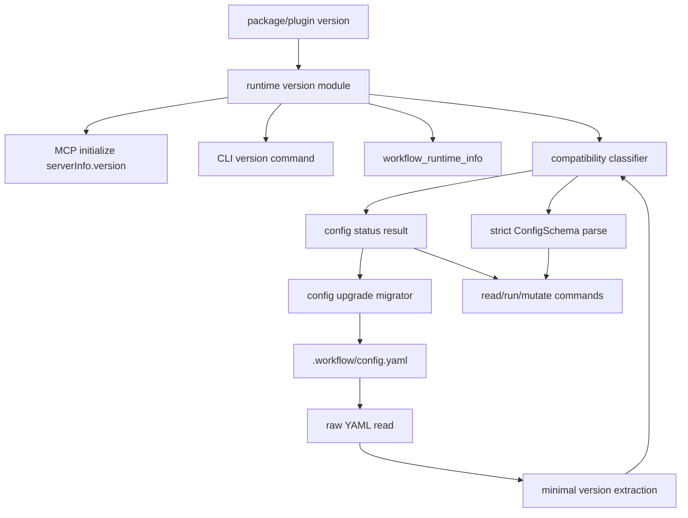

# agentic-workflow-kit runtime and config versioning technical design

**Source PRD:** [README](./README.md)
**PRD acceptance criteria:** WF-2, WF-4, WF-5, RUN-6, POL-1, POL-2, POL-7, OBS-1, OBS-3, HC-1, HC-2, FUT-2

This design defines the version-discovery and config-schema compatibility model for the
agentic-workflow-kit CLI, MCP server, and `.workflow/config.yaml`. It starts from the current repo
state and the MCP specification behavior: MCP clients receive server implementation metadata during
the initialize handshake, while users and agents still need an explicit, model-visible runtime
inspection surface.

## Context and existing surfaces

Current implementation surfaces:

- The root package and `@agentic-workflow-kit/orchestrator` package are both versioned as semver
  package artifacts.
- The MCP server currently constructs `McpServer` with `name: agentic-workflow-kit` and a hard-coded
  implementation `version: 0.1.0`.
- The CLI has no `version` command or `--version` handling; leading flags are rejected before
  commander parsing.
- `.workflow/config.yaml` currently has `version: 1`, enforced by `z.literal(1)` and documented in
  `references/config-schema.md`.
- The config loader validates the whole file with one strict schema. Version incompatibility is
  therefore reported as a generic invalid-config error instead of an actionable compatibility state.
- MCP and CLI already share product-style facade patterns for project, run, tracker, and driver
  inspection.

External protocol facts relevant to this design:

- MCP `InitializeResult.serverInfo.version` is the standard implementation version surfaced during
  server initialization.
- MCP `protocolVersion` is a protocol-compatibility value and must not be reused for
  agentic-workflow-kit package, API, or workflow-config compatibility.
- MCP elicitation can request user input during tool execution only when the client declares the
  elicitation capability, so config-upgrade prompting must have deterministic CLI/MCP fallbacks.

## Assumptions

| Assumption | Evidence | Revisit when |
| --- | --- | --- |
| Runtime package/plugin versions remain semver. | Existing `package.json`, plugin manifests, and changeset release flow already use semver. | Release tooling stops keeping package and plugin versions aligned. |
| Config schema compatibility should use semver strings, not integer revisions. | Config changes are released with package/plugin versions and users need meaningful minimum/current comparisons. | The project adopts a date-based or independent config-contract versioning policy. |
| Config schema version should be release-aligned but not bump on every release. | Only config-contract changes require repo config action; package patches can be runtime-only. | Product policy requires exact config file provenance for every release. |
| MCP handshake metadata is not enough for user-visible diagnostics. | Agents often cannot see raw initialize results; existing MCP tools return bounded structured envelopes. | Hosts expose serverInfo clearly to the model and user across supported surfaces. |
| Prompting on first activation is best-effort. | MCP elicitation is capability-gated; CLI use has no host UI beyond command output. | All supported hosts provide reliable elicitation and consent UI. |

## Technical requirements

| Requirement | PRD criteria | Technical bar | Notes |
| --- | --- | --- | --- |
| Runtime version is discoverable from CLI and MCP. | OBS-1, OBS-3, HC-1 | `agentic-workflow-kit --version`, `agentic-workflow-kit version --json`, MCP `serverInfo.version`, and a read-only MCP runtime-info tool all report the same package version. | `protocolVersion` remains MCP-only. |
| Config compatibility is evaluated before strict config parsing blocks useful diagnostics. | RUN-6, POL-1, POL-7 | Loader separates raw config read, minimal version extraction, compatibility classification, and full schema parse. | Enables actionable stale/newer/unsupported messages. |
| Minimum-supported and current config versions are explicit runtime constants. | POL-2, POL-7, FUT-2 | Runtime exports `CURRENT_CONFIG_SCHEMA_VERSION` and `MIN_SUPPORTED_CONFIG_SCHEMA_VERSION`; status tools include both. | Current version changes only when the config contract changes. |
| Stale but supported configs warn without blocking read-only work. | WF-4, OBS-3 | Read-only commands include warnings and next actions when config version is below current but at or above minimum. | Mutating commands can enforce stricter migration policies. |
| Unsupported configs fail closed for config-dependent runtime actions. | RUN-6, POL-1 | Versions below minimum or above current block run/dispatch/mutation and return structured remediation instructions. | Dedicated status/upgrade tools remain available. |
| Upgrade prompting has deterministic fallbacks. | WF-4, POL-1, OBS-1 | First activation checks status; if elicitation is unavailable, tool/CLI responses tell the agent/user exactly which upgrade command/tool to run. | No hidden auto-upgrade. |
| Config upgrades are previewable and auditable. | WF-5, POL-2, FUT-2 | `config upgrade --dry-run` and MCP `workflow_config_upgrade` return changed fields, rationale, warnings, and file refs before write. | Write requires `--yes` or explicit MCP input. |

## System architecture diagram



## Proposed modules/components

| Module/component | Responsibility | Inputs | Outputs | Dependencies |
| --- | --- | --- | --- | --- |
| `runtime/version.ts` | Single source for package version, API version, current config schema version, minimum supported config schema version, and MCP server display metadata. | Package metadata or generated build constant. | Runtime/version info object. | Package release flow. |
| `config/version.ts` | Parse and compare config semver, classify compatibility, and expose migration policy metadata. | Raw YAML object, runtime version constants. | `current`, `supported`, `stale`, `unsupported-old`, `unsupported-new`, `invalid` status. | Semver comparison helper. |
| `config/migrations/*` | Ordered config migrations with summaries and safety metadata. | Raw config object and from/to versions. | Updated config object, change list, warnings. | YAML serializer and ConfigSchema. |
| `config/resolve.ts` | Split raw read, compatibility check, strict parse, and error formatting. | Config path/cwd. | Loaded config or structured compatibility failure. | Existing config schema. |
| `cli/args.ts` and `cli.ts` | Add `--version`, `version`, `config status`, and `config upgrade`. | CLI args. | Plain text or JSON output. | Runtime info and config migration APIs. |
| `mcp/tools.ts` | Add read-only `workflow_runtime_info`, `workflow_config_status`, and guarded `workflow_config_upgrade`. | Optional `cwd`, `configPath`, response format, dry-run/write confirmation. | Product envelope with warnings and next actions. | Facade helpers. |
| `mcp/server.ts` | Report the real implementation version in `serverInfo.version`. | Runtime version module. | Correct MCP initialize metadata. | MCP SDK. |
| `references/config-schema.md` and generated schema | Document semver `version`, compatibility policy, and upgrade behavior. | Zod schema and migration metadata. | Human and machine docs. | Existing drift tests. |
| `skills/workflow-init` and runtime skills | Teach first-activation/config-staleness flow. | Config status tool or CLI result. | Ask user before upgrade, run upgrade when approved. | Existing skill instructions. |

## Data/query design

No database or remote query surface is in scope. The data contract changes are local file and
artifact shapes:

- `.workflow/config.yaml` changes top-level `version` from integer `1` to a semver string, for
  example `"0.6.0"`.
- `references/config.schema.json` should accept the supported semver shape and document the current
  schema version in `$comment` or a generated metadata field.
- Config migration metadata should be deterministic and testable:

```ts
interface ConfigMigration {
  from: string;
  to: string;
  summary: string;
  addedCapabilities: string[];
  behaviorChange: "none" | "warn" | "blocks-mutating-actions";
  apply(rawConfig: unknown): unknown;
}
```

- Runtime status results should include:

```ts
interface WorkflowRuntimeInfo {
  packageVersion: string;
  mcpServer: { name: string; version: string };
  apiVersion: "1";
  configSchema: {
    current: string;
    minimumSupported: string;
  };
}
```

- Config status results should include detected config version, current/minimum versions,
  compatibility classification, upgrade availability, blocking level, warnings, added capabilities,
  and next actions.

## AI prompts/triggers/tools

No model prompt templates are required for version checks. The AI-facing behavior is instruction and
tool-surface design:

- Runtime skills should check config status before mutating or dispatching work.
- If config is stale and supported, the agent should summarize added capabilities and ask whether to
  upgrade first; read-only inspection may continue with a warning.
- If config is unsupported-old or unsupported-new, the agent should stop before config-dependent
  work and point to the exact upgrade/downgrade runtime action.
- MCP elicitation may be used for "upgrade now?" only when the client declares support. Without
  elicitation, the MCP tool response should return a `next` action and the agent should ask in chat.
- Upgrade tools must never request secrets or credentials through elicitation.

## Observability/events/metrics

| Signal | Type | Purpose | Owner/consumer |
| --- | --- | --- | --- |
| `workflow_config_compatibility_checked` | log/event | Proves a runtime action evaluated config compatibility. | CLI/MCP diagnostics, tests. |
| `workflow_config_upgrade_previewed` | log/event | Records dry-run migration summary without writing. | User, reviewer, future audit tools. |
| `workflow_config_upgraded` | log/event | Records from/to versions and migration ids after write. | User, support diagnostics. |
| Config warnings in API envelopes | structured warning | Lets MCP/CLI consumers distinguish stale-supported from blocked states. | Agents and users. |
| Runtime info output | command/tool result | Provides package, MCP, API, and config-schema versions in one place. | Users, CI, support. |

Version and config-status checks do not need long-lived run artifacts unless they occur inside a
workflow run. If a run is blocked by config compatibility, the blocker should name the detected
version, current version, minimum-supported version, and upgrade command.

## Migration/deploy surfaces

Rollout should be staged to avoid breaking existing repos:

1. Introduce runtime version constants, CLI/MCP version reporting, and MCP `serverInfo.version`
   correction without changing config parsing.
2. Add compatibility classifier that treats legacy numeric `version: 1` as an alias for the first
   semver config version during a transition window.
3. Add `config status` and `config upgrade --dry-run`, plus MCP equivalents.
4. Add migration from `version: 1` to `"0.6.0"` or the release version that first ships this
   contract. The migration should preserve all existing keys and only rewrite the version field
   unless required by that release's actual config changes.
5. Update presets, generated schema, docs, tests, and local plugin fixtures in the same change.
6. Enforce blocking policy for unsupported-old/unsupported-new configs after the migration tooling
   is available.

Rollback expectations:

- A runtime should not rewrite config unless explicitly approved.
- Older configs inside the transition window remain readable.
- Newer configs fail closed with an "upgrade the runtime" message.
- The MCP server should still start even when the target repo config is incompatible; only
  config-dependent tool calls should fail.

## Testing strategy

| Test layer | Scope | Command or gate | PRD/solution coverage |
| --- | --- | --- | --- |
| Unit | Semver parsing, min/current/current-plus-one compatibility, numeric legacy mapping. | `pnpm --filter @agentic-workflow-kit/orchestrator test` | RUN-6, POL-7. |
| Unit | Config migrations preserve unknown-safe structure only where allowed and reject invalid post-migration output. | `pnpm --filter @agentic-workflow-kit/orchestrator test` | POL-2, WF-5. |
| CLI | `--version`, `version --json`, `config status`, `config upgrade --dry-run`, and write confirmation. | `pnpm check` | OBS-1, OBS-3. |
| MCP | `serverInfo.version`, `workflow_runtime_info`, `workflow_config_status`, and blocked stale/unsupported actions. | `pnpm check`, MCP server tests. | HC-1, HC-2, POL-1. |
| Docs/schema drift | Generated `config.schema.json`, `config-schema.md`, presets, and plugin fixtures stay synced. | `pnpm generate-schema && pnpm check` | WF-5, FUT-2. |
| Regression | Existing `version: 1` config remains accepted or produces an upgradeable status during transition. | `pnpm check` | RUN-6, POL-1. |

## Open technical questions

| Question | Blocking? | Recommended default | Resolution path |
| --- | --- | --- | --- |
| What exact semver should replace legacy `version: 1`? | No | Use the first release version that ships config semver support. | Set during implementation based on package version. |
| Should config schema version bump on every release? | No | No; bump only when `.workflow/config.yaml` contract or default semantics change. | Document in release checklist. |
| Should stale-supported configs block non-mutating tools? | No | Warn only; block mutating/dispatch actions only when migration metadata marks behavior-changing API semantics. | Encode in migration metadata and tests. |
| Should upgrade prompt use MCP elicitation? | No | Use elicitation when available, otherwise return next actions and ask in chat. | Implement after checking SDK support in current MCP server wrapper. |

## Inputs for delivery tracker/story briefs

| Story brief input | PRD criteria | Technical solution sections to cite | Sequencing/file-contention notes |
| --- | --- | --- | --- |
| Runtime version source and surfaces | OBS-1, OBS-3, HC-1 | Context, Proposed modules/components, Testing strategy | Touches package metadata, `mcp/server.ts`, CLI parser, README. Do before config compatibility so diagnostics can report runtime versions. |
| Config compatibility classifier | RUN-6, POL-1, POL-7 | Data/query design, Migration/deploy surfaces | Touches `config/resolve.ts`, `config/schema.ts`, new version helpers, types. Coordinate with schema drift tests. |
| Config migration/status CLI and MCP tools | WF-4, OBS-1, OBS-3 | AI prompts/triggers/tools, Proposed modules/components | Touches CLI args, facade, MCP tools, output envelopes. Depends on classifier. |
| Legacy numeric config migration | POL-2, WF-5, FUT-2 | Data/query design, Migration/deploy surfaces | Touches presets, generated schema, docs, tests, plugin fixture sync. Depends on migration API. |
| Skill activation guidance | WF-4, POL-1 | AI prompts/triggers/tools, Open technical questions | Touches `skills/workflow-init`, `workflow-autopilot`, `implement-next`, docs. Should land after tools exist. |
| Verification and release checklist | WF-5, FUT-2 | Testing strategy, Observability/events/metrics | Add tests and docs that enforce package/plugin/MCP/config version consistency. Final story should run `pnpm check`. |
