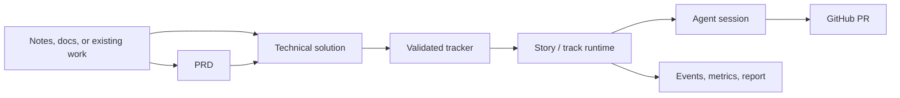
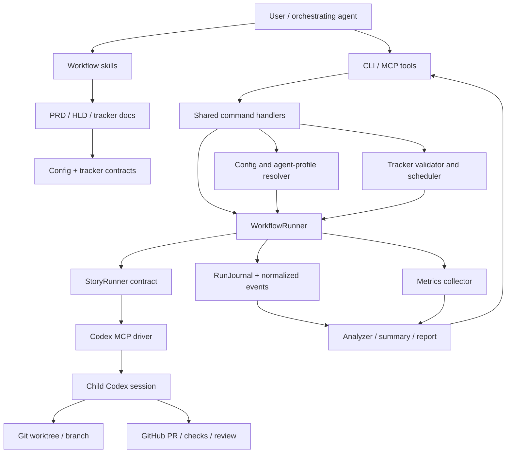

# agentic-workflow-kit redesign technical solution

**Source PRD:** [README](./README.md)
**PRD acceptance criteria:** WF-1, WF-2, WF-3, WF-4, WF-5, TRK-1, TRK-2, TRK-3, TRK-4, RUN-1, RUN-2, RUN-3, RUN-4, RUN-5, RUN-6, POL-1, POL-2, POL-3, POL-4, POL-5, POL-6, POL-7, OBS-1, OBS-2, OBS-3, OBS-4, OBS-5, OBS-6, OBS-7, HC-1, HC-2, HC-3, HC-4, FUT-1, FUT-2

agentic-workflow-kit should become a local-first workflow product for turning product intent into
technical design, contract-backed delivery tracks, and configurable autonomous implementation runs.
The technical design keeps that journey understandable at the top level, while the deep dives hold
the sequence diagrams, state machines, schemas, and runtime contracts that delivery stories need.

## Document map

| # | Document | Purpose |
| --- | --- | --- |
| 1 | [Architecture and domains](./technical-solution/01-architecture-and-domains.md) | System shape, bounded contexts, and module responsibilities |
| 2 | [Runtime flows](./technical-solution/02-runtime-flows.md) | Authoring, story execution, autopilot, streaming, and state/control diagrams |
| 3 | [Data contracts](./technical-solution/03-data-contracts.md) | File-backed data model, config/profile shape, artifacts, metrics, and interfaces |
| 4 | [AI, observability, and operations](./technical-solution/04-ai-observability-operations.md) | Prompt boundaries, MCP/CLI tools, notifications, events, rollout, security, and tests |
| 5 | [API surface](./technical-solution/05-api-surface.md) | Product-first MCP and CLI API contract, schemas, streaming, and errors |
| 6 | [Delivery inputs](./technical-solution/06-delivery-inputs.md) | Story-area handoff table and non-blocking technical questions |
| S1 | [Runtime and config versioning](./runtime-versioning-design.md) | Supplemental design for CLI/MCP version discovery, config schema compatibility, upgrade prompting, and migration tools |

## Context and existing surfaces

The current product already has the right spine: repo-local `.workflow/config.yaml`, markdown
trackers, PRD/HLD/track skills, an orchestrator package, CLI/MCP surfaces, a `WorkflowRunner`,
Codex MCP child driver, run journals, metrics snapshots, and analyzer reconstruction.

The redesign preserves that spine and makes it a clearer product architecture:

- Authoring steps stay independently invokable. A user can create an HLD from a PRD, from a live
  brainstorming session, or from an externally authored design.
- Runtime execution remains tracker-contract based. Existing arbitrary backlogs must be migrated
  before the runtime can execute them.
- V1 stays local-first and Codex-first, while the execution boundary is provider-neutral enough for
  future drivers.
- GitHub is the concrete V1 collaboration target.
- Runtime observability is V1 scope. A benchmark/evaluation harness is future scope, but V1
  artifacts must be shaped for it.

Deep dive: [Architecture and domains](./technical-solution/01-architecture-and-domains.md).

## Technical requirements

| Area | PRD criteria | Technical direction |
| --- | --- | --- |
| Workflow authoring | WF-1, WF-2, WF-3, WF-4, WF-5 | Skills accept upstream kit artifacts or explicit external context, record assumptions, and write contract-compliant docs. |
| Tracker validation and migration | TRK-1, TRK-2, TRK-3, TRK-4 | Runtime executes only validated kit trackers; migration/import produces draft trackers plus diagnostics. |
| Story and track runtime | RUN-1, RUN-2, RUN-3, RUN-4, RUN-5, RUN-6 | Story execution is the primitive; track autopilot schedules eligible story runs with policy, budget, recovery, and completion gates. |
| Policy, agents, and budgets | POL-1, POL-2, POL-3, POL-4, POL-5, POL-6, POL-7 | Config defines autonomy presets, named agent profiles, prompt/model/reasoning defaults, structured output, and budget actions. |
| Observability and control | OBS-1, OBS-2, OBS-3, OBS-4, OBS-5, OBS-6, OBS-7 | CLI/MCP expose status, stream, inspect, abort, analyze, and report over normalized events and artifacts. |
| API consistency | WF-5, RUN-1, RUN-2, OBS-1, OBS-2, OBS-3, HC-1, HC-2 | MCP and CLI share the same conceptual resources, command semantics, result envelopes, event stream, and error model. |
| Host and collaboration | HC-1, HC-2, HC-3, HC-4 | Codex MCP is the V1 driver; the driver contract remains host-neutral; GitHub PR/check/review/merge evidence is structured. |
| Future readiness | FUT-1, FUT-2 | V1 avoids hosted dashboards/evals but produces structured run data that can power them later. |

## System architecture diagram

The main architectural rule is separation of concerns: authoring writes durable intent, contracts
validate executable work, runtime schedules and supervises, agent execution owns host interaction,
and observability reconstructs what happened from normalized artifacts.

Deep dive: [Architecture and domains](./technical-solution/01-architecture-and-domains.md).

## Proposed modules/components

| Module group | Responsibility | Primary surfaces |
| --- | --- | --- |
| Authoring contracts | Keep PRD, HLD, tracker, story brief, detailed spec, and runtime responsibilities separate. | `skills/`, `references/`, `docs/prds/*`, `docs/tracks/*` |
| Config and policy | Resolve repo policy, agent profiles, task bindings, prompt/output defaults, budgets, and observability defaults. | `packages/orchestrator/src/config/schema.ts`, generated schema/docs, presets |
| Tracker validation and scheduling | Parse markdown trackers, validate dependency/status contracts, compute eligibility, and claim stories safely. | `markdownTracker.ts`, command handlers, CLI/MCP tools |
| Runtime supervision | Dispatch story runs, enforce stop policies, apply completion/recovery gates, and preserve artifact state. | `WorkflowRunner`, guards, metrics, journal |
| API facade | Present the same product API through MCP tools and CLI commands, including result envelopes, filters, streaming, and errors. | MCP tools, CLI commands, shared command handlers |
| Agent execution | Render prompts, negotiate driver capabilities, launch child sessions, map host events into normalized events. | `StoryRunner`, Codex MCP driver |
| Observability and control | Stream progress, write run artifacts, process abort/control requests, analyze runs, and produce reports. | `RunJournal`, `events.ndjson`, `controls.ndjson`, analyzer |
| Collaboration evidence | Capture Git branch/worktree, PR, checks, reviews, merge, and cleanup evidence without trusting child prose alone. | Git/GitHub evidence records, child result artifacts |

Deep dive: [Architecture and domains](./technical-solution/01-architecture-and-domains.md).

## Data/query design

No database is in scope for V1. Data is file-backed and local-first:

- `.workflow/config.yaml` is the repo policy source of truth.
- Markdown PRD/HLD/tracker/story-brief files are the durable planning artifacts.
- Run artifacts under `.codex/agentic-workflow-kit/runs/<runId>/` are the runtime source of truth.
- Host transcripts stay in host session storage and are linked by path unless a future export mode
  copies them into a bundle.

The major schema additions are agent profiles, task bindings, prompt/template refs, structured
output refs, budget policies, stream subscription defaults, and report artifact settings.

Deep dive: [Data contracts](./technical-solution/03-data-contracts.md).

## AI prompts/triggers/tools

V1 triggers are explicit CLI/MCP/user actions: define product, design technical solution, plan
track, validate or migrate tracker, dry-run, run story, run eligible/autopilot, watch/stream,
inspect, analyze/report, and abort.

Agent prompts should be treated as runtime API payloads, not loose prose:

- Agent profiles resolve prompt/template, model, reasoning effort, sandbox, approval policy, host
  config, structured output, and budget before launch.
- Codex-specific behavior stays inside the Codex MCP driver.
- Parent progress notifications are emitted from normalized WorkflowKit events, not raw child
  Codex events.

Deep dive: [AI, observability, and operations](./technical-solution/04-ai-observability-operations.md).

## MCP/CLI API surface

The public API should be designed from the product model, not the current implementation. MCP and
CLI are two transports over the same resources:

- project context, config, agent profiles, PRD/HLD/track artifacts
- tracks, stories, runs, child sessions, events, controls, reports, and exports
- shared envelopes for success, validation errors, warnings, artifact refs, and next actions

The CLI optimizes for humans and automation in a shell. MCP optimizes for orchestrating agents that
need structured results, bounded payloads, live progress subscriptions, and exact artifact links.

Deep dive: [API surface](./technical-solution/05-api-surface.md).

## Observability/events/metrics

The runtime writes normalized events and metrics that can serve three consumers:

- durable reconstruction through `events.ndjson`, `metrics.live.json`, `summary.json`, `rows.json`,
  `analysis.json`, and `report.md`
- manual status inspection through CLI/MCP watch and inspect calls
- live orchestration through streaming subscriptions and progress notifications

Metrics should include wall time, phase durations, child startup/active/no-progress time, tool call
counts, failed calls, subagent counts, token fields when available, budget outcomes, and GitHub
checkpoint evidence.

Deep dive: [AI, observability, and operations](./technical-solution/04-ai-observability-operations.md).

## Migration/deploy surfaces

There are no database migrations or hosted deploy surfaces for V1. Rollout should be
compatibility-first:

1. Add config schema fields as optional with defaults.
2. Preserve existing artifact names and analyzer compatibility.
3. Add new artifact files without changing existing semantics.
4. Add new CLI/MCP tools while preserving existing tool names and inputs.
5. Update plugin manifests, fixtures, references, presets, and tests with behavior changes.

Rollback must keep older configs and older run artifacts readable. If streaming is unavailable,
`watch_run` polling remains the fallback. If token telemetry is unavailable, token budgets are
reported as unenforceable rather than breaking unrelated runs.

Deep dive: [AI, observability, and operations](./technical-solution/04-ai-observability-operations.md).

## Testing strategy

| Test layer | Scope | Gate |
| --- | --- | --- |
| Contract/template tests | PRD, technical solution, tracker, story brief, migration report shape | Focused Vitest docs tests |
| Config/preset tests | Agent profiles, task bindings, budgets, observability defaults, generated schema drift | Config and preset Vitest tests |
| Runtime tests | Tracker validation, story and track loops, stop policies, abort controls, duplicate launch guards | Orchestrator unit tests |
| Driver tests | Host-neutral lifecycle, Codex events, progress, session linkage, cancellation, evidence | Fake driver and Codex MCP tests |
| Analyzer/report tests | Existing/new artifact shapes, transcript parsing, token fields, summary rows, markdown reports | Analyzer fixture tests |
| Package/plugin smoke | Package build, dry-run pack, Codex/Claude plugin fixture startup | `pnpm check`, package/plugin smoke commands |

Deep dive: [AI, observability, and operations](./technical-solution/04-ai-observability-operations.md).

## Open technical questions

No open question blocks delivery-track planning. The important defaults are:

- Use `agents.profiles.<profileName>` and `agents.bindings.<taskType>` for profile config.
- Start with built-in output schemas for child results, review results, planning results, run
  analysis, recovery decisions, and migration reports.
- Add `workflow_run_stream` for long-lived live progress while keeping snapshot status
  compatibility.
- Enforce wall-time/tool-count budgets live; report token budgets from transcript/analyzer until
  live token telemetry is proven.
- Keep GitHub workflow child-owned in V1, but require structured evidence extraction and analyzer
  validation.

Deep dive: [Delivery inputs](./technical-solution/06-delivery-inputs.md).

## Inputs for delivery tracker/story briefs

The delivery tracker should be sliced around foundations first, then runtime hardening, then
observability/reporting and packaging stabilization.

| Story area | PRD criteria | Deep-dive sections to cite |
| --- | --- | --- |
| Config agent profiles, prompts, structured outputs, and budgets | POL-3, POL-4, POL-5, POL-6, POL-7, HC-2 | [Architecture and domains](./technical-solution/01-architecture-and-domains.md), [Data contracts](./technical-solution/03-data-contracts.md) |
| Workflow-step independence | WF-1, WF-2, WF-3, WF-4, WF-5 | [Runtime flows](./technical-solution/02-runtime-flows.md), [AI/operations](./technical-solution/04-ai-observability-operations.md) |
| Tracker validation and migration | TRK-1, TRK-2, TRK-3, TRK-4 | [Architecture and domains](./technical-solution/01-architecture-and-domains.md), [Data contracts](./technical-solution/03-data-contracts.md) |
| Story/track runtime policies | RUN-1, RUN-2, RUN-3, RUN-4, RUN-5, RUN-6 | [Runtime flows](./technical-solution/02-runtime-flows.md), [Delivery inputs](./technical-solution/06-delivery-inputs.md) |
| Streaming, abort, analyzer, and reports | OBS-1, OBS-2, OBS-3, OBS-4, OBS-5, OBS-6, OBS-7, FUT-1, FUT-2 | [Runtime flows](./technical-solution/02-runtime-flows.md), [AI/operations](./technical-solution/04-ai-observability-operations.md) |
| Provider-neutral driver and GitHub evidence | HC-1, HC-2, HC-3, HC-4 | [Architecture and domains](./technical-solution/01-architecture-and-domains.md), [Data contracts](./technical-solution/03-data-contracts.md) |

Deep dive: [Delivery inputs](./technical-solution/06-delivery-inputs.md).
