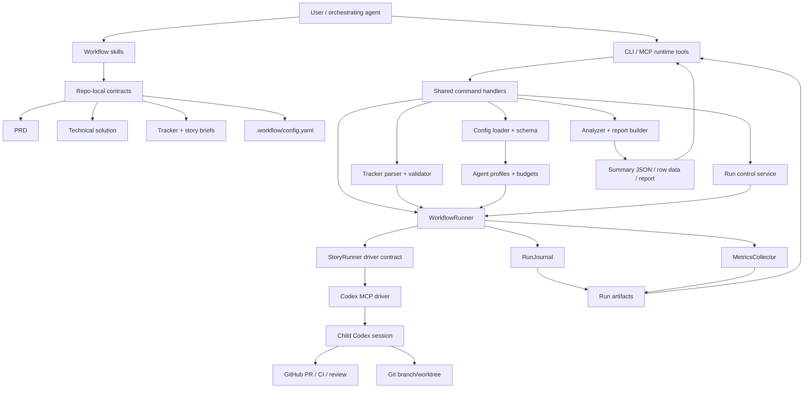
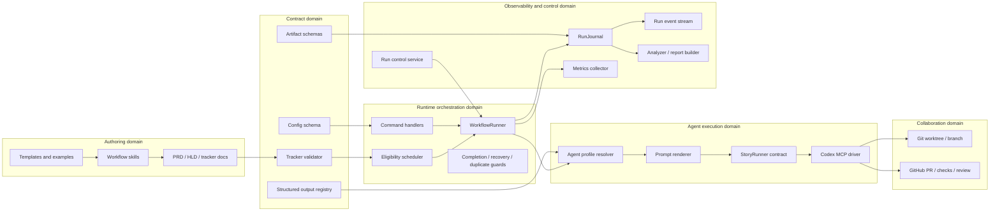

# Architecture and domains

This page is the deep dive for the system shape, bounded contexts, and component ownership.

## System architecture

## Domain architecture

| Domain | Owns | Does not own | Primary artifacts/APIs |
| --- | --- | --- | --- |
| Authoring | User-facing workflow skills, templates, generated PRD/HLD/track/story-brief markdown. | Runtime dispatch behavior or host-specific session mechanics. | `skills/*/SKILL.md`, `references/templates/*`, `docs/prds/*`, `docs/tracks/*` |
| Contract | Machine-valid repo policy, tracker shape, story graph validation, artifact event schemas, structured output schema names. | Launching child sessions or mutating tracker status. | `.workflow/config.yaml`, `references/config.schema.json`, tracker diagnostics, event schemas |
| Runtime orchestration | Command semantics, dry-run behavior, story claim/settle loop, stop policies, completion/recovery decisions. | Prompt wording, provider transport internals, GitHub implementation details beyond evidence requirements. | `commands/handlers.ts`, `WorkflowRunner`, scheduler, gates |
| Agent execution | Agent profiles, prompt rendering, model/reasoning/speed selection, driver capability negotiation, child session lifecycle. | Tracker parsing or report generation. | `ResolvedAgentProfile`, prompt payloads, `StoryRunner`, Codex driver events |
| Observability and control | Normalized event stream, live metrics, run control requests, analyzer/report reconstruction. | Business decisions hidden in prompts. | `events.ndjson`, `metrics.live.json`, `controls.ndjson`, `summary.json`, `rows.json`, `report.md` |
| Collaboration | Evidence for branch, PR, checks, reviews, merge, and cleanup. | Runtime eligibility policy. | Git state, GitHub evidence records, child result evidence |

## Proposed modules/components

| Module/component | Responsibility | Inputs | Outputs | Dependencies |
| --- | --- | --- | --- | --- |
| Workflow skill contracts | Keep PRD, HLD, track, story brief, detailed spec, and runtime responsibilities separate. | User context, repo docs, existing artifacts | Contract-compliant markdown artifacts | `skills/`, `references/` |
| `ConfigSchema` extensions | Add agent profiles, task bindings, prompt defaults, structured-output contracts, child-session speed/service-tier policy, budgets, notification/watch policy, artifact/report settings, and migration settings. | `.workflow/config.yaml` | Resolved config plus JSON schema/docs | Zod schema, config docs, presets |
| Agent profile and launch-policy resolver | Resolve logical task type to a named profile, then combine prompt/template, model, reasoning effort, child-session speed/service-tier policy, structured output contract, approval policy, sandbox, host config, and budget defaults. | Config, CLI/MCP overrides, task type, optional profile override | Effective child/session launch policy | Config loader, CLI/MCP schemas |
| Prompt/template registry | Resolve built-in or repo-local prompt templates and variables for each agent profile. | Agent profile, story/run context, repo policy | Renderable prompt payload plus prompt hash | Skills, references, prompt templates |
| Structured output registry | Define built-in and repo-local output contracts for child results, review findings, analyzer reports, and migration reports. | Agent profile, output schema name/path | JSON schema or host-compatible structured-output descriptor | Driver contract, analyzer, evidence parser |
| Budget policy engine | Evaluate observed usage against configured policies and choose warn/stop/abort outcomes. | Metrics updates, agent profile budgets, run state | Budget events, stop decisions, artifact fields | Metrics collector, runner |
| Tracker validator | Validate tracker contract independently of dispatch and return actionable diagnostics. | Tracker markdown, config statuses, id pattern | Valid story graph or validation report | `markdownTracker.ts`, contracts |
| Backlog migration/import skill | Convert existing docs/tables into draft contract-backed tracks and story briefs. | Existing backlog docs, PRD/HLD/context | Draft tracker, migration report, unresolved gaps | Tracker validator, story brief contract |
| Runtime command handlers | Share CLI and MCP behavior for list, validate, dry-run, run, status, stream, abort, analyze, and report. | CLI/MCP input | Structured results and bounded summaries | `commands/handlers.ts`, MCP tools |
| `WorkflowRunner` supervision core | Dispatch stories, claim trackers, manage child sessions, evaluate completion, and enforce stop policies. | Story source, config, agent profiles, budget policy | Run state, events, child artifacts | Scheduler, tracker claimer, story runner |
| Run control service | Implement abort and future pause/resume-safe controls through artifact-backed state. | Run path, control request | Control events and child abort signal where live | Runner, artifact store |
| Run event stream | Normalize runner, child, tracker, GitHub, budget, and control events for journals and subscriptions. | Internal lifecycle events | `events.ndjson`, live notifications, stream rows | RunJournal, MCP context |
| Artifact store v2 | Keep current files and add structured summaries suitable for reports and later UI surfaces. | Run events, state, metrics, session links | `run.json`, `state.json`, `events.ndjson`, `metrics.live.json`, `children/*`, `summary.json`, `rows.json`, `report.md` | File artifact store |
| Analyzer/report builder | Reconstruct behavior from run artifacts and session transcripts; produce machine and human reports. | Run directory, session roots | Analysis JSON, CSV/row data, markdown report | Existing runAnalyzer, session parser |
| Provider-neutral `StoryRunner` contract | Define host-independent launch, progress, metrics, evidence, cancellation, and capability checks. | Story run request | Story run result and lifecycle events | Driver implementations |
| Codex MCP driver | Concrete V1 adapter for Codex, including `codex/event`, progress, thread linkage, and session-log discovery. | Story run request, Codex MCP server | Child session result, lifecycle, metrics/evidence | MCP SDK, Codex CLI |
| GitHub evidence boundary | Normalize PR URL/number, checks, review comments/reactions, merge, and branch cleanup evidence. | Child result, gh/GitHub output, PR state | Structured GitHub evidence in child/run artifacts | GitHub CLI/API through child or helpers |
| MCP tool surface | Expose workflow runtime to orchestrating agents with bounded structured responses. | MCP calls | Tool results, progress/custom notifications where supported | `mcp/tools.ts`, command handlers |
