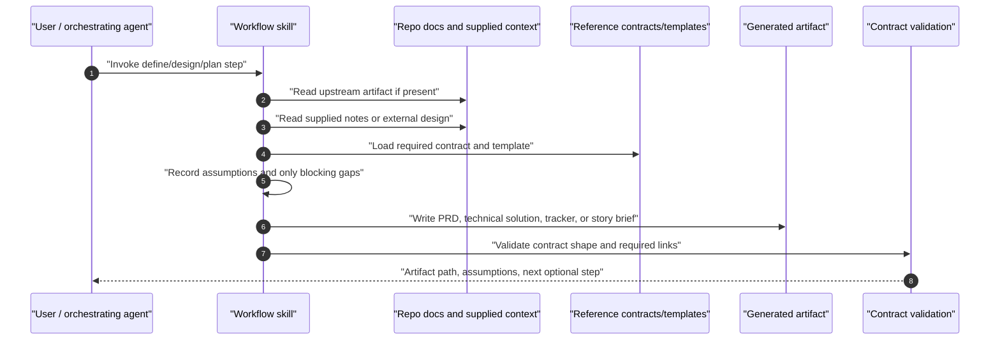
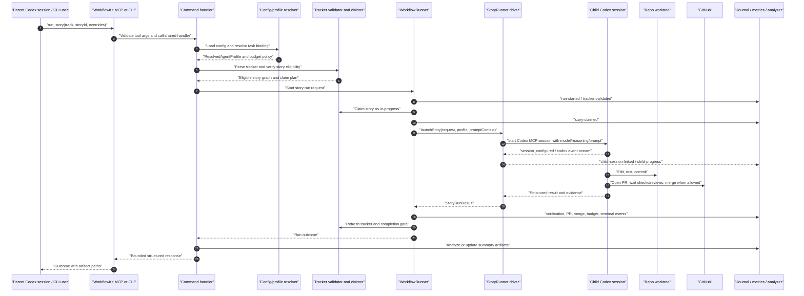
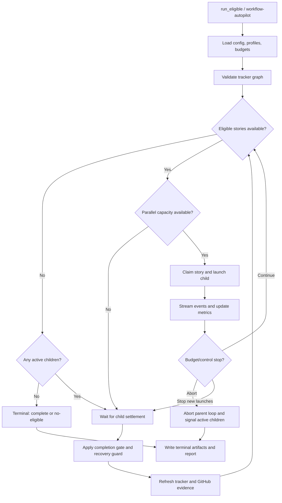
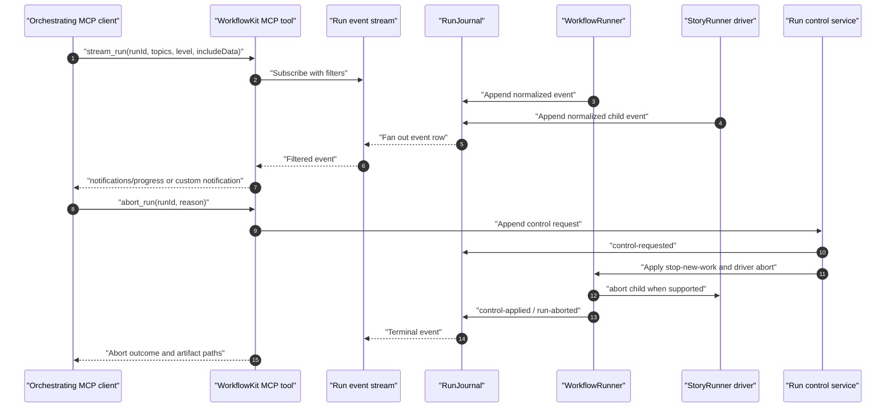
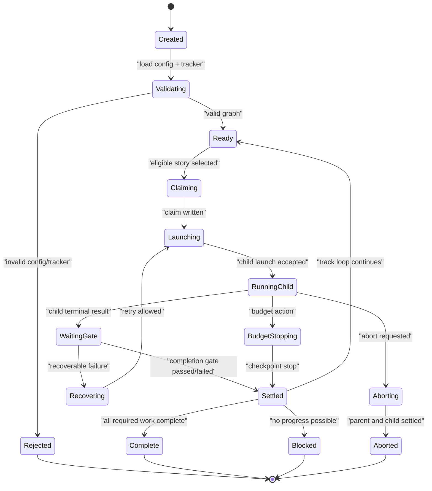

# Runtime flows

This page describes the main call sequences, runtime loop, and control-state model.

## Authoring flow

Workflow steps are independently invokable. Each skill can consume upstream kit artifacts when they
exist, but must also accept explicit in-session context or externally authored documents.

## Story runtime sequence

Story execution is the core unit. Track autopilot is a scheduler over story runs, not a separate
execution model.

## Track autopilot sequence

Autopilot repeatedly refreshes the tracker graph, launches currently eligible stories up to the
configured parallelism, waits for settlement, applies stop/budget/recovery policy, then checks
whether new stories became eligible.

## Streaming and run control sequence

Progress notifications should come from normalized WorkflowKit events, not raw Codex child events.

## Runtime state and controls

| State/control | Technical meaning | Artifact evidence |
| --- | --- | --- |
| `Created` | Run id and artifact root allocated before any mutation. | `run.json`, `run-started` |
| `Validating` | Config, agent profile bindings, tracker graph, and command args are validated. | `config.resolved.json`, `tracker-validated` or validation diagnostics |
| `Ready` | Runtime has a valid graph and no active launch at this instant. | `state.json`, eligibility snapshot |
| `Claiming` | Runner is performing the status transition that prevents duplicate launch. | `story-claim-requested`, `story-claimed` |
| `Launching` | Prompt/profile resolved and driver start requested. | `child-launch-requested` with profile, prompt hash, output schema |
| `RunningChild` | Child session is linked or pending linkage and progress can stream. | `child-session-linked`, `child-progress`, metrics |
| `WaitingGate` | Driver returned; parent is evaluating verification, PR, tracker, and policy evidence. | completion-gate events, GitHub evidence |
| `Recovering` | Failure is classified as recoverable and retry/repair policy is being applied. | recovery decision events |
| `BudgetStopping` | Budget policy is stopping new launches or stopping at the next checkpoint. | `budget-warning`, `budget-stop` |
| `Aborting` | User/system requested abort; parent loop must stop new work and signal live children where supported. | `controls.ndjson`, `control-requested`, `control-applied` |
| `Settled` | A story attempt has a terminal classification; track loop may continue if allowed. | child result, state refresh |
| `Complete` | Completion comes from tracker/GitHub evidence, not child prose. | `run-complete`, tracker state, PR/merge evidence |
| `Blocked` | No configured recovery or eligible work remains. | `run-blocked`, blocker diagnostics |
| `Rejected` | No execution mutation occurred because validation failed. | validation report |

Control actions:

- `abort`: durable request in `controls.ndjson`; immediately stop new story launches; ask each
  active driver to cancel; classify still-running child state conservatively if cancellation cannot
  be confirmed.
- `stop-new-launches`: budget/policy control that lets active children reach a checkpoint but
  prevents new eligible stories from starting.
- `checkpoint-stop`: budget/policy control that waits for current story completion gate, then ends
  the loop without launching newly eligible work.
- `resume`: not required in V1; artifacts should be shaped so a future resume can reconstruct
  completed, active, and blocked work without reading prose transcripts.

Budget controls are evaluated at runner checkpoints after live metrics and budget artifacts are
written. The runner uses the strongest observed action with this precedence: `abort`,
`checkpoint-stop`, `stop-new-launches`, then `warn`. Budget stop actions are independent from child
failure policy: they prevent new launches even when `stopLaunchingOnBlocked` is `false`. `warn`
records evidence only, `stop-new-launches` and `checkpoint-stop` let active children settle before
ending the track loop, and `abort` also signals active child sessions through the driver abort
signal when supported. Completion still comes only from tracker/GitHub evidence; budget policy can
stop autonomy, but it cannot mark a story complete.
