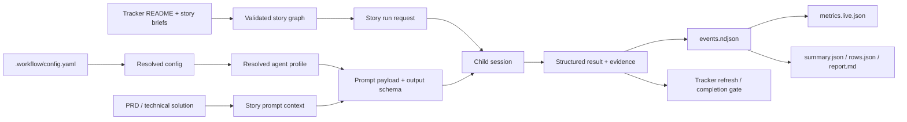

# Data contracts

V1 is local-first and file-backed. This page captures the config, artifact, metric, and interface
contracts that implementation stories should preserve.

## Data flow



## Config schema

Extend `.workflow/config.yaml` and the generated `references/config.schema.json` with these logical
blocks:

```yaml
agents:
  profiles:
    storyImplementer:
      driver: codex-mcp
      model: null
      reasoning: medium
      approvalPolicy: never
      sandbox: workspace-write
      prompt:
        template: built-in/story-implementer
        variables:
          includeRepoInstructions: true
          includePrPolicy: true
          includeVerificationPolicy: true
      structuredOutput:
        schema: built-in/child-run-result
        required: true
      budget:
        wallMs:
          limit: 7200000
          action: checkpoint-stop
        activeTokens:
          limit: null
          warnAtPercent: 80
          action: stop-new-launches
    prePrReviewer:
      driver: codex-mcp
      model: null
      reasoning: medium
      prompt:
        template: built-in/pre-pr-reviewer
      structuredOutput:
        schema: built-in/review-result
        required: true
      budget: {}
    planner:
      driver: inline
      prompt:
        template: built-in/planner
      structuredOutput:
        schema: built-in/planning-result
        required: false
      budget: {}
    analyzer:
      driver: inline
      prompt:
        template: built-in/analyzer
      structuredOutput:
        schema: built-in/run-analysis
        required: true
      budget: {}
    recovery:
      driver: inline
      prompt:
        template: built-in/recovery
      structuredOutput:
        schema: built-in/recovery-decision
        required: true
      budget: {}
  bindings:
    implementStory: storyImplementer
    prePrReview: prePrReviewer
    planTrack: planner
    analyzeRun: analyzer
    recoverRun: recovery
observability:
  stream:
    enabled: true
    defaultTopics: [run, story, child, tracker, review, pr, merge, budget, error]
    minLevel: info
    throttleMs: 2000
  reports:
    writeSummaryJson: true
    writeRowsJson: true
    writeMarkdownReport: true
```

Exact field names can change during implementation, but the model must support named agent
profiles, built-in defaults, task bindings, per-run overrides, prompt/template selection,
structured-output contracts, budget actions, and stream/report policy.

## Run artifact shape

Preserve existing artifact compatibility:

```text
.codex/agentic-workflow-kit/runs/<runId>/
  run.json
  config.resolved.json
  state.json
  metrics.live.json
  events.ndjson
  stories.initial.json
  stories/
  children/
```

Add or formalize:

```text
  controls.ndjson              requested abort/pause/resume/recovery controls
  summary.json                 normalized run-level summary
  rows.json                    row-level child/session metrics
  report.md                    human-readable report
  analysis.json                analyzer result, equivalent to detailed analyze output
  transcripts.json             session id/path index; not full transcript copies by default
  budgets.json                 configured vs observed budget outcomes
```

Retention is repo-local. Runtime artifacts remain ignored by completion dirty checks. Transcript
files stay in host session storage and are referenced by path unless a future export mode copies
them into the run bundle.

## Metrics fields

Metrics should distinguish:

- wall time and phase durations
- child startup time, active time, no-progress time, and total runtime
- tool calls total, by tool, failed, retried, and error rate
- subagent counts by role/status
- token totals: input, output, reasoning, cache read/write, total, active
- budget limits, warning thresholds, actions taken, and unavailable telemetry fields
- GitHub checkpoints: PR opened, checks passed/failed, review pending/clear/findings, findings
  fixed/replied, merged, branch deleted

When a host cannot expose a field live, the field must be `null` with an explicit unavailable
reason instead of omitted.

## Interface contracts

These are logical contracts for delivery planning. Exact TypeScript names can change during
implementation, but each concept should have schema/tests before runtime behavior depends on it.

```ts
type AgentTaskType =
  | "implementStory"
  | "prePrReview"
  | "planTrack"
  | "analyzeRun"
  | "recoverRun"
  | "migrateTracker";

interface AgentProfile {
  driver: "codex-mcp" | "inline";
  model?: string | null;
  reasoning?: "low" | "medium" | "high" | string;
  approvalPolicy?: string;
  sandbox?: string;
  prompt: PromptTemplateRef;
  structuredOutput?: StructuredOutputRef;
  budget?: BudgetPolicy;
  host?: Record<string, unknown>;
}

interface TaskBinding {
  taskType: AgentTaskType;
  profileName: string;
}

interface ResolvedAgentProfile extends AgentProfile {
  profileName: string;
  taskType: AgentTaskType;
  promptHash: string;
  structuredOutputRequired: boolean;
  resolvedBudget: BudgetPolicy;
  capabilityDowngrades: CapabilityDowngrade[];
}

interface StoryRunRequest {
  runId: string;
  trackId: string;
  storyId: string;
  worktreeCwd: string;
  resolvedProfile: ResolvedAgentProfile;
  promptContext: StoryPromptContext;
  controlSignal: AbortSignal;
}

interface StoryRunner {
  capabilities(): StoryRunnerCapabilities;
  launchStory(request: StoryRunRequest): AsyncIterable<RunEvent>;
  abort?(runId: string, childId: string, reason: string): Promise<AbortResult>;
}

interface RunEvent {
  id: string;
  runId: string;
  storyId?: string;
  childId?: string;
  timestamp: string;
  topic:
    | "run"
    | "story"
    | "child"
    | "tracker"
    | "review"
    | "pr"
    | "merge"
    | "budget"
    | "control"
    | "error";
  level: "debug" | "info" | "warning" | "error";
  type: string;
  message: string;
  data?: Record<string, unknown>;
}
```

Contract rules:

- `ResolvedAgentProfile` is written before child launch so analyzer/report output can explain which
  prompt, model, reasoning effort, budget, and structured-output schema were used.
- `StoryRunner` emits normalized `RunEvent` rows. The Codex driver can derive them from
  `codex/event`, standard MCP progress, final structured content, transcript parsing, and local
  evidence, but callers should not consume raw Codex event names.
- `RunEvent.data` must be bounded and scrubbed for secrets. Transcript paths are allowed; transcript
  contents are not copied into progress notifications by default.
- `AbortResult` distinguishes requested, confirmed, unsupported, and already-terminal outcomes.
