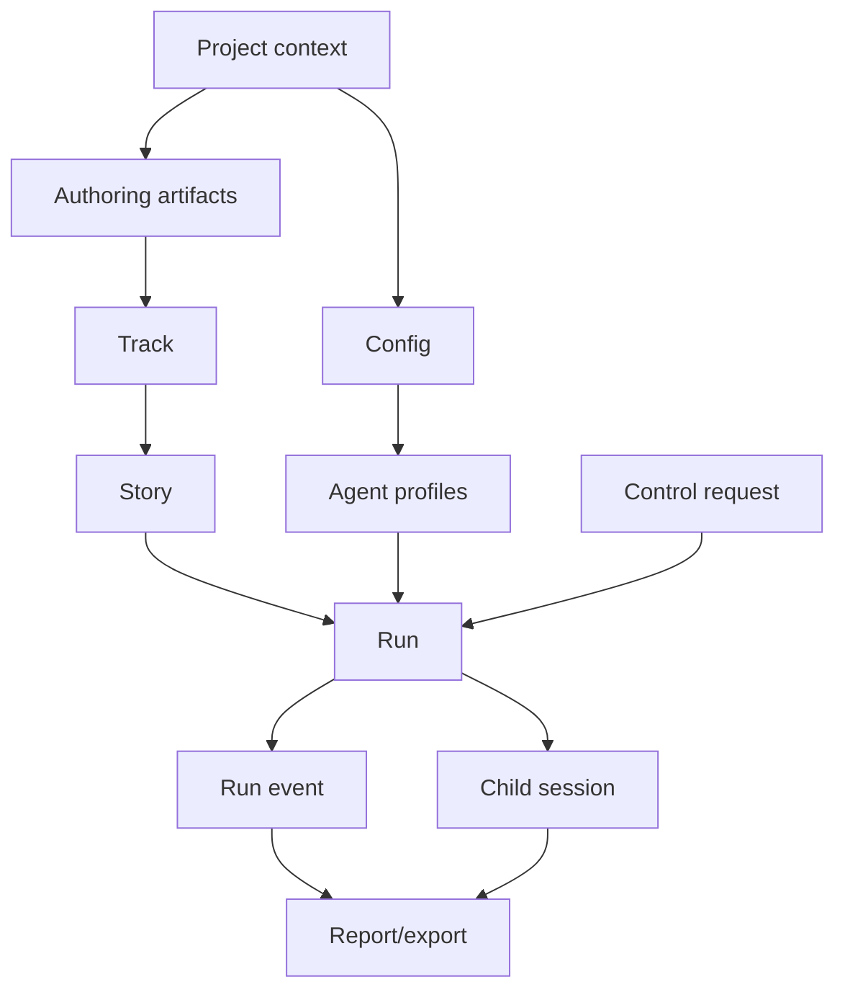

# API surface

This page designs the MCP and CLI API from the product requirements, not from the current
implementation. The API model should be stable enough for users, orchestrating agents, future UI
surfaces, and tests to share one vocabulary.

## API goals

- Same conceptual resources across MCP and CLI.
- Structured by default for MCP; human-readable by default for CLI with `--json` and `--format
  ndjson` for automation.
- Dry-run/preview before mutation for runtime and migration commands.
- Explicit artifact refs for every durable output.
- Dynamic progress subscription by topic, level, story id, and data inclusion.
- Consistent error envelope across validation, runtime, host, GitHub, and control failures.
- No trust in child-session prose for completion; API results point to tracker/GitHub/artifact
  evidence.

Non-goals:

- Direct execution of arbitrary non-kit backlogs.
- Hosted service APIs.
- Replacing workflow skills as the best interactive authoring experience.
- Exposing raw Codex child events as the public WorkflowKit event API.

## Resource model



| Resource | Stable identity | Source of truth | Notes |
| --- | --- | --- | --- |
| Project context | repo root | current working directory or explicit `repo` arg | Includes resolved config path, PRD dir, tracks dir, package info. |
| Config | config path + hash | `.workflow/config.yaml` | Includes presets, statuses, git/PR policy, profiles, budgets, observability defaults. |
| Agent profile | profile name | config | Resolved before child launch and captured in run artifacts. |
| Artifact | kind + slug/path | markdown files | PRD, technical solution, tracker, story brief, migration report. |
| Track | track id/path | tracker README | Runtime can execute only validated kit trackers. |
| Story | track id + story id | tracker/story brief | Story state is tracker-owned. |
| Run | run id | run artifact directory | Runtime state is artifact-owned. |
| Child session | child id + host session id | driver + artifacts | Host-specific fields stay behind driver boundary. |
| Event | run id + event id | `events.ndjson` | Normalized WorkflowKit event, not raw host event. |
| Control request | run id + control id | `controls.ndjson` | Abort in V1; pause/resume can be future additions. |
| Report/export | run id + artifact path | analyzer/report builder | Summary JSON, rows JSON, markdown report, optional export bundle. |

## Result envelope

Every mutating or long-running API should return a shared envelope:

```json
{
  "ok": true,
  "operation": "workflow_run_start",
  "apiVersion": "1",
  "requestId": "req_...",
  "project": {
    "repoRoot": "/repo",
    "configPath": ".workflow/config.yaml"
  },
  "result": {},
  "artifacts": [
    {
      "kind": "run",
      "path": ".codex/agentic-workflow-kit/runs/2026-06-13T...",
      "description": "Run artifact root"
    }
  ],
  "warnings": [],
  "next": [
    {
      "label": "Stream run",
      "mcpTool": "workflow_run_stream",
      "cli": "workflow-kit run stream 2026-06-13T..."
    }
  ]
}
```

Errors use the same shape with `ok: false`, an `error` object, and any diagnostics/artifacts that
were safely produced. Public error codes are derived from typed WorkflowKit errors, not from
human-readable message text:

| Code | Meaning | Retryable default |
| --- | --- | --- |
| `CONFIG_INVALID` | The repository config is missing, invalid, or unavailable at a config-loading boundary. | `false` |
| `TRACKER_INVALID` | Tracker discovery, validation, migration, or story target resolution failed. | `false` |
| `STORY_NOT_ELIGIBLE` | A requested story exists but cannot be dispatched without `force` because status, owner, or dependencies block it. | `false` |
| `RUN_NOT_FOUND` | The requested run reference or required run artifact root is absent. | `false` |
| `INTERNAL_ERROR` | An unexpected failure occurred after the target resource was resolved, such as corrupt run artifacts. | `false` |

`retryable` is owned by the error class. Current public classes default to `false`; future transient
host or network failures may opt into `true` without changing the envelope shape.

## CLI design

The CLI should expose product nouns and verbs. Examples use `workflow-kit` as the command name; a
short alias can be added later without changing the API model.

Global flags:

| Flag | Meaning |
| --- | --- |
| `--repo PATH` | Resolve project context from another repository. Defaults to cwd. |
| `--config PATH` | Use an explicit config path. |
| `--json` | Emit the result envelope as JSON. |
| `--format table|json|ndjson|markdown` | Select display format where supported. |
| `--dry-run` | Validate and preview without mutation. |
| `--yes` | Allow non-interactive confirmation for safe configured mutations. |
| `--profile NAME` | Override the default agent profile for a compatible operation. |
| `--budget EXPR` | Apply a per-run budget override, recorded in artifacts. |
| `--stream` | Subscribe to live events after starting a run. |

Command map:

| Command | Purpose | Mutates? |
| --- | --- | --- |
| `workflow-kit --version` / `workflow-kit version --json` | Show package, MCP server, public API, and config schema versions. | no |
| `workflow-kit project inspect` | Show resolved repo context, config path, docs dirs, package/plugin metadata. | no |
| `workflow-kit config status` | Classify config compatibility against the current runtime and return upgrade guidance. | no |
| `workflow-kit config upgrade --dry-run\|--yes` | Preview or apply supported config schema migrations. | optional |
| `workflow-kit config validate` | Validate config, presets, statuses, agent profiles, budgets, and observability defaults. | no |
| `workflow-kit profiles list` | List resolved agent profiles and task bindings. | no |
| `workflow-kit profiles show PROFILE` | Show one profile, including inherited defaults and unavailable capabilities. | no |
| `workflow-kit artifact create --kind prd|technical-solution|track --slug SLUG --from PATH` | Non-interactive artifact generation from supplied context. | yes |
| `workflow-kit artifact validate PATH` | Validate PRD, technical solution, tracker, story brief, or migration report. | no |
| `workflow-kit tracker validate --track TRACK` | Validate tracker contract, dependencies, statuses, and story refs. | no |
| `workflow-kit tracker migrate --from PATH --track TRACK --write-draft` | Convert existing backlog docs into a draft kit tracker plus diagnostics. | optional |
| `workflow-kit tracks list` | List known tracks and validation summaries. | no |
| `workflow-kit stories list --track TRACK --status eligible,blocked` | List stories with dependency and status context. | no |
| `workflow-kit stories show --track TRACK --story STORY_ID` | Show story detail, brief refs, dependencies, and latest run refs. | no |
| `workflow-kit run preview --track TRACK --story STORY_ID` | Explain what would run, selected profile, budgets, worktree/branch plan, blockers. | no |
| `workflow-kit run start --track TRACK --story STORY_ID` | Start one story run. | yes |
| `workflow-kit run start --track TRACK --mode eligible` | Start track autopilot over eligible stories. | yes |
| `workflow-kit run status RUN_ID` | Read current run state, active children, recent events, budgets. | no |
| `workflow-kit run stream RUN_ID --topics run,story,child,error` | Stream normalized events as table or NDJSON. | no |
| `workflow-kit run subscribe RUN_ID --topics run,story,child,error` | Register a detached realtime subscription and return a wake artifact plus replay tail. | yes |
| `workflow-kit run subscription-poll RUN_ID SUBSCRIPTION_ID` | Pull and ack deliverable events for a detached subscription. | yes |
| `workflow-kit run unsubscribe RUN_ID SUBSCRIPTION_ID` | Close a detached subscription and remove its wake artifact. | yes |
| `workflow-kit abort-run RUN_PATH --reason TEXT` | Request abort and return applied/unsupported/terminal outcome. | yes |
| `workflow-kit run inspect RUN_ID` | Show artifact tree, child sessions, transcripts, PR links, metrics. | no |
| `workflow-kit run report RUN_ID --format markdown|json` | Build `analysis.json` and `report.md` from bounded run artifacts. | yes |
| `workflow-kit run export RUN_ID --out PATH` | Produce a shareable bounded artifact bundle without transcript contents. | yes |

Example:

```bash
workflow-kit run start --track redesign --mode eligible --parallelism 2 --stream --json
workflow-kit run stream 2026-06-13T15-48-02-107Z --topics run,story,child,pr,error --format ndjson
workflow-kit abort-run .codex/agentic-workflow-kit/runs/2026-06-13T15-48-02-107Z --reason "Wrong target branch"
```

## MCP tool design

MCP tools should be flat, explicit, and optimized for orchestrating agents. Tool names are
prefixed with `workflow_` to avoid collisions.

| MCP tool | CLI equivalent | Purpose |
| --- | --- | --- |
| `workflow_runtime_info` | `version --json` | Report package, MCP server, public API, and config schema versions. |
| `workflow_project_inspect` | `project inspect` | Resolve project context and surface capabilities. |
| `workflow_config_status` | `config status` | Classify config compatibility and return warnings, blocking status, upgrade availability, and next actions. |
| `workflow_config_upgrade` | `config upgrade` | Preview or apply supported config schema migrations with explicit confirmation for writes. |
| `workflow_config_validate` | `config validate` | Validate config and return diagnostics. |
| `workflow_profiles_list` | `profiles list` | List profiles and task bindings. |
| `workflow_profile_get` | `profiles show` | Inspect one resolved profile. |
| `workflow_artifact_create` | `artifact create` | Generate PRD/HLD/track/migration artifacts from supplied context. |
| `workflow_artifact_validate` | `artifact validate` | Validate a planning artifact. |
| `workflow_tracker_validate` | `tracker validate` | Validate a tracker before execution. |
| `workflow_tracker_migrate` | `tracker migrate` | Draft a kit tracker from an existing backlog source. |
| `workflow_tracks_list` | `tracks list` | List tracks and validation summaries. |
| `workflow_stories_list` | `stories list` | List/filter stories. |
| `workflow_story_get` | `stories show` | Inspect one story. |
| `workflow_run_preview` | `run preview` | Preview selected work, policy, profiles, budgets, and blockers. |
| `workflow_run_start` | `run start` | Start story or track execution. |
| `workflow_run_status` | `run status` | Snapshot run state and recent events. |
| `workflow_run_stream` | `run stream` | Long-lived request that subscribes to filtered normalized events. |
| `workflow_run_subscribe` | `run subscribe` | Register a durable detached subscription with server-stored filters/cursor and a wake artifact. |
| `workflow_run_subscription_poll` | `run subscription-poll` | Pull deliverable events for a detached subscription and commit an acknowledged cursor. |
| `workflow_run_unsubscribe` | `run unsubscribe` | Idempotently close a detached subscription and remove its wake artifact. |
| `workflow_run_control` | `run control` | Request abort or future controls. |
| `workflow_run_inspect` | `run inspect` | Return artifact/session/PR/metrics index. |
| `workflow_run_report` | `run report` | Produce report outputs through an explicit post-run write operation. |
| `workflow_run_export` | `run export` | Produce a bounded bundle for sharing/future UI without copying host transcript contents. |

## MCP resources and prompts

MCP tools perform actions. MCP resources expose read-only, bounded state for agents that want to
inspect context without triggering runtime behavior.

| Resource URI | Purpose |
| --- | --- |
| `workflow://project/context` | Resolved project context, config path, docs paths, API version, and capabilities. |
| `workflow://config/resolved` | Resolved config with secrets redacted and defaults expanded. |
| `workflow://profiles` | Resolved agent profiles and task bindings. |
| `workflow://tracks` | Track index with validation summaries. |
| `workflow://tracks/{trackId}` | One tracker summary, status buckets, dependency graph summary, and artifact refs. |
| `workflow://tracks/{trackId}/stories/{storyId}` | One story summary with dependencies, status, brief refs, latest run refs. |
| `workflow://runs/{runId}/state` | Current run state, active children, controls, budgets, and artifact refs. |
| `workflow://runs/{runId}/events` | Bounded event tail, filterable through query params where supported. |
| `workflow://runs/{runId}/report` | Latest report envelope generated from bounded run artifacts. |

Prompt exposure should be conservative:

- Built-in prompt templates can be exposed as read-only resources or MCP prompts for inspection.
- Repo-local prompt overrides should expose ids, paths, hashes, and required variables by default,
  not full content, unless the caller asks for full-bounded data.
- Runtime launch should always record prompt/template id and hash in artifacts.

### Common MCP input fields

```json
{
  "repo": "/repo",
  "config": ".workflow/config.yaml",
  "requestId": "optional-client-id",
  "response": {
    "include": "summary",
    "maxEvents": 50,
    "maxBytes": 200000
  }
}
```

`response.include` should support:

- `minimal`: ids, status, and artifact refs only
- `summary`: bounded human-readable summaries plus key fields
- `full-bounded`: structured details up to configured byte/event limits

### Version and config compatibility tools

`workflow_runtime_info` is the read-only source for runtime discovery:

```json
{
  "packageVersion": "0.6.0",
  "mcpServer": {"name": "agentic-workflow-kit", "version": "0.6.0"},
  "apiVersion": "1",
  "configSchema": {"current": "0.6.0", "minimumSupported": "0.6.0"}
}
```

`workflow_config_status` and `workflow_config_upgrade` are the compatibility boundary for
`.workflow/config.yaml`. Config-dependent runtime actions, including run start and
subscribe-by-`runId`, should call the same classifier before strict config parsing turns stale,
unsupported, or newer config files into generic failures. Legacy numeric `version: 1` remains a
supported upgrade path while current configs use semver strings such as `"0.6.0"`.

Read-only artifact operations that already support explicit run artifact paths may use that existing
fallback when repo config is unavailable, but they must not silently upgrade config or ignore a
blocking compatibility result for `runId`-based resolution.

### `workflow_run_start`

Input:

```json
{
  "repo": "/repo",
  "target": {
    "type": "track",
    "trackId": "redesign",
    "mode": "eligible"
  },
  "execution": {
    "dryRun": false,
    "parallelism": 2,
    "continueUntilNoEligible": true
  },
  "agents": {
    "bindings": {
      "implementStory": "storyImplementer"
    }
  },
  "stream": {
    "subscribe": true,
    "topics": ["run", "story", "child", "pr", "budget", "error"],
    "minLevel": "info",
    "includeData": "summary"
  }
}
```

Output:

```json
{
  "ok": true,
  "operation": "workflow_run_start",
  "result": {
    "run": {
      "id": "2026-06-13T15-48-02-107Z",
      "status": "running",
      "target": {"type": "track", "trackId": "redesign", "mode": "eligible"}
    },
    "selectedProfiles": {
      "implementStory": "storyImplementer"
    },
    "streaming": {
      "subscribed": true,
      "topics": ["run", "story", "child", "pr", "budget", "error"]
    }
  },
  "artifacts": [
    {"kind": "runRoot", "path": ".codex/agentic-workflow-kit/runs/2026-06-13T15-48-02-107Z"}
  ],
  "warnings": []
}
```

### `workflow_run_status`

Input:

```json
{
  "repo": "/repo",
  "runId": "2026-06-13T15-48-02-107Z",
  "events": {
    "limit": 25,
    "topics": ["run", "story", "child", "error"]
  }
}
```

Output includes run status, active children, completed/blocked counts, budget state, current
controls, latest artifact paths, and recent events.

### `workflow_run_stream`

`workflow_run_stream` is a long-lived MCP request. It should replay a bounded tail by default, then
push new normalized events until terminal state or client cancellation.

Input:

```json
{
  "repo": "/repo",
  "runId": "2026-06-13T15-48-02-107Z",
  "subscription": {
    "topics": ["run", "story", "child", "pr", "merge", "budget", "error"],
    "minLevel": "info",
    "storyIds": [],
    "includeData": "summary",
    "replay": {"lastEvents": 20},
    "throttleMs": 2000
  }
}
```

Notifications:

- Use standard MCP progress notifications for liveness and coarse progress.
- Use a WorkflowKit structured event notification when the client supports it.
- Never forward raw child host events directly as public WorkflowKit API.

Structured event payload:

```json
{
  "method": "notifications/workflow_event",
  "params": {
    "runId": "2026-06-13T15-48-02-107Z",
    "event": {
      "id": "evt_...",
      "topic": "child",
      "level": "info",
      "type": "child-session-linked",
      "message": "Child session linked",
      "storyId": "WK-001",
      "childId": "child_1",
      "data": {
        "host": "codex",
        "sessionId": "019...",
        "profile": "storyImplementer"
      }
    }
  }
}
```

Final response:

```json
{
  "ok": true,
  "operation": "workflow_run_stream",
  "result": {
    "runId": "2026-06-13T15-48-02-107Z",
    "terminal": true,
    "status": "complete",
    "eventsDelivered": 184
  }
}
```

`workflow_run_stream` is the *attached* path: delivery ends when this request returns. For a
detached subscriber (an agent that yields its turn and wants realtime wakes), an additive set of
tools — `workflow_run_subscribe`, `workflow_run_subscription_poll`, and `workflow_run_unsubscribe` —
provides a durable, server-stored subscription with a wake signal. It reuses this event model and
does not change `workflow_run_stream`. See
[07-detached-realtime-subscription.md](07-detached-realtime-subscription.md).

### `workflow_run_subscribe` / `workflow_run_subscription_poll` / `workflow_run_unsubscribe`

The detached subscription tools are additive runtime tools for agents that need realtime wakes after
their original tool call returns. They use the same result envelope and public `apiVersion: "1"` as
the rest of the API, reuse `notifications/workflow_event` event payloads, and persist subscription
state as internal `schemaVersion: 1` artifacts under the run root.

`workflow_run_subscribe` resolves a run through repo context and is therefore config-dependent.
When config compatibility is blocking (`missing`, `invalid`, `unsupported-old`, or
`unsupported-new`), it should fail with the same structured diagnostics and next actions exposed by
`workflow_config_status` / `workflow_config_upgrade`. `workflow_run_subscription_poll` and
`workflow_run_unsubscribe` may accept an explicit `runPath` for artifact-local operation only where
existing run-read tools already support that fallback.

Project inspection should advertise this feature with
`capabilities.detachedRunSubscriptions: true` when the runtime can create subscription records,
touch wake artifacts, and poll by subscription id.

### `workflow_run_control`

Input:

```json
{
  "repo": "/repo",
  "runId": "2026-06-13T15-48-02-107Z",
  "control": {
    "action": "abort",
    "reason": "Wrong target branch"
  }
}
```

Output distinguishes:

- `requested`: control request appended, application pending
- `applied`: parent loop and supported children acknowledged control
- `unsupported`: driver or host cannot apply part of the control
- `already-terminal`: run had already completed/blocked/aborted

## CLI/MCP parity rules

- Every CLI command that emits durable state has an MCP equivalent.
- Every MCP mutating tool has a CLI preview/dry-run route.
- CLI table output is display-only; JSON output is the contract.
- MCP bounded summaries and CLI JSON use the same envelope and error schema.
- Long-running MCP tools can stream; CLI uses `--stream` or a separate `run stream`.
- Both surfaces write the same artifact refs and normalized events.

## Event topics

| Topic | Examples | Default stream? |
| --- | --- | --- |
| `run` | run started, terminal state, report written | yes |
| `tracker` | tracker validated, story graph refreshed | yes |
| `story` | story claimed, story settled, dependency unblocked | yes |
| `child` | child launch requested, session linked, progress summary | yes |
| `review` | pre-PR review started/clear/findings | yes |
| `pr` | PR opened, checks pending/passed/failed, comments handled | yes |
| `merge` | merge started/succeeded/failed, branch cleanup | yes |
| `budget` | warning, stop-new-launches, checkpoint-stop, abort | yes |
| `control` | abort requested/applied/unsupported | yes |
| `error` | validation/runtime/host errors | yes |
| `debug` | verbose driver details, raw host mapping notes | no |

## Error model

Error envelope:

```json
{
  "ok": false,
  "operation": "workflow_run_start",
  "error": {
    "code": "TRACKER_INVALID",
    "message": "Tracker contains invalid dependency references.",
    "severity": "error",
    "retryable": false,
    "details": [],
    "artifactRefs": [
      {"kind": "validationReport", "path": "docs/tracks/redesign/validation.json"}
    ]
  },
  "warnings": [],
  "next": [
    {"label": "Validate tracker", "mcpTool": "workflow_tracker_validate"}
  ]
}
```

Standard codes:

| Code | Meaning | CLI exit |
| --- | --- | --- |
| `CONFIG_INVALID` | Config failed schema, semantic validation, or compatibility checks. Details should include compatibility status and point to config status/upgrade when available. | 2 |
| `AGENT_PROFILE_MISSING` | Task binding references a missing profile. | 2 |
| `TRACKER_INVALID` | Tracker contract/dependency/status validation failed. | 2 |
| `STORY_NOT_ELIGIBLE` | Requested story cannot run under current policy. | 3 |
| `RUN_NOT_FOUND` | Run id cannot be resolved in the project. | 4 |
| `RUN_ALREADY_TERMINAL` | Requested mutation/control targets a terminal run. | 3 |
| `BUDGET_LIMIT_REACHED` | Configured budget prevents new work. | 3 |
| `CONTROL_UNSUPPORTED` | Requested control is not supported by active driver/host. | 5 |
| `HOST_UNAVAILABLE` | Agent host or MCP child driver cannot start/respond. | 5 |
| `GITHUB_POLICY_BLOCKED` | PR/check/review/merge policy blocks completion. | 6 |
| `INTERNAL_ERROR` | Unexpected runtime error. | 1 |

## Idempotency and mutation policy

- `preview`, `validate`, `list`, `show`, `status`, `stream`, `inspect`, and report reads are
  non-mutating.
- `artifact create`, `tracker migrate --write-draft`, `run start`, `abort-run`, `run report`
  when generating missing outputs, and `run export` are mutating.
- Mutating calls accept `dryRun` or `--dry-run` where a safe preview is meaningful.
- Runtime mutating calls create a run id before tracker mutation, then record each mutation in
  artifacts.
- Replayed MCP requests with the same client `requestId` should return the existing operation
  result when it is safe to do so.

## Capability discovery

`workflow_project_inspect` should return capability flags so orchestrating agents can adapt:

```json
{
  "capabilities": {
    "authoring": true,
    "trackerMigration": true,
    "runStory": true,
    "runTrack": true,
    "streaming": true,
    "detachedRunSubscriptions": true,
    "abort": true,
    "runtimeInfo": true,
    "configCompatibility": true,
    "tokenTelemetryLive": false,
    "structuredOutputEnforced": true,
    "github": true
  }
}
```

Unavailable capabilities should be explicit in results, not inferred from missing fields.
