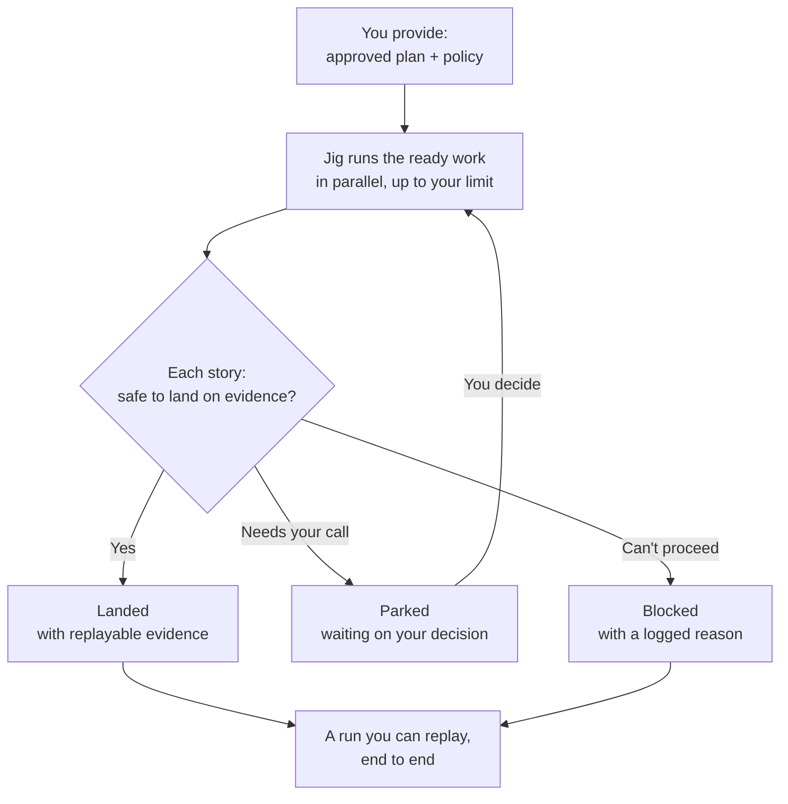

# Jig — the package (main product)

Jig is the deterministic execution engine you run as `jig` (the package
`@agentic-workflow-kit/jig`). You give it an approved **execution plan** and a **policy**; it
turns that plan into reviewed, landed work as far as the policy allows, or into a deliberate,
inspectable stop when the work should not continue.

This page is the product contract for Jig: who it serves, what job it does, what promises it
makes, and where its boundaries are. It does not define low-level protocol mechanics,
provider internals, safety classifiers, or delivery exit bars. Product owns what and why;
design and delivery planning own how those promises are implemented and verified.

## Product Spine

| Question | Product answer |
|---|---|
| User | An owner/operator with product and design judgment who cannot safely supervise every agent action manually. |
| Job | Turn an approved execution plan into reviewed, landed work while preserving human control. |
| Current alternative | A chain of one-off agent sessions, manual PR and review follow-up, ad hoc notes, and fragile recovery. |
| Before | The owner cannot tell whether the agent stayed inside policy, what evidence justified a merge, or how to resume safely after interruption. |
| After | The owner delegates execution under policy and receives evidence, escalation points, recovery, and a reconstructible outcome. |
| Non-fit | Jig is not a product-definition tool, a design authoring tool, an LLM project manager, or a way to bypass review judgment. |

## Workflow

Jig starts where planning ends:

1. You provide an execution plan and policy.
2. Jig runs eligible work under that policy, with the worker contained behind authorization
   and the runner holding privileged actions.
3. Jig asks for a human decision when policy, evidence, or capability proof requires it.
4. Jig lands work only on evidence, or stops in a named state with enough information to
   recover, re-plan, or reject.

The supporting products can help produce the product definition, design, and plan. They are
strong defaults, not prerequisites. Jig's minimum input is a valid execution plan.

## The Five Guarantees

1. **Control & trust** — the worker can only do what you authorized, earns autonomy by proof,
   cannot weaken its own guardrails, pulls you in for real decisions, and never ships on its
   own assertion.
2. **You own the configuration** — policy expresses risk and safety; work profile expresses how
   work is carried out; both are track-scoped and understandable to the owner.
3. **Never lose work; resume safely** — recorded progress survives interruption, irreversible
   actions are not repeated, and one blocked story does not sink independent work.
4. **Runs against your stack** — agents, execution hosts, forges, and work sources sit behind
   swappable seams, and weak drivers reduce autonomy rather than weakening guarantees.
5. **See everything** — every governed decision and outcome is visible through durable,
   structured records that owners and tools can inspect.

### Enforce vs. Guide

Most of the suite guides: it gives templates, presets, product practices, and planning
discipline the owner can adapt. Jig enforces only the floors that make delegation safe:
authorization before action, policy that cannot be quietly weakened, runner-owned irreversible
actions, and evidence before landing work. The owner still chooses the policy posture and the
strength of the gates.

## How You Use Jig

These scenarios show what Jig does _for you_. Each one makes one of the five guarantees
concrete.

### Overnight delivery of a planned epic

You have an approved plan — twelve stories — and you want them delivered tonight without
supervising each one. You set a cautious policy posture and point Jig at the plan. It works the
stories that are ready, in parallel up to the limit you set, and lands each one **only on real
evidence** — never on the agent's say-so. One story tries to change a file that governs your
safety rules; Jig **pauses it and asks you**, rather than quietly merging. Another fails its
checks; Jig **stops it and records why**, without holding up the independent stories.

By morning: nine landed with evidence you can replay, two waiting on a decision only you should
make, one blocked with a reason. **You spent your judgment on the two decisions that mattered —
not on babysitting twelve runs.**

_More scenarios — a risky change at the doorbell, a safe resume after interruption, swapping
your agent — follow the same shape and are added in the same pass._

## ① Control & Trust

**Intended behavior.** The agent is a contained worker. It can request work, produce code, run
checks, and report progress, but it cannot expand its own authority or land changes by
self-report. Jig is responsible for keeping the authority boundary real.

### ①.1 The fence — runtime authorization

- **FENCE-1.** Every worker request is authorized before it executes. If the request is not
  declared and approved, it fails closed.
- **FENCE-2.** Widening permission requires owner re-approval. The worker cannot negotiate a
  broader runtime grant for itself mid-run.
- **FENCE-3.** The worker never holds privileged credentials. The runner performs privileged
  actions on the worker's behalf, under policy and evidence gates.

### ①.2 Earned trust — capability attestation

- **EARN-1.** Autonomy requires fresh, positive proof that the relevant driver can perform the
  capability safely enough for the policy in force.
- **EARN-2.** Capability proof is specific to the driver and run context. Missing, stale, or
  failed proof means less autonomy and more human checkpoints, not a weakened guarantee.

### ①.3 Anti-gaming

- **GUARD-1.** The policy in force is fixed when the run launches. The worker cannot loosen
  the rules it is being judged by.
- **GUARD-2.** If the work changes parts of the project that govern policy, verification, or
  integration safety, completion pauses for explicit owner re-approval and fresh evidence. Jig
  will not let a run quietly change its own rules and then declare itself done.

### ①.4 The doorbell — approval and escalation

- **DOOR-1.** Ambiguous, risky, or unproven action routes to the owner. The default when Jig
  cannot justify autonomy is a closed door, not a guess.
- **DOOR-2.** Escalations are durable. The run parks at the decision point and resumes when the
  owner decides, even after interruption.
- **DOOR-3.** Human grants are narrow. Approval is scoped to the need in front of the run, not
  a blanket yes to future authority.

### ①.5 Merge-on-evidence

- **MERGE-1.** Completing and landing work requires independent evidence aligned to the policy,
  never the worker's self-report alone.
- **MERGE-2.** Push, PR creation, and merge are runner authority. The thing that writes code is
  not the thing that ships it.
- **MERGE-3.** Done conditions are explicit and policy-bound. The owner decides what evidence
  is required before work may land.

**Honest edge.** Jig protects the shape of trust; the substance of each gate is still the
owner's responsibility. A weak review, empty verification command, or vague plan remains weak.
Jig makes that weakness visible instead of pretending it is proof.

## ② You Own The Configuration

**Intended behavior.** You set the risk posture and execution style for each track without
being handed an undifferentiated wall of knobs. Policy is the safety contract. Work profile is
how the work gets done. Jig derives live behavior from those choices and the plan.

- **CFG-1. Policy is the governance contract.** It expresses gating posture, merge spectrum,
  concurrency ceiling, retry budget, required reviews, approvals, escalation rules, and the
  anti-gaming floor. Because policy governs safety, changing it is itself governed.
- **CFG-2. The work profile is the realization.** It expresses cost, quality, and behavior:
  model, effort, prompt strategy, and role realization. It is freely tunable because it does
  not lower the safety floor.
- **CFG-3. Configuration is per track.** Each independent line of work has its own policy and
  work profile, while repo-level floors remain intact.
- **CFG-4. The actual is computed, not hand-set.** You set intent and limits; Jig derives what
  can safely run from policy and the plan's current eligible work.
- **CFG-5. Setup is guided by your intent.** Jig starts by asking how you want to work and maps
  that to a sensible starting configuration before you tune details.
- **CFG-6. Presets are strong defaults with reasoning.** They encode useful starting positions,
  explain why they exist, and remain choices you can override.
- **CFG-7. Open seams, not a closed turnkey.** Jig exposes records and extension points so
  owners and tool builders can add analyzers, dashboards, story sources, scans, and other
  surrounding tools without changing Jig's core.
- **CFG-8. Prompt strategy is guided, not magical.** Prompting can move from dynamic per task
  to templated and then to stable role prompts as the work matures; traceability comes from
  versioned guidance, not hidden agent intuition.

**Honest edge.** Presets are starting points, not a guarantee of fit. Ignoring guidance may be
valid, but it trades away legibility and traceability. Jig will not pretend those tradeoffs do
not exist.

## ③ Never Lose Work; Resume Safely

**Intended behavior.** A run survives interruption and local failure without losing recorded
progress, repeating irreversible actions, or blocking unrelated work.

### ③.1 Interruption resume

- **RESUME-1. Durable progress.** Completed work and run decisions are recorded when they
  happen. A crash does not erase progress that was already committed to the run record.
- **RESUME-2. Resume from the last safe checkpoint.** Jig resumes from a safe point instead of
  starting over, and repeated work is handled as repeatable work.
- **RESUME-3. No double effect.** Irreversible actions already taken are recognized and not
  performed again on resume.
- **RESUME-4. Fail closed and diagnosable.** If Jig cannot safely continue, it parks in a
  named, inspectable state rather than guessing forward.
- **RESUME-5. Resume integrity.** If safety-relevant assumptions changed while the run was
  stopped, Jig asks for owner re-approval and fresh evidence before continuing.

### ③.2 Work-level failure isolation

- **ISO-1. Fault isolation is dependency-aware.** A blocked story halts itself and downstream
  dependents, while independent work keeps moving.
- **ISO-2. Resolution is policy-determined.** Prevention-leaning policy can quarantine and
  re-plan; throughput-leaning policy can land independent work and rely on enabled follow-up
  checks. Jig follows the owner's posture.
- **ISO-3. Blocks are first-class outcomes.** A block records what happened and why, so the
  owner, supporting tools, and the learning loop can act on it.

**Honest edge.** Resume works from checkpoints, not individual keystrokes. Isolation is only
as good as the dependencies declared in the plan. A corrupt or contradictory substrate becomes
a diagnosable stop, not a promise of magic recovery.

## ④ Runs Against Your Stack

**Intended behavior.** Jig works with the stack you bring while keeping its guarantees stable.
The promise is not a specific vendor list; the promise is that changing a driver does not move
the control, evidence, and recovery boundaries.

- **STACK-1. Your guarantees do not depend on your vendor.** Control, evidence, and recovery
  hold regardless of which compatible driver you use.
- **STACK-2. Four seams are independently swappable.** Agent, Execution Host, Forge, and Work
  Source are the product-level integration boundaries.
- **STACK-3. Bring-your-own agent is a work-profile choice.** Agent and model choice belongs
  with how the owner wants work carried out.
- **STACK-4. Capabilities are attested, not assumed.** A driver proves what it can do before
  Jig grants autonomy; unproven capability means more supervision.
- **STACK-5. Seams are authority boundaries.** Credentials and irreversible authority stay
  where policy and evidence gates can govern them.

**Honest edge.** A seam is not a shipped driver. Drivers can arrive incrementally. Until a
driver proves a capability, the owner should expect reduced autonomy rather than a weaker
guarantee.

## ⑤ See Everything

**Intended behavior.** Jig makes a run reconstructible. The owner can see what was requested,
authorized, gated, approved, blocked, landed, or stopped without relying on the worker's
memory or narrative.

- **SEE-1. Full run visibility.** Decisions, authorizations, gates, evidence, approvals, state
  transitions, and outcomes are captured well enough to reconstruct what happened and why.
- **SEE-2. Structured and machine-readable by design.** The records are a product surface that
  owners and suite-level tools can consume.
- **SEE-3. The records are the evidence.** The evidence Jig uses to decide is the evidence the
  owner can inspect afterward; there is no separate story that can drift from the run.
- **SEE-4. Self-diagnosis, no extra tooling required.** A minimal Jig user can inspect the run
  records directly to diagnose a bad plan or policy. The learning loop accelerates diagnosis;
  it is not required for visibility.

**Honest edge.** Jig shows everything it governs. It does not read the agent's mind and it does
not turn evidence into judgment automatically. The owner or learning loop still interprets the
records.

## Product Boundaries

Jig owns execution under policy: authorization, escalation, evidence, recovery, stack seams,
and run visibility. The supporting products can help produce better product definitions,
designs, and execution plans, but Jig does not require them. The learning loop is between-runs
improvement, not part of Jig's per-run hot path.

Design owns the implementation details behind these promises: event schema shape, protocol
mechanics, provider contracts, exact policy classifiers, storage strategy, and delivery gates.
Planning owns delivery-level acceptance criteria and phase sequencing. Product keeps the
outcome-level commitments and the IDs above.

## Success And Counter-Signals

**Success looks like:**

- Owners can explain the run's promise and boundaries from this page without reading design
  mechanics.
- Runs land or stop with clear evidence and fewer unsafe surprises.
- Review burden drops because policy, evidence, and escalation are explicit.
- Recovery feels ordinary rather than exceptional.

**Counter-signals look like:**

- Product docs require implementation protocol detail to explain the promise.
- Supporting docs cite commitment IDs that no longer exist here.
- Owners treat current design defaults as product truth instead of reconciling design to the
  product commitment.

## Open Questions

- How much of the setup and preset experience belongs in Jig itself versus surrounding
  guidance?
- How broad should first-class driver support be before stack portability feels credible?
- Which throughput-oriented follow-up checks should become shipped product surfaces, and which
  should remain extension examples?
- Delivery-level acceptance criteria should be issued later in design or planning artifacts
  that cite these product-owned IDs; they should not become a product-layer AC table.

## Related

- [Product definition](./README.md) — where Jig fits in the suite and how it relates to the
  supporting products.
- [Tracks](./concepts.md) — the track model that scopes policy, work profile, and execution.
- [Engineering design](../design/10-architecture/architecture.md) — the implementation
  reference for how the product commitments are satisfied.

<!-- DOCS-NAV (generated — do not edit by hand) -->

---

**↑ Up:** [Product definition](./README.md) · **← Prev:** [Product definition](./README.md) · **Next →:** [Tracks — parallel independent work](./concepts.md)

<!-- /DOCS-NAV -->
