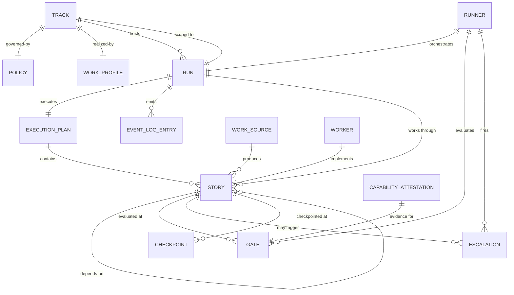

← [Back to README](./README.md)

# Domain model

*Conceptual entities and relationships — what these things are and how they relate, not how
they are stored or structured internally. Technical representation belongs in the technical
solution.*

## Entities

- **Execution Plan** — the single hard input schema Jig owns. A structured, versioned,
  dependency-ordered collection of stories that the upstream products produce (or the user
  authors directly). The plan encodes *what* to do and in what order; Jig encodes *how
  safely* to do it. This is the one hard schema boundary in the suite; everything upstream
  produces conformant artifacts.

- **Story** — one unit of work within a plan, scoped and sized for a single agent session.
  Each story has a declared scope, acceptance criteria references (pointing to this PRD's
  AC IDs), and explicit dependencies on other stories. A story is the unit of fault
  isolation: it can be blocked, quarantined, or retried without affecting independent stories.

- **Run** — one execution of an execution plan under a specific policy and work profile,
  on a specific track. A run is bounded: it starts, it may pause and resume, and it ends
  (successfully, with a deliberate stop, or with a structured failure). The event log is
  the authoritative record of what happened in a run.

- **Track** — one independent line of work within a repo, with its own policy, work profile,
  and execution plan. Multiple tracks run in parallel, independently of each other. A track
  is the unit of policy isolation: policy changes on one track do not affect another.

- **Policy** — the governance contract for a run on a track. Expresses risk tolerance: the
  gating posture (prevention-leaning to throughput-leaning), the merge spectrum (what
  constitutes "done"), concurrency ceiling, retry budget, required review configuration,
  approval and escalation rules, and the anti-gaming protection. Policy is fixed at run
  launch and cannot be loosened by the worker during a run. Repo-level policy floors apply
  to all tracks and cannot be weakened by a per-track policy.

- **Work Profile** — the realization of how work is carried out on a track. Expresses cost,
  quality, and behavior: which agent and model, how much effort, the prompt strategy, and
  how roles (reviewer, implementer) are realized. The work profile is freely tunable and
  does not govern safety.

- **Preset** — a named starting configuration pairing a policy and work profile that encodes
  the author's best-practice defaults for a specific point on the gating spectrum. Two presets
  ship at Phase 0: _prevention_ (gate and prove before merge) and _balanced_ (moderate gating,
  human review required). The _throughput_ preset (gate lightly, fix-forward scan seam enabled)
  ships at Phase 1 (CFG-9). Presets are documented starting points, not locked choices.

- **Work Source** — an adapter that produces conformant execution plan stories from an
  upstream task-tracking system (plan files, GitHub Issues, Jira, or any other source). The
  Work Source seam is one of the four stable Jig seam contracts (alongside Agent, Execution
  Host, and Forge). Every Work Source driver must produce stories conformant to the
  execution-plan schema (see STACK-8 and PLAN-4). The Phase 0 driver supports plan files as
  the story source.

- **Worker** — the contained agent process that implements a story: writes code, runs local
  checks, produces local commits. The worker holds no forge credentials and cannot initiate
  pushes, PRs, or merges. The worker is sandboxed behind the authorization fence.

- **Runner** — the Jig process that orchestrates a run: manages the plan's dependency graph,
  evaluates gates, routes escalations, performs irreversible actions (push, PR, merge), and
  persists the event log. The runner is the privileged half of the worker/runner split; it
  acts on the worker's behalf, behind the configured gates.

- **Capability Attestation** — a durable, per-driver proof that a specific capability (for
  example: can merge a PR, can push a branch) is available and functional for a given driver
  instance. Produced by a capability probe; recorded as an event in the event log. Gates
  autonomous action: missing, stale, or failed attestation routes to a human, regardless of
  policy permissiveness.

- **Event Log** — the append-only, machine-readable record of everything that happens in a
  run: authorization decisions, gate outcomes, capability attestations, state transitions,
  escalations, approvals, and story outcomes. The event log is the single source of truth
  for run activity. It is a first-class product surface, not a debugging side-channel: its
  schema is documented and versioned, and it is the input contract for suite-level tools
  (learning loop, evals, dashboards, analyzers).

- **Gate** — a checkpoint that the runner evaluates before proceeding. A gate requires
  external, independently verifiable evidence (CI result, review approval, capability
  attestation) — never the worker's self-report. Gate outcomes are recorded in the event
  log. When a gate cannot be satisfied, the runner fails closed.

- **Escalation** — a human-facing interrupt fired when a real decision is on the line
  (risk classification is medium or high, capability is unproven, or classification is
  ambiguous). An escalation is a first-class, durable event: it is recorded the instant it
  fires and survives process restarts; the run parks at the escalation point until the human
  decides.

- **Checkpoint** — the last durable saved state of a run from which it can safely resume
  without repeating irreversible actions or losing completed work. Resume granularity is the
  checkpoint, not the individual instruction.

## Relationships

---
Previous: [02-principles](./02-principles.md) · Next: [04-roles](./04-roles.md) · Up: [README](./README.md)

<!-- DOCS-NAV (generated — do not edit by hand) -->

---

**↑ Up:** [Jig PRD](./README.md) · **← Prev:** [Principles](./02-principles.md) · **Next →:** [Roles](./04-roles.md)

<!-- /DOCS-NAV -->
