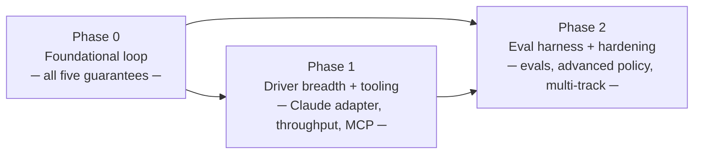

← [Back to README](./README.md)

# Phases

## Why phases

The five guarantees are not equal in implementation difficulty or in foundational precedence.
The control cluster (①) and the event log (⑤) are the architectural spine: without them,
no other guarantee is meaningful. You cannot have reliable recovery (③) without a durable
event log; you cannot have stack-agnostic guarantees (④) without the control cluster that
makes driver-swapping safe; you cannot have a policy spectrum (②) that is trustworthy
without the anti-gaming floor.

The phasing consequence is clear: Phase 0 implements all five guarantees at their minimum
viable level — the floors, the first driver per seam, the foundational event log, the
schema validation — as a complete, integrated delivery loop. Phase 1 adds breadth (more
drivers, the throughput preset, MCP surface, extensibility tooling) once correctness of the
core is established. Phase 2 hardens the evaluation layer and advanced policy controls.

The existing `docs/design/` corpus already specifies the full architecture; implementation
work begins at Phase 0.

## Phase breakdown

### Phase 0 — Foundational delivery loop

- **Goal:** a complete, end-to-end delivery loop on real software under all five guarantees,
  with the Codex agent driver, using a prevention-leaning or balanced preset.
- **Scope:**
  - Control cluster: FENCE (authorization fence), EARN (capability attestation), GUARD
    (anti-gaming, policy immutability during run), DOOR (risk classification + escalation
    ladder), MERGE (runner-only push/merge, evidence gate) — all at floor level.
  - Configuration: per-track policy and work profile; _prevention_ and _balanced_ presets;
    guided setup that maps user intent to a preset.
  - Recovery: RESUME (checkpoint durability, idempotent resume, irreversible-action
    deduplication, fail-closed park) and ISO (fault isolation by dependency subgraph,
    policy-determined blocked-story resolution, first-class block events).
  - Stack seams: four seam contracts — Agent, Execution Host, Forge, Work Source — each
    with at least one Phase 0 driver (Codex agent, one execution host, GitHub forge, one
    work source).
  - Observability: full event log for all run events; structured, machine-readable schema;
    shared source of truth with gates; self-diagnosis from the event log without additional
    tooling.
  - Execution-plan input schema: validated on ingestion, versioned, documented, single
    boundary.
  - Delivery surfaces: skill invocation (Claude Code `jig` skill) and CLI (`jig` command).
- **Exit bar:** a complete plan of ≥ 3 stories with ≥ 1 cross-story dependency is
  ingested, executed from start to merged PRs, with at least one escalation successfully
  parked and resolved, at least one story-block handled with isolation (other stories
  continue), and `pnpm check` green on the Jig implementation. The event log covers the
  entire run with no gaps.

### Phase 1 — Driver breadth and tooling surface

- **Goal:** expand agent driver coverage, ship the throughput preset, open the MCP
  surface, and add structured tooling for operators and integrators.
- **Scope:**
  - Claude agent adapter as the first additional driver against the Agent seam contract.
  - _Throughput_ preset: lightly-gated policy with the fix-forward scan extensibility seam
    (CFG-7) wired up.
  - MCP delivery surface for programmatic Jig invocation.
  - Additional forge drivers (beyond GitHub).
  - Structured run-export operation (human-readable summary of a full run).
  - Enhanced event log query and filtering for operators and integrators.
- **Exit bar:** a second agent driver (Claude adapter) is attested and completes a full
  run under the throughput preset; MCP surface is functional and documented; structured run
  export produces a complete, human-readable run summary.

### Phase 2 — Evaluation harness and advanced hardening

- **Goal:** a rigorous capability attestation evaluation suite, advanced policy controls,
  and production-grade multi-track reliability.
- **Scope:**
  - Capability attestation evaluation suite covering all five guarantees across all Phase 0
    and Phase 1 drivers.
  - Advanced policy controls: per-story policy overrides (within track-level ceiling), cost
    budget gates.
  - Run history and cross-run analytics accessible via event log.
  - Multi-track concurrency hardening: concurrent tracks in a single repo with no
    cross-contamination of policy, credentials, or event logs.
  - Guided prompt-strategy ladder (CFG-8): tooling to assist migration from fully dynamic
    to templated to unified role prompts.
- **Exit bar:** eval suite covers all five guarantees across all drivers; ≥ 2 tracks run
  concurrently in a single repo under different policies with no cross-contamination;
  cross-run analytics are queryable from the event log without custom tooling.

## Dependency graph

---
Previous: [04-roles](./04-roles.md) · Next: [06-quality-bars](./06-quality-bars.md) · Up: [README](./README.md)

<!-- DOCS-NAV (generated — do not edit by hand) -->

---

**↑ Up:** [Jig PRD](./README.md) · **← Prev:** [Roles](./04-roles.md) · **Next →:** [Quality bars](./06-quality-bars.md)

<!-- /DOCS-NAV -->
