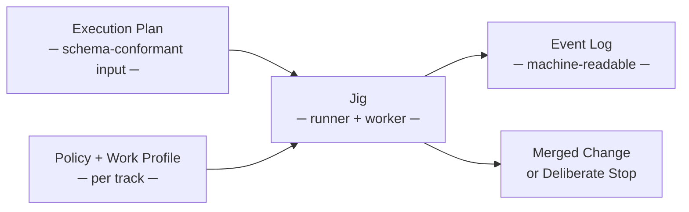

# Jig PRD

**Version 1 · June 2026 · draft**

Jig is the deterministic execution engine at the heart of the `agentic-workflow-kit` suite.
You give it a schema-conformant **execution plan** — a structured, dependency-ordered set of
stories — and a **policy** — the governance contract you set — and it delivers that work as
far as your policy allows: from pushing a branch for review, all the way through a verified,
reviewed, merged change. It does this safely, recoverably, and under your supervision,
interrupting you only when a real decision is on the line. Five guarantees make this
trustworthy: the agent can only do what you authorized, earns autonomy by proof, cannot
weaken its own guardrails, never loses progress, runs against whatever stack you bring, and
makes every run fully observable. This PRD pins down the requirements for each guarantee,
the configurable policy spectrum, the execution-plan input schema seam, and which parts of
each guarantee are ship-blocking versus deferrable.

## Document map

| # | Document | Purpose |
|---|---|---|
| 1 | [01-context](./01-context.md) | Problem, opportunity, thesis, non-goals |
| 2 | [02-principles](./02-principles.md) | Operating tenets |
| 3 | [03-domain-model](./03-domain-model.md) | Conceptual entities and relationships |
| 4 | [04-roles](./04-roles.md) | Personas + capability matrix |
| 5 | [05-phases](./05-phases.md) | Phased delivery plan |
| 6 | [06-quality-bars](./06-quality-bars.md) | Cross-cutting quality requirements |
| 7 | [07-success-metrics](./07-success-metrics.md) | How success is measured |
| 8 | [08-acceptance-criteria](./08-acceptance-criteria.md) | Ship checklist (ID'd ACs) |
| 9 | [09-risks-and-open-questions](./09-risks-and-open-questions.md) | Assumptions, risks, open questions |
| 10 | [10-glossary](./10-glossary.md) | Terms |

## PRD vs technical-design boundary

This PRD owns **what** and **why**: the behavioral requirements for each guarantee, the
policy spectrum, the execution-plan schema seam contract (what it must do, not how it is
shaped), and which requirements are ship-blocking. It does not own:

- **High-level how** — that is the technical solution (`design-technical-solution`), which
  specifies schema field design, concrete event types, seam API contracts, and provider
  driver architecture. The existing `docs/design/` corpus is the current engineering
  reference for this layer.
- **Delivery sequencing and status** — the delivery tracker (`plan-delivery-track`) owns
  that, mapping stories back to the AC IDs in section 08 of this PRD.
- **Story-local scope** — story briefs own that.
- **Exact implementation** — detailed story specs own that.
- **Execution evidence** — runtime artifacts (event logs, run records) own that.

## Status & next steps

**Status:** draft. Proceed to `/red-team-prd` for the adversarial gate (Phase 2) once
this draft is reviewed and any blocking questions in section 09 are resolved.

Downstream:
- Technical solution: run `/design-technical-solution` (Jig is a complex technical
  product — new backend modules, event log, seam API contracts, gate sequencing, recovery
  substrate).
- Delivery tracker: run `/plan-delivery-track` after the technical solution is approved.
- Supporting-product PRDs (Phase 1b): `design-to-plan`, `product-to-design`,
  `define-product`, `learning-loop` — each via `/define-product` in a separate session.

<!-- DOCS-NAV (generated — do not edit by hand) -->

---

**↑ Up:** [PRDs — product requirements](../README.md) · **← Prev:** [PRDs — product requirements](../README.md) · **Next →:** [Context](./01-context.md)

**Children:** [Context](./01-context.md) · [Principles](./02-principles.md) · [Domain model](./03-domain-model.md) · [Roles](./04-roles.md) · [Phases](./05-phases.md) · [Quality bars](./06-quality-bars.md) · [Success metrics](./07-success-metrics.md) · [Acceptance criteria](./08-acceptance-criteria.md) · [Risks and open questions](./09-risks-and-open-questions.md) · [Glossary](./10-glossary.md)

<!-- /DOCS-NAV -->
