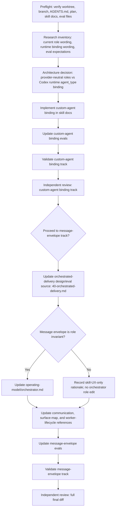

# Codex Custom-Agent Bindings and Orchestration Message Plan

## Review Verdict

The prior plan was directionally correct but structurally weak: it mostly stacked tasks in the order
they were discussed. This rewrite keeps the same decisions, but organizes them by ownership,
dependency, validation, and review gates so an executor can implement it without re-deciding scope.

## Goal

Update the repo-local workflow-kit skills so Codex custom agents are bound explicitly at the correct
planning and orchestration boundaries, and then improve `orchestrated-delivery` operator messages so
the first visible line is story/role/status context rather than raw worker ids or long prompt previews.

The work has two independent but related tracks:

1. **Custom-agent binding**: remove inference between conceptual workflow-kit roles and Codex
   `agent_type` values.
2. **Orchestration message envelope**: standardize coordinator-visible worker transition summaries.

Both tracks must preserve the existing delivery pipeline:

- `plan-epic` authors story DAGs and story contracts, then stops at Gate 1.
- `plan-delivery` projects ready stories into a provider-neutral execution package.
- `orchestrated-delivery` binds runtime facts and executes packaged worker prompts.

## Source Of Truth And Ownership

Use the repo-local skill docs as the execution surface, but keep durable requirements in the owning
design docs when a requirement affects the orchestrator role or its eval contract.

| Concern | Owning artifact | Notes |
|---|---|---|
| Stage boundaries | `.agents/skills/{plan-epic,plan-delivery,orchestrated-delivery}/SKILL.md` plus delivery-pipeline design docs | Do not weaken or merge stages. |
| Provider-neutral package role data | `plan-delivery` skill docs and generated execution package schema | Never write Codex `agent_type` values into generated execution packages. |
| Runtime surface binding | `.agents/skills/orchestrated-delivery/references/runtime-binding.md` and `surface-map.md` | Codex `agent_type` belongs here for execution workers. |
| Worker lifecycle and persistent pair rules | `.agents/skills/orchestrated-delivery/references/worker-lifecycle.md` | Role binding must not break same-context fix/rereview loops. |
| Operator communication policy | `docs/implementation-authoring/delivery-pipeline/40-orchestrated-delivery.md` first, then `.agents/skills/orchestrated-delivery/references/communication.md` | Update `operating-model/orchestrator.md` only if the message envelope is a role invariant. |
| Skill behavior evals | `.agents/skills/*/EVALS.md` and matching `evals/*.json` files | Evals must be updated wherever the normative behavior changes. |

## Requirements

### R1: Preserve Stage Boundaries

`plan-epic` remains planning-only, `plan-delivery` remains package-projection-only, and
`orchestrated-delivery` remains runtime execution-only. No track may add feature-code work, package
repair during orchestration, delivery dispatch during planning, or concrete provider model ids to
provider-neutral artifacts.

### R2: Bind Codex Custom Agents Explicitly

When delegating on Codex:

- `researcher` handles broad read-only scans and evidence gathering.
- `architect` handles characterization judgment, architecture override, design-gap escalation,
  source-contract blocker classification, and five-round-cap escalation review.
- `reviewer` handles independent read-only reviews and implementation review workers.
- `implementer` handles implementation workers only in `orchestrated-delivery`.

Planning-stage delegation wording must not make subagent support mandatory on surfaces that do not
support it.

### R3: Preserve Provider-Neutral Package Artifacts

Generated execution package artifacts must continue to record abstract package-owned role data:
model class, effort, reasoning tier, routing rationale, prompt contract, evidence slots, allowed
pathset, and escalation target. They must not contain Codex-specific `agent_type` values.

### R4: Keep Model Routing Separate From Role Binding

`agent_type` controls behavioral role. It does not replace abstract model class, effort, reasoning
tier, provider profiles, or concrete model resolution.

### R5: Preserve Blocker Route-Back Ownership

An `architect` custom agent may classify source-contract blockers or five-round-cap escalations, but
durable tracker route-back targets remain:

- `$plan-epic` for frozen story-contract defects;
- `$plan-delivery` for package-only projection defects.

### R6: Improve Orchestration Message Envelope

Coordinator-visible worker messages should lead with ledger context, not raw worker ids. Wait,
launch, input/readdress, result/blocker, and close transitions must show alias, story id, role,
round, verdict or purpose, commit when applicable, route-back target when blocked, and raw id only as
traceability metadata.

## Dependency DAG



## Execution Plan

### Phase 0: Preflight

Verify the worktree and live state before editing:

- `pwd`
- `git rev-parse --show-toplevel`
- `git status --short --branch`
- read `AGENTS.md`
- read this plan
- read the target skill docs and eval files listed below

Refuse or pause if the checkout is not
`/Users/aryekogan/repos/workflow-kit/.worktrees/codex-custom-agent-skill-bindings`, if the branch is
not the expected work branch, or if unrelated user changes overlap the target files.

The branch has been rebased over `origin/v-next` commit `6e0518f` (`fix: repair approval failure
catalog`). Any edits to `plan-epic` or `plan-delivery` must preserve that upstream change's
failure-token/catalog closure rules, source-readiness refusal routing, same-logic/public-barrel
ownership wording, and existing route-back semantics.

### Phase 1: Custom-Agent Binding Track

Target files:

- `.agents/skills/plan-epic/SKILL.md`
- `.agents/skills/plan-epic/EVALS.md`
- `.agents/skills/plan-epic/evals/evals.json`
- `.agents/skills/plan-epic/evals/trigger_queries.json` if activation-boundary behavior changes
- `.agents/skills/plan-delivery/SKILL.md`
- `.agents/skills/plan-delivery/EVALS.md`
- `.agents/skills/plan-delivery/evals/evals.json`
- `.agents/skills/plan-delivery/evals/trigger_queries.json` if activation-boundary behavior changes
- `.agents/skills/orchestrated-delivery/references/runtime-binding.md`
- `.agents/skills/orchestrated-delivery/references/surface-map.md`
- `.agents/skills/orchestrated-delivery/references/worker-lifecycle.md`
- `.agents/skills/orchestrated-delivery/EVALS.md`
- `.agents/skills/orchestrated-delivery/evals/evals.json`
- `.agents/skills/orchestrated-delivery/evals/trigger_queries.json`

Implementation requirements:

- Make planning-stage `agent_type` wording conditional on Codex delegation support.
- Bind packaged implementer prompts to `agent_type: "implementer"` on Codex surfaces.
- Bind packaged reviewer prompts to `agent_type: "reviewer"` on Codex surfaces.
- Bind source-contract blocker classification, five-round-cap escalation review, and architecture
  judgment to `agent_type: "architect"` where delegated on Codex.
- Bind bounded read-only evidence tasks to `agent_type: "researcher"` where delegated on Codex.
- Explicitly state that `agent_type` does not replace model class, effort, reasoning tier, provider
  profiles, or concrete model resolution.
- Inspect and update `plan-epic`, `plan-delivery`, and `orchestrated-delivery` eval expectations where
  normative behavior changes, so stale evals cannot pass without the new Codex custom-agent behavior.
  If a planning-skill eval file does not need a content change after inspection, record the no-change
  rationale in the implementation summary.

Preferred commit boundary:

- Commit this track separately before starting the message-envelope track if validation and review
  pass.

### Phase 2: Orchestration Message Envelope Track

Authoritative requirement update comes first:

1. Update `docs/implementation-authoring/delivery-pipeline/40-orchestrated-delivery.md` to strengthen
   OD-8 from generic sparse communication into alias-first worker transition summaries.
2. Decide whether alias-first worker messages are an orchestrator role invariant or only a skill UX
   rule.
3. If role invariant, update `docs/implementation-authoring/operating-model/orchestrator.md`.
4. If skill UX only, do not edit the orchestrator role spec; record the rationale in the implementation
   summary.

Skill/eval target files after the design requirement is set:

- `.agents/skills/orchestrated-delivery/references/communication.md`
- `.agents/skills/orchestrated-delivery/references/surface-map.md`
- `.agents/skills/orchestrated-delivery/references/worker-lifecycle.md`
- `.agents/skills/orchestrated-delivery/EVALS.md`
- `.agents/skills/orchestrated-delivery/evals/evals.json`
- `.agents/skills/orchestrated-delivery/evals/trigger_queries.json`

Required message envelope:

```text
Wait: 2 workers active
- core-03-s3-impl R1 | implementer | story=core-03-s3-pending-... | id=019f...
- core-04-s3-impl R1 | implementer | story=core-04-s3-timers-wait | id=019f...

Result: core-03-s3-impl R1 BLOCKED | source-contract | commit=none | changes=none | route=$plan-epic
Reason: missing/contradictory token `approval-resume-capability-missing`.

Launch: core-04-s3-review R1 | reviewer | model=gpt-5.5/high | commit=8882a17 | story=core-04-s3-timers-wait

Input: core-04-s3-impl R2 | rebase/reprove after track advanced | base=<track-head> | prior=8882a17

Closed: core-04-s3 pair | impl=019f... | review=019f...
```

Acceptance requirements:

- Worker aliases appear before raw worker ids in coordinator-visible summaries.
- Spawn and readdress messages begin with compact story/role/round/purpose headers before long worker
  instructions.
- Worker result summaries use stable fields: alias, story id, role, round, verdict, commit,
  changed-files count or `none`, blocker class, route-back target, and residual risk.
- Close messages collapse per-story worker-pair closure when both sides close together.
- Raw worker ids remain available for traceability but are never the only first-line identifier.

Preferred commit boundary:

- Commit this track separately from the custom-agent binding track if both tracks are implemented in
  one session.

## Subagent Plan

Use subagents only where they reduce risk or context load. Keep each prompt bounded.

| Phase | Suggested agent | Scope |
|---|---|---|
| Phase 0/1 inventory | `researcher` | Read-only map of current role wording, runtime binding wording, and eval expectations. |
| Phase 1 architecture | `architect` | Confirm custom-agent binding ownership, provider-neutral package invariant, and blocker route-back ownership. |
| Phase 1 edits | `implementer` | Apply skill/eval edits after architecture pass. |
| Phase 2 decision | `architect` | Decide whether alias-first messaging is a role invariant or skill UX requirement. |
| Phase 2 edits | `implementer` | Apply design, skill-reference, and eval edits in dependency order. |
| Final review | `reviewer` | Independent read-only review of final diff against this plan, design docs, skill refs, and evals. |

If subagent tooling is unavailable, perform separate explicit passes in the main session and state
that independent subagent review was unavailable.

## Validation Requirements

Run these after any relevant edits:

```bash
python3 "$HOME/.agents/skills/open-skill-creator/scripts/validate_skill.py" .agents/skills/plan-epic
python3 "$HOME/.agents/skills/open-skill-creator/scripts/validate_skill.py" .agents/skills/plan-delivery
python3 "$HOME/.agents/skills/open-skill-creator/scripts/validate_skill.py" .agents/skills/orchestrated-delivery
```

Run targeted checks:

```bash
rg -n 'agent_type: "(reviewer|architect|researcher|implementer)"|agent_type' .agents/skills
rg -n 'agent_type' docs/implementation/epics
rg -n 'Wait:|Launch:|Input:|Result:|Closed:|worker alias|alias-first|raw worker' docs/implementation-authoring .agents/skills/orchestrated-delivery
rg -n 'failure-token/catalog|PD-11|PE-18|same-logic|public-barrel|packages/sdk/src/index.ts' .agents/skills/plan-epic .agents/skills/plan-delivery docs/implementation-authoring
```

Expected targeted-check outcomes:

- `agent_type` appears only in skill/runtime/eval contexts where Codex custom-agent binding is
  intentional.
- `agent_type` does not appear in generated execution packages under `docs/implementation/epics`.
- Message-envelope terms appear in the authoritative design/eval source and in the
  `orchestrated-delivery` communication/runtime references.
- The `6e0518f` planning-skill rules for failure-token/catalog closure, source-readiness refusal,
  same-logic concurrency, and public-barrel ownership remain present after edits.

Run repository verification:

```bash
pnpm check
```

`pnpm check` may be skipped only if the final diff is docs/eval-only and the executor records a
specific rationale. If skipped, do not imply the full repo gate passed.

## Review Requirements

Before final closeout, perform an independent read-only review. The reviewer must inspect:

- this plan;
- the full final diff;
- stage-boundary preservation across `plan-epic`, `plan-delivery`, and `orchestrated-delivery`;
- provider-neutral package invariants;
- runtime binding and provider model routing separation;
- blocker classification vs durable route-back ownership;
- message-envelope requirement placement and skill-reference implementation;
- eval coverage for every normative behavior changed;
- validation output and any skipped checks.

Blocking review findings must be fixed or explicitly escalated before claiming the plan is complete.
If no independent subagent reviewer is available, the executor must perform a separate review pass and
state that it was not independent.

## Non-Goals

- Do not edit packaged workflow-kit runtime code as part of this change.
- Do not change the stage boundary between `plan-epic`, `plan-delivery`, and
  `orchestrated-delivery`.
- Do not bake Codex-specific `agent_type` values into generated execution packages.
- Do not replace provider model profiles or abstract model classes with custom-agent names.
- Do not dispatch actual delivery workers from this planning/change task.

## Final Acceptance Criteria

- The skill docs explicitly bind Codex custom agents at the correct planning/delegation and
  orchestration/runtime boundaries.
- Provider-neutral execution packages remain free of Codex-specific `agent_type` values.
- Runtime role binding remains separate from model class, effort, reasoning tier, and provider model
  resolution.
- Orchestration communication requirements lead with alias/story/role/round context and preserve raw
  ids only as traceability metadata.
- The authoritative design/eval source is updated before dependent skill-reference changes for the
  message-envelope track.
- Evals are updated for every normative behavior change.
- Validators and targeted searches pass, and `pnpm check` either passes or is explicitly skipped with
  rationale.
- Independent review is complete, or the lack of independent review is stated with a separate manual
  review result.

<!-- DOCS-NAV (generated — do not edit by hand) -->

---

**↑ Up:** [documentation home](../README.md) · **← Prev:** [Producer↔Consumer Closure Audit — kit-vnext design corpus](./2026-06-25-producer-consumer-closure-audit.md) · **Next →:** [roadmap](../roadmap.md)

<!-- /DOCS-NAV -->
