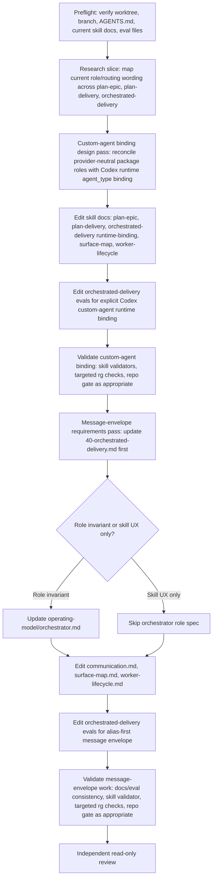

# Codex Custom-Agent Bindings for Workflow-Kit Planning Skills

## Goal

Update the repo-local workflow-kit skills so Codex custom agents are used explicitly at the correct
planning and orchestration boundaries.

Codex currently exposes custom agents named `reviewer`, `architect`, `researcher`, and
`implementer`. The workflow-kit skills already describe those responsibilities conceptually, but the
skill text does not consistently bind those concepts to Codex `agent_type` values. A later
implementation should remove that inference step while preserving the existing stage separation:

- `plan-epic` authors story DAGs and story contracts, then stops at Gate 1.
- `plan-delivery` projects ready stories into a provider-neutral execution package.
- `orchestrated-delivery` binds runtime facts and executes the packaged worker prompts.

## Current State

The repo-local skills live under:

- `.agents/skills/plan-epic`
- `.agents/skills/plan-delivery`
- `.agents/skills/orchestrated-delivery`

The current skill split is correct and should remain intact. The improvement is a Codex runtime
binding clarification, not a replacement for the existing delivery pipeline.

The key design rule is:

> `plan-delivery` grounds durable roles and prompt contracts; `orchestrated-delivery` maps those
> roles to the current surface's custom agent mechanism.

## Role-Boundary Decisions

### `plan-epic`

When delegating on Codex, bind planning-stage assistant roles to Codex custom agents without making
delegation mandatory on surfaces that do not support it:

- Use `agent_type: "researcher"` for broad read-only source and evidence scans, such as source-doc
  traceability, existing DAG/story inventory, sibling symbol/path checks, and epic readiness evidence.
- Use `agent_type: "architect"` for characterization review, architecture override, design-gap
  escalation, and final ownership of contract/architecture judgment.
- Use `agent_type: "reviewer"` for the final independent read-only Gate 1 review.
- Do not use `agent_type: "implementer"` in `plan-epic`; no feature execution, execution-package
  authoring, or delivery dispatch happens in this stage.

### `plan-delivery`

- When delegating on Codex, use optional `agent_type: "researcher"` for wide source-readiness
  evidence gathering when the readiness surface is broad enough to benefit from bounded read-only
  delegation.
- When delegating on Codex, use `agent_type: "reviewer"` for the independent package-quality and
  implementation-readiness review after local closeout validation.
- Keep generated execution package artifacts provider-neutral. Do not place Codex-specific
  `agent_type` values in `execution/plan.md`, `execution/tracker.md`, or packaged
  `execution/prompts/<story-id>/{implementer,reviewer}.md` files.
- Continue to record package-owned role data as abstract model class, effort, reasoning tier, routing
  rationale, prompt contract, evidence slots, allowed pathset, and escalation target.

### `orchestrated-delivery`

- On Codex surfaces, runtime-bind packaged role prompts to Codex custom agents:
  - implementer prompt -> `agent_type: "implementer"`
  - reviewer prompt -> `agent_type: "reviewer"`
  - source-contract blocker classification or five-round cap escalation review ->
    `agent_type: "architect"`
  - bounded read-only evidence task -> `agent_type: "researcher"`
- Preserve durable route-back ownership for blockers: an `architect` escalation may classify the
  issue, but tracker route-back targets remain `$plan-epic` for frozen story defects and
  `$plan-delivery` for package-only projection defects.
- Keep model class and effort routing separate from role binding. The package-declared model class
  still resolves through `references/providers/openai.md` or the active provider profile.
  `agent_type` controls the behavioral role; it does not replace abstract model routing.
- Reuse the same implementer and reviewer contexts through fix/rereview rounds. Do not spawn a fresh
  replacement worker for each round unless the context is lost or technically impossible to continue.

## Follow-Up Implementation Targets

A follow-up implementation should update the smallest useful set of skill docs:

- `.agents/skills/plan-epic/SKILL.md`
- `.agents/skills/plan-delivery/SKILL.md`
- `.agents/skills/orchestrated-delivery/references/runtime-binding.md`
- `.agents/skills/orchestrated-delivery/references/surface-map.md`
- `.agents/skills/orchestrated-delivery/references/worker-lifecycle.md`
- `.agents/skills/orchestrated-delivery/EVALS.md`
- `.agents/skills/orchestrated-delivery/evals/evals.json`
- `.agents/skills/orchestrated-delivery/evals/trigger_queries.json`

The orchestrated-delivery eval updates are required because its runtime-binding requirements already
assert surface and routing behavior. Update `plan-epic` or `plan-delivery` evals only if their skill
text gains normative custom-agent dispatch behavior. All eval changes must preserve provider-neutral
package artifacts.

## Task Dependency DAG

Use this DAG for implementation sequencing. The work is intentionally split into logical phases so an
executor can delegate bounded read/review slices to subagents without losing the stage boundaries.



Recommended subagent use:

- Use a `researcher` for node B: read-only inventory of current wording and stale eval expectations.
- Use an `architect` for node C and the node H decision: confirm boundary ownership and whether the
  message envelope is a role invariant or skill UX rule.
- Use an `implementer` for nodes D, E, G, I/J, K, and L after the owning requirements are clear.
- Use a `reviewer` for node N: independent read-only review of the final docs/eval diff against this
  plan, the design docs, and the skill references.

Execution constraints:

- Do not mix the custom-agent binding change and the message-envelope change in one undifferentiated
  edit pass; land them as separate logical commits if both are implemented in one session.
- Do not place Codex-specific `agent_type` values in generated execution packages.
- Do not update skill references for the message envelope before the design/eval source has been
  updated or explicitly judged unnecessary by the architect pass.
- Keep raw worker ids available for traceability while making aliases the first-line operator handle.

## Follow-Up: Orchestration Message Envelope

After the custom-agent binding work, add a separate communication-contract improvement for
`orchestrated-delivery` operator messages. Current Codex surface events expose raw worker ids and
long prompt previews before the useful story/role/status context. The goal is not to change runtime
behavior; it is to make every wait, launch, input, result, blocker, and close transition summarize
the ledger fact first.

Recommended human-facing envelope:

```text
Wait: 2 workers active
- core-03-s3-impl R1 | implementer | story=core-03-s3-pending-... | id=019f...
- core-04-s3-impl R1 | implementer | story=core-04-s3-timers-wait | id=019f...

Result: core-03-s3-impl R1 BLOCKED | source-contract | commit=none | changes=none | route=$plan-epic
Reason: missing/contradictory token `approval-resume-capability-missing`.

Launch: core-04-s3-review R1 | reviewer | model=gpt-5.5/high | commit=8882a17 | story=core-04-s3-timers-wait

Input: core-04-s3-impl R2 | rebase/reprove after track advanced | base=<track-head> | prior=8882a17

Closed: core-04-s3 pair | impl=019f... | review=019f...
```

Required ordering for the follow-up:

1. Update the authoritative requirement/eval source first:
   `docs/implementation-authoring/delivery-pipeline/40-orchestrated-delivery.md`.
2. If the requirement becomes an orchestrator role invariant rather than only a skill UX rule, also
   update `docs/implementation-authoring/operating-model/orchestrator.md`.
3. Then update the skill runtime docs:
   - `.agents/skills/orchestrated-delivery/references/communication.md`
   - `.agents/skills/orchestrated-delivery/references/surface-map.md`
   - `.agents/skills/orchestrated-delivery/references/worker-lifecycle.md`
   - `.agents/skills/orchestrated-delivery/EVALS.md`
   - `.agents/skills/orchestrated-delivery/evals/evals.json`
   - `.agents/skills/orchestrated-delivery/evals/trigger_queries.json`

Acceptance bar:

- Worker aliases appear before raw worker ids in coordinator-visible summaries.
- Spawn and readdress messages begin with compact story/role/round/purpose headers before long
  worker instructions.
- Worker result summaries use stable fields: alias, story id, role, round, verdict, commit,
  changed-files count or `none`, blocker class, route-back target, and residual risk.
- Close messages collapse per-story worker-pair closure when both sides close together.
- Raw UUIDs remain available for traceability but are never the only first-line identifier.

## Non-Goals

- Do not edit packaged workflow-kit runtime code as part of this change.
- Do not change the stage boundary between `plan-epic`, `plan-delivery`, and
  `orchestrated-delivery`.
- Do not bake Codex-specific `agent_type` values into generated execution packages.
- Do not replace provider model profiles or abstract model classes with custom-agent names.

## Verification for Follow-Up Implementation

After editing skill files, run:

```bash
python3 "$HOME/.agents/skills/open-skill-creator/scripts/validate_skill.py" .agents/skills/plan-epic
python3 "$HOME/.agents/skills/open-skill-creator/scripts/validate_skill.py" .agents/skills/plan-delivery
python3 "$HOME/.agents/skills/open-skill-creator/scripts/validate_skill.py" .agents/skills/orchestrated-delivery
```

Also run repository checks required by the edited scope, normally:

```bash
pnpm check
```

Use targeted search checks:

```bash
rg -n 'agent_type: "(reviewer|architect|researcher|implementer)"|agent_type' .agents/skills
rg -n 'agent_type' docs/implementation/epics
```

The first check should prove the skill/runtime binding is explicit. The second should not find
Codex-specific `agent_type` values in generated execution-package artifacts unless a future decision
intentionally changes package portability.

## Acceptance Criteria

- A fresh session can read this document and understand the task without this conversation.
- The role decisions for `plan-epic`, `plan-delivery`, and `orchestrated-delivery` are explicit.
- The distinction between provider-neutral package roles and Codex runtime `agent_type` binding is
  preserved.
- The proposed follow-up target files and verification commands are listed.
