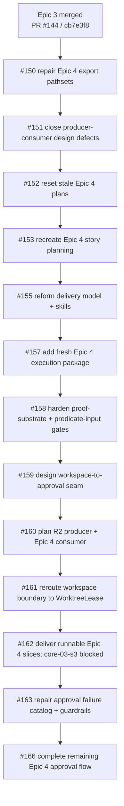
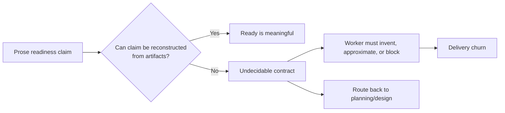
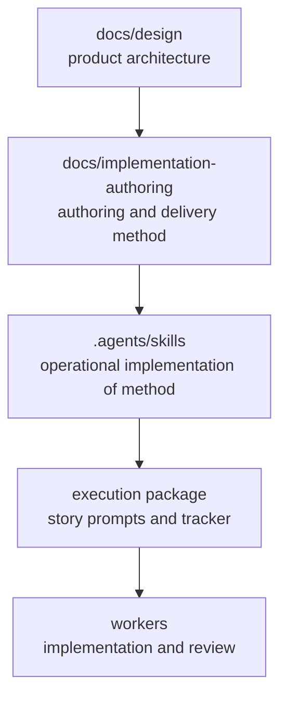
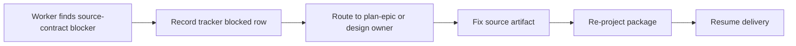

# Epic 4 execution blockers - pattern profile and prevention buttons

## Purpose

This report profiles the design and authoring failures that repeatedly blocked Epic 4 execution after
Epic 3 landed. It is written for a reader who was not present for the planning or delivery sessions.

The goal is not to re-litigate the fixes. The goal is to extract the recurring issue classes, explain
why they held execution back, verify whether the lessons ledger now records them, and define practical
"buttons" reviewers and planners can press before a future epic reaches delivery.

## Scope

Covered:

- Epic 4 planning and execution artifacts after Epic 3 implementation merged to `v-next`.
- PRs and commits that repaired Epic 4 design, story planning, execution package, delivery skills, and
  residual source-contract blockers.
- The current authoring standard, delivery-pipeline specs, lessons ledger, and repo-local delivery
  skills that now encode the fixes.

Not covered:

- Ordinary implementation bugs that occurred after the design contract was clear, unless they indicate a
  recurring design-authoring class.
- Active Epic 5 planning work.
- Full post-run performance or token analysis.

## Background

Epic 3 landed the core runtime spine. Epic 4 was the next major delivery unit: human control and liveness
loop, spanning approval/escalation (`core-03`) and supervision/liveness (`core-04`). The expected flow was
straightforward:

1. Freeze Epic 4 story DAG and story contracts.
2. Project the frozen contracts into an execution package.
3. Run orchestrated delivery in story waves.
4. Merge approved story results to `v-next`.

Instead, Epic 4 exposed a series of blockers that forced multiple design and authoring repairs before
the delivery could complete. The important observation is that most blockers were not caused by
implementer incompetence. They were caused by **undecidable contracts**: the worker was asked to build,
prove, or classify something whose owner, source, operand, token, or runtime substrate was missing.

## Timeline

The following sequence is reconstructed from `v-next` history and PR descriptions after Epic 3 PR #144.

Supportive but not central to the design pattern:

- PR #154 forward-fixed delivered code affected by the broader producer-consumer closure audit.
- PR #156 fixed `.turbo` worktree log isolation.
- PR #164 bound Codex custom-agent roles for the delivery skills.
- PR #165 standardized pnpm store and CI actions.

## Research method

The analysis used an evidence-first audit method:

1. **Establish the live sequence.** Read `v-next` git history from the Epic 3 merge forward and identify
   Epic 4-related PRs.
2. **Read primary PR explanations.** Use PR bodies as the source for why a change was made, not commit
   titles alone.
3. **Cross-check durable docs.** Compare PR causes against:
   - `docs/implementation-authoring/lessons-ledger.md`
   - `docs/implementation-authoring/authoring-standard/`
   - `docs/implementation-authoring/delivery-pipeline/`
   - `.agents/skills/plan-epic/`
   - `.agents/skills/plan-delivery/`
   - `.agents/skills/orchestrated-delivery/`
4. **Separate classes from incidents.** Promote only recurring or gate-preventable defect classes.
   Ordinary implementation mistakes stay with reviewer practice unless they recur.
5. **Validate current enforcement shape.** Confirm that the relevant skills still validate structurally
   and that the current docs contain the covering gates/preflights.

Evidence used:

- PR #150, #151, #152, #153, #155, #157, #158, #159, #160, #161, #162, #163, #166.
- `docs/reviews/2026-06-25-producer-consumer-closure-audit.md`.
- `docs/reviews/2026-06-25-barrel-coownership-and-closure-wiring-plan.md`.
- Current lessons ledger entries LSN-08 and LSN-24 through LSN-31.
- Current `plan-epic`, `plan-delivery`, and `orchestrated-delivery` skill contracts.

Verification performed during this analysis:

- `git fetch origin v-next`
- `git rev-parse HEAD origin/v-next`
- `git log --oneline cb7e3f8..v-next`
- `ghx` PR reads for the Epic 4 PR sequence
- `validate_skill.py .agents/skills/plan-epic`
- `validate_skill.py .agents/skills/plan-delivery`
- `validate_skill.py .agents/skills/orchestrated-delivery`
- targeted wording sweeps over docs and skill directories

## Executive finding

Epic 4's repeated blockers reduce to one architectural failure:

> **Readiness was asserted instead of reconstructed.**

The artifacts said `ready`, but some readiness claims could not be rebuilt from concrete source
artifacts: declared inputs, producer-owned fields, owned pathsets, public export lines, runtime
substrate, failure catalogs, or graph-level producer assignments.

That made the delivery package look executable while leaving the implementer to discover missing
decisions during execution.

## Issue taxonomy and buttons

The table below is the practical profile. A "button" is the review question or gate check that should be
pressed before a package is marked ready.

| Bucket | Failure shape | Why it blocked execution | Button |
|---|---|---|---|
| Producer-consumer closure | A required produced field/event/public symbol had no reachable producer. | Implementers could not construct the requested value without inventing a source. | For every produced record/event field and public symbol, name the exact input field, producer-owned field, owned file, resolver, or minting rule. |
| Public exposure ownership | A story had a public SDK import AC but did not own its `packages/sdk/src/index.ts` export line. | Workers were asked to prove public importability without permission to wire the public entrypoint. | Every public-symbol story owns its own barrel export line plus public-import test. |
| Whole-graph orphan | A consumed event or failure token had no producer anywhere in the DAG, so per-story checks could pass falsely. | Dependency order looked valid while the graph lacked the thing consumers waited for. | Reconcile every consumed event, record, and shared failure token to exactly one producer before freezing the DAG. |
| Design-to-AC incompleteness | ACs traced to design, but not every design invariant traced back to an AC. | Important behavior such as resume capability freshness could be silently dropped. | Run the mirror pass: every design-stated invariant, emitted event, and failure behavior maps to at least one AC. |
| Proof-substrate mismatch | A type-only story carried runtime coverage requirements. | Coverage could be vacuously green because TypeScript types erase and V8 sees no executable statements. | If a coverage lane is required, identify the runtime substrate: function, enum, `export const`, or `as const` catalog. Otherwise use type fixtures and public-import tests. |
| Predicate-input gap | A relational safety predicate named only one concrete operand. | Tests could pass while the implementation approximated the missing operand and failed open. | For each relational sub-predicate, name both operands as concrete fields, not categories. |
| Failure-token/catalog drift | A consumer failure table invented or referenced a token missing from the producer catalog/design. | Worker had to invent policy vocabulary or stop. | Every consumed failure/degraded/validation token must exist in one authoritative producer catalog with exact-literal tests. |
| Design-skill drift | Docs were repaired, but skills still encoded the older workflow or only prose safeguards. | Old behavior could be regenerated by the next planning or delivery run. | Rule lives in one design source of truth; skills reference and enforce it; evals or static checks cover the behavior. |
| Execution model mismatch | Shared-file fears from an older shared-worktree model shaped the barrel plan. | The package over-serialized or treated append-only aggregation as a special ownership problem. | Distinguish logic-bearing conflicts from append-only aggregation overlaps; handle the latter by per-story ownership plus rebase. |

## Detailed analysis

### 1. Producer-consumer closure was the root class

The producer-consumer audit states the defect directly: a contract declared a required output with no
producer reachable from declared inputs. Epic 4 surfaced this first through SDK barrel ownership and
approval normalization, but the same class existed elsewhere in the design corpus.

Observed root patterns:

- **No injected time.** Required timestamps such as `requestedAt` or `classifiedAt` appeared on produced
  records/events, but no explicit clock or event time crossed the producer boundary.
- **Ref or identity assumed at a seam.** Fields like prompt refs, plan ids, run/request identity, or SDK
  public symbols were treated as if already available.
- **Producer input not threaded.** A source existed in a sibling domain but was not passed to the
  producer that needed it.
- **Two sources of truth or shapeless type.** Types were referenced but undefined, or canonical SDK docs
  disagreed with domain docs.

Why this matters:

An implementer can choose an implementation strategy, but it cannot responsibly choose the authority for
a required event field or public surface. That is architecture-level ownership, not implementation detail.

Cover now in place:

- Gate 3 whole-graph event/record producer reconciliation.
- Gate 4 producer-closure rows.
- `plan-epic` requires reconciliation before `story: ready`.

### 2. Public exposure was treated as an outcome without an owner

Early Epic 4 package artifacts asked stories to prove public imports from `sdk`, but did not allow the
workers to write the SDK public entrypoint. The first repair serialized all eight public-entrypoint
writers. The later, better model recognized that the barrel is just a normal owned file: each public
symbol story owns its own export line.

Why this matters:

Public importability is not a global afterthought. If a story's DONE includes public import, the story
must own the export line and the public-import test.

Cover now in place:

- LSN-08 reframed the barrel model.
- Story DAG delivery readiness says `packages/sdk/src/index.ts` is a normal owned file.
- Gate 4 public exposure requires the export line in the owned pathset.
- Same-logic concurrency treats append-only aggregation files differently from logic-bearing files.

### 3. Whole-graph checks were missing

Per-story checks cannot catch an event that no story produces. If every story assumes the event exists
elsewhere, every individual contract can look plausible while the DAG is impossible.

Epic 4 reproduced this around approval events that downstream stories consumed. The right fix was not a
worker workaround; it was a DAG-level reconciliation table.

Cover now in place:

- LSN-24.
- Gate 3 whole-graph event/record reconciliation.
- `plan-epic` step that enumerates every event/record named by design seams and consumed by stories.

### 4. The gates were one-directional

Before the fixes, gates were good at checking that each AC could point to design. They were weaker at
checking that each design requirement had a corresponding AC.

This allowed:

- Dropped resume capability freshness checks.
- A boundary sweep that banned a token the story itself needed to assert.
- Failure-table rows whose cited AC proved the happy path rather than the row's trigger and behavior.

Cover now in place:

- Characterization review now includes design-to-AC completeness.
- Sweep vocabulary must not ban story-owned normative vocabulary.
- Failure rows must cite ACs that assert the actual failure trigger and behavior.

### 5. Proof substrate must match the proof

The `core-04-s1` blocker exposed a subtle but important defect: a type-only producer had a statement and
branch coverage bar. Since TypeScript types erase, the runtime coverage lane had no meaningful substrate.
That can look green without proving anything.

The general rule is:

- If the proof is runtime coverage, the story must emit runtime substrate.
- If the story is type-only, use compile-time fixtures, negative fixtures, and public-import tests.
- Do not let a coverage number stand in for proof when there is no runtime code to instrument.

Cover now in place:

- LSN-29.
- `Readiness is reconstructed, not asserted`.
- Gate 4 proof-substrate match.
- `plan-delivery` substrate-presence preflight.

### 6. Relational predicates need both operands

The `core-03-s2` workspace containment case showed why predicate closure needs field-level precision.
The story needed to decide whether `cwd` or a file path was inside the workspace. One operand was the
agent-supplied path; the other had to be a trusted workspace boundary. Without the trusted boundary, the
predicate was undecidable.

The dangerous implementation approximation was to treat `cwd` as the workspace root. That can pass tests
but fail open, because an attacker-controlled or agent-supplied value can redefine the boundary.

Cover now in place:

- LSN-30.
- Gate 4 predicate-input closure for relational and compound predicates.
- `plan-delivery` predicate-input preflight.
- Approval workspace boundary later routed from `WorktreeLease.worktreePath`.

### 7. Failure vocabulary needs a producer catalog

The `core-03-s3` blocker was a failure-token/catalog closure problem. The story referenced
`approval-resume-capability-missing`, but the authoritative producer catalog did not include it.

This is not a string cleanup. A failure token is a contract: it carries behavior, tests, and downstream
interpretation. A consumer cannot invent it inside a failure row.

Cover now in place:

- LSN-31.
- Gate 3 whole-graph failure-token/catalog reconciliation.
- Gate 4 failure-token/catalog closure.
- `plan-delivery` PD-11 preflight.
- `plan-epic` refusal criteria for unowned, ambiguous, absent, stronger-than-design, or prose-only tokens.

### 8. Skill conformance mattered as much as docs

Several fixes would have been weak if they lived only as prose. The repo now treats the hierarchy as:

The failure mode was design-skill drift: a rule stated in docs but not present in the skill can be lost
when the next session regenerates artifacts. PR #155 was important because it conformed the skills to
the reformed delivery model, not because it merely updated wording.

Cover now in place:

- `plan-epic` requires whole-graph reconciliation, same-logic concurrency, proof-substrate,
  predicate-input, and failure-token/catalog closure.
- `plan-delivery` refuses `ready_for_implementation` on substrate, predicate, or token closure gaps.
- `orchestrated-delivery` executes packages only; it does not repair package scope or ACs.

## Ledger verification

The lessons ledger is in sync with the Epic 4 design-fix classes found in this analysis.

| Lesson | Covers | Status in ledger |
|---|---|---|
| LSN-08 | Public SDK barrel ownership and per-story export lines. | covered |
| LSN-24 | Whole-graph event/record producer reconciliation. | covered |
| LSN-25 | Reformed delivery model: per-round commits, track branch, same-logic concurrency. | covered |
| LSN-26 | Design-to-AC completeness for dropped design invariants. | covered |
| LSN-27 | Sweep vocabulary must not ban story-owned required vocabulary. | covered |
| LSN-28 | Failure-row AC mismatch. | covered |
| LSN-29 | Proof-substrate mismatch for erased type producers. | covered |
| LSN-30 | Relational predicate operand closure. | covered |
| LSN-31 | Failure-token/catalog closure. | covered |

No missing Epic 4 design-fix lesson was identified.

Notes:

- PR #166 found an implementation issue in `core-03-s4` around empty session command-prefix widening and
  sub-95% branch coverage. That is currently best treated as reviewer-domain implementation feedback, not
  a new lessons-ledger entry, unless the same shape recurs.
- PR #156 fixed concurrent `.turbo` log clobbering. That is execution tooling reliability, not an Epic 4
  design-authoring defect class.

## Recommended review checklist

Use this checklist before calling a future epic `story: ready` or `ready_for_implementation`.

### Planning gate buttons

- **Producer button:** every required output has a named source.
- **Graph button:** every consumed event/record/failure token maps to exactly one producer across the DAG.
- **Public button:** every public symbol has an owned export line and public-import test.
- **Predicate button:** every branch predicate names concrete fields; relational predicates name both
  operands per sub-condition.
- **Substrate button:** every runtime proof has runtime substrate; type-only stories use type fixtures.
- **Catalog button:** every consumed failure/degraded/validation token exists in an authoritative catalog
  and exact-literal tests.
- **Mirror button:** every design invariant and emitted event maps forward to at least one AC.
- **Skill button:** every rule the plan relies on is represented in the active skill contract, not just in
  a prose doc.

### Delivery gate buttons

- **Package button:** `orchestrated-delivery` receives a package that is already complete; it does not fix
  source contracts.
- **Tracker button:** dependency unlock requires merge-back to the track branch plus tracker update.
- **Conflict button:** append-only aggregation overlap is rebase work; logic-bearing conflict is an
  upstream planning defect.
- **Cap button:** five review rounds without approval means block and escalate the story, not endless
  churn.

## Reasoned recommendations

### 1. Keep "readiness is reconstructed, not asserted" as the umbrella principle

This principle correctly generalizes the blockers without overfitting to Epic 4. It covers source
closure, proof substrate, predicate operands, and public exposure using the same reasoning: if the claim
cannot be rebuilt from artifacts, the claim is not ready.

### 2. Treat source-contract blockers as planning defects, not delivery defects

If a worker reports that a required field, token, operand, or owner is missing, the correct response is
not to ask the worker to approximate. The route is:

This preserves the worker contract and prevents fail-open implementation choices.

### 3. Prefer field-level closure over category-level closure

Rows like "normalized request" or "projections" are too vague. The artifact should identify
`Producer/Type.field`, a consumed event field, or a resolver. This is especially important for safety
predicates and replay determinism.

### 4. Do not promote every delivery review bug into a ledger lesson

The ledger should stay focused on recurring defect classes that can be prevented by a gate, role, or
preflight. One-off implementation bugs remain reviewer findings. This keeps the ledger useful as a
planning tool rather than a bug archive.

### 5. Periodically sweep for design-skill drift

The most dangerous recurrence path is not that architects forget the lesson. It is that the next run uses
a skill or template that still encodes an older model. After major authoring reforms, validate:

- the canonical docs state the rule once;
- the skill references that canonical rule;
- evals or static checks cover it;
- generated packages reflect the new rule.

## Residual risks

- **Ledger conditional items remain.** Some older lessons outside Epic 4 remain conditional, especially
  signature-level verbatim seam checks and safety-critical invariant tagging. They did not appear as new
  Epic 4 gaps in this analysis, but they remain possible recurrence channels.
- **Semantic eval execution remains limited.** Skill structural validation passed, but some skill evals are
  documented rather than executed by a local semantic eval runner.
- **New planning sessions can still drift if they skip source reads.** The rules are present, but they only
  help if the planning workflow actually reads the owning design and authoring sources.

## Bottom line

Epic 4 was slowed by undecidable contracts, not by a lack of implementation effort. The durable prevention
model is now coherent:

- design defines the authoritative sources and seams;
- authoring gates reconstruct readiness from artifacts;
- delivery packages carry only ready work;
- orchestrated delivery executes and records, but does not invent missing decisions;
- the lessons ledger records the recurring classes and maps each to a checkable cover.

The practical test for future epics is simple:

> If a worker would have to choose an authority, source, operand, token, public owner, or proof substrate,
> the story is not ready. Press the relevant button before delivery.

<!-- DOCS-NAV (generated — do not edit by hand) -->

---

**↑ Up:** [documentation home](../README.md) · **← Prev:** [Codex Custom-Agent Bindings and Orchestration Message Plan](./2026-06-26-codex-custom-agent-skill-bindings-plan.md) · **Next →:** [roadmap](../roadmap.md)

<!-- /DOCS-NAV -->
