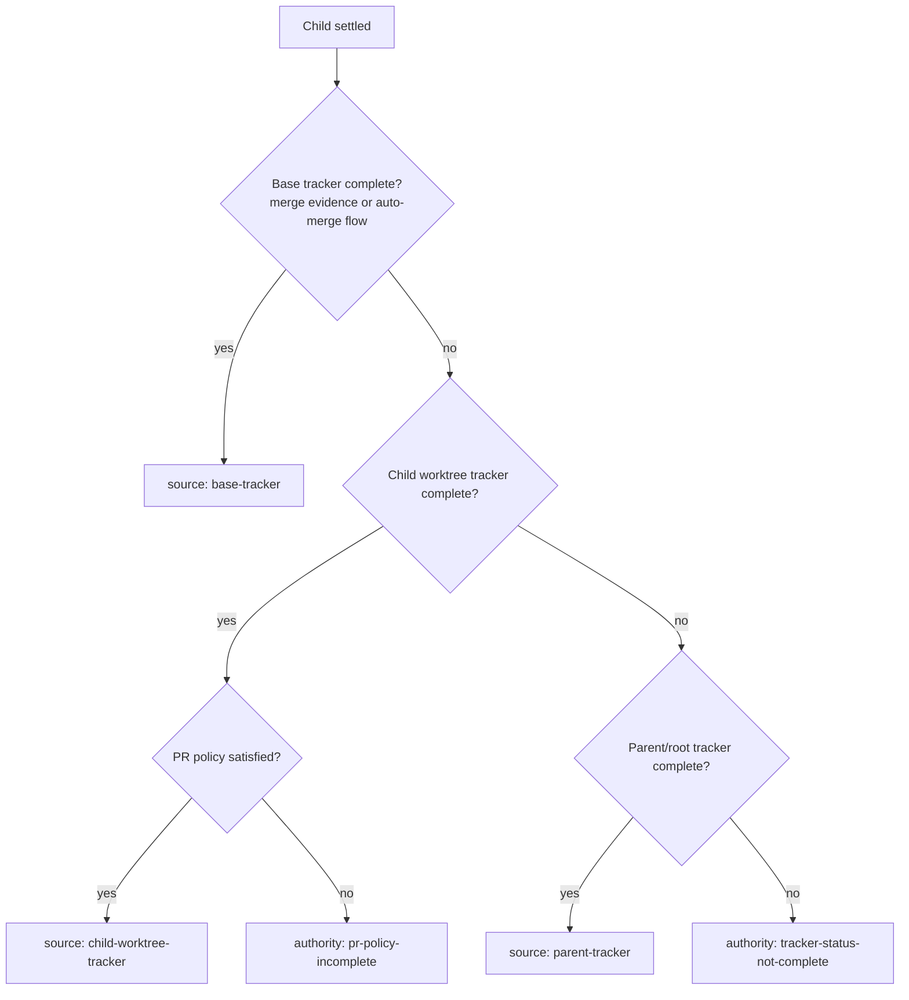

# Autopilot completion evidence hardening design

## Context

This design captures the actionable workflow-kit issues found while analyzing Codex session
`019ebde0-8907-7072-9d6f-a8a39cc4cb1e`, which ran `agentic-workflow-kit` plugin `0.5.11`
against the Pathway repository.

The run artifacts are under:

```text
/Users/aryekogan/repos/pathway/.codex/agentic-workflow-kit/runs/2026-06-12T22-09-21-463Z
```

The run launched three stories:

| Story | Child session | Final parent artifact state | Notes |
| --- | --- | --- | --- |
| DLD03 | `019ebde1-f33d-70c0-a1b6-0613ffc91a06` | complete | `codex-event` linkage worked; story completed. |
| DLD04 | `019ebde1-f9cc-7ed1-bfff-490b3a1f26c2` | complete | PR #107 merged; base tracker authority worked. |
| DLD05 | `019ebdef-0bac-7083-be5f-42be4f3b3601` | blocked | Child returned `ok: true`, but parent read tracker status `implementing`. |

Important corrected scope:

- Git author metadata is excluded from this design. The final spawned-session commits did not prove a
  workflow-kit credential bug.
- Pathway deploy smoke is not a workflow-kit product issue to fix here. It was recovered after the
  session: the bypass secret was present, the manually dispatched `Post-deploy smoke` run on `main`
  passed, and the relevant app assertions executed. The useful workflow-kit lesson is evidence
  classification, not changing Pathway smoke behavior.

## What Worked And Must Be Preserved

- `maxParallel: 2` was respected. DLD03 and DLD04 launched first, and DLD05 launched only after a
  slot opened.
- Child startup/liveness used Codex `codex/event` notifications successfully. All three children
  linked to real session ids and reached `settled`.
- Worktree dispatch worked. Launch records used story-specific child cwd values under
  `/Users/aryekogan/repos/pathway/.worktrees/`.
- The parent did not infer completion from child prose alone. It blocked when the tracker source it
  read was not complete.
- `analyze-run` found child session logs from the configured session root even when launch artifacts
  lacked a persisted `sessionLogPath`.

## Issues Found

### I1. Completion Reads The Parent Tracker Snapshot Before The Child Worktree Tracker

DLD05 child output said:

```text
Tracker row is `done` and linked to PR #108.
```

But `stories/after-DLD05.json` still showed:

```json
{
  "id": "DLD05",
  "status": "implementing",
  "owner": "awk:2026-06-12T22-09-21-463Z:DLD05",
  "metadata": {
    "pr": "-"
  }
}
```

The parent then blocked with:

```text
DLD05 returned but status is implementing
```

The current runtime re-reads stories through the parent/root `StorySource` after a child settles.
For worktree strategy, that can be a stale claim snapshot relative to the child checkout. The parent
has the child cwd in the launch record and child invocation, but completion evaluation does not first
parse the tracker from that child worktree.

### I2. PR Merge Evidence Has A False Positive Path

DLD05 raw output linked PR #108, then later said a failing check came from an "already-merged DLD04
workflow." Compatibility evidence parsed `merged: true` for PR #108 because it matched a PR URL and
any use of the word "merged" in the same content.

That is too broad. Merge evidence must be scoped to the same PR or an explicit merge commit.

### I3. Verification Evidence Can Contradict Its Own Detail

The DLD05 child evidence contained:

```json
{
  "command": "Post-deploy smoke",
  "status": "passed",
  "detail": "Blocker: auto-merge was not enabled because PR checks are not green. `Post-deploy smoke` fails ..."
}
```

This happened because compatibility parsing treats any line with a backticked command and the word
"passed" as passed. The line also contained "fails" and "Blocker", so the normalized evidence became
misleading.

### I4. Tracker Final Status Evidence Missed Common Child Wording

The raw child content used:

```text
Tracker row is `done`
```

Current compatibility parsing recognizes `Tracker authority: ... marked done`, but not this common
phrasing. That prevented `finalStatus: done` from being captured.

### I5. Blocked Run Analysis Was Too Quiet

Running:

```bash
pnpm agentic-workflow-kit -- analyze-run /Users/aryekogan/repos/pathway/.codex/agentic-workflow-kit/runs/2026-06-12T22-09-21-463Z --session-root /Users/aryekogan/.codex/sessions --json
```

returned `issues: []` even though the run was blocked and the child artifacts contained enough
evidence to explain the mismatch. Operators should not need to manually inspect raw child output,
tracker snapshots, PR state, and session logs to learn why a run blocked.

### I6. Analyzer Output Is Too Large For Normal Supervision

The same `analyze-run --json` output included a very large timeline and reconstructed:

```json
{
  "commandCounts": {
    "exec_command": 284,
    "apply_patch": 36,
    "spawn_agent": 4
  },
  "tokenTotals": {
    "totalTokens": 28979807
  }
}
```

Full detail is useful for postmortems, but normal supervision needs a concise default with terminal
state, child status, issues, PR/check evidence, and a small recent timeline. Detailed output should
remain available on request.

### I7. Session Log Paths Are Not Always Persisted In Launch Records

DLD03 and DLD05 launch records had `sessionLogPath: null`, even though `analyze-run` could discover
the logs from `/Users/aryekogan/.codex/sessions`. Persisted launch records should keep the path when
Codex events provide it, and analysis should continue to resolve missing paths best-effort.

### I8. Manual Recovery Leaves The Original Run Artifact Blocked

After the parent/operator recovered DLD05 and merged PR #108, the original run artifact still showed:

```json
{
  "status": "blocked",
  "blockedReason": "DLD05 returned but status is implementing"
}
```

This should not be silently rewritten, but operators need a supported reconciliation view that says
"this blocked run is now externally complete" when base tracker, PR, and merge evidence prove it.

## Requirements

| ID | Requirement |
| --- | --- |
| R1 | Preserve tracker authority. Do not complete a story from child prose alone. |
| R2 | Under `git.strategy: worktree`, evaluate the child worktree tracker snapshot before treating the parent/root snapshot as authoritative for a returned child. |
| R3 | Enforce PR policy separately from tracker status. A child worktree tracker at `done` with an unmerged or unhealthy required PR must produce a policy-specific incomplete reason, not a generic stale tracker reason. |
| R4 | Parse compatibility evidence section-aware enough to avoid false merged PRs, false passed verification, and missed final tracker statuses. |
| R5 | Make blocked run analysis actionable. A blocked run with evidence mismatches must return non-empty issues and recommended recovery/inspection targets. |
| R6 | Keep concise analyzer output small by default while preserving full audit detail behind `responseFormat: detailed` or equivalent CLI output mode. |
| R7 | Do not add git-author checks or Pathway deploy-smoke changes as part of this story. |
| R8 | Keep existing successful behavior for startup liveness, duplicate-launch safety, worktree preparation, and base-tracker completion. |

## Proposed Design

### Completion Source Resolution

Add a small completion-source resolver used by `WorkflowRunner.processSettled` and
`CompletionGate.evaluate`.



Implementation shape:

- Add a tracker reader that can parse a single story from an explicit root/cwd plus tracker path.
- Use `settled.invocation.cwd` or the launch record child cwd as the child tracker root.
- Keep base tracker handling for already merged PRs and `pr.merge.auto` flows.
- Add `CompletionAuthoritySource` values:
  - `child-worktree-tracker`
  - `parent-tracker`
  - existing `base-tracker`
- Add `CompletionAuthority` value `pr-policy-incomplete`.
- If child tracker is complete but `pr.merge.auto` is true and base/merged evidence is absent, return
  incomplete with a reason such as:

```text
DLD05 child tracker is done, but configured PR merge policy is not satisfied
```

This makes DLD05-shaped runs actionable without weakening tracker authority.

### Evidence Parser Hardening

Move compatibility parsing out of `CodexMcpStoryRunner.ts` into a focused helper, for example:

```text
packages/orchestrator/src/drivers/codex-mcp/evidenceParser.ts
```

The helper should:

- Parse PR URL/number independently from merge evidence.
- Set `merged: true` only when the text explicitly says the same PR merged, a merge commit exists,
  or structured evidence says it merged.
- Parse tracker status from supported patterns:
  - `Tracker authority: <path> marked done`
  - `Tracker row is done` with `done` optionally wrapped in backticks
  - `final status: done`
- Parse the `Verification:` section as the primary source of compatibility verification commands.
- Treat lines containing `fail`, `failed`, `fails`, `not green`, or `Blocker:` as failed/blocking
  evidence, never passed.
- Capture blocker lines as `downgrades` or a new `blockers` field. If a new field is added, update
  `ChildResultEvidence`, `analyze-run`, docs, and tests in the same change.

### PR Policy Evidence

Add a normalized PR-policy view for completion and analysis:

```ts
interface PrPolicyEvidence {
  required: boolean;
  satisfied: boolean;
  prNumber: number | null;
  prUrl: string | null;
  merged: boolean;
  mergeCommit: string | null;
  checksKnown: boolean;
  failingOrPendingChecks: string[];
}
```

This can initially be derived only from child structured/text evidence. It does not need live GitHub
API access in the first implementation. If checks are unknown, say so directly.

### Analyzer Issue Classification

Add an analyzer classifier that runs after children are normalized.

Minimum issue categories:

| Key | Trigger |
| --- | --- |
| `child_tracker_parent_snapshot_mismatch` | Parent/root returned status incomplete, child worktree or child evidence says tracker complete. |
| `pr_policy_incomplete` | Tracker complete but configured PR merge policy is not satisfied. |
| `verification_evidence_contradiction` | Status says passed while detail contains failure/blocker language. |
| `merge_evidence_false_positive_guard` | PR marked merged without same-PR merge wording or merge commit. |
| `external_recovery_available` | Run blocked, but base tracker now complete and PR/merge evidence proves recovery happened after the parent blocked. |

For the DLD05 artifact, the target analysis should say the run blocked because the completion gate
saw a parent/root tracker snapshot at `implementing` while child output claimed a done tracker and an
open PR with an unsatisfied check/merge policy. It should not claim the deploy smoke feature itself
is broken after the later recovery.

### Concise Analyzer Output

Keep full timeline and exhaustive metrics available, but make normal responses smaller.

Recommended behavior:

- CLI `--json` remains full fidelity for scripts.
- MCP `responseFormat: concise` returns:
  - run id, status, derived status, blocked reason
  - child summaries
  - issues
  - PR/verification/review/merge summaries
  - recent terminal timeline events only
- MCP `responseFormat: detailed` can include the full timeline, bounded by existing truncation.
- Add a human-readable one-paragraph `summary` field to structured analysis if the MCP response
  shape can be extended without breaking existing consumers.

### Workflow-Autopilot Skill Guidance

Update `skills/workflow-autopilot/SKILL.md` and the materialized plugin copy with these operating
rules:

- During long child runs, report only material state changes, blockers, completions, or explicit
  user requests. A roughly 5-minute inspection cadence is the default unless state changes.
- When a child returns incomplete, run `watch_run` and `analyze_run` before touching branches,
  tracker rows, or app code.
- For red deploy/CI checks, inspect the actual check log and served response before changing
  unrelated implementation code. Treat environment or protection problems as evidence to classify,
  not as automatic application regressions.

## Non-Goals

- Do not add or change git-author metadata checks.
- Do not change Pathway deploy-smoke code, secrets, or Vercel configuration.
- Do not infer story completion from child prose alone.
- Do not mutate old run artifacts automatically during analysis.
- Do not require live GitHub API access for the first pass; use persisted child evidence and
  artifacts first.

## Verification Plan

### Focused Tests

Add or update tests in `packages/orchestrator/tests/` and `test/`:

| Test | Expected result |
| --- | --- |
| Completion gate reads child worktree tracker | Parent/root tracker `implementing`, child worktree tracker `done`, committed branch evidence present. With `pr.merge.auto: false`, child is complete from `child-worktree-tracker`. |
| PR policy blocks incomplete merge | Same fixture with `pr.merge.auto: true` and no merged/base evidence returns `pr-policy-incomplete`. |
| Base tracker still wins after merge | Merged PR/base tracker complete keeps existing `merged-pr-on-base` behavior. |
| Parser handles DLD05 raw text | `finalStatus: done`, `prNumber: 108`, `merged` is not true, blocker line is not `passed`. |
| Parser scopes merge to same PR | Text mentioning an already-merged different PR does not mark the current PR merged. |
| Analyzer reports actionable DLD05-shaped issues | A sanitized DLD05 fixture returns non-empty `issues` with tracker mismatch and PR policy classification. |
| Concise MCP analysis remains bounded | `analyze_run` concise output excludes the full timeline but includes status, children, issues, and terminal events. |

### Repo Verification

Run:

```bash
pnpm --filter @agentic-workflow-kit/orchestrator test -- completion-gate
pnpm --filter @agentic-workflow-kit/orchestrator test -- analysis
pnpm test -- run-analyzer
pnpm check
```

If the implementation changes docs, schemas, plugin copies, or public MCP output, also run the
matching fixture/smoke tests named by `pnpm check` failures.

## Acceptance Criteria

| ID | Acceptance criterion |
| --- | --- |
| AC1 | No code or docs added by the implementation frame git-author metadata as a confirmed issue from session `019ebde0-8907-7072-9d6f-a8a39cc4cb1e`. |
| AC2 | No implementation changes are made to Pathway deploy smoke. The design treats deploy smoke as recovered incident context only. |
| AC3 | A DLD05-shaped fixture no longer produces `verification: [{ command: "Post-deploy smoke", status: "passed", detail: "... fails ..." }]`. |
| AC4 | A DLD05-shaped fixture no longer marks PR #108 merged merely because the content mentions an already-merged DLD04 workflow. |
| AC5 | Child output phrasing `Tracker row is done`, with `done` optionally wrapped in backticks, is normalized into tracker final-status evidence. |
| AC6 | Completion evaluation can distinguish parent/root tracker status from child-worktree tracker status and records the authority source used. |
| AC7 | When child tracker is complete but configured PR merge policy is unsatisfied, the run blocks with a PR-policy-specific reason rather than `returned but status is implementing`. |
| AC8 | `analyze-run` reports non-empty, actionable issues for blocked runs with child/parent tracker mismatch or evidence contradictions. |
| AC9 | Concise MCP `analyze_run` output is usable for normal supervision without returning the full event timeline. |
| AC10 | Existing successful cases for DLD03/DLD04-shaped completion, Codex `codex/event` liveness, duplicate-launch safety, and base-tracker completion continue to pass. |
| AC11 | `pnpm check` passes before the implementation is reported complete. |

## Implementation Notes For The Next Agent

- Start with tests around `CompletionGate` and the evidence parser. The current behavior is easy to
  regress because broad text parsing can look plausible while producing false positives.
- Keep parser changes deterministic and conservative. Unknown evidence should remain unknown, not
  optimistic.
- Prefer adding explicit authority/source fields over overloading existing strings.
- If a public type changes, update `docs/architecture.md`, `skills/workflow-autopilot/SKILL.md`, the
  materialized plugin copy, and relevant tests in the same story.
- Preserve `analyze-run --json` script compatibility unless a migration is deliberate and tested.
