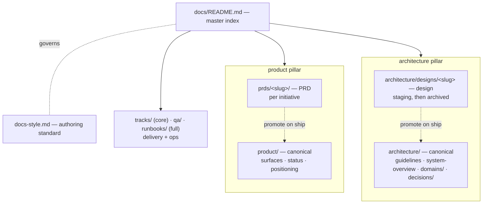
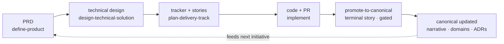

# Docs knowledge-base redesign — design

_The kit today emits per-initiative leaf docs (PRD, technical solution, tracker, stories) with no standing knowledge base behind them. This design makes the kit produce and maintain a self-maintaining knowledge base — indexed pillars of canonical docs, fed by per-initiative docs, kept current by a gated promote-to-canonical loop, governed by a repo-owned authoring standard — with everything configurable and presets as recommendations, never mandates._

## Context

The kit already produces a competent five-layer leaf chain — `define-product` → `design-technical-solution` → `plan-delivery-track` → story briefs → downstream specs/plans/code — with frontmatter, document-map tables, acceptance-criteria IDs, navigation footers, and two mandatory Mermaid diagrams (the tracker dependency graph and the technical-solution architecture diagram). The problem is not the templates; it is structural and lifecycle:

1. **No canonical knowledge base.** The kit emits per-initiative leaf docs but never establishes or maintains standing pillars (a master index, a `product/` narrative, an `architecture/` rulebook + topic docs + domain references + decision records). Produced docs float with no home and no index.
2. **No promote-to-canonical loop.** The only update rule is "fix the story brief if it is wrong." Nothing folds a shipped initiative's durable decisions back into canonical docs, so canon goes stale or never exists.
3. **No authoring standard.** Quality guidance is scattered across skill prompts instead of living in one repo-owned `docs-style.md` (required frontmatter, closed `status` vocabulary, one-fact-one-place, diagram placement, per-doc-type templates).
4. **Diagrams are mandated, not crafted.** Diagrams are required in a couple of places, but there is no guidance on choosing a diagram type or pairing a diagram with prose so it actually helps.
5. **Decisions and domain knowledge have no home.** The two doc types that keep architecture correct over time — immutable numbered ADRs and per-domain references (purpose, public API, invariants, gotchas) — do not exist in the kit.

The reference model is the OnClass docs tree (`on-class-web/docs/`): a master `README.md` map, `product/` and `architecture/` pillars, `architecture/{guidelines,system-overview,domains/,decisions/}`, a `docs-style.md` standard, and an observable canonical-versus-per-change separation. This design ports the *pattern*, not the specific repo's shape.

### Goal

The kit should produce not just leaf artifacts but a knowledge base that compounds: each initiative starts from accurate canon and leaves canon more accurate than it found it.

### Non-goals

- Not forcing OnClass's exact folder shape onto every repo. The kit serves many repos; it recommends, it does not impose.
- Not a plugin engine for arbitrary new doc types. The catalog is fixed; every entry is tunable.
- Not changing the orchestration/runtime model (waves, DAG, `run_story`/`run_eligible`, drivers). This design is about the docs the kit authors, not how it runs stories.

## Principles

- **Canonical vs. per-initiative separation.** Canonical docs are durable and always current. Per-initiative docs (PRD, design) are transient and retired after shipping.
- **One fact, one place.** Each fact lives in exactly one canonical doc; everything else links to it.
- **Configurable-first.** Every path, doc type, status word, template, and the standard itself is overridable. Presets are recommendations; built-ins are seeds and fallbacks only. Skills read the resolved config and repo-owned files at runtime — they never hardcode the standard.
- **Init detects, it does not impose.** Adopting the kit maps config onto an existing docs layout rather than reshuffling it.
- **Diagrams are a craft.** Required where they replace branching prose, paired with a one-line preamble and takeaway, and standardized on Mermaid for repo docs.
- **The loop closes.** A gated promote-to-canonical step is the mechanism that keeps canon current; without it canon rots.

## Target docs architecture

The shift is from emitting leaf docs to maintaining a knowledge base. Two things govern everything and neither exists today: a master index (`docs/README.md` — "start here" plus an "I need to X → read Y" routing table) and an authoring standard (`docs-style.md`). The index pattern repeats recursively: every folder gets its own README index, high-level at the top, deeper on demand.

Under that sit two pillars, each split into a **canonical zone** (durable, always current) and a **per-initiative zone** (transient, retired after shipping). `architecture/designs/` is a fenced staging area — `status`-tracked and archived after promotion — kept visibly separate from canonical architecture so it cannot rot into the pillar.

The structure (read top to bottom; solid = contains, dashed = promote-on-ship):



The lean default scaffolds the master index, `docs-style.md`, both pillars' canonical stubs, and `tracks/` (the kit's core delivery output, always present). The `full` preset adds `architecture/domains/`, `architecture/decisions/`, and the rest of the operational band (`qa/` · `runbooks/`). Both presets are starting points — every folder and file path is an overridable config key (see Configurability model).

## The promote-to-canonical lifecycle

This is the piece that makes docs compound instead of rot. The four production steps map to existing skills. The new piece is `promote-to-canonical`: the work a dependency-terminal story performs when a track ships — read the merged diff plus per-story canonical-impact breadcrumbs, update the canonical pillars, mint ADRs for real decisions, flip the PRD to `shipped`, and archive the design doc.

The cycle (dashed = the feedback edge that closes the loop):



The loop closes because `define-product` reads current canonical docs as input, so each initiative starts from accurate canon rather than re-deriving it.

### Cadence: per track, not per story, not per wave

Promotion is a synthesis task, and synthesis wants the whole picture. Per-story promotion would write canonical prose, then rewrite it as later stories revise earlier ones, churning canon with intermediate states that never shipped as a coherent whole — and it would drag doc rewrites into every implementation PR. So promotion is **per track**, performed by a single terminal story whose `Depends on` is the full set of implementation stories.

It is deliberately **not per wave**. In the kit, waves are parallelism groupings (which stories touch disjoint files and can run concurrently), not ship events. Promoting per wave would canonicalize intermediate scaffolding that never shipped on its own. This is the key correction from the OnClass model, where a "phase" *was* a release boundary; the kit has no such concept — the **track is the ship unit**.

Consequences of "track = ship unit":

- "Promote per track" already equals "promote per ship boundary." No phase concept is needed.
- Need finer ship granularity? Slice into more tracks (or PRDs); each gets its own terminal promote story for free. The granularity knob — how you cut tracks — already exists.
- Staleness is correctly bounded to one in-flight track. A track long enough that mid-flight staleness hurts is the kit's existing "5–25 stories, split if bigger" signal firing.

### Enforcement: gated, not optional

A trailing story is the easiest thing to cut when a track stalls. Two cheap guards prevent that:

1. **Structural, not optional.** `plan-delivery-track` always emits the promote story as the track's exit-bar. The track (and its PRD) cannot reach a complete status until the promote story is `verified`. The gate sits at track/PRD level, not per story.
2. **Per-story breadcrumbs.** Each story spec carries a one-line **canonical impact** note (does this change an invariant, introduce a decision, or change product behavior?). The promote story reads breadcrumbs instead of reconstructing intent from every diff. Cheap to jot at decision time, expensive to recall at track end.

## Doc-type catalog

Every doc type the kit knows how to produce or maintain. "Zone" is canonical (durable), per-initiative (retired after ship), or operational. Paths shown are recommended defaults; all are config keys.

| Doc type | Default path | Zone | Owner skill |
|---|---|---|---|
| Master index | `docs/README.md` | canonical | workflow-init |
| Pillar index | `product/README.md`, `architecture/README.md` | canonical | workflow-init + promote |
| PRD (multi-file) | `product/prds/<slug>/` | per-initiative | define-product |
| Technical design | `architecture/designs/<slug>.md` | per-initiative (staging) | design-technical-solution |
| ADR (numbered) | `architecture/decisions/NNNN-*.md` | canonical (immutable) | promote-to-canonical |
| Domain reference | `architecture/domains/<domain>.md` | canonical | workflow-init (stub) + promote |
| Topic doc / rulebook | `architecture/<topic>.md`, `architecture/guidelines.md` | canonical | promote |
| Tracker | `tracks/<track>/README.md` | operational | plan-delivery-track |
| Story spec | `tracks/<track>/stories/<ID>.md` | operational | plan-delivery-track → implement |
| Runbook | `runbooks/*.md` | operational (full) | workflow-init (stub) |

The two genuinely new canonical types carry fixed templates:

- **ADR (MADR)**: Context · Decision · Consequences (positive / negative / neutral) · Alternatives considered · Related. Immutable and stably numbered, so any doc can cite "ADR 0004" and survive title renames.
- **Domain reference**: Purpose · Public API · Invariants · Gotchas · Related code. This is where architecture knowledge actually stays correct over time.

## Authoring standard (`docs-style.md`)

One repo-owned standard governs all docs. The kit seeds it from the chosen preset; thereafter it is authoritative and the skills read it at runtime.

It defines:

- **Required frontmatter** on every doc: `title`, `status`, `owner`, `last-reviewed`, `related` (relative links).
- **Closed `status` vocabulary**, scoped per doc family so it stays small:

  | Doc family | Allowed `status` |
  |---|---|
  | Canonical (product / architecture / domain / topic) | `draft` · `approved` · `deprecated` |
  | ADR | `proposed` · `accepted` · `superseded by NNNN` |
  | PRD / design | `draft` · `approved` · `shipped` · `archived` |

- **One fact, one place** — link, never duplicate.
- **Structure rules**: H1 + italic TL;DR + Context + body + Related; sentence-case headings; active voice; descriptive headings; code fences with language tags; relative links only; no binary screenshots (Mermaid, code, or tables only).
- **Per-doc-type templates** (the catalog above), resolved per the Configurability model.

The standard is overridable and extensible: a consumer may edit it freely, or have it declare `extends: built-in/recommended` so their rules layer on the kit's base instead of copying it wholesale.

## Diagrams as a craft

The kit mandates diagrams but says nothing about making them good. `docs-style.md` adds a type-picker and a pairing rule.

| Situation | Diagram |
|---|---|
| Request / data flow, module boundaries | `flowchart` |
| Cross-layer or temporal interaction | `sequenceDiagram` |
| Lifecycle / status machine | `stateDiagram-v2` |
| Data model | `erDiagram` |
| System context | `C4Context` |

Rules:

- Every diagram is wrapped **preamble (one line: what to look for) → diagram → takeaway (one line: the conclusion)**.
- A diagram earns its place only when it replaces branching or nested prose. If ≤3 linear steps say it, use prose.
- **Repo docs standardize on Mermaid** — diffable, agent-readable, and rendered by GitHub. Richer rendered SVG (as used in design conversations) is for presentation, not committed docs.

## Tracking and stories

The tracker is already strong (status matrix + dependency graph + waves + parallelism rules). It gains only:

- The **terminal promote row** in the status matrix (`Depends on` = all implementation stories; final wave).
- A ground rule: the track is not complete until the promote story is `verified`.

The real change is the **story model**. Today the kit splits a deliberately non-actionable *brief* (`tracks/<track>/stories/<ID>.md`) from a *detailed spec* that `implement-next` later writes in a different folder (`docs/specs/`). That scatters one story's knowledge across two files in two places, and the brief is useless on its own.

Replace it with **one file per story that grows in place**:

- `plan-delivery-track` writes the brief-level sections (scope, PRD-criteria links, dependencies, open questions, candidate surfaces, the canonical-impact breadcrumb).
- At pickup, the implementer enriches the *same file* to implementation-ready (files to touch, acceptance, verification, resolved decisions) instead of spawning a separate doc.
- The `status` column tracks maturity: `specced` = brief-level, `plan-approved` = implementation-ready.

This preserves the kit's valid instinct — do not write 25 detailed specs upfront — while giving each story a single source of truth, co-located in the track. It supersedes the separate `docs/specs/` detailed-spec location for story specs; `specsDir` can be retired or repurposed (confirm in the plan).

## Configurability model

Configurability is the spine, built on the existing `.workflow/config.yaml` (not a new config system). Precedence is layered, later wins, and skills read the resolved result at runtime:

`built-in defaults → preset → .workflow/config.yaml → repo-owned files (docs-style.md, templates/)`

Three rules:

1. **Everything is a config key with a recommended default.** Extend the existing `paths` block with a `docs` section. Illustrative shape:

   ```yaml
   docs:
     preset: full            # lean | full — a recommendation; every key below overrides it
     style: docs/docs-style.md          # repo-owned + authoritative
     templatesDir: .workflow/templates  # repo template overrides resolved here first
     index: docs/README.md
     paths:
       productDir:      docs/product
       prdsDir:         docs/product/prds
       architectureDir: docs/architecture
       designsDir:      docs/architecture/designs
       domainsDir:      docs/architecture/domains
       decisionsDir:    docs/architecture/decisions
     types:                  # enable/disable + per-type status vocab + template
       adr:     { enabled: true,  status: [proposed, accepted, superseded] }
       domain:  { enabled: true }
       runbook: { enabled: false }
     promote:
       strategy: terminal-story   # dependency-terminal promote story
       gate: track-complete
       breadcrumbs: required
   ```

2. **The standard and templates are repo-owned and authoritative.** `workflow-init` seeds `docs-style.md` and the doc templates from the chosen preset; the skills then read the repo's copies at runtime. Built-ins are only the seed and the fallback-if-absent. Template resolution per type: `repo templatesDir/<type>.md` → preset → kit built-in.

3. **Init detects, it does not impose.** `workflow-init` inspects an existing docs layout and maps config onto it (a repo with `docs/adr/` gets `decisionsDir: docs/adr`), so adopting the kit never forces a reshuffle.

**Boundary.** Configurable = paths, enable/disable per type, status vocabulary, templates, and the freely-editable standard. Not in scope: a plugin engine for arbitrary brand-new doc types — the fixed catalog covers the space and every entry is fully tunable, so that complexity buys little.

## Skill-by-skill changes

| Skill | Change |
|---|---|
| **workflow-init** | Scaffold the knowledge base, not just tracks: master index + `docs-style.md` + both pillar indexes + `guidelines.md` stub (lean). `full` preset adds `domains/`, `decisions/` (+ ADR template), `qa/`, `runbooks/`. New `docs` config block. Detects existing layout; idempotent; never clobbers. |
| **define-product** | Output shape kept (already a good multi-file PRD). Now reads current canonical as input; registers the PRD in the product pillar index; conforms to `docs-style.md`. |
| **design-technical-solution** | Output moves from `docs/prds/<slug>/technical-solution.md` to `architecture/designs/<slug>.md` (staging, `status`-tracked). Adds a **Canonical impact** section enumerating which canonical docs / domain refs / ADRs it will create or change on promotion. |
| **plan-delivery-track** | Always emits the **terminal promote story** (`Depends on` = all implementation stories). Story files become single grow-in-place specs (not brief + separate detailed spec elsewhere). Each story carries a one-line canonical-impact breadcrumb. Tracker ground rule: not complete until promote is `verified`. |
| **promote-to-canonical** (NEW) | The work the promote story runs: update product narrative + topic docs + domain references, mint ADR(s) for real decisions, flip the PRD to `shipped`, archive the design doc, refresh pillar indexes. Reads the chosen `docs.promote` config and repo-owned standard/templates. |

Implementation surfaces (for the plan):

- Skills: `plugins/agentic-workflow-kit/skills/<skill>/SKILL.md` (+ new `promote-to-canonical/`).
- Templates: `plugins/agentic-workflow-kit/references/templates/` (add `adr.md`, `domain-reference.md`, `docs-style.md`, master/pillar index templates; reconcile story templates).
- Presets: `plugins/agentic-workflow-kit/presets/` (add `docs: lean` / `docs: full` presets).
- Config schema: `references/config-schema.md` (add the `docs` block; bump schema version).
- Contracts: `references/prd-contract.md`, `references/technical-solution-contract.md`, and a new promote contract.

## Migration and adoption

- **Existing kit consumers.** `workflow-init` reconciles missing `docs` keys into an existing config, reports drift, and asks before changing version. It detects an existing docs layout and maps config to it rather than moving files.
- **`design-technical-solution` relocation.** The move from `docs/prds/<slug>/technical-solution.md` to `architecture/designs/<slug>.md` is config-driven (`docs.paths.designsDir`); a back-compat shim should keep reading the old path until a consumer migrates.
- **Dogfooding.** Apply the redesign to the kit's own `docs/` (it already has `docs/prds/`, `docs/tracks/`, and `docs/architecture.md`) as the first consumer and the worked example.

## Success criteria

- A repo can run `workflow-init` and get a master index, `docs-style.md`, and pillar stubs (lean) or the full tree (full) — with every path overridable.
- A full initiative run (`define-product` → `design-technical-solution` → `plan-delivery-track` → implement) produces docs that conform to the repo-owned `docs-style.md` and link into the pillar indexes.
- `plan-delivery-track` always emits a dependency-terminal promote story; the track cannot complete until it is `verified`.
- `promote-to-canonical` updates canonical docs (narrative, domain refs, ADRs), flips the PRD to `shipped`, and archives the design doc.
- Overriding any `docs.*` key (path, status vocab, template, the standard) changes skill output accordingly, with no skill hardcoding the standard.
- ADRs and domain references exist as first-class, templated canonical doc types.

## Risks

- **Promote story skipped.** Mitigated by the structural exit-bar gate (track cannot complete until promote is `verified`), not discipline.
- **Config sprawl.** Mitigated by strong presets and sane defaults; consumers touch config only to override.
- **Template / standard drift between repo and kit built-ins.** Mitigated by `extends: built-in/recommended` and by `workflow-init` reporting drift rather than silently overwriting.
- **Scope creep into orchestration.** Explicitly out of scope; this design touches only authored docs, not the runtime.

## Open questions

- Schema version bump: confirm the target `.workflow/config.yaml` version for the `docs` block.
- Exact `status`/wave wiring for the terminal promote story in the existing status vocabulary (`specced → plan-approved → implementing → done → verified`) — likely the promote story uses the same vocabulary and the track-complete gate keys off its `verified` state.
- Whether `promote-to-canonical` ships as a standalone skill, an extension of an existing skill, or both a skill and an MCP action.

## Related

- `references/prd-contract.md`
- `references/technical-solution-contract.md`
- `references/config-schema.md`
- `plugins/agentic-workflow-kit/skills/` (the four existing skills)
- Reference model: `on-class-web/docs/` (master index, pillars, `docs-style.md`, `architecture/{guidelines,domains,decisions}`)
