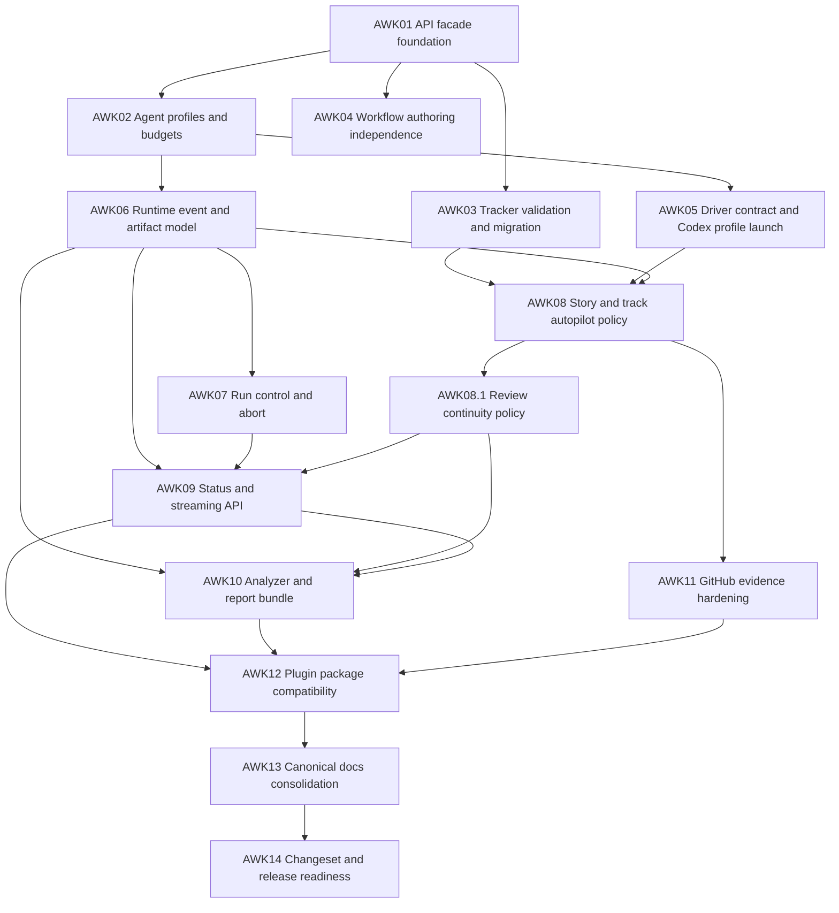

# agentic-workflow-kit redesign tracker

*This track delivers the V1 redesign described in the PRD and technical solution: independent
workflow authoring, contract-backed trackers and migration, profile/budget-aware autonomous
runtime, product-first CLI/MCP APIs, observability/control/reporting, GitHub collaboration
evidence, docs consolidation, and release readiness. The PRD owns what/why; the technical solution
owns high-level how; this doc owns sequencing and parallelism. Each story (AWKn) has a lightweight
brief; the detailed story spec and implementation plan are created by implement-next.*

## Context

This track decomposes the `agentic-workflow-kit-redesign` PRD into implementation stories that can
be run by the currently installed, pinned WorkflowKit plugin version 0.5.13. Code changes made by
the stories are not assumed to affect the orchestrator executing the track until the final release.

The repo audit found a package-backed MCP/CLI runtime under `packages/orchestrator/`, shared plugin
skills under `skills/`, durable contracts under `references/`, presets, examples, Codex/Claude
plugin metadata, and tests covering schemas, trackers, manifests, package smoke, analyzer, and the
orchestrator. Repo policy requires story specs/plans to live transiently under `docs/superpowers/`
and canonical docs to be updated before release.

This tracker covers story order, dependencies, and safe parallelism. Per-story delivery context
lives in each story brief; detailed technical story specs and implementation plans come later.

## Dependency graph

**Reading the graph:** every solid arrow is a hard dependency. The source story must be in a
`statuses.complete` state before the target starts. Nodes with no inbound edge can start
immediately.

## Status matrix

Statuses come from `references/tracker-contract.md`:
`specced` → `plan-approved` → `implementing` → `done` → `verified`, plus terminal
`blocked` / `canceled` / `deferred` / `superseded`. IDs match `tracker.idPattern`.

| ID | Name | Depends on | Wave | Status | Spec | Plan | Owner | PR |
| --- | --- | --- | --- | --- | --- | --- | --- | --- |
| AWK01 | API facade foundation | — | W1 | done | [brief](./stories/AWK01.md) | — | codex | [#56](https://github.com/aryeko/agentic-workflow-kit/pull/56) |
| AWK02 | Agent profiles and budgets | AWK01 | W2 | done | [brief](./stories/AWK02.md) + [spec](../../superpowers/specs/2026-06-13-awk02-agent-profiles-and-budgets-design.md) | [plan](../../superpowers/plans/2026-06-13-awk02-agent-profiles-and-budgets.md) | codex | [#58](https://github.com/aryeko/agentic-workflow-kit/pull/58) |
| AWK03 | Tracker validation and migration | AWK01 | W2 | done | [brief](./stories/AWK03.md) | — | codex | [#57](https://github.com/aryeko/agentic-workflow-kit/pull/57) |
| AWK04 | Workflow authoring independence | AWK01 | W2 | done | [brief](./stories/AWK04.md) | — | codex | [#59](https://github.com/aryeko/agentic-workflow-kit/pull/59) |
| AWK05 | Driver contract and Codex profile launch | AWK02 | W3 | done | [brief](./stories/AWK05.md) + [spec](../../superpowers/specs/2026-06-14-awk05-driver-contract-and-codex-profile-launch-design.md) | [plan](../../superpowers/plans/2026-06-14-awk05-driver-contract-and-codex-profile-launch.md) | codex | [#61](https://github.com/aryeko/agentic-workflow-kit/pull/61) |
| AWK06 | Runtime event and artifact model | AWK02 | W3 | done | [brief](./stories/AWK06.md) + [contract](../../../references/runtime-artifact-contract.md) | — | codex | [#60](https://github.com/aryeko/agentic-workflow-kit/pull/60) |
| AWK07 | Run control and abort | AWK06 | W4 | done | [brief](./stories/AWK07.md) | — | codex | [#63](https://github.com/aryeko/agentic-workflow-kit/pull/63) |
| AWK08 | Story and track autopilot policy | AWK03, AWK05, AWK06 | W4 | done | [brief](./stories/AWK08.md) | — | codex-2026-06-13T22-51-49Z | [#62](https://github.com/aryeko/agentic-workflow-kit/pull/62) |
| AWK081 | AWK08.1 Review continuity policy | AWK08 | W4.5 | implementing | [brief](./stories/AWK081.md) + [spec](../../superpowers/specs/2026-06-14-awk081-awk08-1-review-continuity-policy-design.md) | [plan](../../superpowers/plans/2026-06-14-awk081-awk08-1-review-continuity-policy.md) | codex-2026-06-13T23-29-42Z | — |
| AWK09 | Status and streaming API | AWK06, AWK07, AWK081 | W5 | specced | [brief](./stories/AWK09.md) | — | — | — |
| AWK10 | Analyzer and report bundle | AWK06, AWK09, AWK081 | W5 | specced | [brief](./stories/AWK10.md) | — | — | — |
| AWK11 | GitHub evidence hardening | AWK08 | W5 | specced | [brief](./stories/AWK11.md) | — | — | — |
| AWK12 | Plugin package compatibility | AWK09, AWK10, AWK11 | W6 | specced | [brief](./stories/AWK12.md) | — | — | — |
| AWK13 | Canonical docs consolidation | AWK12 | W7 | deferred | [brief](./stories/AWK13.md) | — | — | — |
| AWK14 | Changeset and release readiness | AWK13 | W8 | deferred | [brief](./stories/AWK14.md) | — | — | — |

Keep the **Status** column current. Leave **Plan** as `—` — the implementing session drafts the
plan after creating the detailed technical story spec. Each story maps to one or more PRD
acceptance-criteria IDs in its story brief.

## Parallelism rules

**Wave 1 — Foundation (sequential):** AWK01 runs alone. It defines the shared API/result envelope
that later CLI/MCP/config/runtime stories must align to.

**Wave 2 — Contract and authoring split (up to 2-way parallel):** AWK02, AWK03, and AWK04 may run
with at most two concurrent sessions because they touch different primary surfaces but may contend
on references, presets, and docs tests.

**Wave 3 — Driver and artifact foundations (up to 2-way parallel):** AWK05 and AWK06 can run
concurrently only if detailed specs keep driver-contract files and artifact/event files disjoint.

**Wave 4 — Runtime behavior (mostly sequential):** AWK07 and AWK08 both touch `WorkflowRunner`,
handlers, and state transitions. Run AWK07 first when possible, then AWK08.

**Wave 4.5 — Review policy follow-up (sequential):** AWK081 is an AWK08 follow-up for local
pre-PR review continuity semantics. Run it after AWK08 lands and before AWK09/AWK10 consume
review-loop events in status, stream, analyzer, or report surfaces.

**Wave 5 — Observability and collaboration (up to 2-way parallel):** AWK09, AWK10, and AWK11 may
run with at most two concurrent sessions after runtime state is stable. They have likely contention
in analyzer/event fixtures, so coordinate before editing shared fixtures.

**Wave 6 — Package/plugin compatibility (sequential):** AWK12 touches plugin metadata, package
smoke tests, and examples. Run alone after implementation-facing behavior settles.

**Wave 7 — Docs consolidation (sequential):** AWK13 runs after all implementation stories. It
audits every repo `*.md` surface, including root READMEs, `AGENTS.md`, `CONTRIBUTING.md`, package
and plugin Markdown, and folds durable content from transient `docs/superpowers/` specs/plans into
canonical docs. Launch AWK13 with extra-high, or the highest supported, reasoning effort. It must
write and verify replacement docs before removing or archiving old docs or transient specs/plans.
AWK13 is intentionally `deferred` so autopilot does not launch it; run it manually in a new session
after AWK12 is complete by changing its status back to `specced`/`plan-approved` or by force-running
that story.

**Wave 8 — Release readiness (sequential):** AWK14 runs last. It creates the consolidated changeset
and release handoff after docs are canonical. AWK14 is intentionally `deferred` so autopilot cannot
launch release-readiness work accidentally; run it manually after AWK13 is complete by changing its
status back to `specced`/`plan-approved` or by force-running that story.

## ID-prefix registry

This track reserves the prefix **`AWK`**. It is recorded in `docs/tracks/README.md` and is never
reused by another track.

## How to pick up a story

1. Confirm the executing WorkflowKit plugin remains pinned to installed version 0.5.13.
2. Find a row whose **Depends on** are all in a `statuses.complete` state and whose **Status** is
   in `statuses.eligible`.
3. Claim it (set **Owner**; isolate per `git.strategy`) and flip **Status** to
   `statuses.inProgress`.
4. Read the linked story brief.
5. Create/refine the detailed technical story spec under `docs/superpowers/specs`.
6. If no plan exists, draft one under `docs/superpowers/plans`.
7. Execute. Before opening the PR, flip **Status** to `done` in this table in the same change.
8. Fill the **PR** column once the PR exists.

## Ground rules

- **Pinned executor:** all stories are executed by the installed 0.5.13 WorkflowKit plugin/runtime.
  Do not depend on code changes from this track to run later stories until AWK14 completes release
  readiness.
- **One story per PR.** Do not bundle.
- **No per-story changesets by default.** AWK14 owns the consolidated changeset and release
  readiness. Add an earlier changeset only if a detailed story spec proves the release tooling
  requires it.
- **Transient specs/plans:** implementation stories may create `docs/superpowers/` specs/plans.
  AWK13 is the final canonical-docs sweep that consumes any remaining durable content before
  release.
- **The tracker is the single source of truth for status** — never infer completion from child
  session prose.
- **When the story brief is wrong, update it in the same PR** as the detailed spec or code that
  surfaced the gap.

## Related

- [PRD](../../prds/agentic-workflow-kit-redesign/README.md)
- [Technical solution](../../prds/agentic-workflow-kit-redesign/technical-solution.md)
- [Repo architecture](../../architecture.md)
- [Repo instructions](../../../AGENTS.md)
- `./stories/` — story briefs
